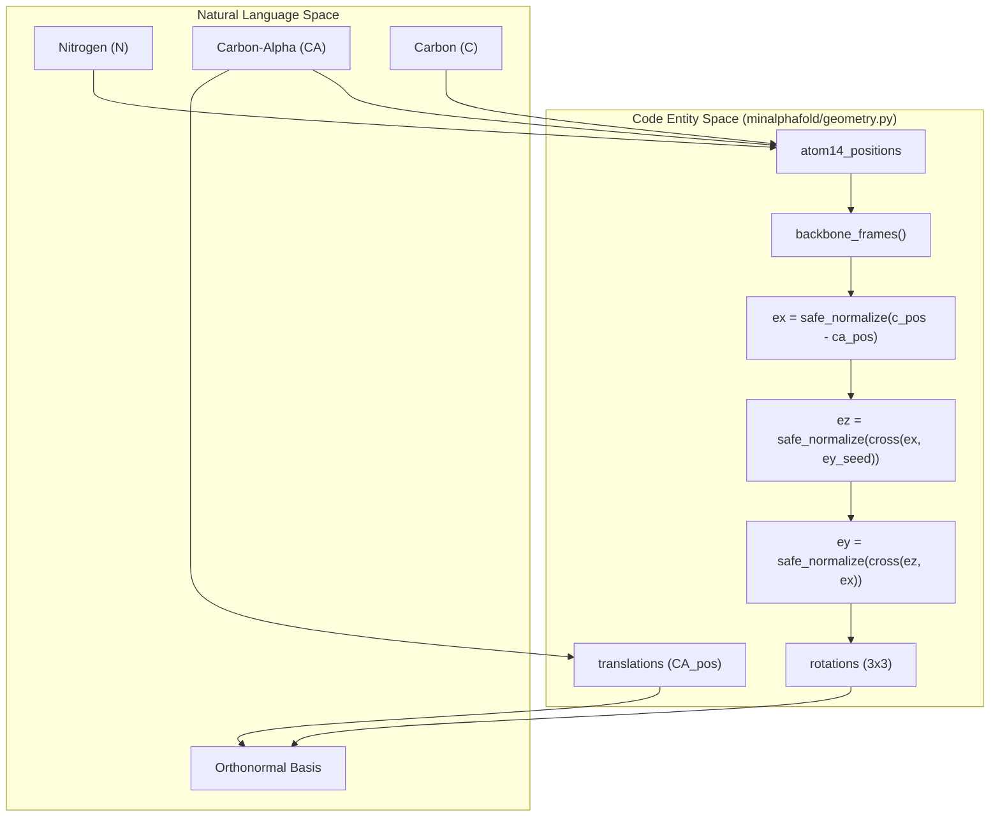
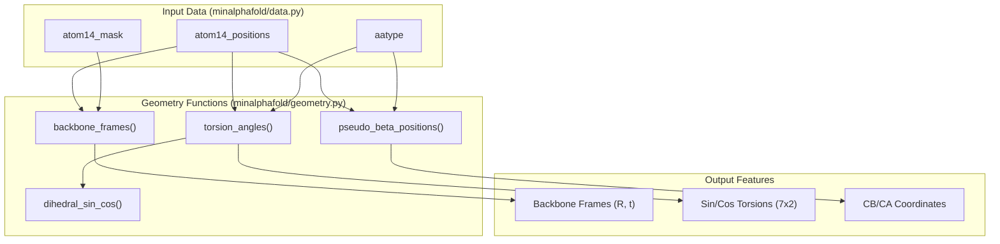

# Geometry Utilities

> **Relevant source files**
> * [minalphafold/data.py](https://github.com/ChrisHayduk/minAlphaFold2/blob/d0d066ad/minalphafold/data.py)
> * [minalphafold/geometry.py](https://github.com/ChrisHayduk/minAlphaFold2/blob/d0d066ad/minalphafold/geometry.py)

The `minalphafold/geometry.py` module provides the mathematical foundation for converting raw 3D atomic coordinates into the internal representations used by AlphaFold2. This includes the construction of orthonormal local reference frames for the protein backbone, the calculation of binned torsion angles (represented as sine-cosine pairs), and the identification of pseudo-beta positions for distance-based loss functions.

## Backbone Frame Construction

The `backbone_frames` function implements a Gram-Schmidt-style orthonormalization to create a rigid body frame for each residue based on its $N$, $C\alpha$, and $C$ atoms [minalphafold/geometry.py L67-L87](https://github.com/ChrisHayduk/minAlphaFold2/blob/d0d066ad/minalphafold/geometry.py#L67-L87)

### Implementation Logic

1. **Coordinate Extraction**: It extracts the 3D positions of the Nitrogen ($N$), Carbon-alpha ($C\alpha$), and Carbon ($C$) atoms from the `atom14` representation [minalphafold/geometry.py L68-L70](https://github.com/ChrisHayduk/minAlphaFold2/blob/d0d066ad/minalphafold/geometry.py#L68-L70)
2. **Masking**: A `valid_mask` is computed, ensuring all three backbone atoms exist for a given residue [minalphafold/geometry.py L72-L75](https://github.com/ChrisHayduk/minAlphaFold2/blob/d0d066ad/minalphafold/geometry.py#L72-L75)
3. **Basis Vector Calculation**: * **x-axis ($e_x$)**: Defined as the unit vector from $C\alpha$ to $C$ [minalphafold/geometry.py L77](https://github.com/ChrisHayduk/minAlphaFold2/blob/d0d066ad/minalphafold/geometry.py#L77-L77) * **z-axis ($e_z$)**: Defined as the unit vector of the cross product between $e_x$ and the vector from $C\alpha$ to $N$ [minalphafold/geometry.py L78-L79](https://github.com/ChrisHayduk/minAlphaFold2/blob/d0d066ad/minalphafold/geometry.py#L78-L79) * **y-axis ($e_y$)**: Defined as the cross product of $e_z$ and $e_x$ to complete the right-handed orthonormal basis [minalphafold/geometry.py L80](https://github.com/ChrisHayduk/minAlphaFold2/blob/d0d066ad/minalphafold/geometry.py#L80-L80)
4. **Rigid Transform**: The function returns a rotation matrix $R$ and a translation vector $t$ (centered at $C\alpha$) [minalphafold/geometry.py L82-L87](https://github.com/ChrisHayduk/minAlphaFold2/blob/d0d066ad/minalphafold/geometry.py#L82-L87)

### Code Entity Mapping: Backbone Frames

The following diagram maps the geometric concepts to the code entities in `geometry.py`.

**Sources:** [minalphafold/geometry.py L67-L87](https://github.com/ChrisHayduk/minAlphaFold2/blob/d0d066ad/minalphafold/geometry.py#L67-L87)

---

## Torsion Angle Calculation

The `torsion_angles` function computes the 7 dihedral angles required for protein structure representation: $\omega$ (omega), $\phi$ (phi), $\psi$ (psi), and $\chi_{1-4}$ (chi angles) [minalphafold/geometry.py L102-L166](https://github.com/ChrisHayduk/minAlphaFold2/blob/d0d066ad/minalphafold/geometry.py#L102-L166)

### Sin-Cos Representation

Angles are not stored as scalars but as $(\sin \theta, \cos \theta)$ pairs to avoid discontinuities at $\pm 180^\circ$ [minalphafold/geometry.py L64](https://github.com/ChrisHayduk/minAlphaFold2/blob/d0d066ad/minalphafold/geometry.py#L64-L64)

 The core calculation is handled by `dihedral_sin_cos`, which takes four points $(a, b, c, d)$ and computes the angle between planes $(a,b,c)$ and $(b,c,d)$ [minalphafold/geometry.py L48-L64](https://github.com/ChrisHayduk/minAlphaFold2/blob/d0d066ad/minalphafold/geometry.py#L48-L64)

### Backbone Torsions

* **$\omega$**: Angle between $C\alpha_{i-1}, C_{i-1}, N_i, C\alpha_i$ [minalphafold/geometry.py L125](https://github.com/ChrisHayduk/minAlphaFold2/blob/d0d066ad/minalphafold/geometry.py#L125-L125)
* **$\phi$**: Angle between $C_{i-1}, N_i, C\alpha_i, C_i$ [minalphafold/geometry.py L126](https://github.com/ChrisHayduk/minAlphaFold2/blob/d0d066ad/minalphafold/geometry.py#L126-L126)
* **$\psi$**: Angle between $N_i, C\alpha_i, C_i, N_{i+1}$ [minalphafold/geometry.py L127](https://github.com/ChrisHayduk/minAlphaFold2/blob/d0d066ad/minalphafold/geometry.py#L127-L127)

### Sidechain Chi Angles ($\chi_{1-4}$)

Sidechain angles are computed using the `CHI_ATOM_INDICES` and `CHI_EXISTS` lookup tables [minalphafold/geometry.py L133-L164](https://github.com/ChrisHayduk/minAlphaFold2/blob/d0d066ad/minalphafold/geometry.py#L133-L164)

 These tables are built at import time using `residue_constants` [minalphafold/geometry.py L14-L31](https://github.com/ChrisHayduk/minAlphaFold2/blob/d0d066ad/minalphafold/geometry.py#L14-L31)

| Angle | Index in Output | Atom Indices Source |
| --- | --- | --- |
| $\omega$ | 0 | Backbone atoms of $i-1$ and $i$ |
| $\phi$ | 1 | Backbone atoms of $i-1$ and $i$ |
| $\psi$ | 2 | Backbone atoms of $i$ and $i+1$ |
| $\chi_1 \dots \chi_4$ | 3-6 | `CHI_ATOM_INDICES` per `aatype` |

**Sources:** [minalphafold/geometry.py L14-L31](https://github.com/ChrisHayduk/minAlphaFold2/blob/d0d066ad/minalphafold/geometry.py#L14-L31)

 [minalphafold/geometry.py L102-L166](https://github.com/ChrisHayduk/minAlphaFold2/blob/d0d066ad/minalphafold/geometry.py#L102-L166)

---

## Symmetry and Alternative Torsions

Certain amino acids (ASP, PHE, TYR, GLU) possess $180^\circ$ rotational symmetry in their sidechains. The `alternative_torsion_angles` function handles this by providing a second set of angles where the symmetric chi angle is negated [minalphafold/geometry.py L169-L181](https://github.com/ChrisHayduk/minAlphaFold2/blob/d0d066ad/minalphafold/geometry.py#L169-L181)

* **$\chi_2$ Symmetry**: Aspartic Acid (ASP), Phenylalanine (PHE), Tyrosine (TYR) [minalphafold/geometry.py L172](https://github.com/ChrisHayduk/minAlphaFold2/blob/d0d066ad/minalphafold/geometry.py#L172-L172)
* **$\chi_3$ Symmetry**: Glutamic Acid (GLU) [minalphafold/geometry.py L173](https://github.com/ChrisHayduk/minAlphaFold2/blob/d0d066ad/minalphafold/geometry.py#L173-L173)

This allows the loss function to penalize the minimum error between the prediction and either the ground truth or its symmetric alternative.

**Sources:** [minalphafold/geometry.py L169-L181](https://github.com/ChrisHayduk/minAlphaFold2/blob/d0d066ad/minalphafold/geometry.py#L169-L181)

---

## Pseudo-Beta Positions

The `pseudo_beta_positions` function identifies the coordinate used for residue-residue distance calculations [minalphafold/geometry.py L90-L99](https://github.com/ChrisHayduk/minAlphaFold2/blob/d0d066ad/minalphafold/geometry.py#L90-L99)

* For **Glycine**, the $C\alpha$ atom is used [minalphafold/geometry.py L95-L96](https://github.com/ChrisHayduk/minAlphaFold2/blob/d0d066ad/minalphafold/geometry.py#L95-L96)
* For all other residues, the **$C\beta$** atom (index 4 in `atom14`) is used [minalphafold/geometry.py L96](https://github.com/ChrisHayduk/minAlphaFold2/blob/d0d066ad/minalphafold/geometry.py#L96-L96)

The function utilizes `gather_atom14` to efficiently index into the `atom14_positions` tensor based on the `aatype` [minalphafold/geometry.py L97](https://github.com/ChrisHayduk/minAlphaFold2/blob/d0d066ad/minalphafold/geometry.py#L97-L97)

### Data Flow: Geometry Extraction

This diagram illustrates how raw atomic data is transformed into geometric features for the model.

**Sources:** [minalphafold/geometry.py L67-L166](https://github.com/ChrisHayduk/minAlphaFold2/blob/d0d066ad/minalphafold/geometry.py#L67-L166)

 [minalphafold/data.py L106-L128](https://github.com/ChrisHayduk/minAlphaFold2/blob/d0d066ad/minalphafold/data.py#L106-L128)

---

## Constant Initialization

At module import time, `geometry.py` builds lookup tables to map `aatype` to specific `atom14` indices for torsion calculation [minalphafold/geometry.py L14-L31](https://github.com/ChrisHayduk/minAlphaFold2/blob/d0d066ad/minalphafold/geometry.py#L14-L31)

* **`CHI_ATOM_INDICES`**: A `(21, 4, 4)` tensor. For each of the 20 amino acids (plus UNK), it stores the 4 atom indices in the `atom14` representation that define each of the 4 $\chi$ angles [minalphafold/geometry.py L14](https://github.com/ChrisHayduk/minAlphaFold2/blob/d0d066ad/minalphafold/geometry.py#L14-L14)
* **`CHI_EXISTS`**: A `(21, 4)` tensor. A boolean mask indicating which residues actually possess $\chi_1, \chi_2, \chi_3,$ or $\chi_4$ [minalphafold/geometry.py L15](https://github.com/ChrisHayduk/minAlphaFold2/blob/d0d066ad/minalphafold/geometry.py#L15-L15)

**Sources:** [minalphafold/geometry.py L14-L31](https://github.com/ChrisHayduk/minAlphaFold2/blob/d0d066ad/minalphafold/geometry.py#L14-L31)