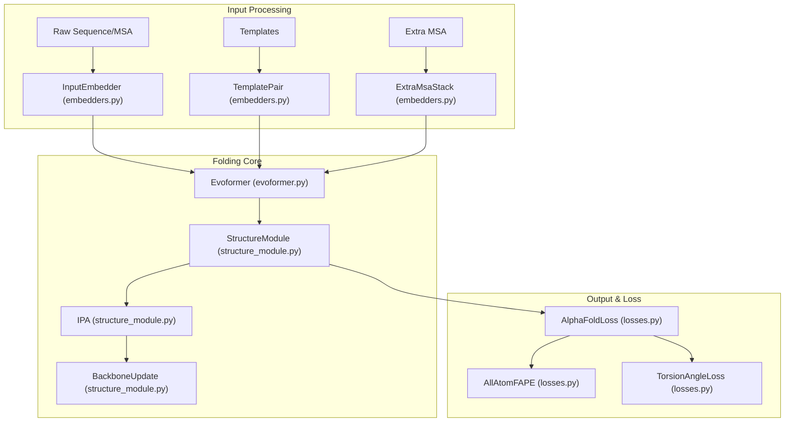
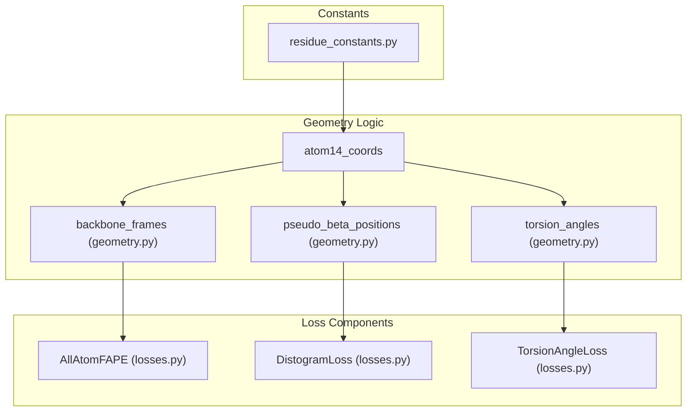

# Glossary

> **Relevant source files**
> * [README.md](https://github.com/ChrisHayduk/minAlphaFold2/blob/d0d066ad/README.md?plain=1)
> * [minalphafold/a3m.py](https://github.com/ChrisHayduk/minAlphaFold2/blob/d0d066ad/minalphafold/a3m.py)
> * [minalphafold/geometry.py](https://github.com/ChrisHayduk/minAlphaFold2/blob/d0d066ad/minalphafold/geometry.py)
> * [minalphafold/losses.py](https://github.com/ChrisHayduk/minAlphaFold2/blob/d0d066ad/minalphafold/losses.py)
> * [minalphafold/model.py](https://github.com/ChrisHayduk/minAlphaFold2/blob/d0d066ad/minalphafold/model.py)
> * [minalphafold/residue_constants.py](https://github.com/ChrisHayduk/minAlphaFold2/blob/d0d066ad/minalphafold/residue_constants.py)
> * [minalphafold/structure_module.py](https://github.com/ChrisHayduk/minAlphaFold2/blob/d0d066ad/minalphafold/structure_module.py)

This glossary provides definitions for technical terms, domain-specific jargon, and implementation conventions used within the `minAlphaFold2` codebase. It serves as a bridge between protein biology, the AlphaFold2 architecture, and the specific PyTorch implementation details.

## AlphaFold2 Architecture Terms

| Term | Definition | Code Pointers |
| --- | --- | --- |
| **Evoformer** | The core transformer-like block that processes MSA and pair representations simultaneously, allowing information to flow between them via outer product means and axial attention. | `evoformer.py: Evoformer` [minalphafold/evoformer.py L13](https://github.com/ChrisHayduk/minAlphaFold2/blob/d0d066ad/minalphafold/evoformer.py#L13-L13) |
| **IPA** | **Invariant Point Attention**. A form of attention that is invariant to global rotations and translations, used in the Structure Module to update residue positions. | `structure_module.py: InvariantPointAttention` [minalphafold/structure_module.py L60](https://github.com/ChrisHayduk/minAlphaFold2/blob/d0d066ad/minalphafold/structure_module.py#L60-L60) |
| **FAPE** | **Frame Aligned Point Error**. A loss function that measures the distance between predicted and true atom positions after aligning their local reference frames. | `losses.py: AllAtomFAPE`, `BackboneFAPE` [minalphafold/losses.py L32](https://github.com/ChrisHayduk/minAlphaFold2/blob/d0d066ad/minalphafold/losses.py#L32-L32) |
| **pLDDT** | **Predicted Local Distance Difference Test**. A per-residue confidence score (0-100) predicting how well the local structure matches the experimental truth. | `heads.py: PLDDTHead`, `losses.py: PLDDTLoss` [minalphafold/losses.py L26](https://github.com/ChrisHayduk/minAlphaFold2/blob/d0d066ad/minalphafold/losses.py#L26-L26) |
| **PAE** | **Predicted Aligned Error**. Derived from the TM-score head, it estimates the expected distance error between pairs of residues if their frames were aligned. | `heads.py: TMScoreHead` [minalphafold/model.py L44](https://github.com/ChrisHayduk/minAlphaFold2/blob/d0d066ad/minalphafold/model.py#L44-L44) |
| **Recycling** | An iterative refinement process where the model's outputs (single/pair representations and coordinates) are fed back as inputs for $N$ cycles. | `model.py: AlphaFold2.forward` [minalphafold/model.py L153](https://github.com/ChrisHayduk/minAlphaFold2/blob/d0d066ad/minalphafold/model.py#L153-L153) |

**Sources:** [minalphafold/model.py L1-L121](https://github.com/ChrisHayduk/minAlphaFold2/blob/d0d066ad/minalphafold/model.py#L1-L121)

 [minalphafold/evoformer.py L1-L13](https://github.com/ChrisHayduk/minAlphaFold2/blob/d0d066ad/minalphafold/evoformer.py#L1-L13)

 [minalphafold/structure_module.py L1-L60](https://github.com/ChrisHayduk/minAlphaFold2/blob/d0d066ad/minalphafold/structure_module.py#L1-L60)

 [minalphafold/losses.py L17-L40](https://github.com/ChrisHayduk/minAlphaFold2/blob/d0d066ad/minalphafold/losses.py#L17-L40)

---

## Protein Biology & Representation

### Atom14 Representation

AlphaFold2 uses a "dense" 14-atom representation for residues. Since no natural amino acid has more than 14 non-hydrogen atoms, every residue is mapped to a fixed-size buffer of 14 slots.

* **Code Pointer:** `residue_constants.py: restype_name_to_atom14_names` [minalphafold/geometry.py L17-L20](https://github.com/ChrisHayduk/minAlphaFold2/blob/d0d066ad/minalphafold/geometry.py#L17-L20)
* **Mapping:** The mapping from the global atom list to the local 14-atom list is defined in `residue_constants.py`.

### Rigid Groups

Each residue is decomposed into up to 8 rigid groups:

1. **Group 0:** Backbone (N, CA, C).
2. **Groups 1-3:** Pre-omega, phi, psi (mostly virtual or for hydrogens).
3. **Groups 4-7:** Side-chain torsion groups ($\chi_1, \chi_2, \chi_3, \chi_4$).

* **Code Pointer:** `residue_constants.py: rigid_group_atom_positions` [minalphafold/residue_constants.py L89](https://github.com/ChrisHayduk/minAlphaFold2/blob/d0d066ad/minalphafold/residue_constants.py#L89-L89)

### Torsion Angles

Proteins are represented by backbone angles ($\phi, \psi, \omega$) and side-chain angles ($\chi_1, \chi_2, \chi_3, \chi_4$). In code, these are often represented as (sine, cosine) pairs to avoid periodicity issues.

* **Code Pointer:** `geometry.py: torsion_angles` [minalphafold/geometry.py L102](https://github.com/ChrisHayduk/minAlphaFold2/blob/d0d066ad/minalphafold/geometry.py#L102-L102)

### Pseudo-beta

For most residues, the $\text{C}*\beta$ atom is used for distance-based metrics. For Glycine (which lacks $\text{C}*\beta$), the $\text{C}_\alpha$ position is substituted.

* **Code Pointer:** `geometry.py: pseudo_beta_positions` [minalphafold/geometry.py L90](https://github.com/ChrisHayduk/minAlphaFold2/blob/d0d066ad/minalphafold/geometry.py#L90-L90)

**Sources:** [minalphafold/residue_constants.py L23-L182](https://github.com/ChrisHayduk/minAlphaFold2/blob/d0d066ad/minalphafold/residue_constants.py#L23-L182)

 [minalphafold/geometry.py L67-L166](https://github.com/ChrisHayduk/minAlphaFold2/blob/d0d066ad/minalphafold/geometry.py#L67-L166)

---

## Implementation Conventions

### Unit Convention (nm vs Å)

While most of the pipeline and the PDB format use Ångströms (Å), the **Structure Module** internally operates in nanometres (nm).

* **Conversion:** `StructureModule` converts constants to nm during `__init__` and converts predicted coordinates back to Å in `forward`.
* **Code Pointer:** `structure_module.py:65-69` [minalphafold/structure_module.py L65-L69](https://github.com/ChrisHayduk/minAlphaFold2/blob/d0d066ad/minalphafold/structure_module.py#L65-L69)

### Zero-Initialization

Following AlphaFold2 Supplement section 1.11.4, specific linear layers (projections, gates, and head logits) are initialized to zero to ensure stable initial gradients.

* **Logic:** `AlphaFold2._initialize_alphafold_parameters` [minalphafold/model.py L62-L105](https://github.com/ChrisHayduk/minAlphaFold2/blob/d0d066ad/minalphafold/model.py#L62-L105)

### Data Flow: Natural Language to Code Entities

The following diagram maps high-level AlphaFold2 concepts to their specific class implementations and file locations within `minAlphaFold2`.

**System Entity Map**

**Sources:** [minalphafold/model.py L10-L45](https://github.com/ChrisHayduk/minAlphaFold2/blob/d0d066ad/minalphafold/model.py#L10-L45)

 [minalphafold/embedders.py L6](https://github.com/ChrisHayduk/minAlphaFold2/blob/d0d066ad/minalphafold/embedders.py#L6-L6)

 [minalphafold/evoformer.py L13](https://github.com/ChrisHayduk/minAlphaFold2/blob/d0d066ad/minalphafold/evoformer.py#L13-L13)

 [minalphafold/structure_module.py L11-L61](https://github.com/ChrisHayduk/minAlphaFold2/blob/d0d066ad/minalphafold/structure_module.py#L11-L61)

---

## Data Formats & Pipeline

| Term | Definition | Code Pointers |
| --- | --- | --- |
| **A3M** | A compressed MSA format where insertions relative to the query are represented by lowercase letters and deletions by dots. | `a3m.py: A3M` [minalphafold/a3m.py L48](https://github.com/ChrisHayduk/minAlphaFold2/blob/d0d066ad/minalphafold/a3m.py#L48-L48) |
| **mmCIF** | The modern standard for macromolecular structures, replacing the legacy PDB format. Used for ground truth coordinates. | `mmcif.py` [README.md L24](https://github.com/ChrisHayduk/minAlphaFold2/blob/d0d066ad/README.md?plain=1#L24-L24) |
| **OpenProteinSet** | A large-scale dataset of AlphaFold2 predictions and MSA features used for training. | `data.py`, `scripts/download_openproteinset.py` [README.md L37-L38](https://github.com/ChrisHayduk/minAlphaFold2/blob/d0d066ad/README.md?plain=1#L37-L38) |
| **Block Deletion** | A data augmentation technique where contiguous blocks of sequences are deleted from the MSA. | `data.py: block_delete_msa` [README.md L51](https://github.com/ChrisHayduk/minAlphaFold2/blob/d0d066ad/README.md?plain=1#L51-L51) |

### Training Phases

1. **Standard Phase:** Training with a subset of losses (FAPE, Distogram, MSA, etc.).
2. **Finetune Phase:** Triggered by `finetune=True`, this adds the `ExperimentallyResolvedLoss` and increases structural violation weights.

* **Code Pointer:** `AlphaFoldLoss.__init__` [minalphafold/losses.py L23-L40](https://github.com/ChrisHayduk/minAlphaFold2/blob/d0d066ad/minalphafold/losses.py#L23-L40)

**Sources:** [minalphafold/a3m.py L1-L126](https://github.com/ChrisHayduk/minAlphaFold2/blob/d0d066ad/minalphafold/a3m.py#L1-L126)

 [minalphafold/losses.py L17-L40](https://github.com/ChrisHayduk/minAlphaFold2/blob/d0d066ad/minalphafold/losses.py#L17-L40)

 [README.md L49-L83](https://github.com/ChrisHayduk/minAlphaFold2/blob/d0d066ad/README.md?plain=1#L49-L83)

---

## Logic Mapping: Geometry to Loss

This diagram illustrates how raw coordinates are transformed into the internal representations required for loss calculation.

**Geometry to Loss Flow**

**Sources:** [minalphafold/geometry.py L67-L166](https://github.com/ChrisHayduk/minAlphaFold2/blob/d0d066ad/minalphafold/geometry.py#L67-L166)

 [minalphafold/losses.py L25-L32](https://github.com/ChrisHayduk/minAlphaFold2/blob/d0d066ad/minalphafold/losses.py#L25-L32)

 [minalphafold/residue_constants.py L89-L159](https://github.com/ChrisHayduk/minAlphaFold2/blob/d0d066ad/minalphafold/residue_constants.py#L89-L159)