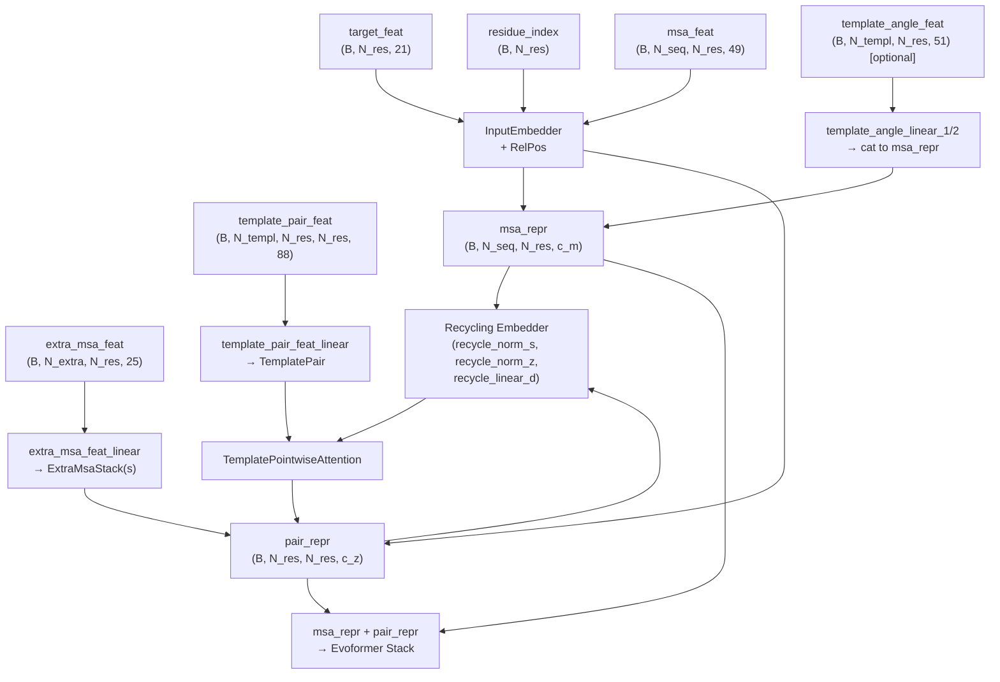
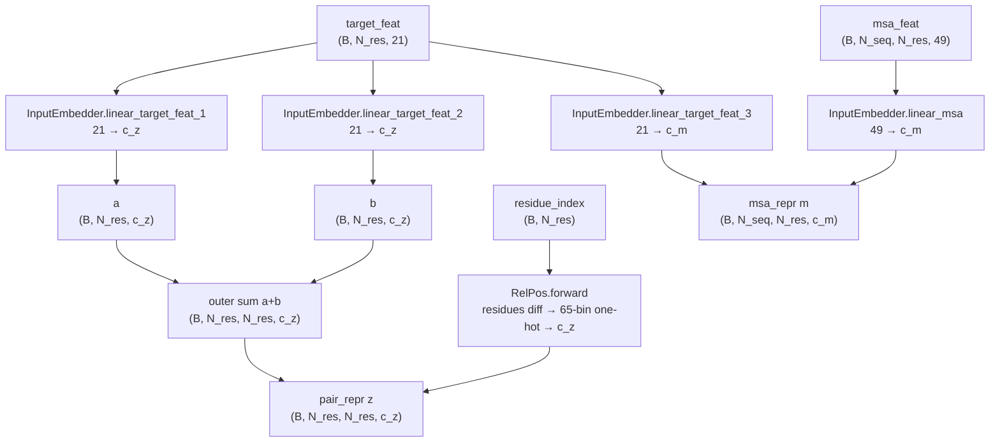
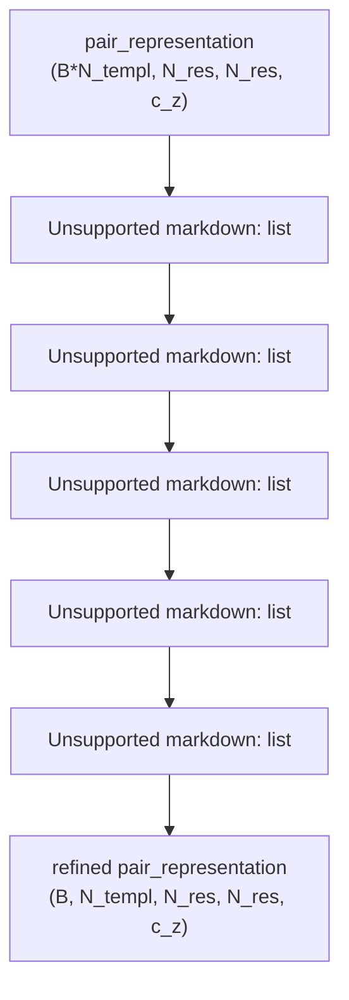
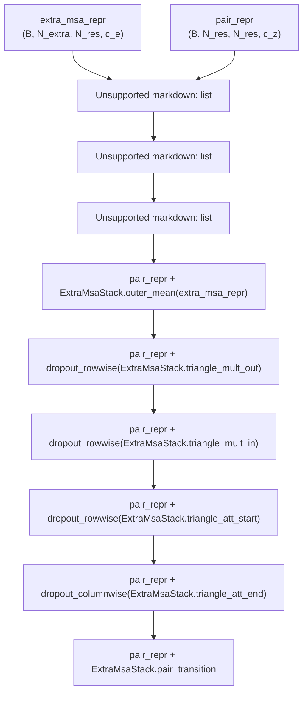

# Input Embedding

> **Relevant source files**
> * [minalphafold/embedders.py](https://github.com/ChrisHayduk/minAlphaFold2/blob/d0d066ad/minalphafold/embedders.py)
> * [minalphafold/model.py](https://github.com/ChrisHayduk/minAlphaFold2/blob/d0d066ad/minalphafold/model.py)

This page covers the initial feature-processing stage that converts raw sequence, MSA, and template inputs into the two core representations consumed by the rest of the model: the **MSA representation** (`msa_repr`) and the **pair representation** (`pair_repr`). The components documented here are `InputEmbedder`, `RelPos`, `TemplatePair`, `TemplatePointwiseAttention`, and `ExtraMsaStack`, all located in [minalphafold/embedders.py](https://github.com/ChrisHayduk/minAlphaFold2/blob/d0d066ad/minalphafold/embedders.py)

 Recycling embedder logic lives in [minalphafold/model.py](https://github.com/ChrisHayduk/minAlphaFold2/blob/d0d066ad/minalphafold/model.py)

 and is also described here.

For what happens to `msa_repr` and `pair_repr` after this stage, see the Evoformer Stack ([2.2](https://github.com/ChrisHayduk/minAlphaFold2/blob/d0d066ad/2.2)

). For the recycling utilities (`recycling_distance_bin`), see Utilities ([5](https://github.com/ChrisHayduk/minAlphaFold2/blob/d0d066ad/5)

). For the top-level orchestration across cycles, see Model Architecture ([2](https://github.com/ChrisHayduk/minAlphaFold2/blob/d0d066ad/2)

).

---

## Overview

The input embedding stage runs once per ensemble member, per recycle cycle. It has four sequential sub-stages:

**Stage 1 — Core Embedding:** `InputEmbedder` projects raw `target_feat` and `msa_feat` into initial `msa_repr` and `pair_repr`, augmented with relative positional encodings from `RelPos`.

**Stage 2 — Recycling:** Outputs from the previous recycle cycle are folded into `msa_repr` and `pair_repr` before template and extra-MSA processing.

**Stage 3 — Template Integration:** `TemplatePair` refines each template's pair features independently. `TemplatePointwiseAttention` then collapses the template dimension into `pair_repr`. Template torsion angles are appended as extra rows of `msa_repr`.

**Stage 4 — Extra MSA Stack:** `ExtraMsaStack` processes a larger, lower-quality MSA to further update `pair_repr` before the main Evoformer.

**Embedding stage pipeline:**



Sources: [minalphafold/model.py L169-L210](https://github.com/ChrisHayduk/minAlphaFold2/blob/d0d066ad/minalphafold/model.py#L169-L210)

 [minalphafold/embedders.py L6-L43](https://github.com/ChrisHayduk/minAlphaFold2/blob/d0d066ad/minalphafold/embedders.py#L6-L43)

---

## InputEmbedder and RelPos

`InputEmbedder` (Algorithm 3 in the supplement) is the first module called in every ensemble pass.

### Inputs and Parameters

| Parameter | Source | Shape |
| --- | --- | --- |
| `target_feat` | one-hot amino acid features | `(B, N_res, 21)` |
| `residue_index` | sequence position indices | `(B, N_res)` |
| `msa_feat` | MSA features (clustered) | `(B, N_seq, N_res, 49)` |

`InputEmbedder` has four learned projections:

| Attribute | Type | Dims | Role |
| --- | --- | --- | --- |
| `linear_target_feat_1` | `nn.Linear` | 21 → `c_z` | row embeddings for `pair_repr` |
| `linear_target_feat_2` | `nn.Linear` | 21 → `c_z` | column embeddings for `pair_repr` |
| `linear_target_feat_3` | `nn.Linear` | 21 → `c_m` | target sequence embedding for `msa_repr` |
| `linear_msa` | `nn.Linear` | 49 → `c_m` | MSA row embedding |
| `rel_pos` | `RelPos` | 65 → `c_z` | relative position bias for `pair_repr` |

### Pair Representation Construction

[minalphafold/embedders.py L31-L38](https://github.com/ChrisHayduk/minAlphaFold2/blob/d0d066ad/minalphafold/embedders.py#L31-L38)

`a = linear_target_feat_1(target_feat)` → `(B, N_res, c_z)`
`b = linear_target_feat_2(target_feat)` → `(B, N_res, c_z)`

The outer sum `z = a.unsqueeze(-2) + b.unsqueeze(-3)` creates an `(B, N_res, N_res, c_z)` pair representation where position `(i, j)` contains the sum of residue `i`'s row embedding and residue `j`'s column embedding.

Relative position information is then added: `z += rel_pos(residue_index)`.

### MSA Representation Construction

[minalphafold/embedders.py L41](https://github.com/ChrisHayduk/minAlphaFold2/blob/d0d066ad/minalphafold/embedders.py#L41-L41)

```
m = self.linear_target_feat_3(target_feat).unsqueeze(1) + self.linear_msa(msa_feat)
```

The target sequence embedding is broadcast across all MSA rows, so every row of `m` contains a per-residue sum of the target embedding and the MSA-row embedding. Output shape: `(B, N_seq, N_res, c_m)`.

### RelPos (Algorithm 4)

[minalphafold/embedders.py L45-L56](https://github.com/ChrisHayduk/minAlphaFold2/blob/d0d066ad/minalphafold/embedders.py#L45-L56)

`RelPos` encodes residue distance as a clipped, one-hot vector projected into `c_z` dimensions.

| Step | Operation | Shape |
| --- | --- | --- |
| Compute pairwise difference | `d[b,i,j] = residue_index[b,i] - residue_index[b,j]` | `(B, N_res, N_res)` |
| Clip to `[-max_rel, +max_rel]` and shift | `d.clamp(-32, 32) + 32` → bins `[0, 64]` | `(B, N_res, N_res)` |
| One-hot encode | `F.one_hot(d, 65).float()` | `(B, N_res, N_res, 65)` |
| Linear projection | `linear(oh)` | `(B, N_res, N_res, c_z)` |

Residue pairs more than 32 positions apart all map to the same boundary bin, so the model sees distance structure up to ±32 positions.

**InputEmbedder and RelPos data flow:**



Sources: [minalphafold/embedders.py L6-L56](https://github.com/ChrisHayduk/minAlphaFold2/blob/d0d066ad/minalphafold/embedders.py#L6-L56)

---

## Recycling Embedder Integration

After `InputEmbedder` produces `msa_repr` and `pair_repr`, recycling information from the previous cycle is added before template processing. This implements Algorithm 32 in the supplement and is handled directly in `AlphaFold2.forward`.

[minalphafold/model.py L148-L178](https://github.com/ChrisHayduk/minAlphaFold2/blob/d0d066ad/minalphafold/model.py#L148-L178)

Three tensors carry state across cycles:

| Variable | Shape | Initialized |
| --- | --- | --- |
| `single_rep_prev` | `(B, N_res, c_m)` | zeros |
| `z_prev` | `(B, N_res, N_res, c_z)` | zeros |
| `x_prev` | `(B, N_res, 3)` | zeros |

The updates applied within each cycle:

```
msa_repr[:, 0, :, :] += self.recycle_norm_s(single_rep_prev)pair_repr += self.recycle_norm_z(z_prev)pair_repr += self.recycle_linear_d(recycling_distance_bin(x_prev, n_bins=15))
```

| Module | Type | Input → Output | Purpose |
| --- | --- | --- | --- |
| `recycle_norm_s` | `nn.LayerNorm(c_m)` | `(B, N_res, c_m)` → same | Normalize previous first-row MSA; added to row 0 of `msa_repr` |
| `recycle_norm_z` | `nn.LayerNorm(c_z)` | `(B, N_res, N_res, c_z)` → same | Normalize previous pair repr; added to `pair_repr` |
| `recycle_linear_d` | `nn.Linear(15, c_z)` | `(B, N_res, N_res, 15)` → `(B, N_res, N_res, c_z)` | Project 15-bin Cβ distances; added to `pair_repr` |

The Cβ distance bins are computed by `recycling_distance_bin(x_prev, n_bins=15)` from [minalphafold/utils.py](https://github.com/ChrisHayduk/minAlphaFold2/blob/d0d066ad/minalphafold/utils.py)

 For Glycine residues, the Cα atom is used instead ([minalphafold/model.py L255-L261](https://github.com/ChrisHayduk/minAlphaFold2/blob/d0d066ad/minalphafold/model.py#L255-L261)

). On the first cycle all inputs are zeros, so the recycling terms have no effect.

Sources: [minalphafold/model.py L148-L178](https://github.com/ChrisHayduk/minAlphaFold2/blob/d0d066ad/minalphafold/model.py#L148-L178)

 [minalphafold/model.py L250-L261](https://github.com/ChrisHayduk/minAlphaFold2/blob/d0d066ad/minalphafold/model.py#L250-L261)

---

## Template Integration

Template data is processed in two steps: `TemplatePair` refines each template pair representation independently, and `TemplatePointwiseAttention` collapses the template dimension into the main `pair_repr`.

### Projection

[minalphafold/model.py L181](https://github.com/ChrisHayduk/minAlphaFold2/blob/d0d066ad/minalphafold/model.py#L181-L181)

Before `TemplatePair`, raw template pair features (88-dimensional) are projected to `c_t`:

```markdown
template_pair = self.template_pair_feat_linear(template_pair_feat)# (B, N_templ, N_res, N_res, 88) → (B, N_templ, N_res, N_res, c_t)
```

### TemplatePair (Algorithm 16)

[minalphafold/embedders.py L58-L127](https://github.com/ChrisHayduk/minAlphaFold2/blob/d0d066ad/minalphafold/embedders.py#L58-L127)

`TemplatePair` applies a stack of triangle operations to each template's pair representation, refining inter-residue relationships within each template independently.

**Initialization:**

| Attribute | Purpose |
| --- | --- |
| `layer_norm` + `linear_in` | Project from `c_t` to `c_z` |
| `triangle_mult_out[i]` | `TriangleMultiplicationOutgoing` per block |
| `triangle_mult_in[i]` | `TriangleMultiplicationIncoming` per block |
| `triangle_att_start[i]` | `TriangleAttentionStartingNode` per block |
| `triangle_att_end[i]` | `TriangleAttentionEndingNode` per block |
| `pair_transition[i]` | `PairTransition` per block |
| `final_layer_norm` | Final LN before output |

**Forward pass:**

The batch and template dimensions are merged to process all templates in parallel: shape `(B, N_templ, N_res, N_res, c_z)` → reshape to `(B*N_templ, N_res, N_res, c_z)` for the block loop, then reshaped back.

Each block applies, in order (all with residual connections and row/column dropout):



Sources: [minalphafold/embedders.py L58-L127](https://github.com/ChrisHayduk/minAlphaFold2/blob/d0d066ad/minalphafold/embedders.py#L58-L127)

### TemplatePointwiseAttention (Algorithm 17)

[minalphafold/embedders.py L129-L193](https://github.com/ChrisHayduk/minAlphaFold2/blob/d0d066ad/minalphafold/embedders.py#L129-L193)

`TemplatePointwiseAttention` reads queries from the main `pair_repr` and keys/values from the `TemplatePair` output, performing attention over the template dimension for each residue pair `(i, j)` independently.

**Tensor shapes through forward:**

| Tensor | Shape |
| --- | --- |
| `Q` (from `pair_representation`) | `(B, N_res, N_res, num_heads, head_dim)` |
| `K`, `V` (from `template_feat`) | `(B, N_templ, N_res, N_res, num_heads, head_dim)` |
| attention scores | `(B, N_templ, N_res, N_res, num_heads)` |
| softmax dim | dim=1 (over templates) |
| output after projection | `(B, N_res, N_res, c_z)` |

A `template_mask` of shape `(B, N_templ)` can mask out invalid templates by adding `-1e9` before softmax.

The output is added directly to `pair_repr`:

```
pair_repr = pair_repr + self.template_pointwise_att(template_pair, pair_repr, template_mask)
```

Sources: [minalphafold/embedders.py L129-L193](https://github.com/ChrisHayduk/minAlphaFold2/blob/d0d066ad/minalphafold/embedders.py#L129-L193)

 [minalphafold/model.py L183-L187](https://github.com/ChrisHayduk/minAlphaFold2/blob/d0d066ad/minalphafold/model.py#L183-L187)

### Template Torsion Angle Features

[minalphafold/model.py L191-L202](https://github.com/ChrisHayduk/minAlphaFold2/blob/d0d066ad/minalphafold/model.py#L191-L202)

If `template_angle_feat` is provided, it is projected to `c_m` dimensions and appended as extra rows to `msa_repr`:

```markdown
template_angle_repr = self.template_angle_linear_2(torch.nn.functional.relu(self.template_angle_linear_1(template_angle_feat)))# (B, N_templ, N_res, 51) → (B, N_templ, N_res, c_m)msa_repr = torch.cat([msa_repr, template_angle_repr], dim=1)
```

The corresponding `msa_mask` is also extended to cover the new template rows. This allows the Evoformer to attend to template torsion angle information as if it were additional MSA sequences.

Sources: [minalphafold/model.py L191-L202](https://github.com/ChrisHayduk/minAlphaFold2/blob/d0d066ad/minalphafold/model.py#L191-L202)

---

## Extra MSA Stack

[minalphafold/embedders.py L195-L339](https://github.com/ChrisHayduk/minAlphaFold2/blob/d0d066ad/minalphafold/embedders.py#L195-L339)

 [minalphafold/model.py L204-L210](https://github.com/ChrisHayduk/minAlphaFold2/blob/d0d066ad/minalphafold/model.py#L204-L210)

The extra MSA stack processes a second, typically larger MSA (with fewer features per position) to update `pair_repr` before the main Evoformer. It is implemented as `ExtraMsaStack` and run for `num_extra_msa` blocks.

### Projection

[minalphafold/model.py L205](https://github.com/ChrisHayduk/minAlphaFold2/blob/d0d066ad/minalphafold/model.py#L205-L205)

```markdown
extra_msa_repr = self.extra_msa_feat_linear(extra_msa_feat)# (B, N_extra, N_res, 25) → (B, N_extra, N_res, c_e)
```

### ExtraMsaStack Sub-modules

| Attribute | Role |
| --- | --- |
| `linear_q/k/v` + `linear_gate` + `linear_output` | Inline MSA row attention with pair bias (Algorithm 7) using `c_e` channel dim |
| `linear_pair` | Projects `pair_repr` to per-head bias for row attention |
| `msa_col_att` (`MSAColumnGlobalAttention`) | Column-wise global attention over the extra MSA (Algorithm 19) |
| `msa_transition` (`MSATransition`) | Feed-forward update on `extra_msa_repr` |
| `outer_mean` (`OuterProductMean`) | Outer product mean from extra MSA → `pair_repr` update |
| `triangle_mult_out/in` | Triangle multiplication updates on `pair_repr` |
| `triangle_att_start/end` | Triangle attention updates on `pair_repr` |
| `pair_transition` (`PairTransition`) | Feed-forward update on `pair_repr` |

### ExtraMsaStack Forward Sequence



Sources: [minalphafold/embedders.py L239-L339](https://github.com/ChrisHayduk/minAlphaFold2/blob/d0d066ad/minalphafold/embedders.py#L239-L339)

### MSAColumnGlobalAttention (Algorithm 19)

[minalphafold/embedders.py L341-L401](https://github.com/ChrisHayduk/minAlphaFold2/blob/d0d066ad/minalphafold/embedders.py#L341-L401)

Used inside `ExtraMsaStack` instead of the standard `MSAColumnAttention`. The key difference is in how queries are formed: rather than projecting each `(s, i)` cell independently, queries are computed per sequence and then **averaged across sequences** before scoring:

```markdown
Q_si = self.linear_q(x_ln)  # (B, N_seq, N_res, H, D)Q = Q_si.mean(dim=1) # (B, N_res, H, D)  — averaged across sequences
```

Attention is then over the sequence dimension (dim=1), with the aggregated value broadcast back to all sequences. This is more memory-efficient for large extra MSAs.

Sources: [minalphafold/embedders.py L341-L401](https://github.com/ChrisHayduk/minAlphaFold2/blob/d0d066ad/minalphafold/embedders.py#L341-L401)

---

## Output Summary

After all four sub-stages complete, the following tensors are passed to the Evoformer stack:

| Tensor | Shape | Contents |
| --- | --- | --- |
| `msa_repr` | `(B, N_seq [+ N_templ], N_res, c_m)` | MSA rows, recycling correction on row 0, optional template angle rows appended |
| `pair_repr` | `(B, N_res, N_res, c_z)` | Sequence pair features, relative positions, recycling distances, template information, extra MSA outer-product updates |

The `pair_repr` is explicitly symmetric by construction in its initial form (outer sum `a+b` is not symmetric, but RelPos adds a distance that is antisymmetric; template and extra MSA updates are not constrained to be symmetric). Symmetrization is not enforced at this stage.

Sources: [minalphafold/model.py L169-L225](https://github.com/ChrisHayduk/minAlphaFold2/blob/d0d066ad/minalphafold/model.py#L169-L225)

 [minalphafold/embedders.py L6-L56](https://github.com/ChrisHayduk/minAlphaFold2/blob/d0d066ad/minalphafold/embedders.py#L6-L56)