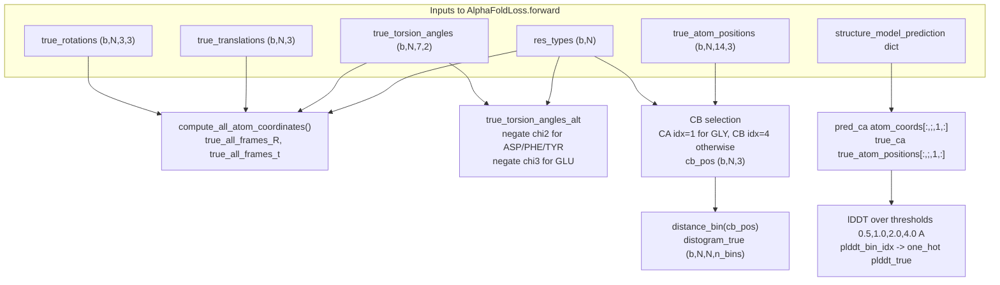
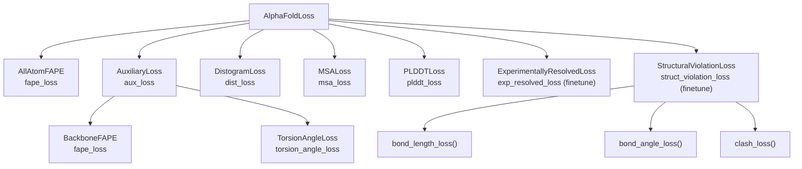
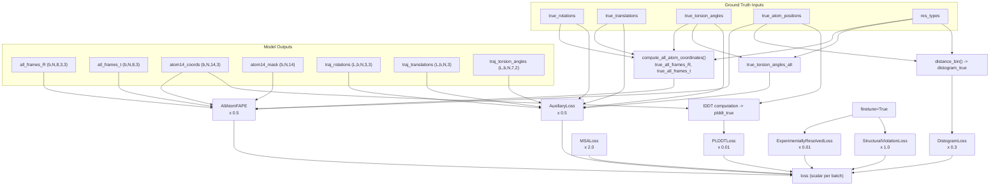

# Loss Functions

> **Relevant source files**
> * [minalphafold/losses.py](https://github.com/ChrisHayduk/minAlphaFold2/blob/d0d066ad/minalphafold/losses.py)

This page documents the `AlphaFoldLoss` class and all sub-loss modules defined in [minalphafold/losses.py](https://github.com/ChrisHayduk/minAlphaFold2/blob/d0d066ad/minalphafold/losses.py)

 `AlphaFoldLoss` is the top-level training objective: it receives raw model outputs and ground-truth structure data, computes several intermediate derived quantities (all-atom frames, CB-CB distances, per-residue lDDT), and combines seven individually weighted loss terms into a single scalar.

For details on the sub-modules that produce the inputs consumed here, see [Model Architecture](/ChrisHayduk/minAlphaFold2/2-model-architecture) and [Prediction Heads](/ChrisHayduk/minAlphaFold2/2.4-prediction-heads). For the structural constants (VDW radii, bond lengths, ideal frames) that violation losses read, see [Residue Constants](/ChrisHayduk/minAlphaFold2/4-residue-constants).

---

## AlphaFoldLoss — Top-Level Class

`AlphaFoldLoss` ([minalphafold/losses.py L17-L151](https://github.com/ChrisHayduk/minAlphaFold2/blob/d0d066ad/minalphafold/losses.py#L17-L151)

) instantiates all sub-loss modules and holds copies of the residue-constant tensors needed to reconstruct ground-truth all-atom frames.

### Registered Buffers

| Buffer | Source constant | Shape | Purpose |
| --- | --- | --- | --- |
| `default_frames` | `restype_rigid_group_default_frame` | `(21, 8, 4, 4)` | Ideal rigid-group frames per residue |
| `lit_positions` | `restype_atom14_rigid_group_positions` | `(21, 14, 3)` | Ideal atom positions in local frame |
| `atom_frame_idx_table` | `restype_atom14_to_rigid_group` | `(21, 14)` | Which rigid group each atom belongs to |
| `atom_mask_table` | `restype_atom14_mask` | `(21, 14)` | Atom existence mask per residue type |
| `rigid_group_mask_table` | `restype_rigid_group_mask` | `(21, 8)` | Which rigid groups exist per residue type |

### Sub-loss Modules

| Attribute | Class | Purpose |
| --- | --- | --- |
| `fape_loss` | `AllAtomFAPE` | All-atom FAPE across all 8 rigid-group frames |
| `aux_loss` | `AuxiliaryLoss` | Per-layer backbone FAPE + torsion loss over trajectory |
| `distogram_loss` | `DistogramLoss` | CB-CB distance cross-entropy |
| `msa_loss` | `MSALoss` | Masked MSA language modeling |
| `plddt_loss` | `PLDDTLoss` | Binned per-residue lDDT cross-entropy |
| `torsion_angle_loss` | `TorsionAngleLoss` | Chi angle supervision (unused directly; called via `aux_loss`) |
| `structural_violation_loss` | `StructuralViolationLoss` | Bond lengths, bond angles, clashes (finetune only) |
| `experimentally_resolved_loss` | `ExperimentallyResolvedLoss` | Per-atom resolution binary cross-entropy (finetune only) |

Sources: [minalphafold/losses.py L17-L41](https://github.com/ChrisHayduk/minAlphaFold2/blob/d0d066ad/minalphafold/losses.py#L17-L41)

---

## Forward Pass: Derived Quantities

Before any loss is computed, `AlphaFoldLoss.forward` ([minalphafold/losses.py L42-L151](https://github.com/ChrisHayduk/minAlphaFold2/blob/d0d066ad/minalphafold/losses.py#L42-L151)

) derives several quantities from the raw inputs.

**Diagram: Derived Quantity Pipeline**



Sources: [minalphafold/losses.py L59-L140](https://github.com/ChrisHayduk/minAlphaFold2/blob/d0d066ad/minalphafold/losses.py#L59-L140)

### True All-Atom Frames

The ground-truth rotation/translation trajectory is not stored directly. Instead, `compute_all_atom_coordinates` from `structure_module.py` is called on the true backbone frames and torsions to produce `true_all_frames_R` and `true_all_frames_t` of shape `(batch, N_res, 8, 3, 3)` and `(batch, N_res, 8, 3)` respectively.

[minalphafold/losses.py L64-L73](https://github.com/ChrisHayduk/minAlphaFold2/blob/d0d066ad/minalphafold/losses.py#L64-L73)

### Torsion Angle Alternates

Symmetric side chains have two equivalent atom labelings. For these residues, the "alternate" ground truth negates the (sin, cos) pair for the relevant chi angle:

| Residue (index) | Symmetric chi | Action |
| --- | --- | --- |
| ASP (3), PHE (13), TYR (18) | chi2 (torsion index 4) | negate `true_torsion_angles[:,:,4,:]` |
| GLU (6) | chi3 (torsion index 5) | negate `true_torsion_angles[:,:,5,:]` |

[minalphafold/losses.py L83-L94](https://github.com/ChrisHayduk/minAlphaFold2/blob/d0d066ad/minalphafold/losses.py#L83-L94)

### CB-CB Distance Bins

For GLY residues (`res_types == 7`), Cα (atom14 index 1) is used as the pseudo-Cβ. For all other residues, Cβ (atom14 index 4) is used. Distances are then discretized via `distance_bin` from `utils.py`.

[minalphafold/losses.py L102-L109](https://github.com/ChrisHayduk/minAlphaFold2/blob/d0d066ad/minalphafold/losses.py#L102-L109)

### pLDDT True Labels

Per-residue lDDT is computed **without gradients** from the Cα positions of the predicted and true structures. Pairs within 15 Å in the true structure (excluding self-pairs and padding) are included. The average fraction of preserved pairwise distances across four thresholds (0.5, 1.0, 2.0, 4.0 Å) is then binned into `n_plddt_bins` equal-width buckets and one-hot encoded.

[minalphafold/losses.py L116-L140](https://github.com/ChrisHayduk/minAlphaFold2/blob/d0d066ad/minalphafold/losses.py#L116-L140)

---

## Loss Weighting

### Standard Training Mode

```
loss = 0.5 * fape_loss
     + 0.5 * aux_loss
     + 0.3 * dist_loss
     + 2.0 * msa_loss
     + 0.01 * plddt_loss
```

### Finetune Mode (finetune=True)

Two additional terms are added:

```
loss += 0.01 * exp_resolved_loss
      + 1.0  * struct_violation_loss
```

| Term | Weight (standard) | Weight (finetune) | Class |
| --- | --- | --- | --- |
| `fape_loss` | 0.5 | 0.5 | `AllAtomFAPE` |
| `aux_loss` | 0.5 | 0.5 | `AuxiliaryLoss` |
| `dist_loss` | 0.3 | 0.3 | `DistogramLoss` |
| `msa_loss` | 2.0 | 2.0 | `MSALoss` |
| `plddt_loss` | 0.01 | 0.01 | `PLDDTLoss` |
| `exp_resolved_loss` | — | 0.01 | `ExperimentallyResolvedLoss` |
| `struct_violation_loss` | — | 1.0 | `StructuralViolationLoss` |

Sources: [minalphafold/losses.py L144-L149](https://github.com/ChrisHayduk/minAlphaFold2/blob/d0d066ad/minalphafold/losses.py#L144-L149)

---

## Sub-Loss Modules

**Diagram: Class Hierarchy and Data Flow**



Sources: [minalphafold/losses.py L17-L566](https://github.com/ChrisHayduk/minAlphaFold2/blob/d0d066ad/minalphafold/losses.py#L17-L566)

### AuxiliaryLoss

`AuxiliaryLoss` ([minalphafold/losses.py L153-L189](https://github.com/ChrisHayduk/minAlphaFold2/blob/d0d066ad/minalphafold/losses.py#L153-L189)

) supervises every intermediate backbone layer produced during the Structure Module's iterative refinement. It reads `traj_rotations` `(L, b, N_res, 3, 3)`, `traj_translations` `(L, b, N_res, 3)`, and `traj_torsion_angles` `(L, b, N_res, 7, 2)` from `structure_model_prediction`, then for each layer `l` computes:

* `BackboneFAPE` between layer-`l` frames and the true backbone frames (Cα positions only)
* `TorsionAngleLoss` between layer-`l` torsion angles and the true (or alternate) torsion angles

The per-layer losses are averaged:

```
aux_loss = mean_over_layers(fape_l + torsion_l)
```

For details, see [FAPE Losses](/ChrisHayduk/minAlphaFold2/3.1-fape-losses).

### TorsionAngleLoss

`TorsionAngleLoss` ([minalphafold/losses.py L191-L232](https://github.com/ChrisHayduk/minAlphaFold2/blob/d0d066ad/minalphafold/losses.py#L191-L232)

) measures how well the predicted `(sin, cos)` torsion angle vectors match the ground truth. Predictions are first normalized to unit vectors. The loss is the minimum squared distance between the predicted unit vector and either the canonical or the alternate ground-truth vector.

A per-residue `torsion_mask` is built from `chi_angles_mask` (from `residue_constants.py`) for indices 3–6 (chi angles), and all-ones for indices 0–2 (backbone angles ω, φ, ψ).

An auxiliary `angle_norm_loss` penalizes predictions whose norm deviates from 1.0, weighted by 0.02:

```
loss = torsion_loss + 0.02 * angle_norm_loss
```

For details, see [Sequence and Confidence Losses](/ChrisHayduk/minAlphaFold2/3.2-sequence-and-confidence-losses).

### BackboneFAPE

`BackboneFAPE` ([minalphafold/losses.py L234-L285](https://github.com/ChrisHayduk/minAlphaFold2/blob/d0d066ad/minalphafold/losses.py#L234-L285)

) implements Frame Aligned Point Error using only backbone Cα positions as both frames and atom targets. Each predicted frame's inverse is applied to all atom positions in both the predicted and true structures; the clamped L2 distances are averaged:

```
FAPE = (1/Z) * mean_{frames, atoms}( clamp(||x_pred_in_frame - x_true_in_frame||, max=d_clamp) )
```

Default parameters: `d_clamp=10.0`, `Z=10.0`, `eps=1e-4`. For details, see [FAPE Losses](/ChrisHayduk/minAlphaFold2/3.1-fape-losses).

### AllAtomFAPE

`AllAtomFAPE` ([minalphafold/losses.py L287-L365](https://github.com/ChrisHayduk/minAlphaFold2/blob/d0d066ad/minalphafold/losses.py#L287-L365)

) extends backbone FAPE to all 8 rigid-group frames per residue and all 14 atoms in atom14 format. The `(N_res × 8)` frames and `(N_res × 14)` atoms are flattened before the cross-product projection. A `rigid_group_mask` from `restype_rigid_group_mask` masks out frames that do not exist for the given amino acid type (e.g., frame 5 for ALA which has no chi2).

The averaging is hierarchical: atoms are averaged first within each frame (using `flat_atom_mask`), then frames are averaged (using `frame_mask`):

```
frame_mean_i = sum_a(dist_clamped_ia * atom_mask_a) / sum_a(atom_mask_a)
fape_loss    = sum_i(frame_mean_i * frame_mask_i) / (sum_i(frame_mask_i) * Z)
```

For details, see [FAPE Losses](/ChrisHayduk/minAlphaFold2/3.1-fape-losses).

### DistogramLoss

`DistogramLoss` ([minalphafold/losses.py L389-L402](https://github.com/ChrisHayduk/minAlphaFold2/blob/d0d066ad/minalphafold/losses.py#L389-L402)

) computes symmetric cross-entropy between predicted distogram logits `(batch, N_res, N_res, n_bins)` and one-hot true distance bins derived from CB-CB distances. The mean is taken over all `(i, j)` pairs. For details, see [Sequence and Confidence Losses](/ChrisHayduk/minAlphaFold2/3.2-sequence-and-confidence-losses).

### MSALoss

`MSALoss` ([minalphafold/losses.py L404-L426](https://github.com/ChrisHayduk/minAlphaFold2/blob/d0d066ad/minalphafold/losses.py#L404-L426)

) is masked language modeling on the MSA. Only positions where `msa_mask == 1` (the masked positions) contribute to the loss. Cross-entropy is averaged over the number of masked positions. For details, see [Sequence and Confidence Losses](/ChrisHayduk/minAlphaFold2/3.2-sequence-and-confidence-losses).

### PLDDTLoss

`PLDDTLoss` ([minalphafold/losses.py L367-L387](https://github.com/ChrisHayduk/minAlphaFold2/blob/d0d066ad/minalphafold/losses.py#L367-L387)

) computes cross-entropy between predicted pLDDT logits and the one-hot binned true lDDT values derived in the forward pass. Valid residues are selected by `seq_mask`. For details, see [Sequence and Confidence Losses](/ChrisHayduk/minAlphaFold2/3.2-sequence-and-confidence-losses).

### ExperimentallyResolvedLoss

`ExperimentallyResolvedLoss` ([minalphafold/losses.py L428-L438](https://github.com/ChrisHayduk/minAlphaFold2/blob/d0d066ad/minalphafold/losses.py#L428-L438)

) applies binary cross-entropy with logits independently to each of the 14 atom positions per residue. It predicts which atoms are experimentally observed in the structure. Only active during finetune mode. For details, see [Sequence and Confidence Losses](/ChrisHayduk/minAlphaFold2/3.2-sequence-and-confidence-losses).

### StructuralViolationLoss

`StructuralViolationLoss` ([minalphafold/losses.py L440-L566](https://github.com/ChrisHayduk/minAlphaFold2/blob/d0d066ad/minalphafold/losses.py#L440-L566)

) sums three geometry-enforcement terms. It is only applied in finetune mode. For detailed documentation of each sub-component, see [Structural Violation Loss](/ChrisHayduk/minAlphaFold2/3.3-structural-violation-loss).

| Method | What it penalizes |
| --- | --- |
| `bond_length_loss()` | C(i)–N(i+1) peptide bond length deviation from ideal |
| `bond_angle_loss()` | CA–C–N and C–N–CA backbone angles via law of cosines |
| `clash_loss()` | VDW overlap between non-bonded atoms (sequence separation ≥ 2) |

---

## End-to-End Data Flow

**Diagram: AlphaFoldLoss.forward — Inputs, Derived Quantities, and Loss Terms**



Sources: [minalphafold/losses.py L42-L151](https://github.com/ChrisHayduk/minAlphaFold2/blob/d0d066ad/minalphafold/losses.py#L42-L151)