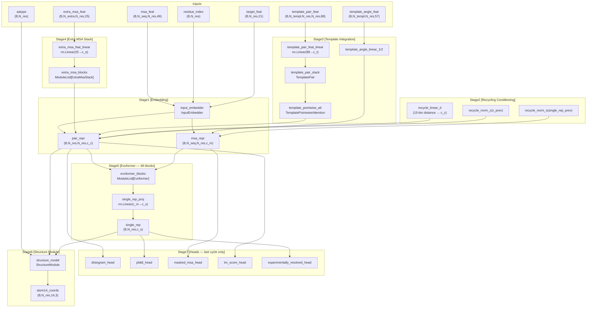
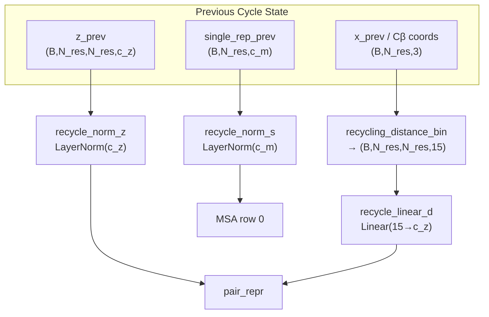

# Model Architecture

> **Relevant source files**
> * [README.md](https://github.com/ChrisHayduk/minAlphaFold2/blob/d0d066ad/README.md?plain=1)
> * [minalphafold/model.py](https://github.com/ChrisHayduk/minAlphaFold2/blob/d0d066ad/minalphafold/model.py)

This page documents the top-level `AlphaFold2` class defined in [minalphafold/model.py](https://github.com/ChrisHayduk/minAlphaFold2/blob/d0d066ad/minalphafold/model.py)

 which orchestrates the full forward pass: input embedding, recycling, ensemble averaging, structure prediction, and all output heads. For details on the individual sub-systems invoked here, see:

* [Input Embedding](/ChrisHayduk/minAlphaFold2/2.1-input-embedding) — `InputEmbedder`, `TemplatePair`, `TemplatePointwiseAttention`, `ExtraMsaStack`
* [Evoformer Stack](/ChrisHayduk/minAlphaFold2/2.2-evoformer-stack) — `Evoformer` block internals
* [Structure Module](/ChrisHayduk/minAlphaFold2/2.3-structure-module) — `StructureModule`, `InvariantPointAttention`, `BackboneUpdate`
* [Prediction Heads](/ChrisHayduk/minAlphaFold2/2.4-prediction-heads) — `DistogramHead`, `PLDDTHead`, and the three others

---

## Overview

`AlphaFold2` is a `torch.nn.Module` that takes raw sequence, MSA, template, and extra-MSA features, runs them through a configurable number of recycle cycles and ensemble members, and returns a dictionary of structural predictions and logits.

It maps directly to **Algorithm 2** (Inference) and **Algorithms 30–32** (recycling and ensemble) in the AlphaFold2 supplement.

Sources: [minalphafold/model.py L10-L48](https://github.com/ChrisHayduk/minAlphaFold2/blob/d0d066ad/minalphafold/model.py#L10-L48)

 [README.md L41-L72](https://github.com/ChrisHayduk/minAlphaFold2/blob/d0d066ad/README.md?plain=1#L41-L72)

---

## Module Composition

The `AlphaFold2.__init__` method instantiates all sub-modules. The diagram below maps the constructor assignments to the classes they hold.

**AlphaFold2 Sub-Module Ownership**

```mermaid
flowchart TD

AF2["AlphaFold2<br>(model.py)"]
IE["input_embedder<br>InputEmbedder"]
TPL["template_pair_feat_linear<br>nn.Linear(88→c_t)"]
TPS["template_pair_stack<br>TemplatePair"]
TPA["template_pointwise_att<br>TemplatePointwiseAttention"]
TAL1["template_angle_linear_1<br>nn.Linear(57→c_m)"]
TAL2["template_angle_linear_2<br>nn.Linear(c_m→c_m)"]
EML["extra_msa_feat_linear<br>nn.Linear(25→c_e)"]
EMB["extra_msa_blocks<br>ModuleList[ExtraMsaStack]"]
RNS["recycle_norm_s<br>LayerNorm(c_m)"]
RNZ["recycle_norm_z<br>LayerNorm(c_z)"]
RLD["recycle_linear_d<br>nn.Linear(15→c_z)"]
EVO["evoformer_blocks<br>ModuleList[Evoformer]"]
SRP["single_rep_proj<br>nn.Linear(c_m→c_s)"]
SM["structure_model<br>StructureModule"]
DH["distogram_head<br>DistogramHead"]
PH["plddt_head<br>PLDDTHead"]
MH["masked_msa_head<br>MaskedMSAHead"]
TH["tm_score_head<br>TMScoreHead"]
EH["experimentally_resolved_head<br>ExperimentallyResolvedHead"]

AF2 --> IE
AF2 --> TPL
AF2 --> TPS
AF2 --> TPA
AF2 --> TAL1
AF2 --> TAL2
AF2 --> EML
AF2 --> EMB
AF2 --> RNS
AF2 --> RNZ
AF2 --> RLD
AF2 --> EVO
AF2 --> SRP
AF2 --> SM
AF2 --> DH
AF2 --> PH
AF2 --> MH
AF2 --> TH
AF2 --> EH

subgraph Heads ["Heads"]
    DH
    PH
    MH
    TH
    EH
end

subgraph Structure ["Structure"]
    SM
end

subgraph Evoformer ["Evoformer"]
    EVO
    SRP
end

subgraph subGraph1 ["Recycling Embedder"]
    RNS
    RNZ
    RLD
end

subgraph subGraph0 ["Embedding Stage"]
    IE
    TPL
    TPS
    TPA
    TAL1
    TAL2
    EML
    EMB
end
```



Sources: [minalphafold/model.py L11-L48](https://github.com/ChrisHayduk/minAlphaFold2/blob/d0d066ad/minalphafold/model.py#L11-L48)

---

## Inputs

`AlphaFold2.forward` accepts the following tensors. `B` = batch size, `N_res` = number of residues, `N_seq` = MSA depth, `N_extra` = extra MSA depth, `N_templ` = number of templates.

| Argument | Shape | Required | Description |
| --- | --- | --- | --- |
| `target_feat` | `(B, N_res, 21)` | Yes | One-hot amino acid type features |
| `residue_index` | `(B, N_res)` | Yes | Integer residue positions for relative encoding |
| `msa_feat` | `(B, N_seq, N_res, 49)` | Yes | MSA features (49-dim per position) |
| `extra_msa_feat` | `(B, N_extra, N_res, 25)` | Yes | Extra MSA features (25-dim per position) |
| `template_pair_feat` | `(B, N_templ, N_res, N_res, 88)` | Yes | Template pair features (88-dim) |
| `aatype` | `(B, N_res)` | Yes | Integer amino acid type (used by Structure Module) |
| `template_angle_feat` | `(B, N_templ, N_res, 57)` | No | Template torsion-angle features (57-dim) |
| `template_mask` | `(B, N_templ)` | No | 1 = valid template, 0 = padding |
| `seq_mask` | `(B, N_res)` | No | 1 = valid residue, 0 = padding |
| `msa_mask` | `(B, N_seq, N_res)` | No | 1 = valid MSA position |
| `extra_msa_mask` | `(B, N_extra, N_res)` | No | 1 = valid extra MSA position |
| `n_cycles` | `int` (default 3) | No | Number of recycling iterations |
| `n_ensemble` | `int` (default 1) | No | Number of ensemble members to average |

When any mask argument is `None`, it defaults to an all-ones tensor of the appropriate shape [minalphafold/model.py L140-L146](https://github.com/ChrisHayduk/minAlphaFold2/blob/d0d066ad/minalphafold/model.py#L140-L146)

Sources: [minalphafold/model.py L106-L151](https://github.com/ChrisHayduk/minAlphaFold2/blob/d0d066ad/minalphafold/model.py#L106-L151)

---

## Outputs

The forward pass returns a single `dict` on the last recycle cycle. All outputs are in Ångströms (the Structure Module converts from nanometres internally).

| Key | Shape | Source |
| --- | --- | --- |
| `atom14_coords` | `(B, N_res, 14, 3)` | `StructureModule` |
| `atom14_mask` | `(B, N_res, 14)` | `StructureModule` |
| `final_rotations` | `(B, N_res, 3, 3)` | `StructureModule` |
| `final_translations` | `(B, N_res, 3)` | `StructureModule` |
| `all_frames_R` | `(B, N_res, 8, 3, 3)` | `StructureModule` |
| `all_frames_t` | `(B, N_res, 8, 3)` | `StructureModule` |
| `traj_rotations` | `(N_layers, B, N_res, 3, 3)` | `StructureModule` |
| `traj_translations` | `(N_layers, B, N_res, 3)` | `StructureModule` |
| `traj_torsion_angles` | `(N_layers, B, N_res, 7, 2)` | `StructureModule` |
| `single` | `(B, N_res, c_s)` | `StructureModule` |
| `distogram_logits` | `(B, N_res, N_res, n_dist_bins)` | `DistogramHead` |
| `plddt_logits` | `(B, N_res, n_plddt_bins)` | `PLDDTHead` |
| `masked_msa_logits` | `(B, N_seq, N_res, n_msa_classes)` | `MaskedMSAHead` |
| `tm_logits` | `(B, N_res, N_res, n_pae_bins)` | `TMScoreHead` |
| `experimentally_resolved_logits` | `(B, N_res, 14)` | `ExperimentallyResolvedHead` |
| `pair_representation` | `(B, N_res, N_res, c_z)` | Evoformer output |
| `msa_representation` | `(B, N_seq, N_res, c_m)` | Evoformer output |
| `single_representation` | `(B, N_res, c_s)` | `single_rep_proj` output |

Sources: [minalphafold/model.py L231-L248](https://github.com/ChrisHayduk/minAlphaFold2/blob/d0d066ad/minalphafold/model.py#L231-L248)

---

## Forward Pass Data Flow

The following diagram traces data through a single recycle cycle and a single ensemble member.

**AlphaFold2.forward — Stage-by-Stage Data Flow**



Sources: [minalphafold/model.py L153-L248](https://github.com/ChrisHayduk/minAlphaFold2/blob/d0d066ad/minalphafold/model.py#L153-L248)

---

## Recycling Loop

The recycling loop (Algorithm 30/31/32) runs the full embedding + Evoformer + Structure Module pipeline `n_cycles` times. Only the final cycle computes gradients and produces head outputs.

**Behavior by mode:**

| Mode | Cycle count |
| --- | --- |
| Inference (`model.eval()`) | Exactly `n_cycles` (fixed) |
| Training (`model.train()`) | Uniformly sampled from `{1, ..., n_cycles}` [minalphafold/model.py L128-L130](https://github.com/ChrisHayduk/minAlphaFold2/blob/d0d066ad/minalphafold/model.py#L128-L130) |

**What is recycled between cycles:**

| Recycled tensor | Shape | Processing before reuse |
| --- | --- | --- |
| `single_rep_prev` | `(B, N_res, c_m)` | `recycle_norm_s` (LayerNorm) added to row 0 of `msa_repr` |
| `z_prev` | `(B, N_res, N_res, c_z)` | `recycle_norm_z` (LayerNorm) added to `pair_repr` |
| `x_prev` (Cβ positions) | `(B, N_res, 3)` | `recycling_distance_bin` → 15-bin one-hot → `recycle_linear_d` → added to `pair_repr` |

Gradient detachment: tensors stored for the next cycle call `.detach()` explicitly [minalphafold/model.py L252-L254](https://github.com/ChrisHayduk/minAlphaFold2/blob/d0d066ad/minalphafold/model.py#L252-L254)

 Gradients only flow through the last cycle [minalphafold/model.py L156](https://github.com/ChrisHayduk/minAlphaFold2/blob/d0d066ad/minalphafold/model.py#L156-L156)

**Pseudo-beta extraction**: For glycine residues (`aatype == 7`), Cα (atom index 1) is used in place of Cβ (atom index 4) [minalphafold/model.py L258-L261](https://github.com/ChrisHayduk/minAlphaFold2/blob/d0d066ad/minalphafold/model.py#L258-L261)

 This matches the standard convention.

Sources: [minalphafold/model.py L128-L261](https://github.com/ChrisHayduk/minAlphaFold2/blob/d0d066ad/minalphafold/model.py#L128-L261)

**Recycling Conditioning Detail (Algorithm 32)**



Sources: [minalphafold/model.py L175-L179](https://github.com/ChrisHayduk/minAlphaFold2/blob/d0d066ad/minalphafold/model.py#L175-L179)

 [minalphafold/model.py L251-L261](https://github.com/ChrisHayduk/minAlphaFold2/blob/d0d066ad/minalphafold/model.py#L251-L261)

---

## Ensemble Averaging

Within each recycle cycle, the forward pass runs `n_ensemble` times with independent dropout masks (input features are identical; stochasticity comes from dropout). Outputs are accumulated and averaged [minalphafold/model.py L158-L227](https://github.com/ChrisHayduk/minAlphaFold2/blob/d0d066ad/minalphafold/model.py#L158-L227)

:

```markdown
msa_first_row  = single_rep_accum / n_ensemble    # (B, N_res, c_m)
pair_repr      = pair_repr_accum  / n_ensemble    # (B, N_res, N_res, c_z)
msa_repr       = msa_repr_accum   / n_ensemble    # (B, N_seq, N_res, c_m)
```

The `single_rep` fed to the Structure Module and heads is derived from the averaged `msa_first_row`:

```markdown
single_rep = single_rep_proj(msa_first_row)    # Linear(c_m → c_s)
```

Note: `msa_repr_accum` only accumulates the original MSA rows (not template angle rows appended during processing), so its slice `[:, :msa_feat.shape[1], :, :]` is used [minalphafold/model.py L227](https://github.com/ChrisHayduk/minAlphaFold2/blob/d0d066ad/minalphafold/model.py#L227-L227)

Sources: [minalphafold/model.py L157-L227](https://github.com/ChrisHayduk/minAlphaFold2/blob/d0d066ad/minalphafold/model.py#L157-L227)

---

## Parameter Initialization

`AlphaFold2._initialize_alphafold_parameters` [minalphafold/model.py L62-L104](https://github.com/ChrisHayduk/minAlphaFold2/blob/d0d066ad/minalphafold/model.py#L62-L104)

 runs after `__init__` and applies specific weight initializations matching supplement §1.11.4. It walks `self.modules()` and applies rules by class name.

| Rule | Target class(es) | What is zeroed/set |
| --- | --- | --- |
| Output zero-init | `MSARowAttentionWithPairBias`, `MSAColumnAttention`, `MSAColumnGlobalAttention`, `TemplatePointwiseAttention`, `ExtraMsaStack`, `TriangleAttentionStartingNode`, `TriangleAttentionEndingNode`, `InvariantPointAttention` | `module.linear_output` weights and bias → 0 |
| Transition zero-init | `MSATransition`, `PairTransition` | `module.linear_down` weights and bias → 0 |
| Gate bias init | Any module with `linear_gate` | weights → 0, bias → 1 (so sigmoid(0·x + 1) ≈ 0.73 at init) |
| Triangle multiplication gates | `TriangleMultiplicationOutgoing`, `TriangleMultiplicationIncoming` | `gate1`, `gate2`, `gate` → bias=1; `out_linear` → zero |
| Outer product mean | `OuterProductMean` | `linear_out` → zero |
| Structure module transition | `StructureModule` | `transition_linear_3` → zero |
| Backbone update | `BackboneUpdate` | `linear` → zero (produces identity rotation at init) |
| IPA head weights | `InvariantPointAttention` | `head_weights` → `log(e-1)` so `softplus(head_weights) = 1.0` |

The helper `_zero_linear` zeros both weight and bias. `_init_gate_linear` zeros weight but sets bias to 1.

Sources: [minalphafold/model.py L50-L104](https://github.com/ChrisHayduk/minAlphaFold2/blob/d0d066ad/minalphafold/model.py#L50-L104)

---

## Template Angle Features

When `template_angle_feat` is provided, it is projected through a two-layer MLP and **appended as extra rows to `msa_repr`** before the Evoformer stack [minalphafold/model.py L191-L202](https://github.com/ChrisHayduk/minAlphaFold2/blob/d0d066ad/minalphafold/model.py#L191-L202)

:

```markdown
template_angle_repr = linear_2(relu(linear_1(template_angle_feat)))
# shape: (B, N_templ, N_res, c_m)
msa_repr = cat([msa_repr, template_angle_repr], dim=1)
```

The MSA mask is extended correspondingly [minalphafold/model.py L204-L207](https://github.com/ChrisHayduk/minAlphaFold2/blob/d0d066ad/minalphafold/model.py#L204-L207)

 After the Evoformer runs, only the original `msa_feat.shape[1]` rows are kept for output and loss computation [minalphafold/model.py L220](https://github.com/ChrisHayduk/minAlphaFold2/blob/d0d066ad/minalphafold/model.py#L220-L220)

Sources: [minalphafold/model.py L191-L202](https://github.com/ChrisHayduk/minAlphaFold2/blob/d0d066ad/minalphafold/model.py#L191-L202)

 [minalphafold/model.py L220](https://github.com/ChrisHayduk/minAlphaFold2/blob/d0d066ad/minalphafold/model.py#L220-L220)

---

## Configuration Parameters

All channel dimensions and hyperparameters are read from a `config` object passed to `__init__`. The relevant fields used directly by `AlphaFold2` are:

| Config field | Used for |
| --- | --- |
| `config.c_m` | MSA representation channel dim |
| `config.c_z` | Pair representation channel dim |
| `config.c_s` | Single representation channel dim (`single_rep_proj` output) |
| `config.c_t` | Template pair channel dim |
| `config.c_e` | Extra MSA channel dim |
| `config.num_evoformer` | Length of `evoformer_blocks` ModuleList |
| `config.num_extra_msa` | Length of `extra_msa_blocks` ModuleList |

Sources: [minalphafold/model.py L11-L47](https://github.com/ChrisHayduk/minAlphaFold2/blob/d0d066ad/minalphafold/model.py#L11-L47)