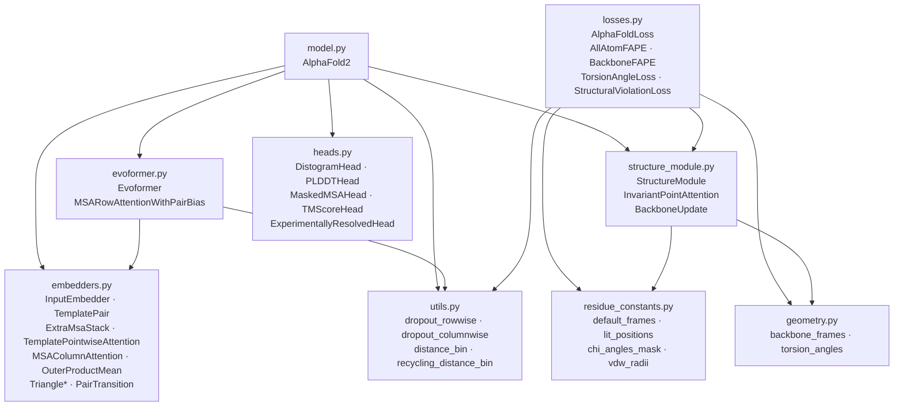
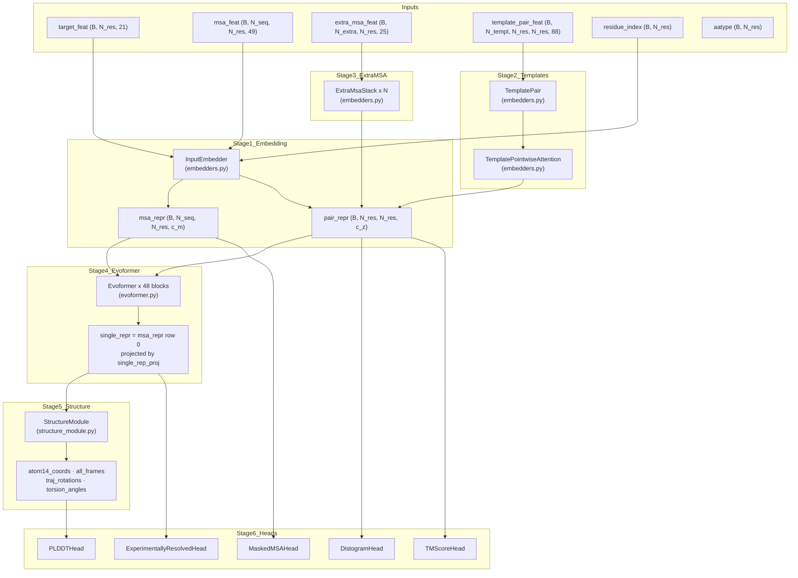

# Overview

> **Relevant source files**
> * [README.md](https://github.com/ChrisHayduk/minAlphaFold2/blob/d0d066ad/README.md?plain=1)
> * [minalphafold/__init__.py](https://github.com/ChrisHayduk/minAlphaFold2/blob/d0d066ad/minalphafold/__init__.py)
> * [minalphafold/model.py](https://github.com/ChrisHayduk/minAlphaFold2/blob/d0d066ad/minalphafold/model.py)
> * [tests/__init__.py](https://github.com/ChrisHayduk/minAlphaFold2/blob/d0d066ad/tests/__init__.py)

This page describes the purpose, structure, and high-level prediction pipeline of **minAlphaFold2**: a minimal, pedagogical PyTorch reimplementation of the AlphaFold2 protein structure prediction system. It covers what the project does, how the source files are organized, and how data flows through the full system from raw inputs to structural predictions.

For details on individual subsystems, see: [Model Architecture](/ChrisHayduk/minAlphaFold2/2-model-architecture), [Evoformer Stack](/ChrisHayduk/minAlphaFold2/2.2-evoformer-stack), [Structure Module](/ChrisHayduk/minAlphaFold2/2.3-structure-module), [Loss Functions](/ChrisHayduk/minAlphaFold2/3-loss-functions), [Residue Constants](/ChrisHayduk/minAlphaFold2/4-residue-constants), and [Utilities](/ChrisHayduk/minAlphaFold2/5-utilities).

---

## Project Goals

minAlphaFold2 is designed to be a reference implementation for understanding AlphaFold2, not a production inference system. Three design principles govern every decision:

* **Pure PyTorch.** Every layer is constructed from `nn.Linear`, `nn.LayerNorm`, `torch.einsum`, and standard activations. No external ML frameworks [README.md L15](https://github.com/ChrisHayduk/minAlphaFold2/blob/d0d066ad/README.md?plain=1#L15-L15)
* **1-to-1 algorithm mapping.** Each module corresponds to a numbered algorithm in the AlphaFold2 supplementary information. Comments in source files reference the specific algorithm and line numbers [README.md L16](https://github.com/ChrisHayduk/minAlphaFold2/blob/d0d066ad/README.md?plain=1#L16-L16)
* **Readable and modifiable.** The entire model is approximately 3,500 lines across 9 modules [README.md L17](https://github.com/ChrisHayduk/minAlphaFold2/blob/d0d066ad/README.md?plain=1#L17-L17)

---

## Repository Layout

```markdown
minalphafold/
    a3m.py                # Minimal A3M parsing and tokenization
    mmcif.py              # Minimal mmCIF atom-site parsing to atom14 coordinates
    geometry.py           # Rigid frames, torsions, pseudo-beta helpers for supervision
    data.py               # Processed OpenProteinSet dataset, crops, collation, feature builders
    model.py              # Top-level AlphaFold2 module; recycling loop; ensemble averaging
    embedders.py          # InputEmbedder, RelPos, TemplatePair, ExtraMsaStack, triangle/attention ops
    evoformer.py          # Evoformer block, MSARowAttentionWithPairBias
    structure_module.py   # StructureModule, IPA, BackboneUpdate, all-atom coordinate generation
    heads.py              # DistogramHead, PLDDTHead, MaskedMSAHead, TMScoreHead, Experimentally Resolved
    losses.py             # AlphaFoldLoss, FAPE variants, torsion, distogram, MSA, violation losses
    utils.py              # Row/column dropout, distance binning, recycling distogram
    residue_constants.py  # Amino acid chemical data: frames, bond lengths, VDW radii, torsion masks
    trainer.py            # Training loop, dataloader wiring, and checkpoint helpers
scripts/
    download_openproteinset.py   # Minimal OpenProteinSet downloader/setup helper
    preprocess_openproteinset.py # Raw OpenProteinSet -> per-chain NPZ caches
tests/
    test_shapes.py        # Core shape and semantic tests
```

Sources: [README.md L21-L45](https://github.com/ChrisHayduk/minAlphaFold2/blob/d0d066ad/README.md?plain=1#L21-L45)

---

## Source File Roles

The table below maps each source file to the classes it owns and the AlphaFold2 supplement algorithms it implements.

| File | Key Classes / Functions | Supplement Algorithms |
| --- | --- | --- |
| `model.py` | `AlphaFold2` | Alg. 2, 30, 31, 32 |
| `embedders.py` | `InputEmbedder`, `RelPos`, `TemplatePair`, `TemplatePointwiseAttention`, `ExtraMsaStack`, `MSAColumnAttention`, `OuterProductMean`, `TriangleMultiplication*`, `TriangleAttention*`, `PairTransition` | Alg. 3–5, 8–19 |
| `evoformer.py` | `Evoformer`, `MSARowAttentionWithPairBias` | Alg. 6, 7 |
| `structure_module.py` | `StructureModule`, `InvariantPointAttention`, `BackboneUpdate`, `compute_all_atom_coordinates` | Alg. 20–25 |
| `heads.py` | `DistogramHead`, `PLDDTHead`, `MaskedMSAHead`, `TMScoreHead`, `ExperimentallyResolvedHead` | Alg. 29 |
| `losses.py` | `AlphaFoldLoss`, `BackboneFAPE`, `AllAtomFAPE`, `TorsionAngleLoss`, `StructuralViolationLoss`, `DistogramLoss`, `MSALoss`, `PLDDTLoss` | Alg. 26–29 |
| `utils.py` | `dropout_rowwise`, `dropout_columnwise`, `distance_bin`, `one_hot_nearest`, `recycling_distance_bin` | Alg. 5, 32 |
| `residue_constants.py` | `default_frames`, `lit_positions`, `chi_angles_mask`, `vdw_radii` | (data layer) |
| `data.py` | `ProcessedOpenProteinSetDataset`, `collate_batch` | Alg. 1 |
| `geometry.py` | `backbone_frames`, `torsion_angles`, `pseudo_beta_positions` | Alg. 21 |

Sources: [README.md L49-L83](https://github.com/ChrisHayduk/minAlphaFold2/blob/d0d066ad/README.md?plain=1#L49-L83)

 [minalphafold/model.py L4-L8](https://github.com/ChrisHayduk/minAlphaFold2/blob/d0d066ad/minalphafold/model.py#L4-L8)

---

## Module Dependency Graph

The diagram below shows which modules import from which. Arrows point from the importing module to the module being imported.

**Figure: Module dependency graph (file-level)**



Sources: [minalphafold/model.py L4-L8](https://github.com/ChrisHayduk/minAlphaFold2/blob/d0d066ad/minalphafold/model.py#L4-L8)

 [README.md L22-L34](https://github.com/ChrisHayduk/minAlphaFold2/blob/d0d066ad/README.md?plain=1#L22-L34)

---

## High-Level Prediction Pipeline

A single forward pass through `AlphaFold2.forward` proceeds in six sequential stages. During training, recycling is applied for a randomly sampled number of cycles (Algorithm 31); during inference, it uses a fixed count (Algorithm 30).

**Figure: AlphaFold2 forward pass — stage-to-class mapping**



Sources: [minalphafold/model.py L106-L263](https://github.com/ChrisHayduk/minAlphaFold2/blob/d0d066ad/minalphafold/model.py#L106-L263)

 [minalphafold/model.py L27-L45](https://github.com/ChrisHayduk/minAlphaFold2/blob/d0d066ad/minalphafold/model.py#L27-L45)

---

## Recycling Loop

`AlphaFold2.forward` wraps the six stages above in a recycling loop (Algorithms 31–32). The loop re-runs the full pipeline `n_cycles` times, carrying three tensors between iterations:

| Recycling Tensor | Shape | Usage |
| --- | --- | --- |
| `single_rep_prev` | `(B, N_res, c_m)` | Added to first MSA row after `recycle_norm_s` (LayerNorm) [minalphafold/model.py L19](https://github.com/ChrisHayduk/minAlphaFold2/blob/d0d066ad/minalphafold/model.py#L19-L19) |
| `z_prev` | `(B, N_res, N_res, c_z)` | Added to `pair_repr` after `recycle_norm_z` (LayerNorm) [minalphafold/model.py L20](https://github.com/ChrisHayduk/minAlphaFold2/blob/d0d066ad/minalphafold/model.py#L20-L20) |
| `x_prev` | `(B, N_res, 3)` | Pseudo-beta (Cβ / Cα for Gly) coordinates; converted to 15-bin one-hot via `recycling_distance_bin`, projected by `recycle_linear_d` [minalphafold/model.py L21](https://github.com/ChrisHayduk/minAlphaFold2/blob/d0d066ad/minalphafold/model.py#L21-L21) |

Only the **last** cycle runs with gradients enabled [minalphafold/model.py L156](https://github.com/ChrisHayduk/minAlphaFold2/blob/d0d066ad/minalphafold/model.py#L156-L156)

 During **training**, `n_cycles` is sampled uniformly from `{1, …, n_cycles}` at the start of each forward pass [minalphafold/model.py L130](https://github.com/ChrisHayduk/minAlphaFold2/blob/d0d066ad/minalphafold/model.py#L130-L130)

 During **inference**, it is fixed.

Sources: [minalphafold/model.py L128-L156](https://github.com/ChrisHayduk/minAlphaFold2/blob/d0d066ad/minalphafold/model.py#L128-L156)

 [minalphafold/model.py L149-L151](https://github.com/ChrisHayduk/minAlphaFold2/blob/d0d066ad/minalphafold/model.py#L149-L151)

---

## Ensemble Averaging

Inside each recycle iteration, the embedding-through-Evoformer path can be repeated `n_ensemble` times. The outputs are accumulated and averaged before being passed to the Structure Module and prediction heads [minalphafold/model.py L157-L225](https://github.com/ChrisHayduk/minAlphaFold2/blob/d0d066ad/minalphafold/model.py#L157-L225)

:

* `msa_repr_accum` — accumulates MSA representations (first `N_seq` rows only) [minalphafold/model.py L160](https://github.com/ChrisHayduk/minAlphaFold2/blob/d0d066ad/minalphafold/model.py#L160-L160)
* `pair_repr_accum` — accumulates pair representations [minalphafold/model.py L159](https://github.com/ChrisHayduk/minAlphaFold2/blob/d0d066ad/minalphafold/model.py#L159-L159)
* `single_rep_accum` — accumulates first MSA row (used as single representation) [minalphafold/model.py L158](https://github.com/ChrisHayduk/minAlphaFold2/blob/d0d066ad/minalphafold/model.py#L158-L158)

All three are divided by `n_ensemble` to produce the final representations passed downstream [minalphafold/model.py L223-L225](https://github.com/ChrisHayduk/minAlphaFold2/blob/d0d066ad/minalphafold/model.py#L223-L225)

Sources: [minalphafold/model.py L157-L225](https://github.com/ChrisHayduk/minAlphaFold2/blob/d0d066ad/minalphafold/model.py#L157-L225)

---

## Parameter Initialization

`AlphaFold2._initialize_alphafold_parameters` [minalphafold/model.py L62-L104](https://github.com/ChrisHayduk/minAlphaFold2/blob/d0d066ad/minalphafold/model.py#L62-L104)

 applies a global initialization pass after all submodules are constructed. It follows supplement section 1.11.4:

| Target | Initialization |
| --- | --- |
| `linear_output` in attention / MSA / extra MSA / triangle attention modules | Zero weight and bias [minalphafold/model.py L81-L82](https://github.com/ChrisHayduk/minAlphaFold2/blob/d0d066ad/minalphafold/model.py#L81-L82) |
| `linear_down` in transition blocks (`MSATransition`, `PairTransition`) | Zero weight and bias [minalphafold/model.py L84-L85](https://github.com/ChrisHayduk/minAlphaFold2/blob/d0d066ad/minalphafold/model.py#L84-L85) |
| `linear_out` in `OuterProductMean` | Zero weight and bias [minalphafold/model.py L87-L88](https://github.com/ChrisHayduk/minAlphaFold2/blob/d0d066ad/minalphafold/model.py#L87-L88) |
| `gate1`, `gate2`, `gate` in `TriangleMultiplication*` | Zero weight, ones bias [minalphafold/model.py L91-L94](https://github.com/ChrisHayduk/minAlphaFold2/blob/d0d066ad/minalphafold/model.py#L91-L94) |
| `linear_gate` anywhere | Zero weight, ones bias [minalphafold/model.py L78-L79](https://github.com/ChrisHayduk/minAlphaFold2/blob/d0d066ad/minalphafold/model.py#L78-L79) |
| `transition_linear_3` in `StructureModule` | Zero weight and bias [minalphafold/model.py L96-L97](https://github.com/ChrisHayduk/minAlphaFold2/blob/d0d066ad/minalphafold/model.py#L96-L97) |
| `linear` in `BackboneUpdate` | Zero weight and bias [minalphafold/model.py L99-L100](https://github.com/ChrisHayduk/minAlphaFold2/blob/d0d066ad/minalphafold/model.py#L99-L100) |
| `head_weights` in `InvariantPointAttention` | Filled with `log(e - 1)` so `softplus(head_weights) = 1` [minalphafold/model.py L102-L104](https://github.com/ChrisHayduk/minAlphaFold2/blob/d0d066ad/minalphafold/model.py#L102-L104) |

Sources: [minalphafold/model.py L50-L104](https://github.com/ChrisHayduk/minAlphaFold2/blob/d0d066ad/minalphafold/model.py#L50-L104)

 [README.md L91](https://github.com/ChrisHayduk/minAlphaFold2/blob/d0d066ad/README.md?plain=1#L91-L91)

---

## Key Design Conventions

| Convention | Detail |
| --- | --- |
| **Config object** | A single config object threads all hyperparameters (`c_m`, `c_z`, `c_s`, `c_e`, `c_t`, number of heads, dropout rates, etc.) through every module constructor [README.md L88](https://github.com/ChrisHayduk/minAlphaFold2/blob/d0d066ad/README.md?plain=1#L88-L88) |
| **Explicit masking** | `seq_mask`, `msa_mask`, `pair_mask`, and `extra_msa_mask` propagate from `AlphaFold2.forward` into every attention and update module. Default masks are all-ones when not supplied [minalphafold/model.py L139-L146](https://github.com/ChrisHayduk/minAlphaFold2/blob/d0d066ad/minalphafold/model.py#L139-L146) |
| **nm / Ångström boundary** | `StructureModule` operates internally in nanometres to match the supplement. Residue constants are converted from Å to nm in `StructureModule.__init__`, and outputs are converted back to Å in `StructureModule.forward` [README.md L90](https://github.com/ChrisHayduk/minAlphaFold2/blob/d0d066ad/README.md?plain=1#L90-L90) |
| **Zero-init output projections** | Output linear layers of attention, transition, and head modules are zero-initialized at construction time [README.md L91](https://github.com/ChrisHayduk/minAlphaFold2/blob/d0d066ad/README.md?plain=1#L91-L91) |
| **Pseudo-beta for recycling** | For non-glycine residues, Cβ (atom index 4 in atom14) is used; for glycine, Cα (atom index 1) is used [minalphafold/model.py L255-L261](https://github.com/ChrisHayduk/minAlphaFold2/blob/d0d066ad/minalphafold/model.py#L255-L261) |

Sources: [README.md L87-L91](https://github.com/ChrisHayduk/minAlphaFold2/blob/d0d066ad/README.md?plain=1#L87-L91)

 [minalphafold/model.py L106-L263](https://github.com/ChrisHayduk/minAlphaFold2/blob/d0d066ad/minalphafold/model.py#L106-L263)

---

## What Is and Is Not Implemented

| Component | Status |
| --- | --- |
| Full forward pass (embedding → Evoformer → Structure → heads) | ✅ Implemented |
| All auxiliary prediction heads | ✅ Implemented |
| All training losses (FAPE, torsion, pLDDT, distogram, MSA, structural violations) | ✅ Implemented |
| Recycling loop with gradient detachment and pseudo-beta features | ✅ Implemented |
| Template processing (pair stack + pointwise attention + torsion angle features) | ✅ Implemented |
| Extra MSA stack with global column attention | ✅ Implemented |
| Ensemble averaging | ✅ Implemented |
| Comprehensive test suite (shapes, semantics, geometry) | ✅ Implemented |
| Data pipeline (A3M/mmCIF parsing, OpenProteinSet ingestion) | ✅ Implemented |
| Training loop and checkpointing | ✅ Implemented |

Sources: [README.md L21-L45](https://github.com/ChrisHayduk/minAlphaFold2/blob/d0d066ad/README.md?plain=1#L21-L45)

 [minalphafold/model.py L10-L45](https://github.com/ChrisHayduk/minAlphaFold2/blob/d0d066ad/minalphafold/model.py#L10-L45)