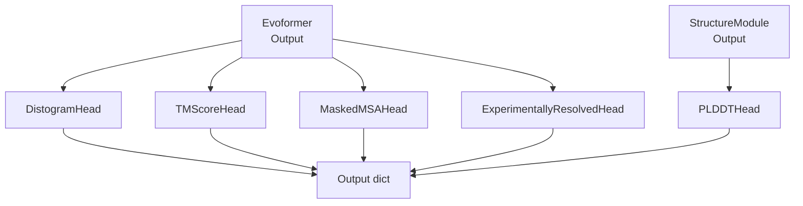
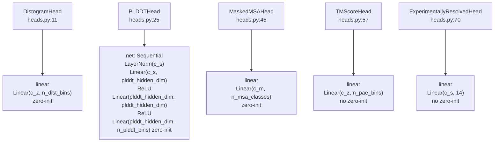

# Prediction Heads

> **Relevant source files**
> * [minalphafold/heads.py](https://github.com/ChrisHayduk/minAlphaFold2/blob/d0d066ad/minalphafold/heads.py)
> * [tests/test_shapes.py](https://github.com/ChrisHayduk/minAlphaFold2/blob/d0d066ad/tests/test_shapes.py)

This page documents the five output heads defined in `minalphafold/heads.py`. These modules sit at the end of the AlphaFold2 forward pass and convert learned representations into specific predictions used for loss computation and structure confidence scoring.

For context on how representations reaching these heads are produced, see the [Evoformer Stack](/ChrisHayduk/minAlphaFold2/2.2-evoformer-stack) and [Structure Module](/ChrisHayduk/minAlphaFold2/2.3-structure-module). For the loss functions that consume each head's output, see [Loss Functions](/ChrisHayduk/minAlphaFold2/3-loss-functions) and [Sequence and Confidence Losses](/ChrisHayduk/minAlphaFold2/3.2-sequence-and-confidence-losses).

---

## Role in the Forward Pass

All five heads are instantiated in `AlphaFold2.__init__` [model.py L41-L45](https://github.com/ChrisHayduk/minAlphaFold2/blob/d0d066ad/[minalphafold/model.py#L41-L45)

 and called **only during the final recycle cycle** [model.py L231-L248](https://github.com/ChrisHayduk/minAlphaFold2/blob/d0d066ad/[minalphafold/model.py#L231-L248)

. Earlier cycles skip head computation entirely to save compute.

**Forward pass call site (last cycle only):**

[model.py L231-L248](https://github.com/ChrisHayduk/minAlphaFold2/blob/d0d066ad/[minalphafold/model.py#L231-L248)


Each head receives a specific representation as input:

| Head | Input Tensor | Input Source |
| --- | --- | --- |
| `DistogramHead` | `pair_repr` | Evoformer pair representation |
| `PLDDTHead` | `structure_predictions["single"]` | StructureModule single output |
| `MaskedMSAHead` | `msa_repr` | Evoformer MSA representation |
| `TMScoreHead` | `pair_repr` | Evoformer pair representation |
| `ExperimentallyResolvedHead` | `single_rep` | Projected Evoformer first MSA row |

Note: `single_rep` and `structure_predictions["single"]` are distinct tensors. `single_rep` is computed as `self.single_rep_proj(msa_first_row)` before the StructureModule [model.py L227](https://github.com/ChrisHayduk/minAlphaFold2/blob/d0d066ad/[minalphafold/model.py#L227-L227)

. `structure_predictions["single"]` is the single representation that has been iteratively updated through the StructureModule layers [heads.py L40-L42](https://github.com/ChrisHayduk/minAlphaFold2/blob/d0d066ad/[minalphafold/heads.py#L40-L42).

---

## Data Flow Diagram

**Diagram: Head Inputs and Outputs**



Sources: [model.py L231-L248](https://github.com/ChrisHayduk/minAlphaFold2/blob/d0d066ad/[minalphafold/model.py#L231-L248), [heads.py L1-L78](https://github.com/ChrisHayduk/minAlphaFold2/blob/d0d066ad/[minalphafold/heads.py#L1-L78)


---

## Head Specifications

**Diagram: Class Structure and Config Parameters**



Sources: [heads.py L11-L78](https://github.com/ChrisHayduk/minAlphaFold2/blob/d0d066ad/[minalphafold/heads.py#L11-L78)
, [test_shapes.py L56-L60](https://github.com/ChrisHayduk/minAlphaFold2/blob/d0d066ad/[tests/test_shapes.py#L56-L60)

---

### DistogramHead

[heads.py L11-L22](https://github.com/ChrisHayduk/minAlphaFold2/blob/d0d066ad/[minalphafold/heads.py#L11-L22)

Predicts a distribution over inter-residue Cβ–Cβ distances from the pair representation.

**Architecture:** single `Linear(c_z, n_dist_bins)` followed by symmetrization [heads.py L14](https://github.com/ChrisHayduk/minAlphaFold2/blob/d0d066ad/[minalphafold/heads.py#L14-L14).

**Symmetrization:** The output is made symmetric by averaging the logits with their transpose:

```
logits = (logits + logits.transpose(1, 2)) / 2
```

This enforces `dist(i, j) == dist(j, i)` [heads.py L21](https://github.com/ChrisHayduk/minAlphaFold2/blob/d0d066ad/[minalphafold/heads.py#L21-L21).

**Output shape:** `(B, N_res, N_res, n_dist_bins)`
**Default `n_dist_bins`:** 64 bins [test_shapes.py L56](https://github.com/ChrisHayduk/minAlphaFold2/blob/d0d066ad/[tests/test_shapes.py#L56-L56)

**Zero-init:** Yes — the final linear layer is zero-initialized at construction [heads.py L16](https://github.com/ChrisHayduk/minAlphaFold2/blob/d0d066ad/[minalphafold/heads.py#L16-L16).

---

### PLDDTHead

[heads.py L25-L42](https://github.com/ChrisHayduk/minAlphaFold2/blob/d0d066ad/[minalphafold/heads.py#L25-L42)

Predicts per-residue predicted local distance difference test (pLDDT) scores as a categorical distribution over confidence bins.

**Architecture:** three-layer MLP with LayerNorm on input [heads.py L28-L35](https://github.com/ChrisHayduk/minAlphaFold2/blob/d0d066ad/[minalphafold/heads.py#L28-L35):

| Layer | Description |
| --- | --- |
| `LayerNorm(c_s)` | Normalize single representation |
| `Linear(c_s, plddt_hidden_dim)` | First projection |
| `ReLU` | Activation |
| `Linear(plddt_hidden_dim, plddt_hidden_dim)` | Second projection |
| `ReLU` | Activation |
| `Linear(plddt_hidden_dim, n_plddt_bins)` | Output logits |

**Input:** `structure_predictions["single"]` — the single representation produced by the StructureModule (not the Evoformer single rep) [model.py L241](https://github.com/ChrisHayduk/minAlphaFold2/blob/d0d066ad/[minalphafold/model.py#L241-L241). This ensures pLDDT reflects the structure module's final state.

**Output shape:** `(B, N_res, n_plddt_bins)`
**Default `n_plddt_bins`:** 50 bins [test_shapes.py L58](https://github.com/ChrisHayduk/minAlphaFold2/blob/d0d066ad/[tests/test_shapes.py#L58-L58)

**Zero-init:** Yes — only the final `Linear` layer is zero-initialized [heads.py L37-L38](https://github.com/ChrisHayduk/minAlphaFold2/blob/d0d066ad/[minalphafold/heads.py#L37-L38).

---

### MaskedMSAHead

[heads.py L45-L54](https://github.com/ChrisHayduk/minAlphaFold2/blob/d0d066ad/[minalphafold/heads.py#L45-L54)

Predicts the identity of masked MSA tokens, acting as a self-supervised auxiliary task (masked language modeling on the MSA).

**Architecture:** single `Linear(c_m, n_msa_classes)` [heads.py L48](https://github.com/ChrisHayduk/minAlphaFold2/blob/d0d066ad/[minalphafold/heads.py#L48-L48)
.

**Output shape:** `(B, N_seq, N_res, n_msa_classes)`
**Default `n_msa_classes`:** 23 (20 amino acid types + gap + masked + unknown) [test_shapes.py L59](https://github.com/ChrisHayduk/minAlphaFold2/blob/d0d066ad/[tests/test_shapes.py#L59-L59)

**Zero-init:** Yes [heads.py L50](https://github.com/ChrisHayduk/minAlphaFold2/blob/d0d066ad/[minalphafold/heads.py#L50-L50).

---

### TMScoreHead

[heads.py L57-L67](https://github.com/ChrisHayduk/minAlphaFold2/blob/d0d066ad/[minalphafold/heads.py#L57-L67)

Predicts the Predicted Aligned Error (PAE) — the expected positional error at residue `j` when aligning structures using the frame of residue `i`. Used to estimate the TM-score.

**Architecture:** single `Linear(c_z, n_pae_bins)` [heads.py L61](https://github.com/ChrisHayduk/minAlphaFold2/blob/d0d066ad/[minalphafold/heads.py#L61-L61).

**Symmetrization:** **None.** PAE is inherently asymmetric: the error using frame `i` to assess residue `j` differs from the error using frame `j` to assess residue `i`. The comment in the code makes this explicit [heads.py L66](https://github.com/ChrisHayduk/minAlphaFold2/blob/d0d066ad/[minalphafold/heads.py#L66-L66).

**Output shape:** `(B, N_res, N_res, n_pae_bins)`
**Default `n_pae_bins`:** 64 bins, covering 0–31.75 Å in 0.5 Å increments [heads.py L60](https://github.com/ChrisHayduk/minAlphaFold2/blob/d0d066ad/[minalphafold/heads.py#L60-L60)

**Zero-init:** No.

---

### ExperimentallyResolvedHead

[heads.py L70-L77](https://github.com/ChrisHayduk/minAlphaFold2/blob/d0d066ad/[minalphafold/heads.py#L70-L77)

Predicts whether each of the 14 possible side-chain atoms (atom14 representation) is experimentally observed (i.e., present and resolved in a crystal structure). This is a per-atom binary classification task used only during fine-tuning.

**Architecture:** single `Linear(c_s, 14)` [heads.py L73](https://github.com/ChrisHayduk/minAlphaFold2/blob/d0d066ad/[minalphafold/heads.py#L73-L73). The output size of 14 is hardcoded, matching the atom14 representation used throughout the codebase.

**Input:** `single_rep` — the single representation computed directly from the Evoformer's first MSA row via `single_rep_proj`, before the StructureModule [model.py L227](https://github.com/ChrisHayduk/minAlphaFold2/blob/d0d066ad/[minalphafold/model.py#L227-L227)

 [minalphafold/model.py L234](https://github.com/ChrisHayduk/minAlphaFold2/blob/d0d066ad/minalphafold/model.py#L234-L234)
.

**Output shape:** `(B, N_res, 14)`
**Zero-init:** No.

---

## Zero-Initialization Convention

As noted in AlphaFold2 Supplement §1.11.4, the output logit layers of several heads are zero-initialized at construction time. This ensures predictions start at a uniform distribution, letting the network learn to deviate from uniform as training progresses.

The helper `_zero_init_linear` [heads.py L4-L8](https://github.com/ChrisHayduk/minAlphaFold2/blob/d0d066ad/[minalphafold/heads.py#L4-L8)

 zeroes both weights and bias of a `Linear` layer.

| Head | Zero-init applied? | Layer affected |
| --- | --- | --- |
| `DistogramHead` | Yes | `self.linear` |
| `PLDDTHead` | Yes | `self.net[-1]` (final Linear only) |
| `MaskedMSAHead` | Yes | `self.linear` |
| `TMScoreHead` | No | — |
| `ExperimentallyResolvedHead` | No | — |

Sources: [heads.py L4-L8](https://github.com/ChrisHayduk/minAlphaFold2/blob/d0d066ad/[minalphafold/heads.py#L4-L8)

, [heads.py L15-L16](https://github.com/ChrisHayduk/minAlphaFold2/blob/d0d066ad/[minalphafold/heads.py#L15-L16)

, [heads.py L37-L38](https://github.com/ChrisHayduk/minAlphaFold2/blob/d0d066ad/[minalphafold/heads.py#L37-L38)

, [heads.py L49-L50](https://github.com/ChrisHayduk/minAlphaFold2/blob/d0d066ad/[minalphafold/heads.py#L49-L50)


---

## Output Dictionary Keys

On the final recycle cycle, the `AlphaFold2.forward` method merges head outputs with structure predictions into a single dictionary [model.py L238-L248](https://github.com/ChrisHayduk/minAlphaFold2/blob/d0d066ad/[minalphafold/model.py#L238-L248)

:

| Key | Producing Head | Shape |
| --- | --- | --- |
| `"distogram_logits"` | `DistogramHead` | `(B, N_res, N_res, n_dist_bins)` |
| `"masked_msa_logits"` | `MaskedMSAHead` | `(B, N_seq, N_res, n_msa_classes)` |
| `"experimentally_resolved_logits"` | `ExperimentallyResolvedHead` | `(B, N_res, 14)` |
| `"plddt_logits"` | `PLDDTHead` | `(B, N_res, n_plddt_bins)` |
| `"tm_logits"` | `TMScoreHead` | `(B, N_res, N_res, n_pae_bins)` |

The remaining keys (`atom14_coords`, `single`, trajectory tensors, `pair_representation`, etc.) come from the StructureModule and the Evoformer representations spread via `**structure_predictions` [model.py L238](https://github.com/ChrisHayduk/minAlphaFold2/blob/d0d066ad/[minalphafold/model.py#L238-L238)

.

Sources: [model.py L238-L248](https://github.com/ChrisHayduk/minAlphaFold2/blob/d0d066ad/[minalphafold/model.py#L238-L248)
