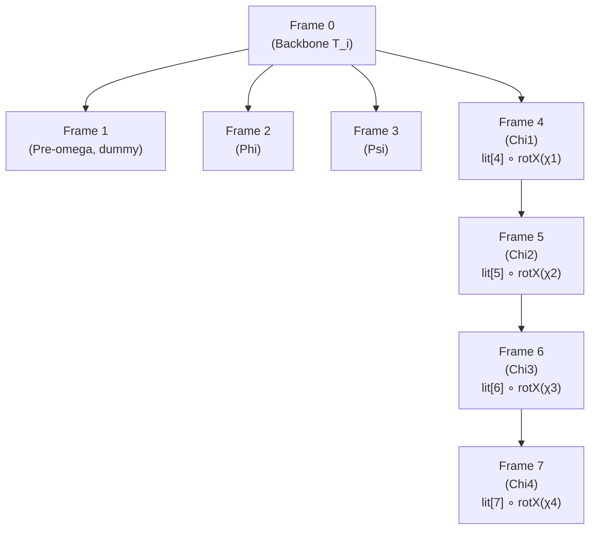
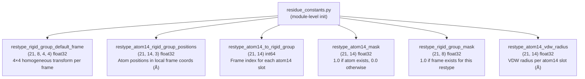
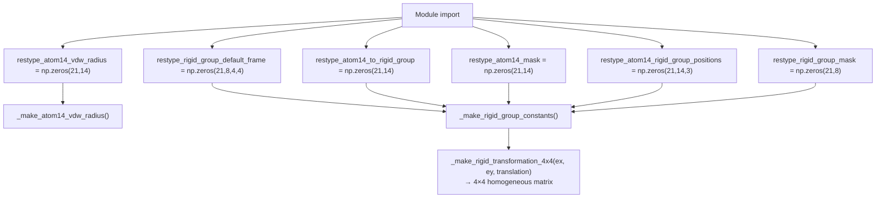
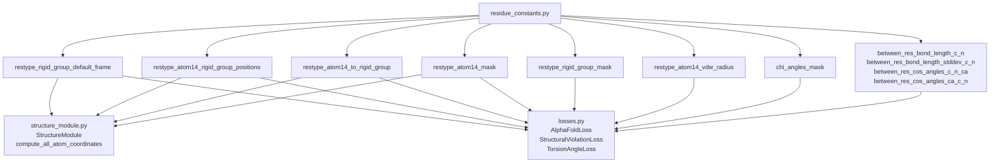

# Residue Constants

> **Relevant source files**
> * [minalphafold/losses.py](https://github.com/ChrisHayduk/minAlphaFold2/blob/d0d066ad/minalphafold/losses.py)
> * [minalphafold/residue_constants.py](https://github.com/ChrisHayduk/minAlphaFold2/blob/d0d066ad/minalphafold/residue_constants.py)

`minalphafold/residue_constants.py` is the foundational data layer for the entire minAlphaFold2 codebase. It defines all per-residue chemistry: the atom14 compact representation, the 8-rigid-group decomposition of each amino acid, ideal bond geometry, VDW radii, and chi angle masks. Every module that places atoms or computes structural violations imports from here.

For how these constants are consumed at runtime, see the Structure Module (page 2.3) and Structural Violation Loss (page 3.3).

---

## Residue Type Ordering

The integer index assigned to a residue type is the canonical ordering used everywhere in the model.

| Index | 1-letter | 3-letter |
| --- | --- | --- |
| 0 | A | ALA |
| 1 | R | ARG |
| 2 | N | ASN |
| 3 | D | ASP |
| 4 | C | CYS |
| 5 | Q | GLN |
| 6 | E | GLU |
| 7 | G | GLY |
| 8 | H | HIS |
| 9 | I | ILE |
| 10 | L | LEU |
| 11 | K | LYS |
| 12 | M | MET |
| 13 | F | PHE |
| 14 | P | PRO |
| 15 | S | SER |
| 16 | T | THR |
| 17 | W | TRP |
| 18 | Y | TYR |
| 19 | V | VAL |
| 20 | — | UNK |

The ordering follows `restypes` [minalphafold/residue_constants.py L332-L335](https://github.com/ChrisHayduk/minAlphaFold2/blob/d0d066ad/minalphafold/residue_constants.py#L332-L335)

 which lists single-letter codes in alphabetical order of their three-letter names. The mapping `restype_1to3` [minalphafold/residue_constants.py L337-L358](https://github.com/ChrisHayduk/minAlphaFold2/blob/d0d066ad/minalphafold/residue_constants.py#L337-L358)

 converts between the two forms.

**Index 20 is reserved for UNK (unknown residue).** It has all-zero masks and no atom positions. Any `aatype` value outside 0–19 should be treated as UNK. The `StructuralViolationLoss` clamps `residue_types` to `max=20` before table lookup [minalphafold/losses.py L540](https://github.com/ChrisHayduk/minAlphaFold2/blob/d0d066ad/minalphafold/losses.py#L540-L540)

Sources: [minalphafold/residue_constants.py L330-L358](https://github.com/ChrisHayduk/minAlphaFold2/blob/d0d066ad/minalphafold/residue_constants.py#L330-L358)

 [minalphafold/losses.py L539-L541](https://github.com/ChrisHayduk/minAlphaFold2/blob/d0d066ad/minalphafold/losses.py#L539-L541)

---

## The atom14 Representation

AlphaFold2 uses a compact fixed-width encoding of 14 atom slots per residue, instead of a sparse list of atom names. The mapping is defined in `restype_name_to_atom14_names` [minalphafold/residue_constants.py L302-L325](https://github.com/ChrisHayduk/minAlphaFold2/blob/d0d066ad/minalphafold/residue_constants.py#L302-L325)

* Slots 0–3 are always backbone: **N, CA, C, O** (in that order).
* Slot 4 is always **CB** when present (absent for GLY).
* Slots 5–13 hold side-chain heavy atoms in a residue-specific order.
* Unused slots are empty strings `''`.

**Example atom14 layouts:**

| Residue | 0 | 1 | 2 | 3 | 4 | 5 | 6 | 7 | 8 | 9 | 10 | 11 | 12 | 13 |
| --- | --- | --- | --- | --- | --- | --- | --- | --- | --- | --- | --- | --- | --- | --- |
| GLY | N | CA | C | O |  |  |  |  |  |  |  |  |  |  |
| ALA | N | CA | C | O | CB |  |  |  |  |  |  |  |  |  |
| ARG | N | CA | C | O | CB | CG | CD | NE | CZ | NH1 | NH2 |  |  |  |
| TRP | N | CA | C | O | CB | CG | CD1 | CD2 | NE1 | CE2 | CE3 | CZ2 | CZ3 | CH2 |
| UNK |  |  |  |  |  |  |  |  |  |  |  |  |  |  |

The atom14 index within the above layout is what `restype_atom14_to_rigid_group`, `restype_atom14_mask`, and `restype_atom14_rigid_group_positions` all use as their second dimension.

Sources: [minalphafold/residue_constants.py L299-L325](https://github.com/ChrisHayduk/minAlphaFold2/blob/d0d066ad/minalphafold/residue_constants.py#L299-L325)

---

## The 8-Rigid-Group Decomposition

Each residue is decomposed into up to 8 rigid groups, identified by integer frame index 0–7. This decomposition is used to build all-atom coordinates from backbone frames and torsion angles.

**Frame index semantics:**

| Frame | Name | Rotation axis / definition |
| --- | --- | --- |
| 0 | Backbone | Identity (the backbone frame itself) |
| 1 | Pre-omega | Identity placeholder (unused, no atoms) |
| 2 | Phi | Axis along CA→N direction |
| 3 | Psi | Axis along CA→C direction |
| 4 | Chi1 | First side-chain dihedral |
| 5 | Chi2 | Second side-chain dihedral |
| 6 | Chi3 | Third side-chain dihedral |
| 7 | Chi4 | Fourth side-chain dihedral |

Atoms are assigned to exactly one frame. The assignment is stored in `restype_atom14_to_rigid_group` — a `(21, 14)` integer array giving the frame index for each atom14 slot.

The atom positions in `rigid_group_atom_positions` [minalphafold/residue_constants.py L89-L297](https://github.com/ChrisHayduk/minAlphaFold2/blob/d0d066ad/minalphafold/residue_constants.py#L89-L297)

 are **local coordinates relative to the rotation axis endpoint** of the corresponding frame. The x-axis points along the rotation axis; the y-axis is defined such that the dihedral-defining atom lies in the xy-plane with positive y.

**Diagram: Frame dependency chain for a sidechain (e.g. ARG)**



Frames 4–7 chain sequentially: frame 5 is built relative to frame 4, frame 6 relative to frame 5, and so on. Frames 0–4 all branch directly from the backbone. This chain is implemented in `compute_all_atom_coordinates` in `structure_module.py` [minalphafold/structure_module.py L427-L457](https://github.com/ChrisHayduk/minAlphaFold2/blob/d0d066ad/minalphafold/structure_module.py#L427-L457)

Sources: [minalphafold/residue_constants.py L77-L88](https://github.com/ChrisHayduk/minAlphaFold2/blob/d0d066ad/minalphafold/residue_constants.py#L77-L88)

 [minalphafold/structure_module.py L427-L457](https://github.com/ChrisHayduk/minAlphaFold2/blob/d0d066ad/minalphafold/structure_module.py#L427-L457)

---

## Exported Arrays and Their Shapes

All primary arrays are populated at module import time and exported as plain NumPy arrays. Callers convert them to `torch.Tensor` via `register_buffer`.

**Diagram: Exported array names and their shapes**



| Array | Shape | dtype | Description |
| --- | --- | --- | --- |
| `restype_rigid_group_default_frame` | `(21, 8, 4, 4)` | float32 | 4×4 homogeneous transform: frame → backbone, in Å |
| `restype_atom14_rigid_group_positions` | `(21, 14, 3)` | float32 | Atom positions in local frame coords, in Å |
| `restype_atom14_to_rigid_group` | `(21, 14)` | int64 | Frame index (0–7) for each atom14 slot |
| `restype_atom14_mask` | `(21, 14)` | float32 | 1.0 if atom exists, else 0.0 |
| `restype_rigid_group_mask` | `(21, 8)` | float32 | 1.0 if frame is active for this residue type |
| `restype_atom14_vdw_radius` | `(21, 14)` | float32 | Van der Waals radius per atom, in Å |

**Important:** `StructureModule.__init__` multiplies the translation parts of `restype_rigid_group_default_frame` and all of `restype_atom14_rigid_group_positions` by 0.1 to convert from Å to nm for internal use [minalphafold/structure_module.py L67-L68](https://github.com/ChrisHayduk/minAlphaFold2/blob/d0d066ad/minalphafold/structure_module.py#L67-L68)

 The raw exported values remain in Å.

Sources: [minalphafold/residue_constants.py L373-L407](https://github.com/ChrisHayduk/minAlphaFold2/blob/d0d066ad/minalphafold/residue_constants.py#L373-L407)

 [minalphafold/structure_module.py L34-L68](https://github.com/ChrisHayduk/minAlphaFold2/blob/d0d066ad/minalphafold/structure_module.py#L34-L68)

---

## Module-Import-Time Initialization Pipeline

All arrays are initialized to zero at module top level, then populated by two functions called immediately at the end of the file. No lazy initialization occurs.

**Diagram: Initialization call graph**



### _make_atom14_vdw_radius

[minalphafold/residue_constants.py L376-L384](https://github.com/ChrisHayduk/minAlphaFold2/blob/d0d066ad/minalphafold/residue_constants.py#L376-L384)

Iterates over all 20 standard residue types. For each atom14 slot, looks up the element from the atom name's first character (e.g., `'CG'[0] == 'C'`) and writes the corresponding radius from `van_der_waals_radius` into `restype_atom14_vdw_radius`. UNK (index 20) is left as zero.

```css
van_der_waals_radius = {'C': 1.7, 'N': 1.55, 'O': 1.52, 'S': 1.8}  # Å
```

### _make_rigid_group_constants

[minalphafold/residue_constants.py L410-L486](https://github.com/ChrisHayduk/minAlphaFold2/blob/d0d066ad/minalphafold/residue_constants.py#L410-L486)

This is the main initialization function. It runs three passes:

**Pass 1 — Atom assignments** (lines 412–418): For each atom in `rigid_group_atom_positions`, finds the atom's slot in the atom14 layout, then sets:

* `restype_atom14_to_rigid_group[restype, atom14idx]` = frame index
* `restype_atom14_mask[restype, atom14idx]` = 1.0
* `restype_atom14_rigid_group_positions[restype, atom14idx, :]` = local position

**Pass 2 — Default frames** (lines 420–468): Computes the 4×4 rigid transform for each frame using `_make_rigid_transformation_4x4`:

* Frame 0: identity (backbone to backbone)
* Frame 1: identity placeholder
* Frame 2 (phi): axis = N − CA, translation at N
* Frame 3 (psi): axis = C − CA, translation at C
* Frame 4 (chi1): axis = CB − CA, defined from `chi_angles_atoms[resname][0]`
* Frames 5–7 (chi2–4): axis computed from the axis-end atom of each chi angle's four-atom definition

**Pass 3 — Rigid group mask** (lines 471–483):

* Frames 0–3 are marked active for all 20 standard residues.
* Frames 4–7 are marked active only when the corresponding `chi_angles_mask` entry is 1.0.
* UNK (index 20) is all zeros.
* Unused frames (mask = 0) are filled with identity matrices to prevent NaN in downstream matrix operations.

### _make_rigid_transformation_4x4

[minalphafold/residue_constants.py L387-L400](https://github.com/ChrisHayduk/minAlphaFold2/blob/d0d066ad/minalphafold/residue_constants.py#L387-L400)

Constructs a 4×4 homogeneous transformation matrix from two axis vectors and a translation:

1. Normalize `ex` to get the x-axis.
2. Orthogonalize `ey` against `ex` and normalize to get the y-axis.
3. Compute `ez = ex × ey` (right-handed).
4. Stack as columns `[ex, ey, ez, translation]` and append homogeneous row `[0,0,0,1]`.

Sources: [minalphafold/residue_constants.py L376-L486](https://github.com/ChrisHayduk/minAlphaFold2/blob/d0d066ad/minalphafold/residue_constants.py#L376-L486)

---

## Chi Angle Mask

`chi_angles_mask` [minalphafold/residue_constants.py L54-L75](https://github.com/ChrisHayduk/minAlphaFold2/blob/d0d066ad/minalphafold/residue_constants.py#L54-L75)

 is a `(20, 4)` list of floats indicating which chi angles are defined for each residue. Residues are ordered according to `restypes`.

| Residue | χ1 | χ2 | χ3 | χ4 |
| --- | --- | --- | --- | --- |
| ALA | 0 | 0 | 0 | 0 |
| ARG | 1 | 1 | 1 | 1 |
| ASN | 1 | 1 | 0 | 0 |
| GLY | 0 | 0 | 0 | 0 |
| LYS | 1 | 1 | 1 | 1 |
| SER | 1 | 0 | 0 | 0 |
| TRP | 1 | 1 | 0 | 0 |
| VAL | 1 | 0 | 0 | 0 |

`TorsionAngleLoss` appends a row of `[0.0, 0.0, 0.0, 0.0]` for UNK before converting to a tensor [minalphafold/losses.py L197-L199](https://github.com/ChrisHayduk/minAlphaFold2/blob/d0d066ad/minalphafold/losses.py#L197-L199)

 so the buffer becomes shape `(21, 4)` matching the other arrays.

Sources: [minalphafold/residue_constants.py L52-L75](https://github.com/ChrisHayduk/minAlphaFold2/blob/d0d066ad/minalphafold/residue_constants.py#L52-L75)

 [minalphafold/losses.py L196-L199](https://github.com/ChrisHayduk/minAlphaFold2/blob/d0d066ad/minalphafold/losses.py#L196-L199)

---

## Bond Geometry Constants

These scalar constants define ideal peptide bond geometry for the `StructuralViolationLoss`:

| Constant | Value | Meaning |
| --- | --- | --- |
| `between_res_bond_length_c_n[0]` | 1.329 Å | Ideal C–N bond length (general) |
| `between_res_bond_length_c_n[1]` | 1.341 Å | Ideal C–N bond length (to PRO) |
| `between_res_bond_length_stddev_c_n[0]` | 0.014 Å | Stddev (general) |
| `between_res_bond_length_stddev_c_n[1]` | 0.016 Å | Stddev (to PRO) |
| `between_res_cos_angles_c_n_ca[0]` | −0.5203 | cos(C–N–CA angle), ~121.4° |
| `between_res_cos_angles_c_n_ca[1]` | 0.0353 | Stddev |
| `between_res_cos_angles_ca_c_n[0]` | −0.4473 | cos(CA–C–N angle), ~116.6° |
| `between_res_cos_angles_ca_c_n[1]` | 0.0311 | Stddev |

All values are in Å for lengths and dimensionless for cosines. See page 3.3 for how they are used in the violation loss.

Sources: [minalphafold/residue_constants.py L364-L370](https://github.com/ChrisHayduk/minAlphaFold2/blob/d0d066ad/minalphafold/residue_constants.py#L364-L370)

---

## How Consumers Register These Arrays

Both `StructureModule` and `AlphaFoldLoss` register the arrays as PyTorch buffers so they move to the correct device automatically:

```markdown
# In StructureModule.__init__ [minalphafold/structure_module.py:34-41]self.register_buffer('default_frames',    torch.tensor(restype_rigid_group_default_frame))   # (21, 8, 4, 4)self.register_buffer('lit_positions',    torch.tensor(restype_atom14_rigid_group_positions)) # (21, 14, 3)self.register_buffer('atom_frame_idx_table',    torch.tensor(restype_atom14_to_rigid_group))        # (21, 14)self.register_buffer('atom_mask_table',    torch.tensor(restype_atom14_mask))                  # (21, 14)
```

**Diagram: Which modules import which constants**



Sources: [minalphafold/structure_module.py L4-L9](https://github.com/ChrisHayduk/minAlphaFold2/blob/d0d066ad/minalphafold/structure_module.py#L4-L9)

 [minalphafold/losses.py L5-L15](https://github.com/ChrisHayduk/minAlphaFold2/blob/d0d066ad/minalphafold/losses.py#L5-L15)

 [minalphafold/structure_module.py L34-L41](https://github.com/ChrisHayduk/minAlphaFold2/blob/d0d066ad/minalphafold/structure_module.py#L34-L41)

 [minalphafold/losses.py L34-L38](https://github.com/ChrisHayduk/minAlphaFold2/blob/d0d066ad/minalphafold/losses.py#L34-L38)