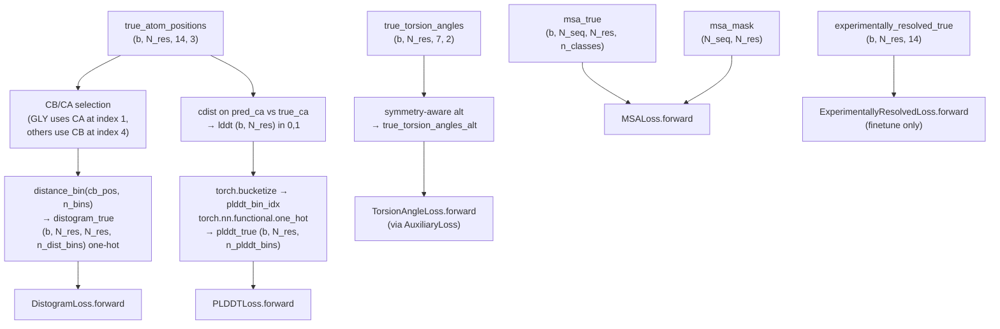
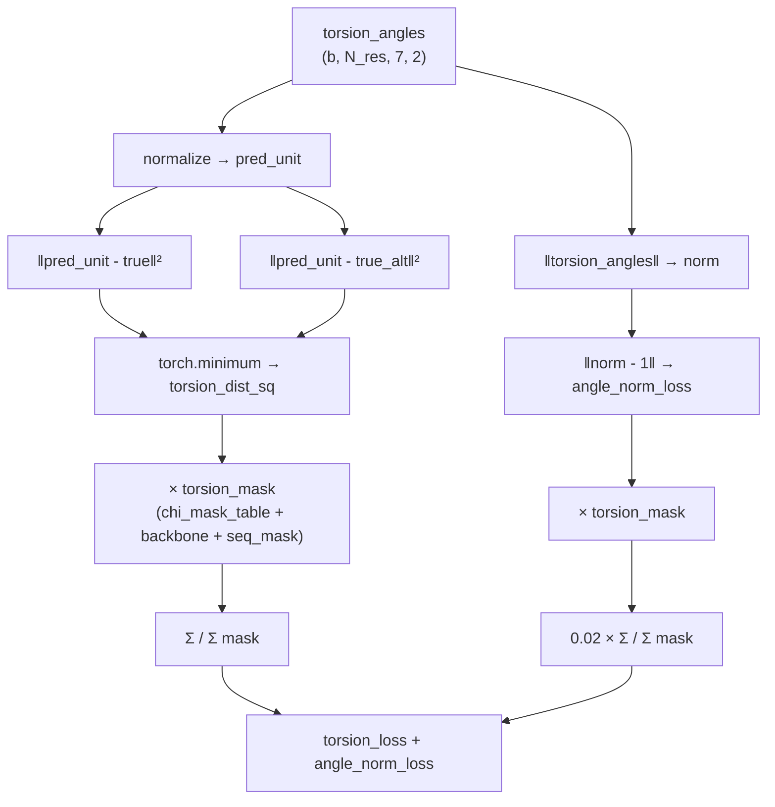
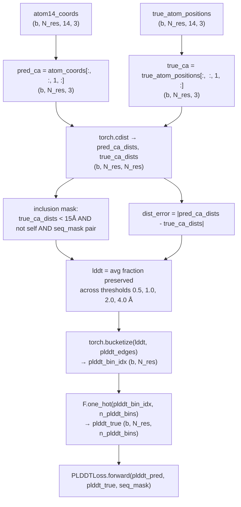
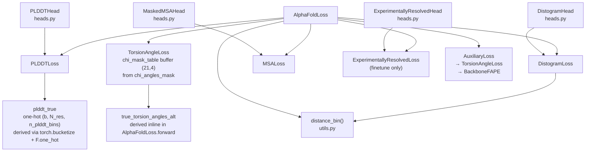

# Sequence and Confidence Losses

> **Relevant source files**
> * [minalphafold/heads.py](https://github.com/ChrisHayduk/minAlphaFold2/blob/d0d066ad/minalphafold/heads.py)
> * [minalphafold/losses.py](https://github.com/ChrisHayduk/minAlphaFold2/blob/d0d066ad/minalphafold/losses.py)

This page documents the loss functions in `minalphafold/losses.py` that supervise the model on sequence-level and confidence-related predictions: `TorsionAngleLoss`, `DistogramLoss`, `MSALoss`, `PLDDTLoss`, and `ExperimentallyResolvedLoss`. These losses do not directly penalize atomic coordinate errors — for that, see [FAPE Losses](/ChrisHayduk/minAlphaFold2/3.1-fape-losses) and [Structural Violation Loss](/ChrisHayduk/minAlphaFold2/3.3-structural-violation-loss). They operate on the outputs of the prediction heads (documented in [Prediction Heads](/ChrisHayduk/minAlphaFold2/2.4-prediction-heads)).

All five are instantiated by `AlphaFoldLoss` and receive both raw model predictions and ground-truth labels derived inline from structure inputs.

---

## Position in the Training Objective

`AlphaFoldLoss.forward` assembles a weighted sum of all sub-losses. The sequence and confidence losses contribute the following terms:

| Loss class | Weight (standard) | Weight (finetune) |
| --- | --- | --- |
| `DistogramLoss` | 0.3 | 0.3 |
| `MSALoss` | 2.0 | 2.0 |
| `PLDDTLoss` | 0.01 | 0.01 |
| `ExperimentallyResolvedLoss` | — | 0.01 |

`TorsionAngleLoss` is not applied directly at the top level; it is applied inside `AuxiliaryLoss` to each intermediate trajectory layer, averaged across layers. See [FAPE Losses](/ChrisHayduk/minAlphaFold2/3.1-fape-losses) for `AuxiliaryLoss` details.

Sources: [minalphafold/losses.py L23-L32](https://github.com/ChrisHayduk/minAlphaFold2/blob/d0d066ad/minalphafold/losses.py#L23-L32)

 [minalphafold/losses.py L214-L232](https://github.com/ChrisHayduk/minAlphaFold2/blob/d0d066ad/minalphafold/losses.py#L214-L232)

---

## Data flow into the loss functions

**Data Flow: Ground Truth Derivation**



Sources: [minalphafold/losses.py L86-L160](https://github.com/ChrisHayduk/minAlphaFold2/blob/d0d066ad/minalphafold/losses.py#L86-L160)

 [minalphafold/utils.py L35-L41](https://github.com/ChrisHayduk/minAlphaFold2/blob/d0d066ad/minalphafold/utils.py#L35-L41)

---

## TorsionAngleLoss

### Purpose

Supervises the seven torsion angles (φ, ψ, ω for backbone, χ₁–χ₄ for side chains) predicted by `StructureModule`. The loss is used inside `AuxiliaryLoss` at every intermediate trajectory layer.

### Inputs

| Tensor | Shape | Description |
| --- | --- | --- |
| `torsion_angles` | `(b, N_res, 7, 2)` | Predicted (sin, cos) pairs, unnormalized |
| `torsion_angles_true` | `(b, N_res, 7, 2)` | Ground truth (sin, cos) |
| `torsion_angles_true_alt` | `(b, N_res, 7, 2)` | Symmetry-flipped alternative |
| `res_types` | `(b, N_res)` | Integer residue type 0–20 |
| `seq_mask` | `(b, N_res)` | 1 = valid, 0 = padding |

### Symmetry-Aware Alternative Labels

Some residue types have symmetric side chains, meaning the two equivalent orientations of the side chain differ only by negating one chi angle's (sin, cos) pair. `AlphaFoldLoss.forward` constructs `true_torsion_angles_alt` before calling `AuxiliaryLoss`:

| Residue type | Index | Symmetric angle | Torsion index |
| --- | --- | --- | --- |
| ASP | 3 | χ₂ | 4 |
| PHE | 13 | χ₂ | 4 |
| TYR | 18 | χ₂ | 4 |
| GLU | 6 | χ₃ | 5 |

For non-symmetric residues (and non-symmetric chi angles), the alt is identical to the canonical label.

Sources: [minalphafold/losses.py L86-L97](https://github.com/ChrisHayduk/minAlphaFold2/blob/d0d066ad/minalphafold/losses.py#L86-L97)

### Computation

Two components are combined:

**1. Torsion distance loss** — squared distance from normalized prediction to the closer of canonical/alt ground truth:

```
pred_unit = torsion_angles / ‖torsion_angles‖    (normalized to unit circle)
torsion_dist_sq = min(‖pred_unit − true‖², ‖pred_unit − true_alt‖²)
```

**2. Angle normalization loss** — penalizes deviation of the raw prediction's magnitude from 1:

```
angle_norm_loss = |‖torsion_angles‖ − 1|
```

The `chi_mask_table` (a `(21, 4)` buffer loaded from `chi_angles_mask` in `residue_constants.py`) gates which chi angles are active for each residue type. Backbone torsion slots (indices 0–2) are always unmasked.

Final per-batch scalar:

```
loss = (Σ torsion_dist_sq × mask) / Σ mask
     + 0.02 × (Σ angle_norm_loss × mask) / Σ mask
```

Sources: [minalphafold/losses.py L270-L322](https://github.com/ChrisHayduk/minAlphaFold2/blob/d0d066ad/minalphafold/losses.py#L270-L322)

 [minalphafold/residue_constants.py L54-L75](https://github.com/ChrisHayduk/minAlphaFold2/blob/d0d066ad/minalphafold/residue_constants.py#L54-L75)

**TorsionAngleLoss Computation**



Sources: [minalphafold/losses.py L270-L322](https://github.com/ChrisHayduk/minAlphaFold2/blob/d0d066ad/minalphafold/losses.py#L270-L322)

 [minalphafold/residue_constants.py L54-L75](https://github.com/ChrisHayduk/minAlphaFold2/blob/d0d066ad/minalphafold/residue_constants.py#L54-L75)

---

## DistogramLoss

### Purpose

Supervises `DistogramHead`, which predicts a probability distribution over pairwise CB–CB distances (CA for glycine).

### True Label Derivation

Inside `AlphaFoldLoss.forward`:

1. For each residue, select atom index 1 (Cα) if glycine (type 7), else index 4 (Cβ).
2. Call `distance_bin(cb_pos, n_dist_bins)` from `utils.py`, which computes pairwise distances via `torch.cdist` and bins them uniformly into `[2.0, 22.0]` Å with one-hot encoding.

The number of bins `n_dist_bins` is read from `distogram_pred.shape[-1]` at runtime; the default configuration uses 64 bins.

Sources: [minalphafold/losses.py L112-L130](https://github.com/ChrisHayduk/minAlphaFold2/blob/d0d066ad/minalphafold/losses.py#L112-L130)

 [minalphafold/utils.py L35-L41](https://github.com/ChrisHayduk/minAlphaFold2/blob/d0d066ad/minalphafold/utils.py#L35-L41)

### Computation

Standard cross-entropy between the symmetrized log-softmax of predictions and the one-hot true bins, averaged over all residue pairs and batch:

```markdown
log_pred = log_softmax(pred_distograms, dim=-1)
vals = Σ_c  true[b,i,j,c] × log_pred[b,i,j,c]
dist_loss = −mean(vals, dim=(1,2))           # (b,) → scalar via reduction
```

Note: the symmetrization of the distogram head output (averaging upper and lower triangle) happens inside `DistogramHead.forward` in `heads.py`, not inside the loss itself.

Sources: [minalphafold/losses.py L479-L492](https://github.com/ChrisHayduk/minAlphaFold2/blob/d0d066ad/minalphafold/losses.py#L479-L492)

 [minalphafold/heads.py L18-L22](https://github.com/ChrisHayduk/minAlphaFold2/blob/d0d066ad/minalphafold/heads.py#L18-L22)

---

## MSALoss

### Purpose

Masked language modeling (MLM) loss on the MSA. Supervises `MaskedMSAHead`, which predicts the original (unmasked) amino acid identity at randomly masked positions in the MSA.

### Inputs

| Tensor | Shape | Description |
| --- | --- | --- |
| `msa_preds` | `(b, N_seq, N_res, n_msa_classes)` | Raw logits from `MaskedMSAHead` |
| `msa_true` | `(b, N_seq, N_res, n_msa_classes)` | One-hot ground truth |
| `msa_mask` | `(N_seq, N_res)` | 1 at masked positions, 0 elsewhere |

### Computation

Cross-entropy only at masked positions:

```
log_pred = log_softmax(msa_preds, dim=-1)
ce[b,s,i] = −Σ_c  msa_true[b,s,i,c] × log_pred[b,s,i,c]
msa_loss = Σ(ce × mask) / Σ(mask)
```

The mask does not have a batch dimension — it broadcasts across the batch. The denominator counts total masked positions across all sequences and residues (clamped to ≥ 1).

Sources: [minalphafold/losses.py L494-L516](https://github.com/ChrisHayduk/minAlphaFold2/blob/d0d066ad/minalphafold/losses.py#L494-L516)

---

## PLDDTLoss

### Purpose

Supervises `PLDDTHead`, which predicts a per-residue confidence score as a binned distribution. At training time, the "true" lDDT is computed from predicted vs. ground-truth Cα distances and then one-hot encoded into bins.

### True Label Derivation

Computed inside `AlphaFoldLoss.forward` under `torch.no_grad()`:

1. Extract predicted Cα positions `pred_ca = atom_coords[:, :, 1, :]` and true Cα `true_ca = true_atom_positions[:, :, 1, :]`.
2. Compute all pairwise distance matrices via `torch.cdist`.
3. Define an inclusion mask: pairs within 15 Å in the true structure, excluding self-pairs and padding.
4. For four distance thresholds (0.5, 1.0, 2.0, 4.0 Å), compute the fraction of included pairs where |pred_dist − true_dist| < threshold.
5. Average across the four thresholds → `lddt ∈ [0, 1]` per residue.
6. Bin into `n_plddt_bins` equal-width bins using `torch.bucketize`, then one-hot encode.

Sources: [minalphafold/losses.py L134-L162](https://github.com/ChrisHayduk/minAlphaFold2/blob/d0d066ad/minalphafold/losses.py#L134-L162)

**PLDDTLoss: True Label Pipeline**



Sources: [minalphafold/losses.py L136-L162](https://github.com/ChrisHayduk/minAlphaFold2/blob/d0d066ad/minalphafold/losses.py#L136-L162)

### Computation

Cross-entropy between the log-softmax of `PLDDTHead` logits and the one-hot true bins, masked to valid residues:

```
log_pred = log_softmax(pred_plddt, dim=-1)
conf_loss[b,i] = −Σ_c  plddt_true[b,i,c] × log_pred[b,i,c]
plddt_loss = Σ(conf_loss × seq_mask) / Σ(seq_mask)
```

Sources: [minalphafold/losses.py L457-L477](https://github.com/ChrisHayduk/minAlphaFold2/blob/d0d066ad/minalphafold/losses.py#L457-L477)

---

## ExperimentallyResolvedLoss

### Purpose

Binary cross-entropy over all 14 atom slots per residue, predicting whether each atom is experimentally resolved in the structure. This loss is **only applied in finetune mode** (`AlphaFoldLoss(finetune=True)`).

### Inputs

| Tensor | Shape | Description |
| --- | --- | --- |
| `exp_resolved_preds` | `(b, N_res, 14)` | Raw logits from `ExperimentallyResolvedHead` |
| `exp_resolved_true` | `(b, N_res, 14)` | Binary ground truth (1 = resolved) |

### Computation

Standard per-element binary cross-entropy, averaged over atoms and residues:

```
loss = BCE_with_logits(exp_resolved_preds, exp_resolved_true).mean(dim=(1,2))
```

No masking is applied — the atom slots that are structurally impossible for a residue type will have a `0` target, which is a valid supervision signal.

Sources: [minalphafold/losses.py L518-L528](https://github.com/ChrisHayduk/minAlphaFold2/blob/d0d066ad/minalphafold/losses.py#L518-L528)

 [minalphafold/losses.py L228-L232](https://github.com/ChrisHayduk/minAlphaFold2/blob/d0d066ad/minalphafold/losses.py#L228-L232)

---

## Class and Tensor Summary

**Class and Tensor Relationships**



Sources: [minalphafold/losses.py L17-L171](https://github.com/ChrisHayduk/minAlphaFold2/blob/d0d066ad/minalphafold/losses.py#L17-L171)

 [minalphafold/heads.py L11-L77](https://github.com/ChrisHayduk/minAlphaFold2/blob/d0d066ad/minalphafold/heads.py#L11-L77)

 [minalphafold/utils.py L35-L41](https://github.com/ChrisHayduk/minAlphaFold2/blob/d0d066ad/minalphafold/utils.py#L35-L41)

---

## Quick Reference: Loss Formulas

| Loss | Formula | Averaged over |
| --- | --- | --- |
| `TorsionAngleLoss` | `min(‖pred_unit−true‖², ‖pred_unit−true_alt‖²) + 0.02×‖‖pred‖−1‖` | Masked torsion slots |
| `DistogramLoss` | `−Σ_c true[c] × log_softmax(pred)[c]` | All residue pairs |
| `MSALoss` | `−Σ_c true[c] × log_softmax(pred)[c]` | Masked MSA positions only |
| `PLDDTLoss` | `−Σ_c true_bin[c] × log_softmax(pred)[c]` | Valid residues |
| `ExperimentallyResolvedLoss` | `BCE(pred_logits, binary_true)` | All 14 atom slots |