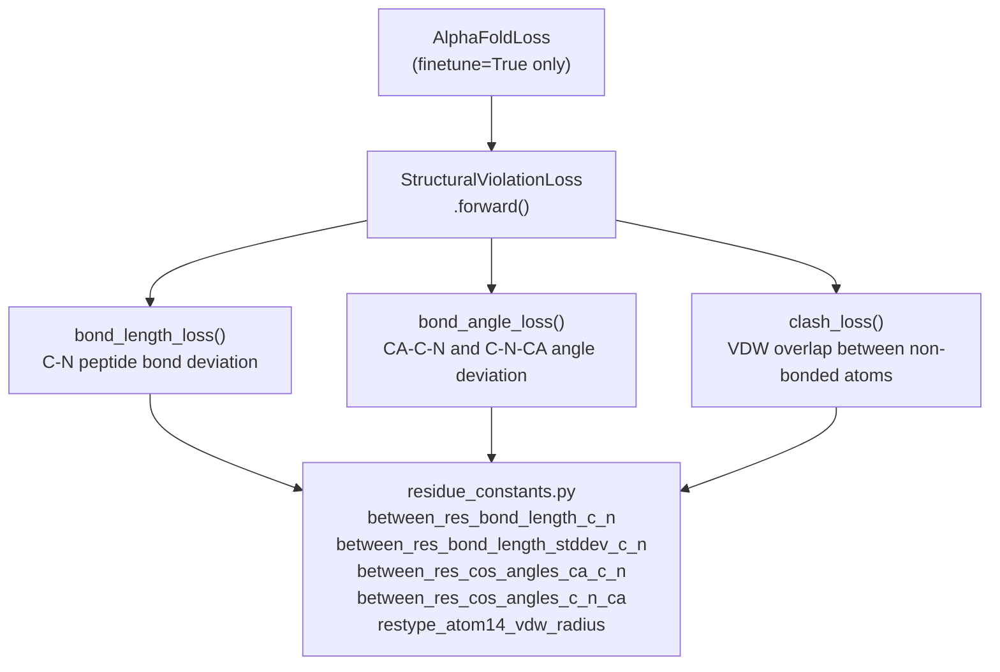

# Structural Violation Loss

> **Relevant source files**
> * [minalphafold/losses.py](https://github.com/ChrisHayduk/minAlphaFold2/blob/d0d066ad/minalphafold/losses.py)
> * [minalphafold/residue_constants.py](https://github.com/ChrisHayduk/minAlphaFold2/blob/d0d066ad/minalphafold/residue_constants.py)

## Purpose and Scope

This page documents `StructuralViolationLoss`, a penalty term that enforces basic stereochemical correctness in predicted protein structures. It operates entirely on the final all-atom coordinate output of the structure module — not on intermediate trajectory frames — and is activated **only during finetune mode** within `AlphaFoldLoss`.

The loss decomposes into three independent sub-losses: `bond_length_loss`, `bond_angle_loss`, and `clash_loss`. Each targets a different class of physical violation. For information about the other loss terms (FAPE, torsion, distogram, etc.) see pages [3.1](https://github.com/ChrisHayduk/minAlphaFold2/blob/d0d066ad/3.1)

 and [3.2](https://github.com/ChrisHayduk/minAlphaFold2/blob/d0d066ad/3.2)

 For the constants that supply ideal geometry values, see page [4](https://github.com/ChrisHayduk/minAlphaFold2/blob/d0d066ad/4)

---

## Role in the Training Objective

`StructuralViolationLoss` is instantiated in `AlphaFoldLoss.__init__` [minalphafold/losses.py L30](https://github.com/ChrisHayduk/minAlphaFold2/blob/d0d066ad/minalphafold/losses.py#L30-L30)

 and called only when `self.finetune = True`.

[minalphafold/losses.py L175-L178](https://github.com/ChrisHayduk/minAlphaFold2/blob/d0d066ad/minalphafold/losses.py#L175-L178)

```
if self.finetune:    struct_violation_loss = self.structural_violation_loss(atom_coords, atom_mask, res_types)    loss += 1.0 * struct_violation_loss
```

| Argument to `forward` | Shape | Description |
| --- | --- | --- |
| `predicted_positions` | `(batch, N_res, 14, 3)` | All-atom coordinates in atom14 layout |
| `atom_mask` | `(batch, N_res, 14)` | 1 where atom exists, 0 for empty atom14 slots |
| `residue_types` | `(batch, N_res)` | Integer residue type index, 0–20 |

The scalar loss returned is the sum of the three components:
`forward = bond_length_loss + bond_angle_loss + clash_loss` [minalphafold/losses.py L451-L453](https://github.com/ChrisHayduk/minAlphaFold2/blob/d0d066ad/minalphafold/losses.py#L451-L453)

**Sources:** [minalphafold/losses.py L23-L41](https://github.com/ChrisHayduk/minAlphaFold2/blob/d0d066ad/minalphafold/losses.py#L23-L41)

 [minalphafold/losses.py L175-L178](https://github.com/ChrisHayduk/minAlphaFold2/blob/d0d066ad/minalphafold/losses.py#L175-L178)

 [minalphafold/losses.py L440-L453](https://github.com/ChrisHayduk/minAlphaFold2/blob/d0d066ad/minalphafold/losses.py#L440-L453)

---

## Class Structure

**Figure 1: `StructuralViolationLoss` — Class and Sub-Loss Decomposition**



**Sources:** [minalphafold/losses.py L23-L32](https://github.com/ChrisHayduk/minAlphaFold2/blob/d0d066ad/minalphafold/losses.py#L23-L32)

 [minalphafold/losses.py L440-L453](https://github.com/ChrisHayduk/minAlphaFold2/blob/d0d066ad/minalphafold/losses.py#L440-L453)

 [minalphafold/residue_constants.py L5-L15](https://github.com/ChrisHayduk/minAlphaFold2/blob/d0d066ad/minalphafold/residue_constants.py#L5-L15)

---

## Sub-Loss 1: bond_length_loss

### What it measures

The peptide bond length between C of residue *i* and N of residue *i+1*. In the atom14 layout, `N=index 0`, `CA=index 1`, `C=index 2`.

[minalphafold/losses.py L455-L479](https://github.com/ChrisHayduk/minAlphaFold2/blob/d0d066ad/minalphafold/losses.py#L455-L479)

### Ideal values

Two regimes are distinguished: general peptide bonds and bonds where residue *i+1* is **proline** (type index 14), which has a slightly longer C-N bond due to ring strain.

| Bond type | `d_ideal` (Å) | `d_stddev` (Å) |
| --- | --- | --- |
| General (non-proline next) | 1.329 | 0.014 |
| Proline next | 1.341 | 0.016 |

Constants are sourced from `between_res_bond_length_c_n` and `between_res_bond_length_stddev_c_n` [minalphafold/losses.py L6](https://github.com/ChrisHayduk/minAlphaFold2/blob/d0d066ad/minalphafold/losses.py#L6-L6)

### Formula

$$\text{loss} = \frac{\sum_{i} \left(\frac{d_i - d_{\text{ideal}}}{\sigma}\right)^2 \cdot m_i}{\sum_i m_i}$$

where $m_i = \text{atom_mask}[i, \text{C}] \times \text{atom_mask}[i+1, \text{N}]$.

The mask requires that both the C atom of residue *i* and the N atom of residue *i+1* are present [minalphafold/losses.py L471-L473](https://github.com/ChrisHayduk/minAlphaFold2/blob/d0d066ad/minalphafold/losses.py#L471-L473)

**Sources:** [minalphafold/losses.py L455-L479](https://github.com/ChrisHayduk/minAlphaFold2/blob/d0d066ad/minalphafold/losses.py#L455-L479)

 [minalphafold/residue_constants.py L23-L50](https://github.com/ChrisHayduk/minAlphaFold2/blob/d0d066ad/minalphafold/residue_constants.py#L23-L50)

---

## Sub-Loss 2: bond_angle_loss

### What it measures

Two inter-residue backbone bond angles computed via the **law of cosines** (operating in cosine space):

1. **CA(i)–C(i)–N(i+1)** — vertex at C(i), angle at the carbonyl carbon.
2. **C(i)–N(i+1)–CA(i+1)** — vertex at N(i+1), angle at the amide nitrogen.

[minalphafold/losses.py L481-L523](https://github.com/ChrisHayduk/minAlphaFold2/blob/d0d066ad/minalphafold/losses.py#L481-L523)

### Cosine-space formula (law of cosines)

For angle at vertex B in triangle ABC:

$$\cos\theta = \frac{d_{AB}^2 + d_{BC}^2 - d_{AC}^2}{2 \cdot d_{AB} \cdot d_{BC}}$$

This avoids the need for an `acos` call, making it numerically smoother [minalphafold/losses.py L504-L508](https://github.com/ChrisHayduk/minAlphaFold2/blob/d0d066ad/minalphafold/losses.py#L504-L508)

### Ideal values

| Angle | `mean` (cos) | `stddev` (cos) | Approx. degrees |
| --- | --- | --- | --- |
| CA(i)–C(i)–N(i+1) | −0.4473 | 0.0311 | ~116.6° |
| C(i)–N(i+1)–CA(i+1) | −0.5203 | 0.0353 | ~121.4° |

Constants are sourced from `between_res_cos_angles_ca_c_n` and `between_res_cos_angles_c_n_ca` [minalphafold/losses.py L7](https://github.com/ChrisHayduk/minAlphaFold2/blob/d0d066ad/minalphafold/losses.py#L7-L7)

### Mask

All four backbone atoms must exist: CA(i), C(i), N(i+1), CA(i+1).

```
mask = atom_mask[:, :-1, 1] * atom_mask[:, :-1, 2] * \       atom_mask[:, 1:, 0]  * atom_mask[:, 1:, 1]
```

[minalphafold/losses.py L516-L517](https://github.com/ChrisHayduk/minAlphaFold2/blob/d0d066ad/minalphafold/losses.py#L516-L517)

**Sources:** [minalphafold/losses.py L481-L523](https://github.com/ChrisHayduk/minAlphaFold2/blob/d0d066ad/minalphafold/losses.py#L481-L523)

 [minalphafold/residue_constants.py L89-L165](https://github.com/ChrisHayduk/minAlphaFold2/blob/d0d066ad/minalphafold/residue_constants.py#L89-L165)

---

## Sub-Loss 3: clash_loss

### What it measures

Steric clashes between **non-bonded, non-adjacent** atom pairs. An overlap occurs when two atoms are closer than the sum of their van der Waals radii minus a tolerance threshold.

[minalphafold/losses.py L525-L566](https://github.com/ChrisHayduk/minAlphaFold2/blob/d0d066ad/minalphafold/losses.py#L525-L566)

### VDW radii

Radii are assigned by residue type and atom index using the `restype_atom14_vdw_radius` table [minalphafold/losses.py L14](https://github.com/ChrisHayduk/minAlphaFold2/blob/d0d066ad/minalphafold/losses.py#L14-L14)

 This table is built at import time based on the element of each atom in the atom14 representation.

### Pair exclusion

Pairs within the same residue or in adjacent residues (sequence separation < 2) are excluded:

```
seq_sep = torch.abs(res_idx[:, :, None] - res_idx[:, None, :])sep_mask = (seq_sep >= 2)
```

[minalphafold/losses.py L549-L550](https://github.com/ChrisHayduk/minAlphaFold2/blob/d0d066ad/minalphafold/losses.py#L549-L550)

### Overlap and loss formula

The implementation uses a fixed overlap tolerance of 1.5 Å [minalphafold/losses.py L557](https://github.com/ChrisHayduk/minAlphaFold2/blob/d0d066ad/minalphafold/losses.py#L557-L557)

```markdown
overlap_tolerance = 1.5  # Åoverlap = (vdw_i + vdw_j) - overlap_tolerance - dist(i, j)clash   = torch.clamp(overlap, min=0) * pair_maskloss    = torch.sum(clash) / (torch.sum(pair_mask) + 1e-6)
```

A positive `overlap` value indicates the atoms are closer than `vdw_i + vdw_j - 1.5` Å. The `clamp(min=0)` makes this a one-sided hinge loss.

**Sources:** [minalphafold/losses.py L525-L566](https://github.com/ChrisHayduk/minAlphaFold2/blob/d0d066ad/minalphafold/losses.py#L525-L566)

 [minalphafold/residue_constants.py L54-L75](https://github.com/ChrisHayduk/minAlphaFold2/blob/d0d066ad/minalphafold/residue_constants.py#L54-L75)

---

## Data Flow Diagram

**Figure 2: `StructuralViolationLoss` — Inputs, Buffers, and Computation Graph**

```mermaid
flowchart TD

PredPos["predicted_positions<br>(batch, N_res, 14, 3)"]
AtomMask["atom_mask<br>(batch, N_res, 14)"]
ResTypes["residue_types<br>(batch, N_res)"]
BLL_CN["C_i = positions[:,:-1,2,:]<br>N_next = positions[:,1:,0,:]"]
BLL_D["d = euclidean(C_i, N_next)"]
BLL_PRO["is_proline = residue_types[:,1:] == 14"]
BLL_IDEAL["d_ideal from between_res_bond_length_c_n<br>d_stddev from between_res_bond_length_stddev_c_n"]
BLL_LOSS["loss = mean( ((d - d_ideal)/stddev)^2 * mask )"]
BAL_ATOMS["CA_i, C_i, N_next, CA_next"]
BAL_COS["cos via law of cosines"]
BAL_IDEAL["ideal from between_res_cos_angles_ca_c_n<br>between_res_cos_angles_c_n_ca"]
BAL_LOSS["loss = mean( ((cos - mean)/stddev)^2 * mask )"]
CL_FLAT["pos_flat (batch, N_res*14, 3)"]
CL_VDW["vdw = vdw_table[residue_types]<br>(batch, N_res, 14)"]
CL_DIST["pairwise dist (batch, M, M)"]
CL_SEP["seq_sep mask: exclude sep < 2"]
CL_OVL["overlap = vdw_i + vdw_j - 1.5 - dist"]
CL_LOSS["loss = mean( clamp(overlap, min=0) * pair_mask )"]
RC_BL["between_res_bond_length_c_n<br>between_res_bond_length_stddev_c_n"]
RC_ANG["between_res_cos_angles_ca_c_n<br>between_res_cos_angles_c_n_ca"]
RC_VDW["restype_atom14_vdw_radius<br>(21, 14)"]
SUM["sum → scalar loss per batch"]

PredPos --> BLL_CN
AtomMask --> BLL_LOSS
ResTypes --> BLL_PRO
RC_BL --> BLL_IDEAL
PredPos --> BAL_ATOMS
AtomMask --> BAL_LOSS
RC_ANG --> BAL_IDEAL
PredPos --> CL_FLAT
ResTypes --> CL_VDW
RC_VDW --> CL_VDW
AtomMask --> CL_SEP
BLL_LOSS --> SUM
BAL_LOSS --> SUM
CL_LOSS --> SUM

subgraph clash_loss() ["clash_loss()"]
    CL_FLAT
    CL_VDW
    CL_DIST
    CL_SEP
    CL_OVL
    CL_LOSS
    CL_FLAT --> CL_DIST
    CL_VDW --> CL_OVL
    CL_DIST --> CL_OVL
    CL_DIST --> CL_SEP
    CL_SEP --> CL_LOSS
    CL_OVL --> CL_LOSS
end

subgraph bond_angle_loss() ["bond_angle_loss()"]
    BAL_ATOMS
    BAL_COS
    BAL_IDEAL
    BAL_LOSS
    BAL_ATOMS --> BAL_COS
    BAL_COS --> BAL_LOSS
    BAL_IDEAL --> BAL_LOSS
end

subgraph bond_length_loss() ["bond_length_loss()"]
    BLL_CN
    BLL_D
    BLL_PRO
    BLL_IDEAL
    BLL_LOSS
    BLL_CN --> BLL_D
    BLL_D --> BLL_LOSS
    BLL_PRO --> BLL_IDEAL
    BLL_IDEAL --> BLL_LOSS
end
```

**Sources:** [minalphafold/losses.py L440-L566](https://github.com/ChrisHayduk/minAlphaFold2/blob/d0d066ad/minalphafold/losses.py#L440-L566)

 [minalphafold/residue_constants.py L14-L15](https://github.com/ChrisHayduk/minAlphaFold2/blob/d0d066ad/minalphafold/residue_constants.py#L14-L15)

---

## Summary of Sub-Loss Properties

| Sub-loss | Atoms involved | Inter-residue? | Ideal source | Loss type |
| --- | --- | --- | --- | --- |
| `bond_length_loss` | C(i), N(i+1) | Yes, consecutive pairs | `between_res_bond_length_c_n` | Squared normalized deviation |
| `bond_angle_loss` | CA(i), C(i), N(i+1), CA(i+1) | Yes, consecutive pairs | `between_res_cos_angles_*` | Squared normalized deviation (cosine space) |
| `clash_loss` | All 14 atoms per residue | Yes, seq sep ≥ 2 | `restype_atom14_vdw_radius` | Hinge (clamped positive overlap) |

**Sources:** [minalphafold/losses.py L455-L566](https://github.com/ChrisHayduk/minAlphaFold2/blob/d0d066ad/minalphafold/losses.py#L455-L566)

 [minalphafold/residue_constants.py L5-L15](https://github.com/ChrisHayduk/minAlphaFold2/blob/d0d066ad/minalphafold/residue_constants.py#L5-L15)