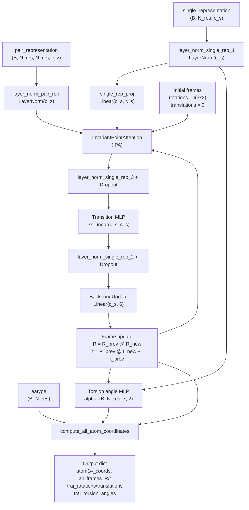
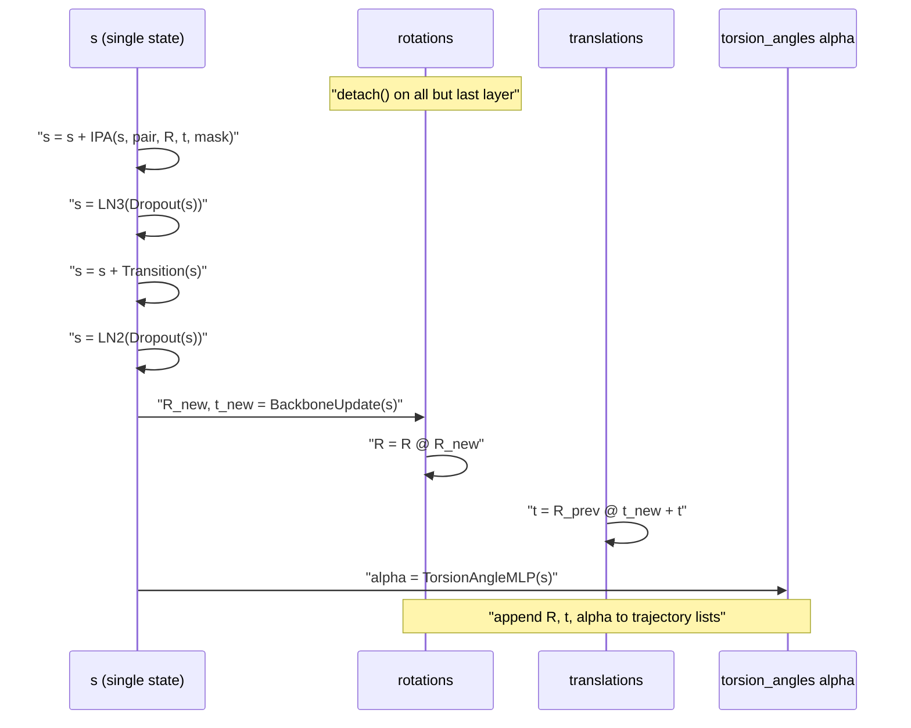
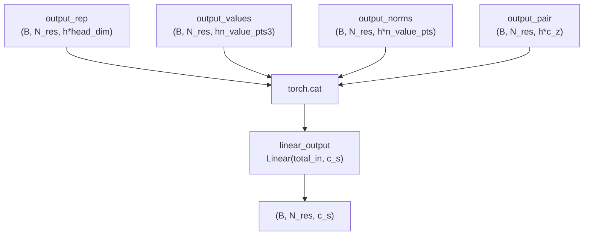
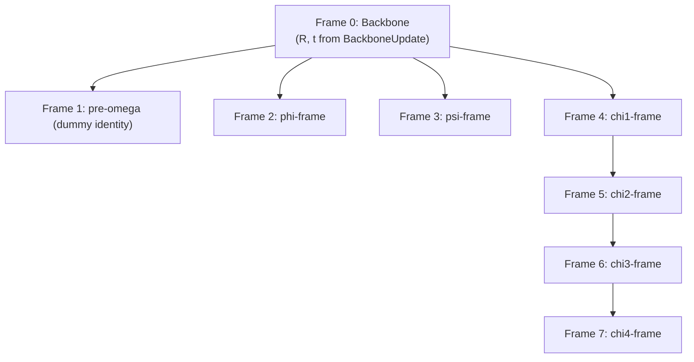

# Structure Module

> **Relevant source files**
> * [minalphafold/structure_module.py](https://github.com/ChrisHayduk/minAlphaFold2/blob/d0d066ad/minalphafold/structure_module.py)
> * [tests/test_shapes.py](https://github.com/ChrisHayduk/minAlphaFold2/blob/d0d066ad/tests/test_shapes.py)

This page documents the `StructureModule`, `InvariantPointAttention`, `BackboneUpdate`, and `compute_all_atom_coordinates` components defined in [minalphafold/structure_module.py](https://github.com/ChrisHayduk/minAlphaFold2/blob/d0d066ad/minalphafold/structure_module.py)

 These components form Stage 5 of the AlphaFold2 forward pass and are responsible for converting the sequence-level representations produced by the Evoformer into 3D atomic coordinates.

For context on what feeds into the Structure Module, see the Evoformer Stack page ([2.2](https://github.com/ChrisHayduk/minAlphaFold2/blob/d0d066ad/2.2)

). For how the Structure Module outputs are consumed by loss functions, see FAPE Losses ([3.1](https://github.com/ChrisHayduk/minAlphaFold2/blob/d0d066ad/3.1)

), Torsion Angle Loss ([3.2](https://github.com/ChrisHayduk/minAlphaFold2/blob/d0d066ad/3.2)

), and Structural Violation Loss ([3.3](https://github.com/ChrisHayduk/minAlphaFold2/blob/d0d066ad/3.3)

). For the residue constant tables the module depends on at runtime, see Residue Constants ([4](https://github.com/ChrisHayduk/minAlphaFold2/blob/d0d066ad/4)

).

---

## Overview

The Structure Module takes the final single and pair representations from the Evoformer and iteratively refines a set of per-residue rigid body frames (rotation + translation). At each layer, Invariant Point Attention (IPA) updates the single representation in a geometry-aware manner, `BackboneUpdate` produces a new frame from that representation, and a small MLP predicts torsion angles. After all layers complete, `compute_all_atom_coordinates` expands the backbone frames and torsion angles into up to 14 heavy-atom 3D positions per residue.

**Data flow diagram — Structure Module pipeline**



Sources: [minalphafold/structure_module.py L70-L171](https://github.com/ChrisHayduk/minAlphaFold2/blob/d0d066ad/minalphafold/structure_module.py#L70-L171)

---

## Initialization and Registered Buffers

`StructureModule.__init__` loads four residue constant arrays from `residue_constants.py` and registers them as non-parameter buffers so they move with the model's device automatically.

| Buffer | Shape | Source in `residue_constants.py` | Description |
| --- | --- | --- | --- |
| `default_frames` | `(21, 8, 4, 4)` | `restype_rigid_group_default_frame` | Literature 4×4 rigid transforms for each of 8 frames per residue type |
| `lit_positions` | `(21, 14, 3)` | `restype_atom14_rigid_group_positions` | Atom positions in their local frame coordinate system |
| `atom_frame_idx_table` | `(21, 14)` | `restype_atom14_to_rigid_group` | Which of the 8 frames each atom belongs to |
| `atom_mask_table` | `(21, 14)` | `restype_atom14_mask` | 1.0 for atoms that exist for this residue type, 0.0 otherwise |

Immediately after registration, `__init__` scales the translation columns of `default_frames` and all entries of `lit_positions` by **0.1** to convert from Å to nm [minalphafold/structure_module.py L67-L68](https://github.com/ChrisHayduk/minAlphaFold2/blob/d0d066ad/minalphafold/structure_module.py#L67-L68)

 See the [Unit Convention](https://github.com/ChrisHayduk/minAlphaFold2/blob/d0d066ad/Unit Convention)

 section below.

Sources: [minalphafold/structure_module.py L17-L68](https://github.com/ChrisHayduk/minAlphaFold2/blob/d0d066ad/minalphafold/structure_module.py#L17-L68)

---

## Forward Pass: Iterative Layer Loop

The `StructureModule.forward` signature is:

```
forward(single_representation, pair_representation, aatype, seq_mask=None)
```

Before entering the layer loop, the module applies `layer_norm_single_rep_1` to `single_representation` and `layer_norm_pair_rep` to `pair_representation`, then projects `single_representation` with `single_rep_proj` to produce the working single state `s`. Backbone frames are initialized to identity rotations and zero translations [minalphafold/structure_module.py L82-L90](https://github.com/ChrisHayduk/minAlphaFold2/blob/d0d066ad/minalphafold/structure_module.py#L82-L90)

**Per-layer update sequence (Algorithm 20)**



The gradient stop on rotations (`rotations.detach()`) applies to all layers except the last [minalphafold/structure_module.py L101](https://github.com/ChrisHayduk/minAlphaFold2/blob/d0d066ad/minalphafold/structure_module.py#L101-L101)

 matching Algorithm 20 of the AlphaFold2 supplement. This prevents instability from differentiating through accumulated frame products across many iterations.

The frame composition rule applied after `BackboneUpdate` is:

```
translations = torch.einsum('bsij, bsj -> bsi', rotations, new_translations) + translationsrotations = torch.einsum('bsij, bsjk -> bsik', rotations, new_rotations)
```

Sources: [minalphafold/structure_module.py L98-L133](https://github.com/ChrisHayduk/minAlphaFold2/blob/d0d066ad/minalphafold/structure_module.py#L98-L133)

---

## Invariant Point Attention (IPA)

`InvariantPointAttention` implements Algorithm 22 [minalphafold/structure_module.py L174](https://github.com/ChrisHayduk/minAlphaFold2/blob/d0d066ad/minalphafold/structure_module.py#L174-L174)

 It extends standard multi-head attention with frame-anchored point features that make the attention scores invariant to global rigid body transformations.

### Attention score components

| Component | Computation | Output shape before aggregation |
| --- | --- | --- |
| Representation score | `Q_rep · K_rep / sqrt(head_dim)` | `(B, N_res, N_res, num_heads)` |
| Pair bias `B` | `linear_bias(pair_repr)` | `(B, N_res, N_res, num_heads)` |
| Point score | `-0.5 * γ * w_c * Σ |  |
| Combined score | `w_l * (rep_score + B) + point_score` | `(B, N_res, N_res, num_heads)` |

The scalar `γ` per head is `softplus(head_weights)`, where `head_weights` is a learned parameter initialized to zero [minalphafold/structure_module.py L202-L203](https://github.com/ChrisHayduk/minAlphaFold2/blob/d0d066ad/minalphafold/structure_module.py#L202-L203)

 `w_c = sqrt(2/(9 * n_query_points))` and `w_l = sqrt(1/3)` are fixed normalization scalars [minalphafold/structure_module.py L205-L206](https://github.com/ChrisHayduk/minAlphaFold2/blob/d0d066ad/minalphafold/structure_module.py#L205-L206)

### Frame-space point projection

Query and key points are produced by linear projections of shape `(B, N_res, 3 * num_heads * n_query_points)`. After reshaping, each point is transformed into global frame coordinates:

```
global_frame_q = torch.einsum('biop, bihqp -> bihqo', rotations, q_pts) + translations[:, :, None, None, :]
```

Value points undergo the same global transformation [minalphafold/structure_module.py L284](https://github.com/ChrisHayduk/minAlphaFold2/blob/d0d066ad/minalphafold/structure_module.py#L284-L284)

 then the attention-weighted sum is projected back into each residue's local frame using the inverse rotation `R^T` and inverse translation `-R^T @ t` [minalphafold/structure_module.py L299-L301](https://github.com/ChrisHayduk/minAlphaFold2/blob/d0d066ad/minalphafold/structure_module.py#L299-L301)

### Output concatenation

The final output of IPA concatenates four components along the last dimension before a linear projection:

**IPA output diagram — `linear_output` input construction**



The `total_in` dimension of `linear_output` equals `h*head_dim + h*n_value_pts*3 + h*n_value_pts + h*c_z` [minalphafold/structure_module.py L218-L223](https://github.com/ChrisHayduk/minAlphaFold2/blob/d0d066ad/minalphafold/structure_module.py#L218-L223)

Sources: [minalphafold/structure_module.py L174-L319](https://github.com/ChrisHayduk/minAlphaFold2/blob/d0d066ad/minalphafold/structure_module.py#L174-L319)

---

## BackboneUpdate (Algorithm 23)

`BackboneUpdate` maps the single representation to a local rigid transform `(R_new, t_new)` for each residue [minalphafold/structure_module.py L321](https://github.com/ChrisHayduk/minAlphaFold2/blob/d0d066ad/minalphafold/structure_module.py#L321-L321)

A single `Linear(c_s, 6)` layer produces 6 scalars per residue [minalphafold/structure_module.py L330](https://github.com/ChrisHayduk/minAlphaFold2/blob/d0d066ad/minalphafold/structure_module.py#L330-L330)

 The first 3 scalars are quaternion components `(b, c, d)`. The real component `a` is implicitly fixed to 1, and the quaternion is normalized:

```
norm = torch.sqrt(1 + b**2 + c**2 + d**2)quaternion = torch.stack([torch.ones_like(b), b, c, d], dim=-1) / norm.unsqueeze(-1)
```

This parameterization guarantees a valid unit quaternion without any trigonometric operations. The rotation matrix `R_new` is then constructed from the quaternion products analytically [minalphafold/structure_module.py L354-L372](https://github.com/ChrisHayduk/minAlphaFold2/blob/d0d066ad/minalphafold/structure_module.py#L354-L372)

 The last 3 scalars form the translation vector `t_new`.

Sources: [minalphafold/structure_module.py L321-L376](https://github.com/ChrisHayduk/minAlphaFold2/blob/d0d066ad/minalphafold/structure_module.py#L321-L376)

---

## Torsion Angle Prediction

Seven torsion angles `[ω, φ, ψ, χ1, χ2, χ3, χ4]` are predicted per residue per layer. Each angle is represented as a 2-vector `(sin θ, cos θ)`, giving shape `(B, N_res, 7, 2)` [minalphafold/structure_module.py L125](https://github.com/ChrisHayduk/minAlphaFold2/blob/d0d066ad/minalphafold/structure_module.py#L125-L125)

The prediction network uses the current single state `s` and the **initial** (pre-loop) single representation (before the projection step) as inputs:

```
a = self.angle_linear_1(s) + self.angle_linear_2(single_representation)a += self.angle_linear_4(self.relu(self.angle_linear_3(self.relu(a))))a += self.angle_linear_6(self.relu(self.angle_linear_5(self.relu(a))))alpha = self.angle_linear_7(self.relu(a)).reshape(*alpha.shape[:-1], 7, 2)
```

The two residual blocks use `Linear(c, c)` layers where `c = config.structure_module_c` [minalphafold/structure_module.py L49-L57](https://github.com/ChrisHayduk/minAlphaFold2/blob/d0d066ad/minalphafold/structure_module.py#L49-L57)

 These raw 2-vectors are later normalized to unit length inside `compute_all_atom_coordinates` before being used to construct rotation matrices [minalphafold/structure_module.py L416](https://github.com/ChrisHayduk/minAlphaFold2/blob/d0d066ad/minalphafold/structure_module.py#L416-L416)

Sources: [minalphafold/structure_module.py L118-L129](https://github.com/ChrisHayduk/minAlphaFold2/blob/d0d066ad/minalphafold/structure_module.py#L118-L129)

---

## compute_all_atom_coordinates (Algorithm 24)

This standalone function takes the final backbone frames and torsion angles and produces global 3D coordinates for all 14 heavy-atom slots per residue [minalphafold/structure_module.py L403](https://github.com/ChrisHayduk/minAlphaFold2/blob/d0d066ad/minalphafold/structure_module.py#L403-L403)

**Rigid group frame hierarchy**



Frames 1–4 each compose independently from the backbone frame. Frames 5–7 chain sequentially from their predecessor sidechain frame [minalphafold/structure_module.py L440-L449](https://github.com/ChrisHayduk/minAlphaFold2/blob/d0d066ad/minalphafold/structure_module.py#L440-L449)

### Step-by-step breakdown

| Step | Operation | Output shape |
| --- | --- | --- |
| 1 | Normalize `torsion_angles` to unit vectors | `(B, N_res, 7, 2)` |
| 2 | Index `default_frames` by `aatype` to get `lit_R`, `lit_t` | `(B, N_res, 8, 3, 3)`, `(B, N_res, 8, 3)` |
| 3 | Call `make_rot_x(torsion_angles)` for all 7 angles | `(B, N_res, 7, 3, 3)` |
| 4 | Build 8 frames via `compose_transforms` | `(B, N_res, 8, 3, 3)`, `(B, N_res, 8, 3)` |
| 5 | Gather per-atom frame using `atom_frame_idx_table[aatype]` | `(B, N_res, 14, 3, 3)`, `(B, N_res, 14, 3)` |
| 6 | Apply: `x_global = R_frame @ x_lit + t_frame` | `(B, N_res, 14, 3)` |

### make_rot_x

`make_rot_x` [minalphafold/structure_module.py L378-L394](https://github.com/ChrisHayduk/minAlphaFold2/blob/d0d066ad/minalphafold/structure_module.py#L378-L394)

 converts a normalized `(sin θ, cos θ)` pair into a rotation about the x-axis:

```
R = [[1,    0,    0  ],     [0,    cosθ, -sinθ],     [0,    sinθ,  cosθ]]
```

### compose_transforms

`compose_transforms(R1, t1, R2, t2)` [minalphafold/structure_module.py L396-L400](https://github.com/ChrisHayduk/minAlphaFold2/blob/d0d066ad/minalphafold/structure_module.py#L396-L400)

 implements the standard rigid body composition:

```
R_out = torch.matmul(R1, R2)t_out = torch.matmul(R1, t2.unsqueeze(-1)).squeeze(-1) + t1
```

Sources: [minalphafold/structure_module.py L403-L474](https://github.com/ChrisHayduk/minAlphaFold2/blob/d0d066ad/minalphafold/structure_module.py#L403-L474)

---

## Unit Convention

The Structure Module operates **internally in nanometers (nm)** to match the AlphaFold2 supplement. The boundary is managed in two places:

**Å → nm (on initialization):**

```markdown
self.default_frames[..., :3, 3] *= 0.1   # translation column: Å → nmself.lit_positions *= 0.1                  # atom positions:     Å → nm
```

[minalphafold/structure_module.py L67-L68](https://github.com/ChrisHayduk/minAlphaFold2/blob/d0d066ad/minalphafold/structure_module.py#L67-L68)

**nm → Å (on output):**

All translation-containing tensors in the output dict are multiplied by `10.0` before being returned:

```
predictions = {    "traj_translations": all_translations * 10.0,    "final_translations": translations * 10.0,    "all_frames_t": all_frames_t * 10.0,    "atom14_coords": atom_coords * 10.0,    ...}
```

Rotation matrices are dimensionless and require no conversion.

Sources: [minalphafold/structure_module.py L149-L169](https://github.com/ChrisHayduk/minAlphaFold2/blob/d0d066ad/minalphafold/structure_module.py#L149-L169)

---

## Output Tensors

The `forward` method returns a single dictionary. All spatial coordinates in the output are in **Å**.

| Key | Shape | Description |
| --- | --- | --- |
| `traj_rotations` | `(num_layers, B, N_res, 3, 3)` | Backbone rotation at each layer, for auxiliary FAPE loss |
| `traj_translations` | `(num_layers, B, N_res, 3)` | Backbone translation at each layer, in Å |
| `traj_torsion_angles` | `(num_layers, B, N_res, 7, 2)` | Torsion angles at each layer, for torsion angle loss |
| `final_rotations` | `(B, N_res, 3, 3)` | Backbone rotation at the final layer |
| `final_translations` | `(B, N_res, 3)` | Backbone translation at the final layer, in Å |
| `all_frames_R` | `(B, N_res, 8, 3, 3)` | All 8 rigid group rotation matrices |
| `all_frames_t` | `(B, N_res, 8, 3)` | All 8 rigid group translation vectors, in Å |
| `atom14_coords` | `(B, N_res, 14, 3)` | Final all-atom coordinates in the atom14 scheme, in Å |
| `atom14_mask` | `(B, N_res, 14)` | 1.0 for atoms that exist for this residue type |
| `single` | `(B, N_res, c_s)` | Final single representation, consumed by prediction heads |

Sources: [minalphafold/structure_module.py L149-L171](https://github.com/ChrisHayduk/minAlphaFold2/blob/d0d066ad/minalphafold/structure_module.py#L149-L171)