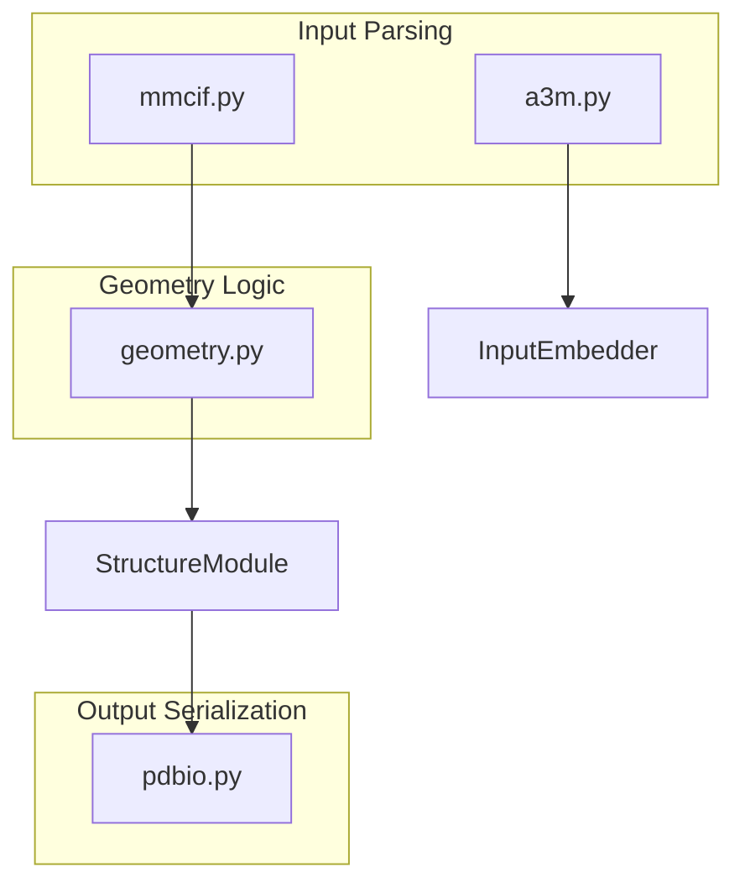

# Testing

> **Relevant source files**
> * [minalphafold/pdbio.py](https://github.com/ChrisHayduk/minAlphaFold2/blob/d0d066ad/minalphafold/pdbio.py)
> * [tests/test_a3m.py](https://github.com/ChrisHayduk/minAlphaFold2/blob/d0d066ad/tests/test_a3m.py)
> * [tests/test_data_pipeline.py](https://github.com/ChrisHayduk/minAlphaFold2/blob/d0d066ad/tests/test_data_pipeline.py)
> * [tests/test_geometry.py](https://github.com/ChrisHayduk/minAlphaFold2/blob/d0d066ad/tests/test_geometry.py)
> * [tests/test_mmcif.py](https://github.com/ChrisHayduk/minAlphaFold2/blob/d0d066ad/tests/test_mmcif.py)
> * [tests/test_pdbio.py](https://github.com/ChrisHayduk/minAlphaFold2/blob/d0d066ad/tests/test_pdbio.py)
> * [tests/test_shapes.py](https://github.com/ChrisHayduk/minAlphaFold2/blob/d0d066ad/tests/test_shapes.py)
> * [tests/test_trainer.py](https://github.com/ChrisHayduk/minAlphaFold2/blob/d0d066ad/tests/test_trainer.py)

This page documents the test suite for minAlphaFold2. The suite consists of shape-verification "smoke tests" in `tests/test_shapes.py`, functional data pipeline tests in `tests/test_data_pipeline.py`, and specialized geometry/IO tests. These tests verify that every module produces correctly shaped outputs and that key behavioral properties (masking, equivariance, gradient flow, initialization) hold.

---

## Test Fixture: MockConfig

All model tests receive a `MockConfig` instance via the `cfg` pytest fixture [tests/test_shapes.py L14-L67](https://github.com/ChrisHayduk/minAlphaFold2/blob/d0d066ad/tests/test_shapes.py#L14-L67)

 The config sets intentionally small channel widths and layer counts so every test runs quickly on CPU.

| Config field | Value | What it controls |
| --- | --- | --- |
| `c_m` | 32 | MSA representation channel dim |
| `c_s` | 32 | Single representation channel dim |
| `c_z` | 16 | Pair representation channel dim |
| `c_t` | 16 | Template feature channel dim |
| `c_e` | 24 | Extra MSA channel dim |
| `dim` / `num_heads` | 8 / 4 | Attention head dimensions |
| `structure_module_layers` | 2 | IPA iteration count |
| `ipa_num_heads` / `ipa_c` | 4 / 8 | IPA head count and dim |
| `n_dist_bins` | 64 | Distogram bin count |
| `n_plddt_bins` | 50 | pLDDT bin count |
| `num_evoformer` | 1 | Evoformer blocks |

Three module-level constants set the batch and sequence sizes used across all tests [tests/test_shapes.py L71-L73](https://github.com/ChrisHayduk/minAlphaFold2/blob/d0d066ad/tests/test_shapes.py#L71-L73)

:

* `B = 2` (batch size)
* `N_seq = 4` (MSA sequences)
* `N_res = 6` (residues)

Sources: [tests/test_shapes.py L14-L73](https://github.com/ChrisHayduk/minAlphaFold2/blob/d0d066ad/tests/test_shapes.py#L14-L73)

---

## Test Organization

The test suite is organized into specialized files targeting different layers of the system.

**Test Class to Code Entity Mapping**

```mermaid
flowchart TD

TIE["TestInputEmbedder"]
TEvo["TestEvoformer"]
TSM["TestStructureModule"]
TIPA["TestInvariantPointAttention"]
TAF2["TestAlphaFold2"]
TDP["test_preprocess_chain"]
TDS["TestDataset"]
TTS["test_train_step_updates"]
TEV["test_evaluate_returns_finite"]
IE["InputEmbedder (embedders.py)"]
EV["Evoformer (evoformer.py)"]
SM["StructureModule (structure_module.py)"]
IPA["InvariantPointAttention (structure_module.py)"]
AF2["AlphaFold2 (model.py)"]
PC["preprocess_chain (preprocess_openproteinset.py)"]
POD["ProcessedOpenProteinSetDataset (data.py)"]
TS["train_step (trainer.py)"]
EVF["evaluate (trainer.py)"]

TIE --> IE
TEvo --> EV
TSM --> SM
TIPA --> IPA
TAF2 --> AF2
TDP --> PC
TDS --> POD
TTS --> TS
TEV --> EVF

subgraph tests/test_trainer.py ["tests/test_trainer.py"]
    TTS
    TEV
end

subgraph tests/test_data_pipeline.py ["tests/test_data_pipeline.py"]
    TDP
    TDS
end

subgraph tests/test_shapes.py ["tests/test_shapes.py"]
    TIE
    TEvo
    TSM
    TIPA
    TAF2
end
```

Sources: [tests/test_shapes.py L87-L477](https://github.com/ChrisHayduk/minAlphaFold2/blob/d0d066ad/tests/test_shapes.py#L87-L477)

 [tests/test_data_pipeline.py L15-L28](https://github.com/ChrisHayduk/minAlphaFold2/blob/d0d066ad/tests/test_data_pipeline.py#L15-L28)

 [tests/test_trainer.py L15-L31](https://github.com/ChrisHayduk/minAlphaFold2/blob/d0d066ad/tests/test_trainer.py#L15-L31)

---

## Shape and Forward Tests

Shape tests instantiate a module with `MockConfig`, feed it random tensors, and assert the output matches expected dimensions.

### Embedder and Evoformer

* **`TestInputEmbedder`**: Verifies that target features (21-dim) and MSA features (49-dim) are projected to `c_m` and `c_z` [tests/test_shapes.py L87-L96](https://github.com/ChrisHayduk/minAlphaFold2/blob/d0d066ad/tests/test_shapes.py#L87-L96)
* **`TestOuterProductMean`**: Confirms MSA-to-pair projection results in `(B, N_res, N_res, c_z)` [tests/test_shapes.py L117-L123](https://github.com/ChrisHayduk/minAlphaFold2/blob/d0d066ad/tests/test_shapes.py#L117-L123)
* **`TestEvoformer`**: Checks that the residual stack preserves the shapes of `msa_repr` and `pair_repr` [tests/test_shapes.py L225-L233](https://github.com/ChrisHayduk/minAlphaFold2/blob/d0d066ad/tests/test_shapes.py#L225-L233)

### Structure Module

`TestStructureModule.test_output_dict` verifies the comprehensive output dictionary required for coordinate generation [tests/test_shapes.py L294-L311](https://github.com/ChrisHayduk/minAlphaFold2/blob/d0d066ad/tests/test_shapes.py#L294-L311)

:

| Key | Expected Shape |
| --- | --- |
| `final_translations` | `(B, N_res, 3)` |
| `all_frames_R` | `(B, N_res, 8, 3, 3)` |
| `atom14_coords` | `(B, N_res, 14, 3)` |
| `traj_torsion_angles` | `(layers, B, N_res, 7, 2)` |

### Full AlphaFold2

`TestAlphaFold2.test_forward_shapes` runs a complete prediction pass including recycling and ensembling [tests/test_shapes.py L434-L476](https://github.com/ChrisHayduk/minAlphaFold2/blob/d0d066ad/tests/test_shapes.py#L434-L476)

 It validates that the model correctly handles the `n_cycles` loop and returns all head logits (Distogram, pLDDT, Masked MSA, Experimentally Resolved, and TM-score).

Sources: [tests/test_shapes.py L87-L476](https://github.com/ChrisHayduk/minAlphaFold2/blob/d0d066ad/tests/test_shapes.py#L87-L476)

---

## Semantic and Behavioral Tests

### IPA Equivariance and Masking

* **Equivariance**: `TestIPAEquivariance` applies a 90° rotation to input frames and verifies that the resulting single representation remains unchanged (invariant), while the updated frames transform accordingly [tests/test_shapes.py L523-L559](https://github.com/ChrisHayduk/minAlphaFold2/blob/d0d066ad/tests/test_shapes.py#L523-L559)
* **Masking**: `TestIPAMasking` ensures that padded residues (where `seq_mask=0`) produce zero attention weights and do not influence the representation of valid residues [tests/test_shapes.py L481-L520](https://github.com/ChrisHayduk/minAlphaFold2/blob/d0d066ad/tests/test_shapes.py#L481-L520)

### Gradient Flow

`TestGradientFlow` verifies that backpropagation works through the complex iterative logic of the `StructureModule` [tests/test_shapes.py L583-L616](https://github.com/ChrisHayduk/minAlphaFold2/blob/d0d066ad/tests/test_shapes.py#L583-L616)

 It specifically checks that:

1. Loss on `final_translations` produces non-zero gradients in the input single representation.
2. The rotation-detaching logic (Algorithm 20) allows gradients to flow through the final layer's backbone update.

### Zero-Initialization

Following the AlphaFold2 supplement, several modules are tested for "zero-init" behavior [tests/test_shapes.py L660-L677](https://github.com/ChrisHayduk/minAlphaFold2/blob/d0d066ad/tests/test_shapes.py#L660-L677)

:

* **Heads**: `DistogramHead`, `PLDDTHead`, and `MaskedMSAHead` must have their final linear layer weights initialized to zero to provide a neutral starting point for training.
* **IPA**: The `linear_output` in `InvariantPointAttention` is verified to be zero-initialized [tests/test_shapes.py L691-L694](https://github.com/ChrisHayduk/minAlphaFold2/blob/d0d066ad/tests/test_shapes.py#L691-L694)

Sources: [tests/test_shapes.py L481-L694](https://github.com/ChrisHayduk/minAlphaFold2/blob/d0d066ad/tests/test_shapes.py#L481-L694)

---

## Data and Training Pipeline Tests

### Data Pipeline (tests/test_data_pipeline.py)

These tests use a `SmallConfig` and synthetic sequences to verify the end-to-end data flow.

* **`test_preprocess_chain`**: Mocks the raw OpenProteinSet directory structure and verifies that `preprocess_chain` correctly extracts A3M features and mmCIF coordinates into `.npz` files [tests/test_data_pipeline.py L205-L244](https://github.com/ChrisHayduk/minAlphaFold2/blob/d0d066ad/tests/test_data_pipeline.py#L205-L244)
* **`TestDataset`**: Validates `ProcessedOpenProteinSetDataset`, ensuring it correctly performs stochastic MSA cropping, cluster sampling, and BERT-style masking [tests/test_data_pipeline.py L270-L305](https://github.com/ChrisHayduk/minAlphaFold2/blob/d0d066ad/tests/test_data_pipeline.py#L270-L305)

### Trainer (tests/test_trainer.py)

* **`test_train_step_updates_model_parameters`**: Runs a single training step and asserts that model weights actually change and the loss is finite [tests/test_trainer.py L44-L86](https://github.com/ChrisHayduk/minAlphaFold2/blob/d0d066ad/tests/test_trainer.py#L44-L86)
* **`test_fit_runs_and_writes_checkpoints`**: Exercises the full training loop for 2 epochs and verifies that `latest.pt` and `best.pt` files are created on disk [tests/test_trainer.py L126-L161](https://github.com/ChrisHayduk/minAlphaFold2/blob/d0d066ad/tests/test_trainer.py#L126-L161)

Sources: [tests/test_data_pipeline.py L205-L305](https://github.com/ChrisHayduk/minAlphaFold2/blob/d0d066ad/tests/test_data_pipeline.py#L205-L305)

 [tests/test_trainer.py L44-L161](https://github.com/ChrisHayduk/minAlphaFold2/blob/d0d066ad/tests/test_trainer.py#L44-L161)

---

## Specialized Utility Tests

### Geometry and IO

* **`tests/test_geometry.py`**: Verifies that `pseudo_beta_positions` correctly selects $C\beta$ for standard residues and $C\alpha$ for Glycine [tests/test_geometry.py L32-L40](https://github.com/ChrisHayduk/minAlphaFold2/blob/d0d066ad/tests/test_geometry.py#L32-L40)  It also checks that `backbone_frames` masks out residues with missing atoms [tests/test_geometry.py L43-L52](https://github.com/ChrisHayduk/minAlphaFold2/blob/d0d066ad/tests/test_geometry.py#L43-L52)
* **`tests/test_mmcif.py`**: Validates the mmCIF parser's handling of `altloc` identifiers and its ability to extract the correct `atom14` coordinate array from raw files [tests/test_mmcif.py L14-L57](https://github.com/ChrisHayduk/minAlphaFold2/blob/d0d066ad/tests/test_mmcif.py#L14-L57)
* **`tests/test_pdbio.py`**: Verifies that the model's predicted `plddt_logits` are correctly converted into B-factors during PDB serialization [tests/test_pdbio.py L65-L87](https://github.com/ChrisHayduk/minAlphaFold2/blob/d0d066ad/tests/test_pdbio.py#L65-L87)
* **`tests/test_a3m.py`**: Confirms that the A3M parser correctly handles insertions (lowercase) and deletions (dashes) relative to the query sequence [tests/test_a3m.py L13-L30](https://github.com/ChrisHayduk/minAlphaFold2/blob/d0d066ad/tests/test_a3m.py#L13-L30)

**Data Flow for Structural Validation**

Sources: [tests/test_geometry.py L11-L65](https://github.com/ChrisHayduk/minAlphaFold2/blob/d0d066ad/tests/test_geometry.py#L11-L65)

 [tests/test_mmcif.py L11-L57](https://github.com/ChrisHayduk/minAlphaFold2/blob/d0d066ad/tests/test_mmcif.py#L11-L57)

 [tests/test_pdbio.py L12-L87](https://github.com/ChrisHayduk/minAlphaFold2/blob/d0d066ad/tests/test_pdbio.py#L12-L87)

 [tests/test_a3m.py L10-L62](https://github.com/ChrisHayduk/minAlphaFold2/blob/d0d066ad/tests/test_a3m.py#L10-L62)