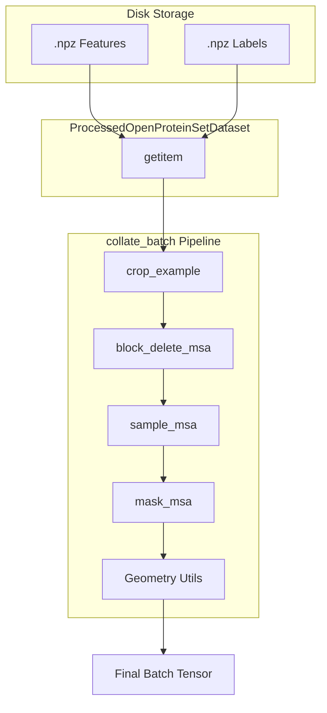
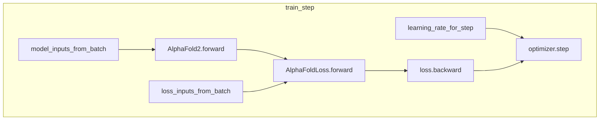
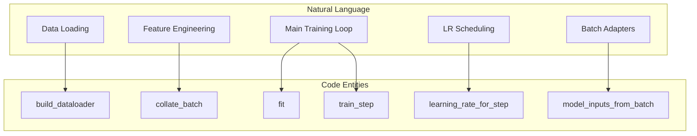

# Training Loop and Data Loading

> **Relevant source files**
> * [minalphafold/data.py](https://github.com/ChrisHayduk/minAlphaFold2/blob/d0d066ad/minalphafold/data.py)
> * [minalphafold/trainer.py](https://github.com/ChrisHayduk/minAlphaFold2/blob/d0d066ad/minalphafold/trainer.py)

This page documents the training orchestration and data ingestion pipeline of minAlphaFold2. The system is designed to handle the complex feature engineering required for AlphaFold2, including MSA subsampling, template processing, and structural label generation, while providing a robust training loop with support for recycling, ensembling, and a distinct finetuning phase.

## Data Ingestion and Processing

The data pipeline transforms processed `.npz` files into the high-dimensional tensors required by the model. This involves stochastic augmentations like MSA block deletion and BERT-style masking.

### Dataset and Dataloader Factory

The `ProcessedOpenProteinSetDataset` class handles loading sequence features and structural labels from disk [minalphafold/data.py L84-L93](https://github.com/ChrisHayduk/minAlphaFold2/blob/d0d066ad/minalphafold/data.py#L84-L93)

 The `build_dataloader` factory function wraps this dataset in a PyTorch `DataLoader`, configuring batching and worker settings [minalphafold/trainer.py L236-L258](https://github.com/ChrisHayduk/minAlphaFold2/blob/d0d066ad/minalphafold/trainer.py#L236-L258)

### The Collate and Feature Engineering Pipeline

The `collate_batch` function is the primary entry point for transforming a list of raw examples into a model-ready batch [minalphafold/data.py L331-L356](https://github.com/ChrisHayduk/minAlphaFold2/blob/d0d066ad/minalphafold/data.py#L331-L356)

 It invokes `build_processed_example` for each protein, which performs the following operations:

1. **Cropping**: Contiguous spatial cropping to `crop_size` [minalphafold/data.py L145-L171](https://github.com/ChrisHayduk/minAlphaFold2/blob/d0d066ad/minalphafold/data.py#L145-L171)
2. **MSA Block Deletion**: Randomly removing blocks of MSA sequences to improve robustness [minalphafold/data.py L174-L198](https://github.com/ChrisHayduk/minAlphaFold2/blob/d0d066ad/minalphafold/data.py#L174-L198)
3. **MSA Subsampling**: Selecting a subset of MSA sequences (defined by `msa_depth` and `extra_msa_depth`) [minalphafold/data.py L201-L240](https://github.com/ChrisHayduk/minAlphaFold2/blob/d0d066ad/minalphafold/data.py#L201-L240)
4. **Masking**: Applying BERT-style random masking to the MSA for the Masked MSA Loss [minalphafold/data.py L243-L273](https://github.com/ChrisHayduk/minAlphaFold2/blob/d0d066ad/minalphafold/data.py#L243-L273)
5. **Geometry Calculation**: Computing ground-truth `backbone_frames`, `torsion_angles`, and `pseudo_beta_positions` from the raw coordinates [minalphafold/data.py L302-L311](https://github.com/ChrisHayduk/minAlphaFold2/blob/d0d066ad/minalphafold/data.py#L302-L311)

**Data Flow: Disk to Batch**

Sources: [minalphafold/data.py L84-L356](https://github.com/ChrisHayduk/minAlphaFold2/blob/d0d066ad/minalphafold/data.py#L84-L356)

 [minalphafold/trainer.py L236-L258](https://github.com/ChrisHayduk/minAlphaFold2/blob/d0d066ad/minalphafold/trainer.py#L236-L258)

## Training Orchestration

The training loop is managed by the `fit` function, which iterates through epochs and steps, handling optimization, checkpointing, and evaluation.

### Adapter Functions

To bridge the gap between the raw data batch and the specific requirements of the model and loss functions, two adapter functions are used:

* **`model_inputs_from_batch`**: Extracts and moves tensors to the target device for the `AlphaFold2` forward pass, including `aatype`, `msa_feat`, and `template_pair_feat` [minalphafold/trainer.py L313-L333](https://github.com/ChrisHayduk/minAlphaFold2/blob/d0d066ad/minalphafold/trainer.py#L313-L333)
* **`loss_inputs_from_batch`**: Extracts ground-truth labels for `AlphaFoldLoss`, such as `atom14_positions`, `torsion_angles_sin_cos`, and `backbone_frames` [minalphafold/trainer.py L336-L353](https://github.com/ChrisHayduk/minAlphaFold2/blob/d0d066ad/minalphafold/trainer.py#L336-L353)

### Learning Rate Scheduler

The `learning_rate_for_step` function implements a warmup followed by a decay strategy. It supports `constant`, `linear`, and `cosine` schedules [minalphafold/trainer.py L356-L377](https://github.com/ChrisHayduk/minAlphaFold2/blob/d0d066ad/minalphafold/trainer.py#L356-L377)

### Training Step and Finetuning Logic

The `train_step` function performs a single optimization iteration [minalphafold/trainer.py L380-L417](https://github.com/ChrisHayduk/minAlphaFold2/blob/d0d066ad/minalphafold/trainer.py#L380-L417)

 A key feature is the transition to the finetuning phase:

* If `step >= finetune_start_step`, the `AlphaFoldLoss` is configured with `finetune=True` [minalphafold/trainer.py L403-L406](https://github.com/ChrisHayduk/minAlphaFold2/blob/d0d066ad/minalphafold/trainer.py#L403-L406)
* This switch enables the `ExperimentallyResolvedLoss` and adjusts weights for structural violation losses [minalphafold/losses.py L64-L70](https://github.com/ChrisHayduk/minAlphaFold2/blob/d0d066ad/minalphafold/losses.py#L64-L70)

**Training Step Execution**

Sources: [minalphafold/trainer.py L313-L417](https://github.com/ChrisHayduk/minAlphaFold2/blob/d0d066ad/minalphafold/trainer.py#L313-L417)

 [minalphafold/losses.py L39-L85](https://github.com/ChrisHayduk/minAlphaFold2/blob/d0d066ad/minalphafold/losses.py#L39-L85)

## Checkpointing and Persistence

The system provides logic for saving and resuming training to ensure progress is not lost and the best models are preserved.

| Function | Responsibility |
| --- | --- |
| `save_checkpoint` | Serializes model `state_dict`, optimizer state, and current step/epoch to a `.pt` file [minalphafold/trainer.py L448-L465](https://github.com/ChrisHayduk/minAlphaFold2/blob/d0d066ad/minalphafold/trainer.py#L448-L465) |
| `resume_from_checkpoint` | Restores the model and optimizer states. It also allows for resuming a training run from a specific step [minalphafold/trainer.py L468-L486](https://github.com/ChrisHayduk/minAlphaFold2/blob/d0d066ad/minalphafold/trainer.py#L468-L486) |

The `fit` function automatically saves a `latest.pt` checkpoint after every epoch and updates `best.pt` if the validation loss improves [minalphafold/trainer.py L586-L602](https://github.com/ChrisHayduk/minAlphaFold2/blob/d0d066ad/minalphafold/trainer.py#L586-L602)

Sources: [minalphafold/trainer.py L448-L602](https://github.com/ChrisHayduk/minAlphaFold2/blob/d0d066ad/minalphafold/trainer.py#L448-L602)

## System Component Mapping

The following diagram maps the natural language concepts of the training loop to the specific code entities in `trainer.py` and `data.py`.

**Training Loop Code Mapping**

Sources: [minalphafold/trainer.py L236-L550](https://github.com/ChrisHayduk/minAlphaFold2/blob/d0d066ad/minalphafold/trainer.py#L236-L550)

 [minalphafold/data.py L331-L356](https://github.com/ChrisHayduk/minAlphaFold2/blob/d0d066ad/minalphafold/data.py#L331-L356)