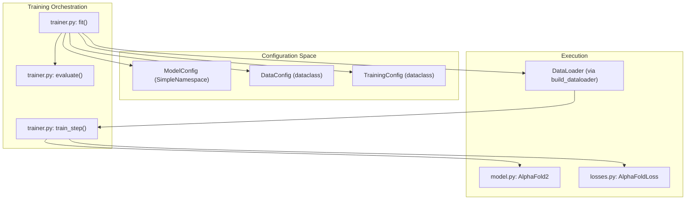
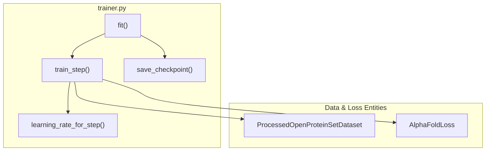

# Training System

> **Relevant source files**
> * [minalphafold/trainer.py](https://github.com/ChrisHayduk/minAlphaFold2/blob/d0d066ad/minalphafold/trainer.py)

The Training System in `minAlphaFold2` provides a structured orchestration for model training, validation, and checkpointing. It is designed to be pedagogical, offering multiple configuration profiles ranging from a "tiny" model for local testing to a full-scale "alphafold2" replication. The system manages the transition between pre-training and fine-tuning phases, handles complex data collation, and implements specific learning rate schedules required for stable AlphaFold2 training.

The core of the training logic resides in `minalphafold/trainer.py`, which encapsulates the `fit()` function and all associated configuration logic.

## System Overview

The training orchestration follows a standard PyTorch pattern but adds domain-specific adapters to bridge the gap between the raw data pipeline and the model's expected input shapes.

### Training Flow Architecture

The following diagram illustrates how the `fit` function orchestrates the training process, interacting with the configuration profiles and the model.

**Sources:** [minalphafold/trainer.py L243-L346](https://github.com/ChrisHayduk/minAlphaFold2/blob/d0d066ad/minalphafold/trainer.py#L243-L346)

 [minalphafold/trainer.py L349-L436](https://github.com/ChrisHayduk/minAlphaFold2/blob/d0d066ad/minalphafold/trainer.py#L349-L436)

## Model Configuration Profiles

`minAlphaFold2` uses three primary configuration profiles to manage model complexity. These are generated via the `_make_model_config` helper [minalphafold/trainer.py L25-L68](https://github.com/ChrisHayduk/minAlphaFold2/blob/d0d066ad/minalphafold/trainer.py#L25-L68)

| Profile | Purpose | Evoformer Blocks | MSA Depth | IPA Heads |
| --- | --- | --- | --- | --- |
| `tiny` | Unit testing and CI. | 1 | 64 | 4 |
| `medium` | Local experimentation/overfitting. | 4 | 64 | 8 |
| `alphafold2` | Official AF2 hyperparameters. | 48 | 64 | 12 |

* **`default_model_config`**: Returns the `tiny` profile [minalphafold/trainer.py L109-L110](https://github.com/ChrisHayduk/minAlphaFold2/blob/d0d066ad/minalphafold/trainer.py#L109-L110)
* **`medium_model_config`**: Increases embedding dimensions (e.g., `c_m` to 128) and Evoformer depth [minalphafold/trainer.py L113-L146](https://github.com/ChrisHayduk/minAlphaFold2/blob/d0d066ad/minalphafold/trainer.py#L113-L146)
* **`alphafold2_model_config`**: Matches official hyperparameters, including dropout rates (0.15 - 0.25) and 48 Evoformer layers [minalphafold/trainer.py L148-L187](https://github.com/ChrisHayduk/minAlphaFold2/blob/d0d066ad/minalphafold/trainer.py#L148-L187)

For details on specific hyperparameter fields, see [Model Configuration and Hyperparameters](/ChrisHayduk/minAlphaFold2/7.1-model-configuration-and-hyperparameters).

**Sources:** [minalphafold/trainer.py L109-L187](https://github.com/ChrisHayduk/minAlphaFold2/blob/d0d066ad/minalphafold/trainer.py#L109-L187)

## Training Phases and Transitions

The system supports two distinct training phases: **Pre-training** and **Fine-tuning**.

1. **Pre-training**: The model is trained on crops with standard loss weights.
2. **Fine-tuning**: Triggered by the `finetune_start_step` parameter in `TrainingConfig` [minalphafold/trainer.py L104](https://github.com/ChrisHayduk/minAlphaFold2/blob/d0d066ad/minalphafold/trainer.py#L104-L104)  During this phase, the `AlphaFoldLoss` behavior changes, typically enabling additional terms like `ExperimentallyResolvedLoss` and increasing the weight of structural violation losses.

The `train_step` function monitors the global step count to decide when to toggle the `finetune` flag passed to the loss function.

For details on the loop mechanics and loss switching, see [Training Loop and Data Loading](/ChrisHayduk/minAlphaFold2/7.2-training-loop-and-data-loading).

**Sources:** [minalphafold/trainer.py L103-L104](https://github.com/ChrisHayduk/minAlphaFold2/blob/d0d066ad/minalphafold/trainer.py#L103-L104)

 [minalphafold/trainer.py L365-L375](https://github.com/ChrisHayduk/minAlphaFold2/blob/d0d066ad/minalphafold/trainer.py#L365-L375)

## Checkpointing Strategy

The `fit()` function implements a robust checkpointing strategy to ensure progress is saved and can be resumed seamlessly.

* **Latest Checkpoint**: Saved at the end of every epoch to `latest_checkpoint_path` [minalphafold/trainer.py L105](https://github.com/ChrisHayduk/minAlphaFold2/blob/d0d066ad/minalphafold/trainer.py#L105-L105)
* **Best Checkpoint**: If the validation loss improves, the model state is saved to `best_checkpoint_path` [minalphafold/trainer.py L106](https://github.com/ChrisHayduk/minAlphaFold2/blob/d0d066ad/minalphafold/trainer.py#L106-L106)
* **State Composition**: Checkpoints include the `model_state_dict`, `optimizer_state_dict`, `scheduler_state_dict`, current `epoch`, and `global_step` [minalphafold/trainer.py L488-L498](https://github.com/ChrisHayduk/minAlphaFold2/blob/d0d066ad/minalphafold/trainer.py#L488-L498)

### Code-to-System Mapping: Training Execution

This diagram maps the high-level training concepts to the specific functions and classes in the codebase.

**Sources:** [minalphafold/trainer.py L349-L436](https://github.com/ChrisHayduk/minAlphaFold2/blob/d0d066ad/minalphafold/trainer.py#L349-L436)

 [minalphafold/trainer.py L439-L478](https://github.com/ChrisHayduk/minAlphaFold2/blob/d0d066ad/minalphafold/trainer.py#L439-L478)

 [minalphafold/trainer.py L488-L500](https://github.com/ChrisHayduk/minAlphaFold2/blob/d0d066ad/minalphafold/trainer.py#L488-L500)

---

## Child Pages

* [Model Configuration and Hyperparameters](/ChrisHayduk/minAlphaFold2/7.1-model-configuration-and-hyperparameters) — Detailed documentation of `ModelConfig`, `DataConfig`, and `TrainingConfig` fields, including learning rate schedules and gradient clipping.
* [Training Loop and Data Loading](/ChrisHayduk/minAlphaFold2/7.2-training-loop-and-data-loading) — Technical breakdown of the `train_step`, the `build_dataloader` factory, and the logic for resuming training from checkpoints.