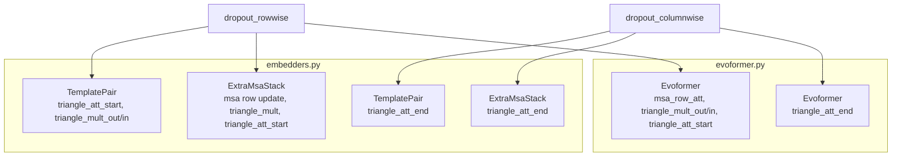
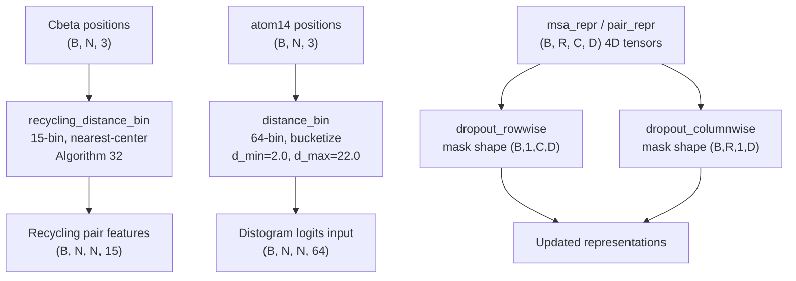

# Utilities

> **Relevant source files**
> * [minalphafold/utils.py](https://github.com/ChrisHayduk/minAlphaFold2/blob/d0d066ad/minalphafold/utils.py)

`minalphafold/utils.py` provides a small set of standalone helper functions used across the codebase. These functions handle two concerns: structured dropout for 4D representation tensors, and distance-to-one-hot encoding for both the distogram head and the recycling loop.

This page covers only the utility functions in `utils.py`. For the modules that consume these functions, see:

* Input Embedding and Evoformer dropout usage: [Model Architecture](/ChrisHayduk/minAlphaFold2/2-model-architecture), [Input Embedding](/ChrisHayduk/minAlphaFold2/2.1-input-embedding), [Evoformer Stack](/ChrisHayduk/minAlphaFold2/2.2-evoformer-stack)
* Distogram head output: [Prediction Heads](/ChrisHayduk/minAlphaFold2/2.4-prediction-heads)
* Recycling loop context: [Model Architecture](/ChrisHayduk/minAlphaFold2/2-model-architecture)
* Loss function use of distance binning: [Loss Functions](/ChrisHayduk/minAlphaFold2/3-loss-functions)

---

## Function Overview

| Function | Lines | Purpose |
| --- | --- | --- |
| `dropout_rowwise` | [minalphafold/utils.py L5-L17](https://github.com/ChrisHayduk/minAlphaFold2/blob/d0d066ad/minalphafold/utils.py#L5-L17) | Shared-mask dropout, mask broadcast over the row dimension |
| `dropout_columnwise` | [minalphafold/utils.py L20-L32](https://github.com/ChrisHayduk/minAlphaFold2/blob/d0d066ad/minalphafold/utils.py#L20-L32) | Shared-mask dropout, mask broadcast over the column dimension |
| `distance_bin` | [minalphafold/utils.py L35-L41](https://github.com/ChrisHayduk/minAlphaFold2/blob/d0d066ad/minalphafold/utils.py#L35-L41) | Distogram binning with uniform `[d_min, d_max]` bins via `bucketize` |
| `one_hot_nearest` | [minalphafold/utils.py L44-L48](https://github.com/ChrisHayduk/minAlphaFold2/blob/d0d066ad/minalphafold/utils.py#L44-L48) | Nearest-bin one-hot encoding (Algorithm 5) |
| `recycling_distance_bin` | [minalphafold/utils.py L51-L60](https://github.com/ChrisHayduk/minAlphaFold2/blob/d0d066ad/minalphafold/utils.py#L51-L60) | 15-bin Cβ-distance one-hot for the recycling loop (Algorithm 32) |

---

## Shared-Mask Dropout

AlphaFold2 uses two specialized dropout variants for 2D pair representations and MSA representations. Standard per-element dropout would independently zero out elements, but the paper specifies that dropout masks should be shared along one spatial axis so that entire rows or columns are dropped together.

Both functions operate on 4D tensors of shape `(B, R, C, D)`, where `B` is batch, `R` is the row count (residues or MSA sequences), `C` is the column count (residues), and `D` is the channel dimension [minalphafold/utils.py L9](https://github.com/ChrisHayduk/minAlphaFold2/blob/d0d066ad/minalphafold/utils.py#L9-L9)

### dropout_rowwise

[minalphafold/utils.py L5-L17](https://github.com/ChrisHayduk/minAlphaFold2/blob/d0d066ad/minalphafold/utils.py#L5-L17)

The mask shape is `(B, 1, C, D)` [minalphafold/utils.py L15](https://github.com/ChrisHayduk/minAlphaFold2/blob/d0d066ad/minalphafold/utils.py#L15-L15)

 Broadcasting this mask over dim `1` means **the same mask applies to every row**, varying only across columns and channels. When a column position `c` is dropped, it is dropped for all rows at once.

```yaml
Input:  (B, R, C, D)
Mask:   (B, 1, C, D)  ← broadcast across R
Output: (B, R, C, D)
```

### dropout_columnwise

[minalphafold/utils.py L20-L32](https://github.com/ChrisHayduk/minAlphaFold2/blob/d0d066ad/minalphafold/utils.py#L20-L32)

The mask shape is `(B, R, 1, D)` [minalphafold/utils.py L30](https://github.com/ChrisHayduk/minAlphaFold2/blob/d0d066ad/minalphafold/utils.py#L30-L30)

 Broadcasting over dim `2` means **the same mask applies to every column**, varying only across rows. When a row position `r` is dropped, it is dropped for all columns.

```yaml
Input:  (B, R, C, D)
Mask:   (B, R, 1, D)  ← broadcast across C
Output: (B, R, C, D)
```

### Behavior at Inference

Both functions are short-circuit no-ops when `training=False` or `p == 0.0`, returning `x` unchanged [minalphafold/utils.py L11-L12](https://github.com/ChrisHayduk/minAlphaFold2/blob/d0d066ad/minalphafold/utils.py#L11-L12)

 [minalphafold/utils.py L26-L27](https://github.com/ChrisHayduk/minAlphaFold2/blob/d0d066ad/minalphafold/utils.py#L26-L27)

### Dropout Usage Map

The following diagram shows which sub-modules call each dropout variant and for which representation tensor.

**Dropout call sites across modules**



Sources: [minalphafold/utils.py L5-L32](https://github.com/ChrisHayduk/minAlphaFold2/blob/d0d066ad/minalphafold/utils.py#L5-L32)

 [minalphafold/embedders.py L99-L119](https://github.com/ChrisHayduk/minAlphaFold2/blob/d0d066ad/minalphafold/embedders.py#L99-L119)

 [minalphafold/embedders.py L304-L337](https://github.com/ChrisHayduk/minAlphaFold2/blob/d0d066ad/minalphafold/embedders.py#L304-L337)

 [minalphafold/evoformer.py L36-L47](https://github.com/ChrisHayduk/minAlphaFold2/blob/d0d066ad/minalphafold/evoformer.py#L36-L47)

---

## Distance Binning

Two distinct binning schemes are implemented: one for the distogram prediction head / distogram loss, and one specifically for the recycling embedding.

### distance_bin

[minalphafold/utils.py L35-L41](https://github.com/ChrisHayduk/minAlphaFold2/blob/d0d066ad/minalphafold/utils.py#L35-L41)

Used by the `DistogramHead` and `DistogramLoss`. Computes pairwise Euclidean distances between all positions in the input tensor using `torch.cdist` [minalphafold/utils.py L37](https://github.com/ChrisHayduk/minAlphaFold2/blob/d0d066ad/minalphafold/utils.py#L37-L37)

 then assigns each distance to one of `n_bins` uniformly-spaced bins covering `[d_min, d_max]`.

**Parameters:**

| Parameter | Default | Description |
| --- | --- | --- |
| `positions` | — | `(B, N, 3)` coordinate tensor |
| `n_bins` | — | Number of output bins (64 for distogram head) |
| `d_min` | `2.0` | Lower bound of range in Å |
| `d_max` | `22.0` | Upper bound of range in Å |

**Output:** `(B, N, N, n_bins)` float one-hot tensor [minalphafold/utils.py L41](https://github.com/ChrisHayduk/minAlphaFold2/blob/d0d066ad/minalphafold/utils.py#L41-L41)

The bin edges are computed as `d_min + step * arange(1, n_bins)` where `step = (d_max - d_min) / n_bins` [minalphafold/utils.py L38-L39](https://github.com/ChrisHayduk/minAlphaFold2/blob/d0d066ad/minalphafold/utils.py#L38-L39)

 yielding `n_bins - 1` interior edges. Assignment uses `torch.bucketize` [minalphafold/utils.py L40](https://github.com/ChrisHayduk/minAlphaFold2/blob/d0d066ad/minalphafold/utils.py#L40-L40)

 which places distances below `d_min` into bin 0 and distances above `d_max` into bin `n_bins - 1`.

### one_hot_nearest

[minalphafold/utils.py L44-L48](https://github.com/ChrisHayduk/minAlphaFold2/blob/d0d066ad/minalphafold/utils.py#L44-L48)

Implements Algorithm 5 from the AlphaFold2 supplement. Rather than boundary-based assignment (`bucketize`), this assigns each value to the **nearest bin center** using an `argmin` over the absolute difference between the value and every center in `vbins` [minalphafold/utils.py L46-L47](https://github.com/ChrisHayduk/minAlphaFold2/blob/d0d066ad/minalphafold/utils.py#L46-L47)

**Parameters:**

| Parameter | Description |
| --- | --- |
| `x` | Input tensor of arbitrary shape |
| `vbins` | 1D tensor of bin center values |

**Output:** Same leading shape as `x`, with an appended dimension of size `vbins.numel()` [minalphafold/utils.py L48](https://github.com/ChrisHayduk/minAlphaFold2/blob/d0d066ad/minalphafold/utils.py#L48-L48)

### recycling_distance_bin

[minalphafold/utils.py L51-L60](https://github.com/ChrisHayduk/minAlphaFold2/blob/d0d066ad/minalphafold/utils.py#L51-L60)

Implements Algorithm 32. This is the distance encoding used inside the recycling loop to embed the previous iteration's Cβ positions into the pair representation [minalphafold/utils.py L53-L54](https://github.com/ChrisHayduk/minAlphaFold2/blob/d0d066ad/minalphafold/utils.py#L53-L54)

 It is **distinct from `distance_bin`** in both the number of bins and the assignment method.

**Parameters:**

| Parameter | Default | Description |
| --- | --- | --- |
| `positions` | — | `(B, N, 3)` Cβ coordinate tensor |
| `n_bins` | `15` | Number of bins (15-bin scheme) |
| `d_min` | `3.375` | Center of the first bin in Å |
| `bin_width` | `1.25` | Spacing between bin centers in Å |

The bin centers are generated as `d_min + bin_width * torch.arange(n_bins)` [minalphafold/utils.py L59](https://github.com/ChrisHayduk/minAlphaFold2/blob/d0d066ad/minalphafold/utils.py#L59-L59)

 resulting in centers: `3.375, 4.625, 5.875, ..., 20.875` Å. Assignment delegates to `one_hot_nearest` [minalphafold/utils.py L60](https://github.com/ChrisHayduk/minAlphaFold2/blob/d0d066ad/minalphafold/utils.py#L60-L60)

**Output:** `(B, N, N, 15)` float one-hot tensor [minalphafold/utils.py L56](https://github.com/ChrisHayduk/minAlphaFold2/blob/d0d066ad/minalphafold/utils.py#L56-L56)

---

## Comparison: distance_bin vs recycling_distance_bin

| Property | `distance_bin` | `recycling_distance_bin` |
| --- | --- | --- |
| Algorithm | — | Algorithm 32 |
| Bins | 64 (configurable) | 15 (fixed default) |
| Range | `[2.0, 22.0]` Å | Centers `[3.375, 20.875]` Å |
| Assignment | `bucketize` (boundary-based) | `one_hot_nearest` (center-based, Algorithm 5) |
| Consumer | `DistogramHead`, `DistogramLoss` | Recycling loop in `AlphaFold2.forward` |

---

## Data Flow Diagram

**How utils.py functions integrate into the forward pass**



Sources: [minalphafold/utils.py L5-L60](https://github.com/ChrisHayduk/minAlphaFold2/blob/d0d066ad/minalphafold/utils.py#L5-L60)