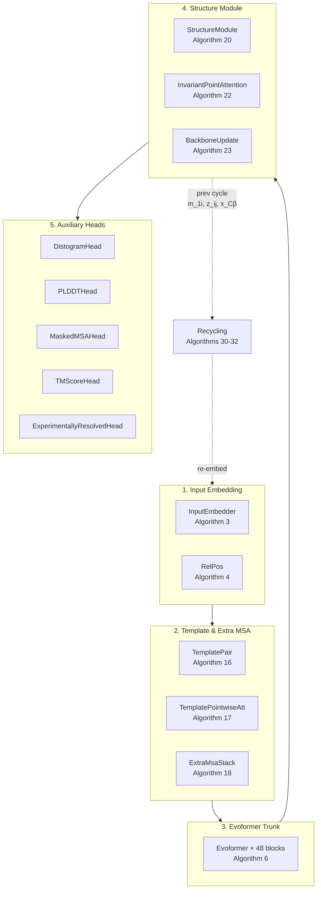

---
slug:1-overview
blog_type:normal
---


**minAlphaFold2** 是 AlphaFold2 的一个极简、教学用途的 PyTorch 复现版本 —— 模型架构仅用约 3,000 行纯 PyTorch 代码实现，整个包约 9,000 行。每个模块与 DeepMind 补充论文中的编号算法一一对应（1:1 映射）。受 Andrej Karpathy 的 minGPT 启发，本仓库牺牲了生产就绪性，只为换取一个特质：你可以在一个下午坐下来，从头到尾读完 AlphaFold2。


来源：[README.md](/README.md#L1-L18)

## minAlphaFold2 是什么（又不是什么）

本项目之所以存在，是因为阅读 AlphaFold2 通常意味着要在 62 页的补充材料、为 Google 规模推理优化的 JAX 代码库，以及添加了自身脚手架的生产级 PyTorch 移植版之间来回跳转。minAlphaFold2 消除了这一瓶颈。它**不是**套在 DeepMind 权重外的推理框架，**不是**速度基准测试，也**不是** AF2 multimer / AF3 的实现。它是一个紧凑、可训练、每个算法单文件的参考实现，你可以派生、调整并在单块 GPU 上端到端地运行。

| 属性 | minAlphaFold2 | DeepMind AF2 (JAX) | OpenFold (PyTorch) |
|---|---|---|---|
| **目的** | 教学与研究 | 生产推理 | 生产推理 |
| **框架** | 纯 PyTorch | JAX / Haiku | PyTorch + 自定义算子 |
| **依赖** | `torch`, `numpy` | JAX, Haiku, dm-tree | torch, einops, 自定义 CUDA |
| **补充材料映射** | 1:1，显式 | 隐式 | 部分 |
| **单 GPU 可训练** | ✅ (梯度累加 + 梯度检查点) | ❌ (TPU Pod) | ⚠️ (多 GPU) |
| **代码行数 (核心)** | ~3,000 | ~15,000+ | ~20,000+ |

来源：[README.md](/README.md#L12-L17), [pyproject.toml](/pyproject.toml#L31-L36)

## 架构一览

完整的 AlphaFold2 流经五个阶段：**输入嵌入 → 额外 MSA 堆叠 → Evoformer 主干 → 结构模块 → 辅助头部**，包裹在一个循环回收环路中，该环路将上一轮的预测重新作为输入。每个阶段都是一个独立的 `nn.Module`，以其实现的补充材料章节命名。



来源：[minalphafold/model.py](/minalphafold/model.py#L15-L51), [minalphafold/model.py](/minalphafold/model.py#L231-L399)

## 核心流水线：表示与数据流

两种表示贯穿整个 Evoformer 主干，并构成结构模块的接口：

- **MSA 表示** `m_si ∈ ℝ^(N_seq × N_res × c_m)` —— 编码同源序列和查询序列本身的进化信息。每一行是一条 MSA 序列；列是残基位置。
- **对表示** `z_ij ∈ ℝ^(N_res × N_res × c_z)` —— 编码残基对关系。通过外积均值、三角操作和模板特征进行更新。模型不强制对称性；它自行学习此性质。

在 Evoformer 之后，第一行 MSA（`m_1i`）被投影为**单一表示** `s_i ∈ ℝ^(N_res × c_s)`，该表示驱动结构模块和所有辅助头部。

| 阶段 | 输入 | 输出 | 算法 | 源文件 |
|---|---|---|---|---|
| 输入嵌入 | `target_feat`, `msa_feat`, `residue_index` | `m_si`, `z_ij` | 3, 4 | `embedders.py` |
| 模板对 | `template_pair_feat` | `z_ij` 更新 | 16, 17 | `embedders.py` |
| 额外 MSA 堆叠 | `extra_msa_feat`, `z_ij` | `z_ij` 更新 | 18, 19 | `embedders.py` |
| Evoformer | `m_si`, `z_ij` | `m_si`, `z_ij` | 6–15 | `evoformer.py`, `embedders.py` |
| 结构模块 | `s_i`, `z_ij` | atom14 坐标，帧，扭转角 | 20–25 | `structure_module.py` |
| 辅助头部 | `s_i`, `z_ij`, `m_si` | distogram, pLDDT, masked MSA, PAE | 29 + §1.9 | `heads.py` |

来源：[minalphafold/embedders.py](/minalphafold/embedders.py#L1-L23), [minalphafold/evoformer.py](/minalphafold/evoformer.py#L1-L50), [minalphafold/structure_module.py](/minalphafold/structure_module.py#L1-L20), [minalphafold/heads.py](/minalphafold/heads.py#L1-L16)

## 项目结构

```
minAlphaFold2/
├── minalphafold/              # 核心包 (~9,000 行代码)
│   ├── model.py               # AlphaFold2 顶层模块 (算法 2)
│   ├── embedders.py           # 输入嵌入 + 所有共享子块 (算法 3-5, 8-19)
│   ├── evoformer.py           # Evoformer 块 + MSA 行注意力 (算法 6-7)
│   ├── structure_module.py    # 结构模块，IPA，骨架更新 (算法 20-25)
│   ├── geometry.py            # 真实刚体帧，扭转角，伪-β (算法 21)
│   ├── losses.py              # 所有损失项 + FAPE + 冲突损失 (算法 26-28, §1.9)
│   ├── heads.py               # 辅助预测头部 (算法 29, §1.9&amp;#57344;9)
│   ├── data.py                # 数据集，特征构建器，裁剪，MSA 处理
│   ├── model_config.py        # 所有超参数的类型化 dataclass 架构
│   ├── initialization.py      # 线性层初始化器 (补充材料 §1.11.4)
│   ├── trainer.py             # 训练循环，学习率调度，梯度累加
│   ├── a3m.py                 # MSA/a3m 文件解析 + 氨基酸字母表
│   ├── mmcif.py               # mmCIF 结构解析器
│   ├── pdbio.py               # PDB 写入器 (B因子 → pLDDT 映射)
│   ├── residue_constants.py   # 原子命名，刚体组帧，立体化学属性
│   └── utils.py               # 共享辅助工具：距离区间，dropout，独热区间分箱
├── configs/                   # 模型配置 + 训练协议 (TOML)
│   ├── alphafold2.toml        # 完整论文规格架构
│   ├── medium.toml            # 用于本地实验的中等规模配置
│   ├── tiny.toml              # 缩减至 CPU 的测试配置
│   └── training_alphafold2.toml  # 两阶段训练超参数
├── scripts/                   # 独立运行脚本 (过拟合，训练，预处理，弛豫)
├── tests/                     # pytest 测试套件 (形状，几何，损失，数据流水线)
├── data/                      # 处理后的特征/标签 (不在仓库中)
└── assets/                    # 图表和演示视频
```

来源：[README.md](/README.md#L19-L26), [pyproject.toml](/pyproject.toml#L59-L63)

## 设计原则

**纯 PyTorch。** 每一层都由 `nn.Linear`、`nn.LayerNorm`、`torch.einsum` 和标准激活函数构建。没有 `einops`，没有自定义 CUDA 内核，没有外部 ML 库。唯一的运行时依赖是 `torch` 和 `numpy`。这意味着你无需交叉参考第二种框架的约定即可阅读任何文件。

**与补充材料 1:1 映射。** 每个模块=对应一个编号算法或章节；该映射是权威索引。每个文件以其实现的补充材料章节命名，每个不寻常的设计选择都引用了论文的具体行。当你在文档字符串中看到 `Algorithm 7` 时，你可以直接翻到补充材料的对应算法，对照阅读。

**零初始化残差起始。** 每个残差块的最终输出投影均进行零初始化，因此每一层最初都是恒等操作（补充材料 §1.11.4）。门控线性层)使用零权重 + 偏置 1，因此 `sigmoid(1) ≈ 0.73` —— 门控初始阶段大部分为直通。这意味着在第 0 步，只有 FAPE 将梯度信号传入主干；所有辅助头部输出均匀分布。

**单 GPU 可训练。** 梯度累加弥补了 128 核 TPU 的算力差距。梯度检查点（§1.11.8）使得在全链裁剪尺寸下也能容纳 48 块 Evoformer。`tiny` 配置可在 CPU 上几秒钟内运行形状测试。

来源：[README.md](/README.md#L21-L26), [minalphafold/initialization.py](/minalphafold/initialization.py#L1-L24), [minalphafold/model.py](/minalphafold/model.py#L106-L153)

## 配置方案

三种模型配置方案可让你用规模换取速度。`alphafold2.toml` 中的每个值均符合论文规格，并附带内联补充材料引用；`tiny` 和 `medium` 缩减了通道维度、头数和块数，以便进行本地迭代。

| 参数 | `tiny` | `medium` | `alphafold2` (论文) |
|---|---|---|---|
| **c_m** (MSA 通道数) | 32 | 128 | 256 |
| **c_z** (对通道数) | 16 | 64 | 128 |
| **c_s** (单一通道数) | 32 | 192 | 384 |
| **Evoformer 块数** | 1 | 4 | 48 |
| **额外 MSA 块数** | 1 | 2 | 4 |
| **SM 层数** | 2 | 4 | 8 |
| **IPA 头数** | 4 | 8 | 12 |
| **适用场景** | 测试 / CPU 冒烟测试 | 本地过拟合 | 完整复现 |

来源：[configs/alphafold2.toml](/configs/alphafold2.toml#L1-L80), [configs/tiny.toml](/configs/tiny.toml#L1-L78), [configs/medium.toml](/configs/medium.toml#L1-L78)

## 训练协议

AlphaFold2 采用**两阶段训练协议**（补充材料表 4）：初始训练阶段从随机初始化开始，训练约 10M 样本，并禁用结构冲突损失；随后是微调阶段，从初始检查点加载，学习率减半，增大裁剪尺寸，并启用冲突损失以修正肽键几何和空间位阻。

| | **阶段 1：初始训练** | **阶段 2：微调** |
|---|---|---|
| **裁剪尺寸** | 256 残基 | 384 残基 |
| **MSA 深度** | 128 | 512 |
| **额外 MSA 深度** | 1,024 | 5,120 |
| **学习率** | 1e-3 (含 128k 样本预热) | 5e-4 (无预热) |
| **冲突损失** | 关闭 | 开启 (权重 = 1.0) |
| **总样本数** | ~10M | ~1.5M |
| **优化器** | Adam (β₁=0.9, β₂=0.999, ε=1e-6) | 同上 |

来源：[configs/training_alphafold2.toml](/configs/training_alphafold2.toml#L1-L54), [minalphafold/trainer.py](/minalphafold/trainer.py#L1-L26)

## 补充材料算法映射

所实现的每个算法的权威索引，包含其位置与功能。这是 DeepMind 补充材料与代码库之间的权威映射。

| 算法 | 描述 | 位置 |
|---|---|---|
| 1 | MSA 块删除 | `data.py: block_delete_msa` |
| 2 | 推理 (顶层) | `model.py: AlphaFold2.forward` |
| 3 | 输入嵌入器 | `embedders.py: InputEmbedder` |
| 4 | 相对位置编码 | `embedders.py: RelPos` |
| 6 | Evoformer 堆叠 | `evoformer.py: Evoformer` |
| 7 | 带对偏置的 MSA 行注意力 | `evoformer.py: MSARowAttentionWithPairBias` |
| 8–9 | MSA 列注意力 / 转换 | `embedders.py` |
| 10 | 外积均值 | `embedders.py: OuterProductMean` |
| 11–12 | 三角乘法 (出/入) | `embedders.py` |
| 13–14 | 三角注意力 (起始/终止) | `embedders.py` |
| 15 | 对转换 | `embedders.py: PairTransition` |
| 16–17 | 模板对 / 逐点注意力 | `embedders.py` |
| 18–19 | 额外 MSA 堆叠 / 全局列注意力 | `embedders.py` |
| 20 | 结构模块 | `structure_module.py: StructureModule` |
| 22 | 不变点注意力 | `structure_module.py: InvariantPointAttention` |
| 26 | 重命名对称真实原子 | `losses.py: select_best_atom14_ground_truth` |
| 27–28 | 扭转角损失 / FAPE | `losses.py` |
| 29 | pLDDT 头部 | `heads.py: PLDDTHead` |
| 30–32 | 循环回收 (推理 + 训练 + 嵌入器) | `model.py: AlphaFold2.forward` |

<CgxTip>文档字符串或内联注释中的每个算法编号均指代 AlphaFold2 补充信息（"Supplementary Methods" PDF）中的编号算法表。打开补充材料至该算法编号，即可将伪代码与 Python 实现对照阅读。</CgxTip>

来源：[README.md](/README.md#L162-L198), [minalphafold/model.py](/minalphafold/model.py#L15-L51)

## 接下来去哪

文档的组织遵循模型自身的数据流。从实际设置开始，然后沿着流水线从输入追踪到输出：

1. **[快速开始](2-quick-start)** —— 运行本仓库：安装、对单个 PDB 过拟合、在 5 分钟内确认端到端正确性。
2. **[训练阶梯](3-training-ladder)** —— 从单蛋白过拟合到完整 AF2 复现的三个阶梯，每个都是前者的严格超集。
3. **[架构概览](4-architecture-overview)** —— 完整的流水线图，包含张量形状、模块边界与循环回收环路的解释。
4. **[输入嵌入器与相对位置编码](5-input-embedder-and-relpos)** —— `target_feat`、`msa_feat` 和 `residue_index` 如何转换为初始的 `m_si` 和 `z_ij`。
5. **[Evoformer 堆叠](6-evoformer-stack)** —— 48 块主干：MSA 注意力、三角更新、外积均值，以及 `m_si` 和 `z_ij` 如何协同演化。
6. **[结构模块与 IPA](7-structure-module-and-ipa)** —— `s_i` 和 `z_ij` 如何通过迭代 IPA 和骨架更新转化为 3D 原子坐标。

<CgxTip>如果你是 AlphaFold2 新手，请从[快速开始](2-quick-start)运行模型开始，然后阅读[架构概览](4-architecture-overview)了解全局图景，再深入各个模块。上面的补充材料算法映射是你在整个文档中的交叉参考关键。</CgxTip>