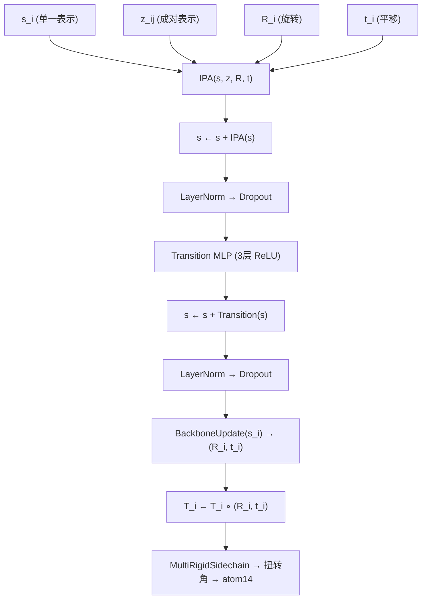

---
slug:10-invariant-point-attention
blog_type:normal
---


不变量点注意力（Invariant Point Attention, IPA）是 AlphaFold2 结构模块核心的几何感知注意力机制。与纯粹基于标量嵌入运算的标准多头注意力不同，IPA 融合了三股信息流——标量查询、成对偏置以及**转换至每个残基局部刚性帧的 3-D 点特征**——形成单一的注意力分布，且该分布**可证明对整个蛋白质的全局刚性运动保持不变**。这种不变性并非事后归一化的结果；它是结构性的，源于这样一个事实：旋转或平移每个帧会通过相同的刚性运动同时旋转/平移每个查询点和关键点，从而保持它们的相对距离不变。minAlphaFold2 的实现严格遵循补充材料中的算法 22，并完全位于 [structure_module.py](/minalphafold/structure_module.py) 中。

来源：[structure_module.py](/minalphafold/structure_module.py#L1-L20)，[structure_module.py](/minalphafold/structure_module.py#L316-L337)

## 三流注意力分数

IPA 的核心洞见在于：没有任何单一的信息通道足以进行结构预测。标量通道捕获序列层面的模式；成对通道捕获 Evoformer 学习到的残基间关系；点通道捕获**几何上下文**——即残基在 3-D 空间中如何相对定位。对于头 *h*，残基 *i* 和 *j* 之间的注意力 logit 为：

$$\text{logit}_{ij}^h = \frac{1}{\sqrt{3}} \left( \frac{q_i^h \cdot k_j^h}{\sqrt{d_h}} + b_{ij}^h - \frac{\gamma_h}{2} \sum_p \|T_i(q_{ip}^h) - T_j(k_{jp}^h)\|^2 \right)$$

其中 *T_i* 和 *T_j* 分别是残基 *i* 和 *j* 的当前刚性帧（旋转 + 平移），*γ_h* 是可学习的逐头权重（通过 softplus 参数化以保持正值），*d_h* 是头维度。**1/√3** 因子是论文中针对三个分数贡献的归一化（算法 22 第 7 行）。点项的负号使其成为**高斯核**——邻近残基具有更强的注意力，而可学习的 *γ_h* 控制每个头的空间敏感度。

来源：[structure_module.py](/minalphafold/structure_module.py#L316-L337)，[structure_module.py](/minalphafold/structure_module.py#L487-L499)

## 点投影与帧变换

从标量表示到 3-D 几何的桥梁是**点投影**流程。对于每个残基 *i*，单一表示 *s_i* 通过学习到的线性映射进行投影，生成查询点 **q** ∈ ℝ^(N_heads × N_query_pts × 3)、关键点 **k** ∈ ℝ^(N_heads × N_query_pts × 3) 和值点 **v** ∈ ℝ^(N_heads × N_value_pts × 3)。`_project_points` 辅助函数将扁平的线性输出重塑为独立的 x/y/z 通道，并将它们堆叠成 `(..., heads, points, 3)` 张量。随后，这些局部帧点通过每个残基的当前刚性帧被**提升至全局坐标**：

```python
query_points_global = einsum("biop,bihqp->bihqo", rotations, q_points) + translation
key_points_global   = einsum("biop,bihqp->bihqo", rotations, k_points) + translation
value_points_global = einsum("biop,bihqp->bihqo", rotations, v_points) + translation
```

这是实现不变性的关键步骤：全局刚性运动 *(R_g, t_g)* 将每个帧变换为 *T_i → T_i' = (R_g, t_g) ∘ T_i*，进而将每个全局点变换为 *T_i'(p) = R_g · T_i(p) + t_g*。平方距离 *‖T_i'(q_i) − T_j'(k_j)‖² = ‖R_g(T_i(q_i) − T_j(k_j))‖² = ‖T_i(q_i) − T_j(k_j)‖²* 保持不变，因为旋转保持范数不变。标准的 AF2 单体配置每个头使用 `n_query_points=4` 和 `n_value_points=8`，分别产生 12 和 24 个 3-D 点供每个头进行推理。

来源：[structure_module.py](/minalphafold/structure_module.py#L383-L398)，[structure_module.py](/minalphafold/structure_module.py#L469-L483)

## 分数组装与头权重缩放

三个分数流在 `_forward_output_features` 中进行组装。标量注意力 logits 计算为标准的 Q·K^T 乘积，然后按 **1/√(3 · d_h)** 缩放（即标准注意力的逐头 √d_h 归一化，再除以跨流的 √3 因子）。成对偏置由成对表示 *z_ij* 通过 `linear_bias` 投影而来（输出维度 = num_heads），并以 **1/√3** 的权重相加。点注意力计算全局坐标下查询点与关键点之间的欧氏距离平方，应用经Fsoftplus 参数化并按 **√(17 / (3 · N_query_pts · 9/2))** 缩放的头权重（这是补充材料中对点贡献的归一化——9/2 因子考虑了三个空间维度乘以 3-D 高斯分布的期望卡方方差），并以 **−0.5** 的因子对查询点求和（从而构成完整的高斯核）。完整计算如下：

```python
point_attention = query_points_global[:, :, None, :, :, :] - key_points_global[:, None, :, :, :, :]
point_attention = torch.sum(point_attention ** 2, dim=-1)           # sum over xyz
head_weights = softplus(self.head_weights) * sqrt(1 / (3 * N_q * 9/2))
point_attention = torch.sum(point_attention * head_weights, dim=-1) * (-0.5)
attention_logits += point_attention.permute(0, 3, 1, 2)
```

来源：[structure_module.py](/minalphafold/structure_module.py#L487-L505)，[structure_module.py](/minalphafold/structure_module.py#L494-L499)

## 多流值聚合

经过 softmax 后，IPA 并非简单地对标量值进行加权。它并行聚合**三个值流**，反映了与分数相同的三个通道哲学：

| 流 | 来源 | 聚合方式 | 后处理 |
|--------|--------|-------------|-----------------|
| **标量** | `linear_kv` → V | α · V（标准加权和） | 重塑为 `(batch, N_res, heads·head_dim)` |
| **点** | `linear_kv_points` → 全局帧中的 V_pts | α · V_pts_global | 变换回局部帧：R_i^T(α·V_global − t_i)，然后拆分为 x/y/z 通道**并**计算逐点范数 |
| **成对** | 成对表示 z_ij | α · z_ij（注意力加权的成对混合） | 重塑为 `(batch, N_res, heads·c_z)` |

点流向局部帧的反向变换使得**输出**具备等变性（注意力权重是不变的；点值随帧移动）。拆分为独立的 x、y、z 通道加上范数通道，为**每个头的每个值点提供了 4 个特征**，总计 `heads × n_value_points × 4` 个点衍生特征。这是一个刻意的设计选择：拆分分量允许下游的 `linear_output` 为每个空间方向和幅度学习不同的权重，而不是将 3-D 向量视为不透明的整体。

来源：[structure_module.py](/minalphafold/structure_module.py#L400-L452)，[structure_module.py](/minalphafold/structure_module.py#L412-L452)

## 输出特征拼接与投影

三个聚合流被拼接为每个残基的单个特征向量：

```
output_features = [output_scalar, point_x, point_y, point_z, point_norms, output_pair]
```

根据论文的标准维度（c_s=384, heads=12, head_dim=16, n_value_pts=8, c_z=128），此拼接的总维度为 **384 + 12×8×4 + 12×128 = 384 + 384 + 1536 = 2304**，随后由 `linear_output` 投影回 c_s=384。此输出投影被**零初始化**（`init="final"`），这意味着在训练初期，整个 IPA 块相当于恒等映射——在网络学习到有意义的几何更新之前，结构模块的单一表示不会因 IPA 而改变。这是补充材料中 **零初始化** 协议（§1.11.4）的基石：每个残差分支初始时均为空操作，防止未经训练的几何噪声在训练早期破坏 Evoformer 的表示。

来源：[structure_module.py](/minalphafold/structure_module.py#L367-L379)，[structure_module.py](/minalphafold/structure_module.py#L442-L452)

## 可学习的头权重与 Softplus 参数化

`head_weights` 参数是一个长度为 `num_heads` 的向量，初始化为**零**，并在使用前通过 `softplus` 变换：`γ_h = softplus(w_h)`。Softplus(x) = log(1 + e^x) 是 ReLU 的平滑且严格为正的近似，因此每个头以 `γ_h = softplus(0) = log(2) ≈ 0.693` 起步。这确保了点注意力贡献非负（它是一个宽度由 1/γ_h 控制的高斯核），并在初始化时表现良好。逐头参数化允许网络学习到：某些头应具备高度的空间选择性（大 γ_h，窄高斯分布），而其他头则应广泛地施加注意力（小 γ_h），从而提供局部与全局几何推理的学习性混合。

来源：[structure_module.py](/minalphafold/structure_module.py#L381-L381)，[structure_module.py](/minalphafold/structure_module.py#L496-L497)

## 序列掩码与填充安全性

填充残基（来自批次中变长蛋白质序列）既不应发起查询，也不应被查询。该实现在 softmax 之前对注意力 logits 应用**乘性掩码**：对于每个 (i, j) 对，如果任一残基被掩码，其 logit 将接收一个较大的负偏移量（−10⁵），使其在 softmax 后的注意力权重接近于零。在输出投影之后，被掩码的查询位置将被显式置零：`output = output * seq_mask[:, :, None]`。这种两阶段掩码（logits + 输出）确保了不会有信息从填充位置泄漏或泄漏至填充位置，且被掩码的位置在输出中严格产生零——这对于变长批次中正确的梯度累积至关重要。

来源：[structure_module.py](/minalphafold/structure_module.py#L501-L503)，[structure_module.py](/minalphafold/structure_module.py#L538-L539)

## 配置文件

IPA 的架构由四个超参数控制，它们在表达能力与计算量之间进行权衡：

| 参数 | AF2 配置 | Tiny 配置 | 描述 |
|-----------|-------------|--------------|-------------|
| `ipa_num_heads` | 12 | 4 | 注意力头数量 |
| `ipa_c` | 16 | 8 | 每个头的维度（标量 Q/K/V） |
| `ipa_n_query_points` | 4 | 4 | 86每个头的 3-D 查询/关键4关键点数 |
| `ipa_n_value_points` | 8 | 4 | 每个头的 3-D 值点数 |

AF2 配置与补充材料完全一致。Tiny 配置减少了头数和每头维度，以便在 CPU 上运行测试，同时保持 `n_query_points=4` 以保留几何机制。IPA 线性层的总参数量主要由 `linear_output`（将拼接后的输出维度投影回 c_s）和 `linear_kv_points`（投影至 3 × heads × (n_query + n_value) 个空间坐标）主导。

来源：[alphafold2.toml](/configs/alphafold2.toml#L68-L72)，[tiny.toml](/configs/tiny.toml#L67-L70)

## 结构模块内的架构上下文

IPA 并非孤立运行——它是结构模块循环（算法 20，第 6–9 行）每次迭代中应用于单一表示的三个操作之首：



IPA 消耗**四个**输入——单一表示、成对表示以及当前的刚性帧（旋转 + 平移）——这使其成为 AlphaFold2 中唯一以不断演进的 3-D 几何为条件的注意力机制。成对表示 *z_ij* 既作为注意力偏置（投影为逐头标量）输入，又作为成对值流（经注意力加权并混合回输出）输入。这形成了一个反馈循环：更优的帧 → 更具信息量的 IPA 分数 → 更优的单一表示 → 更优的骨架更新 → 更优的帧。

来源：[structure_module.py](/minalphafold/structure_module.py#L236-L253)，[structure_module.py](/minalphafold/structure_module.py#L117-L141)

## 不变性证明草图

关于 IPA 对输入帧的全局刚性运动保持不变的主张，可通过检查全局变换 *(R_g, t_g)* 下每个分数分量来证明：

1. **标量分数**：Q·K 仅依赖于单一表示 *s_i*，与帧无关。✓ 不变。
2. **成对偏置**：Linear(z_ij) 仅依赖于成对表示，与帧无关。✓ 不变。
3. **点分数**：‖T_i'(q_i) − T_j'(k_j)‖² = ‖R_g(R_i q_i + t_i + t_g) − R_g(R_j k_j + t_j + t_g)‖² = ‖R_g(R_i q_i + t_i − R_j k_j − t_j)‖² = ‖R_i q_i + t_i − R_j k_j − t_j‖² = ‖T_i(q_i) − T_j(k_j)‖²。✓ 不变（旋转保持范数不变）。

由于注意力权重（logits 的 softmax）是不变的，且输出点值被变换**回**每个残基的局部帧，因此完整的 IPA 输出随帧协变——这正是馈入帧更新的模块所应具备的行为。

来源：[structure_module.py](/minalphafold/structure_module.py#L316-L337)，[structure_module.py](/minalphafold/structure_module.py#L481-L499)

<CgxTip>`linear_output` 的零初始化是 IPA 中最重要的初始化选择。若没有它，来自未经训练的点投影的随机几何噪声将在任何学习发生之前，于第一次前向传播中立即破坏单一表示。如果你正在修改 IPA（例如添加额外的点流），请确保将它们混合回 *s_i* 的输出投影也进行零初始化。</CgxTip>

<CgxTip>`head_weights` 的 `softplus` 参数化保证了非负性，但请注意所有头均以相同的 γ ≈ 0.693 起步。如果你观察到某些头在整个训练过程中始终接近该值，而其他头增长到很大，这表明网络已学会不均匀地分配空间选择性——这是正常的，反映了局部与全局几何注意力之间的一种学习性分工。</CgxTip>

## 下一步

- 了解 IPA 的帧输出如何馈入 BackboneUpdate 和侧链扭转角预测：[结构模块与 IPA](7-structure-module-and-ipa)
- 理解刚性帧约定及 `BACKBONE_FRAME_ADAPTATION` 校正：[刚性帧与扭转角](9-rigid-frames-and-torsions)
- 了解 FAPE 如何监督 IPA 迭代精化的逐层帧：[损失函数与 FAPE](11-loss-functions-and-fape)
- 理解使 IPA 的输出投影在启动时保持安全的零初始化协议：[零初始化与参数 EMA](13-zero-init-and-parameter-ema)