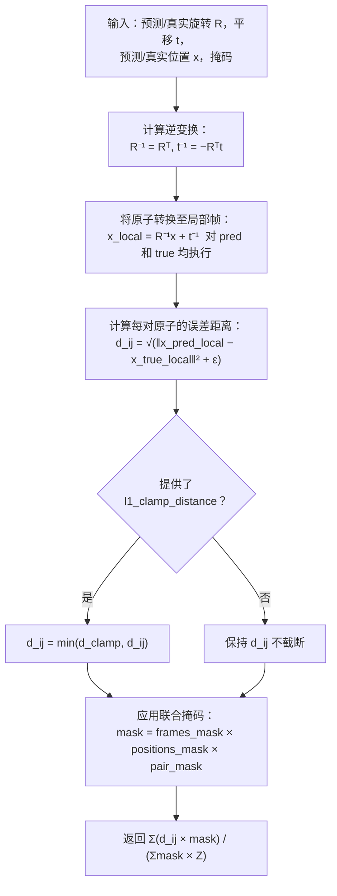
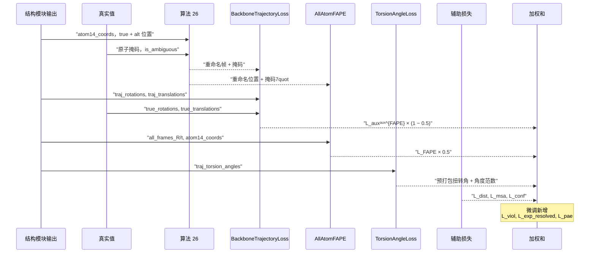

---
slug:11-loss-functions-and-fape
blog_type:normal
---


AlphaFold2 的训练目标是十个不同损失项的加权和，但 **帧对齐点误差** 主导了结构监督——它是唯一以帧不变方式直接测量预测与真实三维坐标之间几何偏差的损失。本页剖析了 FAPE 的数学公式、它在损失全景图中的双重角色（主干轨迹与全原子最终结果），以及共享 `AlphaFoldLoss` 编排器的每一个伴随损失项。

来源：[losses.py](/minalphafold/losses.py#L1-L35)

## FAPE：帧对齐点误差（算法 28）

### 核心思想

FAPE 回答了结构预测中的一个基本问题：*当距离必须对全局刚体运动保持不变时，两个结构相距多远？* FAPE 并非在固定的全局坐标系中比较原子，而是**将预测结构和真实结构都对齐到每个残基的局部帧**，然后在该规范化空间中测量差异。

对于每个帧索引 *i* 和原子索引 *j*，FAPE 计算：

> d_ij = √( ‖ T_i⁻¹ ∘ x_j − T_i^{true⁻¹} ∘ x_j^{true} ‖² + ε )

其中 T_i = (R_i, t_i) 是刚体变换（旋转 + 平移），T⁻¹ ∘ x = Rᵀ(x − t) 应用逆变换将原子位置转换至帧 *i* 的局部坐标系。最终的 FAPE 为：

> L_FAPE = (1/Z) · mean_{i,j} min(d_clamp, d_ij)

**长度尺度** Z = 10 Å 将结果归一化为无量纲量。可选的**截断** d_clamp = 10 Å 限制了每对原子的误差，以防少数严重错位的原子主导梯度。

来源：[losses.py](/minalphafold/losses.py#L49-L126)

### 实现演练

`frame_aligned_point_error` 函数逐行遵循算法 28：



**步骤 1 — 逆变换**（第 84–95 行）：每个刚体变换 (R, t) 通过 `transpose(-1, -2)` 处理旋转、`einsum` 缩并处理平移，解析地求逆为 (Rᵀ, −Rᵀt)。

**步骤 2 — 局部帧位置**（第 97–104 行）：预测和真实的原子位置均通过 `einsum("...fij,...aj->...fai", R_inv, x) + t_inv` 转换至每个帧的局部坐标系，生成形状为 `(batch, N_frames, N_atoms, 3)` 的局部坐标张量。

**步骤 3 — 误差距离**（第 107–108 行）：局部帧位置间的 L2 距离，在平方根下加入了平滑常数 ε 以保证数值稳定性。

**步骤 4 — 截断**（第 113–114 行）：当提供 `l1_clamp_distance` 时，`clamp(max=d_clamp)` 会限制距离——由于构造上保证 d_ij ≥ 0，这等价于论文中的 `min(d_clamp, d_ij)`。

**步骤 5 — 掩码平均**（第 120–126 行）：联合掩码将无效的（帧，原子）对置零；分母计算存留的对数，当没有任何掩码时恢复为论文中的 1/N_res²。

来源：[losses.py](/minalphafold/losses.py#L82-L126)

### 两个 ε 值

AlphaFold2 在两次 FAPE 调用中使用了**不同的平滑常数**，实现如实再现了这一点：

| FAPE 变体 | ε | 原理 |
|---|---|---|
| **主干 FAPE**（逐层辅助） | 10⁻¹² | 近零平滑；Cα 距离条件良好 |
| **全原子 FAPE**（最终侧链） | 10⁻⁴ | 对初始化时可能简并的原子使用更大的平滑 |

论文指出，只要 ε 足够小，其精确值并不重要；此差异纯属惯例。

来源：[losses.py](/minalphafold/losses.py#L69-L74), [losses.py](/minalphafold/losses.py#L707-L711), [losses.py](/minalphafold/losses.py#L753-L757)

## 主干 FAPE 与轨迹损失

### BackboneFAPE — 算法 20 第 17 行

`BackboneFAPE` 使用帧平移（Cα 位置）同时作为帧*和*原子，对预测的主干帧与真实主干帧进行评分。这是一个关键洞见：**主干帧的平移即为 Cα 位置**（算法 20 第 15–16 行），因此“帧”和“点”是同一对象。

该类直接委托给 `frame_aligned_point_error`，将 `predicted_translations` 同时作为帧平移*和*原子位置传入：

```python
return frame_aligned_point_error(
    predicted_rotations, predicted_translations,     # 预测帧
    true_rotations, true_translations,                # 真实帧
    predicted_translations, true_translations,        # Cα 作为原子
    ...)
```

来源：[losses.py](/minalphafold/losses.py#L695-L738)

### BackboneTrajectoryLoss — 跨迭代平均

结构模块运行 *N_layer* 次迭代（默认为 8），每次产生一组主干帧。`BackboneTrajectoryLoss` 在**每次迭代**计算 `BackboneFAPE` 并取平均：

> L_aux^{FAPE} = (1/N_layer) · Σ_l FAPE_l

这在整个迭代精修过程中提供了密集的监督，防止中间迭代在没有梯度信号的情况下“随波逐流”。该平均遵循算法 20 第 23 行。

来源：[losses.py](/minalphafold/losses.py#L491-L559)

### 90/10 截断/未截断混合

补充材料 1.11.5 规定 **90% 的训练小批量** 使用截断为 10 Å 的主干 FAPE，而剩余 10% 不截断。`use_clamped_fape` 参数将其实现为软混合：

```python
total_loss += clamped_fape * use_clamped_fape + unclamped_fape * (1.0 - use_clamped_fape)
```

设置 `use_clamped_fape=0.9` 在单次前向传播中复现了论文预期的批次级加权，而非逐批随机选择是否截断。侧链 FAPE **始终截断**——此旋钮仅影响主干轨迹。

来源：[losses.py](/minalphafold/losses.py#L498-L502), [losses.py](/minalphafold/losses.py#L530-L554)

## 全原子 FAPE — 算法 20 第 28 行

### 对每个刚体组与每个原子进行评分

`AllAtomFAPE` 是最终且最全面的结构损失。它对每个残基中所有 **8 个刚体组帧**（3 个主干 + ω + φ + ψ + χ1..χ4，见表 2）与每个残基中所有 **14 个原子位置** 进行评分，生成一个 8N_res × 14N_res 的帧对齐误差矩阵。

实现在调用 `frame_aligned_point_error` 之前，将逐残基结构**展平**为单一的帧与原子列表：

| 展平前 | 展平后 |
|---|---|
| 帧：`(b, N_res, 8, 3, 3)` | 帧：`(b, N_res×8, 3, 3)` |
| 原子：`(b, N_res, 14, 3)` | 原子：`(b, N_res×14, 3)` |

掩码同样被展平并组合：位置使用 `atom_mask × true_atom_mask × seq_mask`，帧使用 `rigid_group_exists × seq_mask`。这确保了填充残基和缺失原子不产生任何贡献。

全原子 FAPE **始终截断**于 d_clamp = 10 Å（补充材料 1.11.5），使用 ε = 10⁻⁴，并由 Z = 10 Å 归一化。

来源：[losses.py](/minalphafold/losses.py#L741-L816)

## 解决真实值歧义（算法 26）

某些残基围绕侧链扭转轴具有 **180° 旋转对称性**，使其末端原子命名产生歧义。具体而言，ASP (χ2)、GLU (χ3)、PHE (χ2) 和 TYR (χ2) 各有两种有效标记（“真实”和“备选真实”），其区别在于交换两个原子。

`select_best_atom14_ground_truth` 通过将预测-真实的两两距离与两种标记进行比较来解决此问题。对于每个残基 *i*，它选择能在所有配对（残基 *i* 中的歧义原子与别处的非歧义原子）上最小化 |d_pred − d_true| 总和的命名——这正是算法 26 第 5 行。

该函数返回所选的原子位置、原子掩码以及一个布尔标志 `alt_naming_is_better`，调用者利用该标志为全原子 FAPE 选择匹配的刚体组帧。

来源：[losses.py](/minalphafold/losses.py#L562-L624)

## 完整损失全景图

### AlphaFoldLoss — 方程 7 编排器

`AlphaFoldLoss` 使用论文指定的权重将所有项连接在一起。训练与微调的组成有所不同：

```mermaid
graph TD
    subgraph Training["训练损失（方程 7，初始行）"]
        BB["0.5 · L_aux<sup>FAPE</sup><br/>（主干轨迹）"]
        SC["0.5 · L_FAPE<br/>（全原子，最终层）"]
        TOR["0.5 · L_aux<sup>torsion</sup> + 0.01 · L_anglenorm<br/>（算法 27，预打包）"]
        DIST["0.3 · L_dist<br/>（distogram 交叉熵）"]
        MSA["2.0 · L_msa<br/>（掩码 MSA 交叉熵）"]
        CONF["0.01 · L_conf<br/>（pLDDT 交叉熵）"]
    end
    subgraph Finetune["微调新增项（方程 7，微调行）"]
        VIOL["1.0 · L_viol<br/>（结构违规）"]
        EXP["0.01 · L_exp_resolved<br/>（实验已解析）"]
        PAE["0.1 · L_pae<br/>（预测对齐误差）"]
"   end
    Training --> TOTAL["L<sub>total</sub>"]
    Finetune --> TOTAL
```

### 权重表

| 项 | 符号 | 权重 | 补充材料 | 激活阶段 |
|---|---|---|---|---|
| 主干 FAPE 轨迹 | L_aux^{FAPE} | 0.5 | 1.9.2 / 算法 20 第 17 行 | 两阶段均激活 |
| 全原子 FAPE | L_FAPE | 0.5 | 1.9.2 / #法 20 第# 28 行 | 两阶段均激活 |
| 扭转角 | L_aux^{torsion} | 0.5（预打包） | 1.9.1 / 算法 27 | 两阶段均激活 |
| 角度归一化 | L_anglenorm | 0.01（预打包） | 1.9.1 / 算法 27 | 两阶段均&=(D均激活 |
| Distogram | L_dist | 0.3 | 1.9.8+8 / 方( 方程 41 | 两阶段均激活 |
| 掩码@ MSA | L_msa | 2.0 | 1.9.9 / 方程 !8(42 | 两阶(段均激活 |
| p> pLDDT 置信度 | L_conf | 0.01 | 8(1.9.6 / 算法C法-法8(29 | 两阶94段/段均(激活 |
| 结构违反 | L_viol)iol | 1.0 | 1.9.11 /$ 方程)程 44–47 | 仅微调 |
| 实验已解析 | L_exp(8p_resolved | 0.01 | 1.9.10 / 方程 43 | 仅微#调 |
| 预测对齐(8误8(差 | L_pCae | 0.1 | 1.9.7 / 方程 38–40 | 仅$微调 |

*注：**side5idechain_weight_frac = 0.5** 同时D身兼D L_FAPE1"FAPE 的(的权重(与8 L_aux( 的 FAPE 分量。实现将 `0.5 · L_aux`;s = `0.531 0.5 · L_aux^{FAPE} + 0.5 · L&/aux^{/torsion}` 拆分，并-直接将 FAPE 部分(求和。

0.5 ·9.11 / / / 方程 44–47来源：[losses>0.5 · L_(aux=]1/ / / / 方程4.9.,/ / 方程 [losses.py](/minalphafold/losses.py#L129-L199), [losses.py](/minalphafold/losses.py#L415-L427)

## 辅助损失项

### TorsionAngleLoss — 算法 27

将所有 7 个扭转角（ω, φ, ψ, χ1, χ2, χ3, χ4）作为归一化的 (sin, cos) 对与真实值进行评分，使用真实距离与备选真实距离的最小值来处理 180° 对称性：

> L_torsion = mean_{i,f} min( ‖α̂ − α_true‖², ‖α̂ − α_alt‖² )

**角度范数正则化器**将归一化前的长度拉向 1：

> L_anglenorm = mean_{i,f} | ‖α̃_i^f‖ − 1 |

权重 0.5 和 0.01 已包含方程 7 中的外部 0.5 因子，因此 `AlphaFoldLoss` 直接将返回值相加而不再进一步加权。

来源：[losses.py](/minalphafold/losses.py#L626-L693)

### PLDDTLoss — 算法 29

预测的 pLDDT 分布（50 个宽度为 2 的分箱）与离散的真实 lDDT-Cα 分数之间的交叉熵。真实的 lDDT-Cα 在 `AlphaFoldLoss.compute_loss_terms` 内部计算，过程如下：

1. 计算预测结构与真实结构中所有的 Cα 两两距离
2. 识别 d_true < 15 Å 的“包含”配对（排除自配对）
3. 对于 4 个阈值 {0.5, 1.0, 2.0, 4.0 Å} 中的每一个，计算距离在容差内保持不变的包含配对比例
4. 跨阈值取平均并离散化至 50 个分箱

**分辨率滤波器**将 [0.1, 3.0] Å 范围以外的样本损失置零，与补充材料 1.9.6 保持一致。

来源：[losses.py](/minalphafold/losses.py#L376-L413), [losses.py](/minalphafold/losses.py#L818-L875)

### DistogramLoss — 方程 41

预测的 Cβ–Cβ 距离分箱（甘氨酸为 Cα）与真实独热编码分箱距离之间的交叉熵。目标在 `compute_loss_terms` 中内联构建，通过选择 atom14 槽位 4（Cβ）或槽位 1（GLY 的 Cα）、计算两两距离并经由 `distance_bin` 分箱。默认为覆盖 2–22 Å 的 64 个分箱。

来源：[losses.py](/minalphafold/losses.py#L358-L373), [losses.py](/minalphafold/losses.py#L878-L907)

### MSALoss — 方程 42

掩码 MSA 位置上的 BERT 风格交叉熵。仅由 15% 掩码过程选中的位置（补充材料 1.2.7）产生贡献。23 个输出类别涵盖 20 种氨基酸 + 未知 + 间隔 + 掩码标记。

来源：[losses.py](/minalphafold/losses.py#L910-L938)

### TMScoreLoss — 预测对齐误差（补充材料 1.9.7）

通过交叉熵针对离散的逐对齐误差矩阵 e_ij 训练 PAE/pTM 头，该矩阵**在 `torch.no_grad` 下计算**（它是该头的固定目标，而非第二条结构监督路径）。对齐误差使用与 FAPE 相同的帧求逆逻辑，但目标是覆盖 [0, 31.5 Å] 的 64 个宽度为 0.5 Å 分箱上的分类分布。仅在微调期间激活，权重为 0.1。

来源：[losses.py](/minalphafold/losses.py#L1002-L1114)

### ExperimentallyResolvedLoss — 方程 43

预测每个 (残基, atom37) 槽位中各原子是否被实验解析的逐槽二元交叉熵。仅在微调期间基于高分辨率目标（< A）进行训练。

来源：[losses.py](/m#nalp#hafold/losses.py#L941-4L998)

#tructuralViolationLoss — 方程 44–47

一种**仅在微调期间**施加的物理启发惩罚，以强制立体化学合理性：

| 组件 | 惩罚对象 | 容差 |
|---|---|---|
| L_bondlength | 残&基间( C–N 肽键( 长度与文献值的偏差 | 12σ_lit 平(底 |
| L_bondangle | coC(4s(CA–C–N) 和 co)A,s(C–N–CAs)0, 与文献C(4文献(值的偏(8差 | 12σ_li4t 平底( |
| L_clas0h | 非键合重(4原子间(8的( 范德华( 重叠 | 1.5 Å 重叠容差( |

(4碰撞项为节省内存被拆分为残基间和残基内两半，并按原子归一化，使其在共享权重 1.0 下与键长和键角项的尺度可比。

来源：[losses.py](/minalphafold/losses.py#L1117-L1195)

## 损失计算流程

以下图表追踪了 `AlphaFoldLoss.compute_loss_terms` 中的完整数据流：



<CgxTip>每个损失返回形状为 `(batch,)` 的逐样本张量——调用者（训练器）对批次取平均。此设计支持逐样本梯度裁剪和指标记录，而无需在损失模块内部进行归约。</CgxTip>

<CgxTip>`AlphaFoldLoss.forward` 上的 `return_breakdown=True` 标志同时返回标量总和与命名损失项的完整字典，无需单独的评估过程即可实现细粒度训练监控。</CgxTip>

来源：[losses.py](/minalphafold/losses.py#L269-L489), [losses.py](/minalphafold/losses.py#L429-L445)

## FAPE 几何直觉

为什么进行帧对齐，而不是简单地在全局帧中比较原子位置？考虑两个由刚体运动（旋转 + 平移）关联的相同结构。对原始坐标的朴素 L2 损失会报告巨大误差，但两结构在物理上是完全相同的。FAPE 通过以下方式避免了此问题：

1. **将两个结构转换至每个残基的局部帧**——这抵消了任何全局刚体运动，因为相同的运动同时出现在 T_i 和 T_i^{true} 中，并被逆变换消除。
A2. **比较局部帧位置**——现在比较真正是帧不变的：旋转或平移整个预测结构会同时改变 T_i 和 x_j，但 T_i⁻¹ ∘ x_j 保持不变。

这使得 FAPE 成为结构间恰当的 **SE(3) 不变** 距离，这一点至关重要，因为蛋白质结构仅在刚体运动的意义上被定义。

来源：[losses.py](/minalphafold/losses.py#L64-L80)

## 测试策略

测试套件针对手工计算的参考值对 FAPE 进行了验证：

- **`test_backbone_fape_matches_af2_frame_aligned_point_error`**：构建一个具有恒等旋转和非平凡平移的 2 残基系统，然后手动计算逆变换、局部帧位置、截断距离和掩码平均——验证模块输出匹配至 1e-6。
- **`test_all_atom_fape_matches_joint_masked_mean`**：针对直接联合掩码计算，验证展平的（8 帧 × 14 原子）全原子 FAPE。
- **`test_tm_score_loss_uniform_logits_match_log_nbins_when_prediction_matches_truth`**：当预测等于真实值时，所有 e_ij = 0 → 目标分箱 0；均匀 logits 的交叉熵 = 每对 log(64)。
- **`test_select_best_atom14_ground_truth_uses_pairwise_distance_rule`**：构造一个备选真实中歧义原子被交换的场景，验证函数选择了具有更小两两距离误差的命名。

来源：[test_losses.py](/tests/test_losses.py#L22-L111), [test_losses.py](/tests/test_losses.py#L114-L172)

---

理解这些损失项在两阶段协议中如何交互对于实际训练至关重要。下一页[两阶段训练协议](12-two-stage-training-protocol)解释了损失构成在初始训练与微调之间如何转移，而[零初始化与参数 EMA](13-zero-init-and-parameter-ema)则涵盖了为何 FAPE 是第零步中*唯一*梯度源的原因。