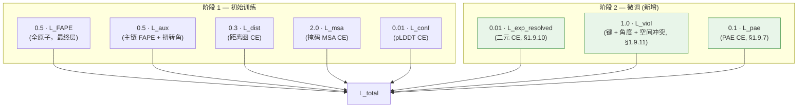
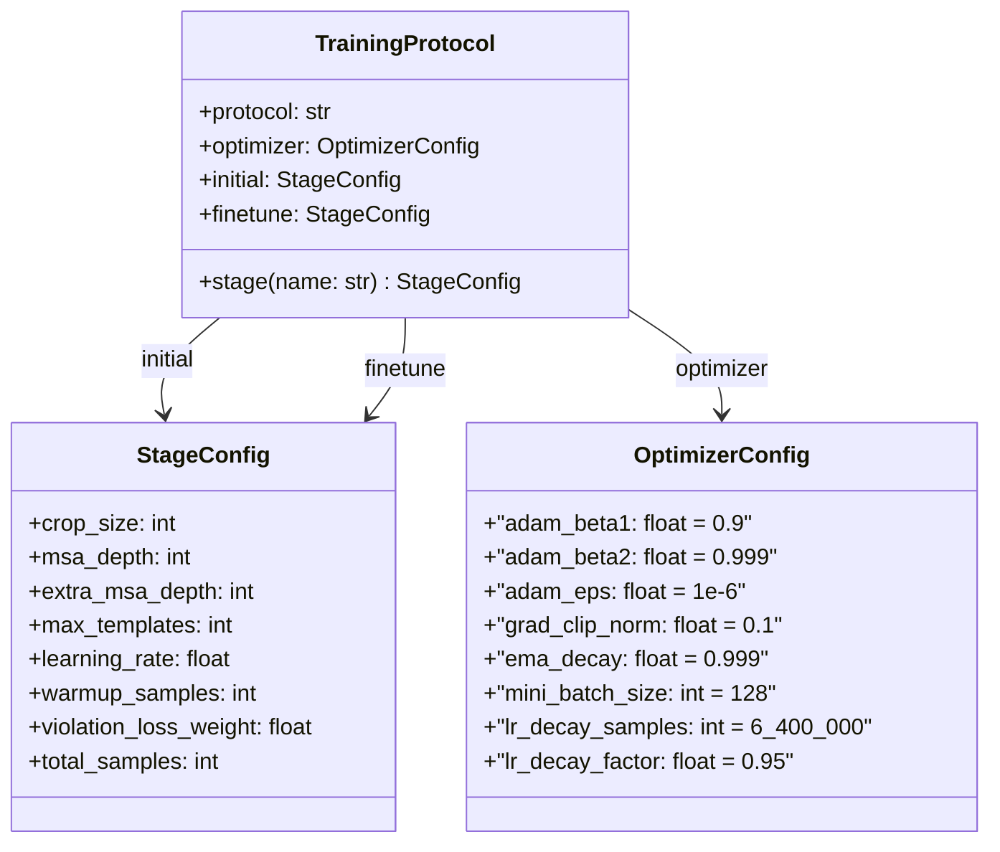

---
slug:12-two-stage-training-protocol
blog_type:normal
---


AlphaFold2 的训练流程并非单体的优化运行——它是一个**两阶段协议**（补充材料 §1.11.1，表 4），刻意将学习过程划分为粗略的“初始训练”阶段和几何精修的“微调”阶段。这两个阶段在裁剪尺寸、MSA 深度、学习率、预热调度以及最关键的**激活损失项**上均有所不同。minAlphaFold2 通过 `TrainingProtocol`、`StageConfig` 和 `OptimizerConfig` 数据类，将此协议作为一等配置数据捕获，并通过一对切换 `finetune` 标志的 `AlphaFoldLoss` 实例接入 `fit` 循环。本页将剖析该两阶段机制的架构：阶段间发生了什么变化，为何重要，以及代码如何实现补充材料中的每条转换规则。

来源：[trainer.py](minalphafold/trainer.py#L1-L26)，[losses.py](minalphafold/losses.py#L129-L163)

## 协议一览

下表总结了两个阶段之间发生变化的每个超参数，数据直接取自补充表 4 及编码它的 TOML 配置：

| 参数 | 初始训练 | 微调 | 补充材料参考 |
|---|---|---|---|
| **裁剪尺寸** (N_res) | 256 | 384 | 表 4 |
| **MSA 深度** (N_seq) | 128 | 512 | 表 4 |
| **额外 MSA 深度** (N_extra_seq) | 1024 | 5120 | 表 4 |
| **最大模板数** (N_templ) | 4 | 4 | 表 4（未变） |
| **学习率** | 1 × 10⁻³ | 5 × 10⁻⁴ | §1.11.3（基础 LR 减半） |
| **LR 预热** | 128k 样本线性预热 | 无 | §1.11.3 |
| **违规损失权重** | 0.0（禁用） | 1.0（启用） | §1.9.11 |
| **实验已分辨损失** | 关闭 | 0.01 | §1.9.10 |
| **pTM / PAE 损失** | 关闭 | 0.1 | §1.9.7 |
| **总样本数** | ~10M | ~1.5M | 表 4 |
| **权重初始化** | 随机 | 来自初始阶段检查点 | §1.11.1 |

来源：[training_alphafold2.toml](configs/training_alphafold2.toml#L1-L54)，[trainer.py](minalphafold/trainer.py#L216-L278)

## 各阶段损失构成

阶段之间架构上最显著的差异是**哪些损失项处于激活状态**。`AlphaFoldLoss` 类实例化了两个版本——`pretrain_loss_fn = AlphaFoldLoss(finetune=False)` 和 `finetune_loss_fn = AlphaFoldLoss(finetune=True)`——训练循环在每一步中通过 `use_finetune_loss` 在二者之间进行选择。

**阶段 1（初始训练）**——公式 7 训练行：

$$L = 0.5 \, L_{\text{FAPE}} + 0.5 \, L_{\text{aux}} + 0.3 \, L_{\text{dist}} + 2.0 \, L_{\text{msa}} + 0.01 \, L_{\text{conf}}$$

**阶段 2（微调）**——公式 7 微调行，*新增*三项：

$$L \mathrel{+}= 0.01 \, L_{\text{exp\_resolved}} + 1.0 \, L_{\text{viol}} + 0.1 \, L_{\text{pae}}$$

条件逻辑位于 `AlphaFoldLoss.compute_loss_terms` 中：共享项（FAPE、扭转角、距离图、MSA、pLDDT）总会被计算，而当 `self.finetune` 为 `True` 时，将追加这三个仅用于微调的项。这种设计意味着基础损失张量只构建一次，然后就地扩展，避免了因未改变项而产生的冗余计算。



来源：[losses.py](minalphafold/losses.py#L129-L199)，[losses.py](minalphafold/losses.py#L415-L489)

## 阶段配置架构

该协议被建模为三个嵌套的数据类，将**随阶段变化**的设置与**共享的**优化器设置分离开来。这种分离确保了单个 TOML 文件能完整指定两个阶段，同时使得意外遗漏阶段专属字段变得不可能——数据类构造器在加载时遇到任何缺失的键都会抛出 `TypeError`。

`StageConfig` 捕获了表 4 中的一列——裁剪/MSA 尺寸、学习率、预热窗口、违规损失权重以及总样本预算。`OptimizerConfig` 包含了在两个阶段中**完全相同**的 Adam 超参数、梯度裁剪范数、EMA 衰减以及一次性 LR 衰减调度。`TrainingProtocol` 将它们绑定在一起：



TOML 文件 `configs/training_alphafold2.toml` 是权威的磁盘表现形式。它由 `load_training_protocol` 加载，该函数使用 `tomllib` 解析 TOML，并将每个子表转发给相应的数据类构造器。TOML 中的拼写错误会在加载时表现为 `TypeError`，而不是在训练中途表现为静默的 `AttributeError`。

来源：[trainer.py](minalphafold/trainer.py#L216-L331)，[training_alphafold2.toml](configs/training_alphafold2.toml#L1-L54)

## 学习率调度转换

LR 调度是区分两个阶段的另一个关键轴。三种调度实现共存，正确的调度会根据配置自动选择：

| 调度 | 触发条件 | 阶段使用 | 论文保真度 |
|---|---|---|---|
| `learning_rate_for_samples` | `warmup_samples > 0` 或设置了 `lr_decay_samples` | **两个阶段**（符合论文的路径） | 精确 |
| `learning_rate_for_step` | `lr_schedule = "warmup_cosine"` | 教学备用方案 | 近似 |
| 常量 | `lr_schedule = "constant"`，无样本钩子 | 快速运行的默认值 | 低 |

**初始训练**使用基于样本的调度：LR 在前 128k 个训练样本中从 0 线性增长至 1×10⁻³，随后保持恒定，并在达到 6.4M 样本时乘以 0.95 执行一次衰减（即 §1.11.3 中的一次性衰减）。**微调**阶段以 `warmup_samples = 0`（根据补充材料无预热）进入，基础 LR 为 5×10⁻⁴（初始阶段 LR 的一半，通过 `finetune_lr_scale = 0.5` 实现）。如果在单次连续运行中，累积样本数跨越了 6.4M 阈值，则一次性衰减可能会在微调期间触发。

`learning_rate_at_step` 函数负责在这些路径间分派。当 `is_finetune=True` 时，它完全绕过基于步数的调度，并计算 `learning_rate * finetune_lr_scale`，如果一次性触发器已触发，则可选地进一步乘以 `lr_decay_factor` 缩放。这确保了微调永远不会意外地从过期的初始阶段配置中接收到预热爬升。

来源：[trainer.py](minalphafold/trainer.py#L435-L627)

## 阶段转换机制

从初始训练到微调的转换在单个 `fit` 调用内**不是自动的**——这是调用者的责任，这与论文的设计相符，即两个阶段是独立的训练运行。有两种机制支持这一点：

**1. `init_weights_from_checkpoint`**——从先前的检查点中提取模型权重作为种子，但不恢复优化器状态、EMA 或样本计数器。这正是论文在微调开始时所做的工作：继承已学习的权重，但从全新的 Adam 状态和零 LR 预热开始。`fit` 函数从指定检查点加载模型 `state_dict` 并打印确认信息，然后使用全新构建的优化器继续执行。

**2. `finetune_start_step`**——一种允许**单次连续运行**在特定全局步骤转换到微调的替代方案。设置后，`use_finetune_loss` 在所有 ≥ `finetune_start_step` 的步骤中返回 `True`，损失函数在运行中途从 `pretrain_loss_fn` 切换为 `finetune_loss_fn`。LR 调度也会转换：`learning_rate_at_step` 检查 `is_finetune` 并立即应用减半的 LR。

`fit` 循环在启动时实例化两个损失函数——`pretrain_loss_fn = AlphaFoldLoss(finetune=False)` 和 `finetune_loss_fn = AlphaFoldLoss(finetune=True)`——并在每一步选择激活的函数：

```python
is_finetune = use_finetune_loss(training_config, global_step)
loss_fn = finetune_loss_fn if is_finetune else pretrain_loss_fn
```

这种逐步骤的选择意味着仅用于微调的损失（结构违规、实验已分辨、pTM/PAE）会在转换步骤立即激活，从损失的角度来看不会产生梯度不连续性——共享项继续不变地流动梯度，新项只是在原有基础上叠加其贡献。

来源：[trainer.py](minalphafold/trainer.py#L568-L577)，[trainer.py](minalphafold/trainer.py#L846-L934)，[trainer.py](minalphafold/trainer.py#L994-L996)

## 结构违规损失——微调的核心区分项

`StructuralViolationLoss`（§1.9.11）是最重要的仅微调项。它强制执行物理上有效的肽键几何和空间位阻分离，充当清理初始训练产生的粗略结构的正则化器。它分解为三个子损失：

| 子损失 | 公式 | 惩罚内容 | 容差 |
|---|---|---|---|
| **L_bondlength** | 公式 44 | 残基间 C–N 肽键长度与文献值的偏差 | 12σ_lit |
| **L_bondangle** | 公式 45 | 肽键角度（CA–C–N 和 C–N–CA）的余弦 | 12σ_lit |
| **L_clash** | 公式 46 | 非键合重原子间的范德华重叠 | 1.5 Å |

三者均使用**平底**惩罚——当预测值在容差范围内时不流动梯度，因此一旦几何结构已经有效，该损失不会与 FAPE 驱动的结构优化相冲突。12.0 的违规容差因子和 1.5 Å 的重叠容差作为与补充材料匹配的构造器默认值被注册。公式 7 中整体 `structural_violation_weight = 1.0` 施加了一个绝对权重，使 L_viol 的规模与 FAPE 项保持可比。

补充材料明确指出：*“网络仅在微调阶段使用结构违规损失进行训练”*——在初始训练期间启用它会破坏早期优化，因为此时结构模块仍在产生近乎随机的坐标，会同时违反每一个几何约束。

来源：[losses.py](minalphafold/losses.py#L1117-L1195)，[losses.py](minalphafold/losses.py#L447-L457)

## 钳位 FAPE 机制转换

与两阶段协议的一个更微妙的交互涉及补充材料 §1.11.5 中的**钳位与非钳位 FAPE** 混合。在 90% 的训练小批量中，主链 FAPE 被钳位在 10 Å（超过 10 Å 的误差贡献恒定梯度），而在剩余的 10% 中则完全非钳位。这种随机混合由 `AlphaFoldLoss` 中的 `use_clamped_fape` 控制，并在 `BackboneTrajectoryLoss.forward` 中实现：

- 当 `use_clamped_fape` 为 `None`（默认）时：完全钳位的主链 FAPE。
- 当 `use_clamped_fape` 为 [0, 1] 区间内的浮点数时：`use_clamped_fape × 钳位 + (1 - use_clamped_fape) × 非钳位` 的软混合。
- 设置 `use_clamped_fape = 0.9` 可重现论文预期的每批次损失。

侧链（全原子）FAPE **始终被钳位**，与阶段无关——`AllAtomFAPE` 类在其对 `frame_aligned_point_error` 的调用中硬编码了 `l1_clamp_distance = self.d_clamp_val`（10 Å）。只有主链轨迹 FAPE 参与了随机非钳位机制。

来源：[losses.py](minalphafold/losses.py#L491-L559)，[losses.py](minalphafold/losses.py#L741-L816)

## 裁剪尺寸与 MSA 深度缩放

阶段间裁剪从 256 → 384 个残基、MSA 深度从 128 → 512 的跃升不仅仅是数据的改变——它重塑了 Evoformer 的**有效感受野**。使用 384 个残基的裁剪，配对表示 `z_ij` 覆盖了 384² = 147,456 个成对位置（从 65,536 增加），额外 MSA 行从 1,024 扩展到 5,120。这意味着：

- **内存**：仅配对表示就增长了 2.25 倍，额外 MSA 表示增长了 5 倍。在单 GPU 上进行微调可能需要进一步减小 `batch_size` 或依赖梯度累加。
- **信息**：每次裁剪包含更多残基意味着训练期间能看到更远距离的接触，更深的 MSA 输入意味着 Evoformer 拥有更丰富的进化证据可供整合。
- **优化稳定性**：更大的裁剪之所以可行，仅仅是因为微调从良好收敛的初始阶段检查点开始。在裁剪为 384 时从随机初始化训练将极度不稳定——仅违规损失就会在未经训练的结构预测上压倒 FAPE 项的信号。

`DataConfig` 数据类的默认值匹配初始训练列；调用者在进入微调时覆盖 `crop_size`、`msa_depth` 和 `extra_msa_depth`。

来源：[trainer.py](minalphafold/trainer.py#L93-L124)，[training_alphafold2.toml](configs/training_alphafold2.toml#L32-L53)

## 跨阶段的检查点与 EMA

参数 EMA（§1.11.7，衰减 0.999）在两个阶段中运行方式相同，但在每个阶段中发挥的战略作用不同：

- **初始训练**：EMA 影子追踪约 10M 样本上快速演变的权重移动平均值。最佳检查点通过评估 EMA 模型在验证损失上的表现来选择。
- **微调**：当使用 `init_weights_from_checkpoint` 时，EMA 从加载的权重中**重新提取种子**（`build_ema_model` 首次更新的特殊情况在 `num_averaged == 0` 时将 `current` 完整拷贝）。这意味着微调 EMA 从初始阶段的最终权重开始，而不是从零初始化的影子开始，这至关重要——零起始的 EMA 需要数千步才能赶上已收敛的权重，导致早期验证毫无意义。

当使用 `resume_from_checkpoint` 替代时，完整的 EMA 状态字典从检查点恢复，因此影子从它中断的地方精确继续。`init_weights_from_checkpoint` 路径有意**不**恢复 EMA——它仅加载模型权重，这与论文的隐含假设一致，即微调以跟踪新加载参数的全新 EMA 开始。

<CgxTip>在编排完整的论文协议时，使用 `finetune=False` 运行阶段 1 并保存最佳检查点，然后启动阶段 2，使 `init_weights_from_checkpoint` 指向该检查点，设置 `finetune=True`、`finetune_lr_scale=0.5` 以及表 4 中增加的裁剪/MSA 值。`finetune_start_step` 路径可用于单次运行实验，但不处理裁剪尺寸变化——DataLoader 在 `fit` 入口处使用初始 `DataConfig` 裁剪尺寸构建一次。</CgxTip>

<CgxTip>`TrainingProtocol` 数据类和 `load_training_protocol` 函数提供了一种单次调用的方式，可从 `configs/training_alphafold2.toml` 加载两个阶段。协议文件通过 `training_` 前缀与模型配置文件区分——`load_training_protocol("alphafold2")` 解析为 `configs/training_alphafold2.toml`，而 `load_model_config("alphafold2")` 解析为 `configs/alphafold2.toml`。</CgxTip>

来源：[trainer.py](minalphafold/trainer.py#L516-L536)，[trainer.py](minalphafold/trainer.py#L916-L934)，[trainer.py](minalphafold/trainer.py#L1042-L1043)

## 接下来阅读什么

两阶段协议与多个其他子系统深度交互。有关组成每个阶段的损失函数，请参阅[损失函数与 FAPE](11-loss-functions-and-fape)。有关稳定从初始阶段检查点进行微调的零初始化技巧，请参阅[零初始化与参数 EMA](13-zero-init-and-parameter-ema)。有关必须在阶段间调整裁剪和 MSA 深度的数据流水线，请参阅[数据流水线与裁剪](14-data-pipeline-and-cropping)。有关编码这些超参数的配置文件，请参阅[模型配置文件](16-model-config-profiles)。