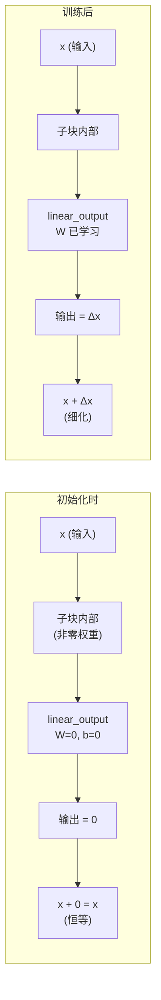
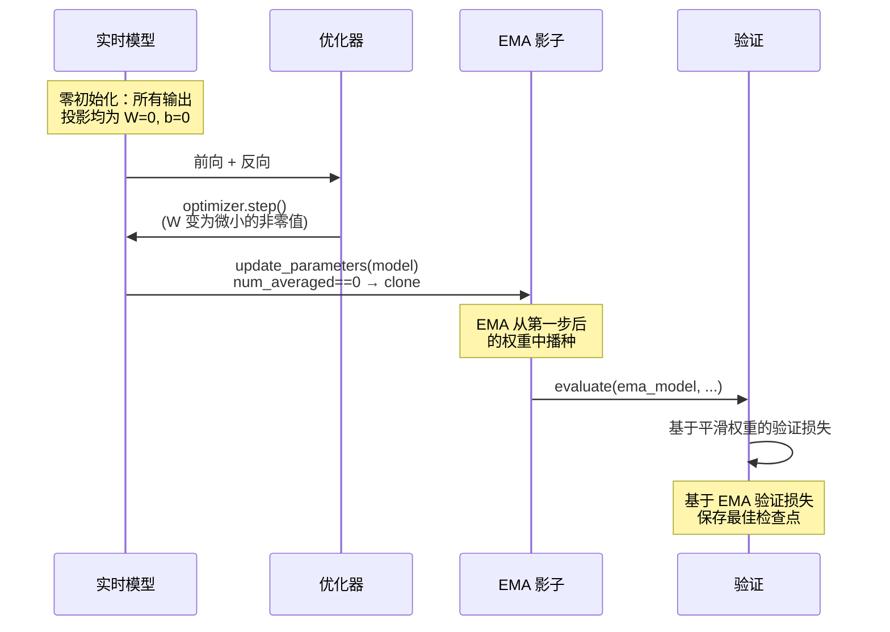

---
slug:13-zero-init-and-parameter-ema
blog_type:normal
---


AlphaFold2的训练稳定性依赖于两个精心设计的参数管理机制：残差输出投影的**零初始化**（补充材料 §1.11.4）和模型权重的**指数移动平均**（补充材料 §1.11.7）。两者共同确保了深厚的Evoformer+StructureModule堆栈在初始时表现为一组近恒等变换，并确保推理时使用的是经过平滑且噪声更低的训练轨迹版本。本文剖析了minAlphaFold2中这两种机制的实现，追溯了初始化扫描从其五种配方到逐模块分发逻辑的过程，以及EMA从其影子参数构造到其在验证和检查点选择中的作用。

来源：[initialization.py](/minalphafold/initialization.py#L1-L81), [model.py](/minalphafold/model.py#L106-L153), [trainer.py](/minalphafold/trainer.py#L516-L536)

## 五种初始化配方

补充材料 §1.11.4 精确规定了网络中每个 `nn.Linear` 的初始化方式。`initialization` 模块是唯一的可信源，提供了由 `init_linear` 分发的五种命名配方。在所有配方中，偏置**始终**为零；只有权重分布有所不同。

| 配方 | 权重分布 | 偏置 | 使用场景 | σ / 范围 |
|--------|--------------------|------|----------|-----------|
| `default` / `linear` | LeCun fan-in 截断正态分布 | 0 | 常规投影 | σ = √(1/fan_in), 裁剪 ±2σ |
| `relu` | He 截断正态分布 | 0 | 紧接在 ReLU 之前的投影 | σ = √(2/fan_in), 裁剪 ±2σ |
| `glorot` | Xavier 均匀分布 | 0 | 自注意力中的 Query/key/value | uniform(−a, a), a = √(6/(fan_in+fan_out)) |
| `final` | 零 | 0 | 残差输出投影，logit 头 | — |
| `gate` | 零 | 1 | 送入 sigmoid 的门控 Linear 层 | 初始化时 sigmoid(1) ≈ 0.73 |

截断正态分布使用了补充材料中的 **±2σ 裁剪**，通过设置 `a=-2σ, b=+2σ` 的 `torch.nn.init.trunc_normal_` 实现。`final` 和 `gate` 配方是直接实现零初始化设计的两种配方：`final` 使残差块以恒等变换起步，而 `gate` 使 sigmoid 门控路径在初始时主要表现为直通。

来源：[initialization.py](/minalphafold/initialization.py#L33-L80)

## 零初始化为何产生恒等残差

其核心洞见在于架构而非仅仅是数值。每个Evoformer子块和StructureModule迭代都使用了**残差连接**：块的输出被添加到其输入中（`x ← x + block(x)`）。如果 `block` 的最终投影具有零权重和零偏置，那么对于所有 `x`，`block(x) = 0`，残差求和退化为 `x ← x + 0 = x` —— 即**恒等函数**。



这意味着一个48层的Evoformer堆栈在初始时表现为48个堆叠的恒等操作——模型以直通方式起步，并**学习添加增量细化**。这之所以至关重要，原因有二：(1) 它防止了极深堆栈在训练早期出现梯度爆炸；(2) 它使模型的初始预测仅依赖于输入嵌入路径，从而为优化器提供了一个干净的起始信号。同一原则也适用于StructureModule的8次IPA迭代及其过渡MLP。

<CgxTip>零初始化扫描由 `config.zero_init` 控制（在所有内置配置中默认为 `True`）。将其设置为 `False` 会禁用所有 `linear_output` 和 `linear_down` 投影的零初始化，同时保留门控初始化——这在消融实验或从已学习权重的检查点进行微调时非常有用。</CgxTip>

来源：[model.py](/minalphafold/model.py#L106-L153), [evoformer.py](/minalphafold/evoformer.py#L127-L135)

## 零初始化扫描：逐模块分发

`AlphaFold2._initialize_alphafold_parameters` 通过 `self.modules()` 遍历网络中的每个模块，并根据模块的类名分发正确的初始化配方。这是一个**构造后扫描**——模块首先使用其默认的PyTorch初始化进行构建，然后扫描覆盖选定的层。分发目标分为四类：

### 1. 注意力块的输出投影

这是八个基于注意力的类的 `linear_output` 层。将它们置零会使每个注意力块以恒等变换起步：

| 模块类 | 置零层 | 算法 |
|-------------|-------------|-----------|
| `MSARowAttentionWithPairBias` | `linear_output` | Alg 7 |
| `MSAColumnAttention` | `linear_output` | Alg 8 |
| `MSAColumnGlobalAttention` | `linear_output` | Alg 19 |
| `TemplatePointwiseAttention` | `linear_output` | Alg 17 |
| `ExtraMsaStack` | `linear_output` | Alg 18 |
| `TriangleAttentionStartingNode` | `linear_output` | Alg 13 |
| `TriangleAttentionEndingNode` | `linear_output` | Alg 14 |
| `InvariantPointAttention` | `linear_output` | Alg 22 |

### 2. 过渡下投影

`MSATransition` 和 `PairTransition` 是具有拓宽瓶颈的两层MLP。`linear_down` 层（即缩窄回原始通道维度的第二个投影）被零初始化，使过渡以恒等变换起步：

| 模块类 | 置零层 | 算法 |
|-------------|-------------|-----------|
| `MSATransition` | `linear_down` | Alg 9 |
| `PairTransition` | `linear_down` | Alg 15 |

### 3. 三角乘法与结构模块特殊处理

三角乘法模块（`Outgoing`/`Incoming`）接收**三部分零初始化**：`gate1` 和 `gate2` 均使用门控初始化（零权重，偏置=1），最终的 `gate` 也使用门控初始化，而 `out_linear` 被置零。StructureModule的 `transition_linear_3`（其三层过渡MLP的第三层）、`BackboneUpdate.linear` 和 `AngleResnetBlock.linear_2` 均被置零。`OuterProductMean.linear_out` 也被置零。

### 4. 不变点注意力头权重

IPA的 `head_weights` 参数控制每个注意力头的 softplus 门控权重。这些权重并未被置零，而是被设置为 `log(e − 1)`，使得在初始化时 `softplus(head_weights) = 1.0`，从而在训练调整平衡之前赋予每个头单位权重。

来源：[model.py](/minalphafold/model.py#L106-L153)

## 门控初始化：Sigmoid 直通

`gate` 配方（零权重，偏置=1）被应用于每个门控注意力模块中的 `linear_gate`，以及两种三角乘法类中的 `gate1`、`gate2` 和 `gate`。其机制工作原理如下：门控路径计算 `sigmoid(W·x + b)`。在初始化时，`W=0` 且 `b=1`，因此无论输入为何，预 sigmoid 激活始终为1，且 `sigmoid(1) ≈ 0.73`。这意味着门以约73%的容量开启——该路径**主要表现为直通**但并未完全打开，允许受控量的门控信号通过，同时为优化器留出余量，以便进一步打开门（偏置 → +∞）或将其关闭（偏置 → −∞）。

```python
# 门控初始化：W=0, b=1 → sigmoid(1) ≈ 0.73
def init_gate_linear(linear):
    with torch.no_grad():
        linear.weight.zero_()
        if linear.bias is not None:
            linear.bias.fill_(1.0)
```

这一设计选择在补充材料 §1.11.4 的“Gating Linear layers”下被明确指出，且与 `final` 配方不同——门控的重点在于**控制信息流**，而非使残差块成为恒等变换。

来源：[initialization.py](/minalphafold/initialization.py#L70-L80)

## 参数 EMA：权重的指数移动平均

补充材料 §1.11.7 规定，训练过程需维护所有模型参数的**指数移动平均（EMA）**。EMA 影子模型专门用于验证损失计算和检查点选择，而实时的 `model.state_dict()` 则继续持有接收梯度更新的训练参数。这解耦了噪声较大的训练时权重与更平滑的推理时权重。

### 构造与更新规则

EMA 通过 `build_ema_model` 构建，它将实时的 `AlphaFold2` 包装在 `torch.optim.swa_utils.AveragedModel` 中，并带有一个实现以下逻辑的自定义平均函数：

```
ema ← decay · ema + (1 − decay) · current
```

论文指定 `decay = 0.999`，这赋予每个新的优化器步骤0.001的权重混合到运行平均值中。特殊情况处理第一次更新（`num_averaged == 0`）：EMA **直接从第一步后的模型中播种**，而不是混合两个相同的初始化参数副本。这避免了 `0.999·θ_init + 0.001·θ_init = θ_init` 在第1步无法产生有意义更新的微妙问题。

```python
def avg_fn(averaged_param, current_param, num_averaged):
    if int(num_averaged) == 0:
        return current_param.detach().clone()    # 第一次更新：直接播种
    return ema_decay * averaged_param + (1.0 - ema_decay) * current_param
```

该更新在 `fit` 循环内每次优化器步骤后触发：`ema_model.update_parameters(model)`。这发生在 `optimizer.step()` **之后**且下一次前向传播**之前**，因此 EMA 始终反映最新的参数值。

来源：[trainer.py](/minalphafold/trainer.py#L516-L536), [trainer.py](/minalphafold/trainer.py#L1042-L1043)

### 验证与检查点中的 EMA

EMA 影子模型的唯一目的就是评估。在验证期间，训练循环显式地选择 EMA 模型而非实时模型：

```python
eval_model = ema_model if ema_model is not None else model
val_metrics = evaluate(eval_model, val_loss_fn, val_loader, training_config)
```

因为 `AveragedModel.__call__` 会使用平均参数转发到其包装的模块，所以无论是否启用 EMA，调用点都是相同的。**最佳检查点选择**（在 `val_loss` 改善时保存）基于此 EMA 评估的损失，因此保存的“最佳”权重是在平滑参数下表现最佳的权重。

检查点持久化在实时模型和优化器状态旁边包含了 EMA 状态字典。恢复时，`load_checkpoint_for_resume` 从 `checkpoint["ema_state_dict"]` 恢复 EMA 影子模型，确保运行平均值在中断的运行中无缝延续。当使用 `init_weights_from_checkpoint`（§1.11.1 中的微调跨阶段权重转移）时，仅加载实时模型权重——EMA 从转移的权重重新初始化，符合论文中微调启动全新 EMA 轨迹的意图。

来源：[trainer.py](/minalphafold/trainer.py#L1066-L1076), [trainer.py](/minalphafold/trainer.py#L803-L843), [trainer.py](/minalphafold/trainer.py#L539-L565)

## 零初始化与 EMA 的交互

在训练开始时，零初始化与参数 EMA 以一种微妙而重要的方式交互。因为零初始化使模型的输出投影产生零，前几个优化器步骤会对那些先前为零的权重产生微小但非零的更新。从第一步后模型播种的 EMA 立即捕获了这些微小更新（多亏了 `num_averaged == 0` 特殊情况）。如果没有该特殊情况，EMA 将从零初始化值开始，并需要许多步才能通过 0.999 的衰减积累有意义的信号——`clone` 捷径确保了 EMA 从第1步开始追踪训练轨迹。



<CgxTip>当使用 `init_weights_from_checkpoint` 进行微调时，EMA 在将预训练权重加载到实时模型（第930行）*之后*构建，随后 `build_ema_model` 将这些权重复制为 EMA 的初始状态。这意味着微调 EMA 从有意义的参数快照而非随机初始化开始——0.999 的衰减随后从该起点平滑追踪微调轨迹。</CgxTip>

来源：[trainer.py](/minalphafold/trainer.py#L916-L939), [model.py](/minalphafold/model.py#L106-L153)

## 配置参考

这两种机制均通过模型配置和训练配置数据类进行控制：

| 参数 | 位置 | 默认值 | 论文值 | 效果 |
|-----------|----------|---------|-------------|--------|
| `zero_init` | `ModelConfig` | `True` | `True` | 启用/禁用输出投影的零初始化扫描 |
| `ema_decay` | `TrainingConfig` | `None` (禁用) | `0.999` | EMA 衰减率；`None` 表示完全禁用 EMA |
| `ema_decay` | `OptimizerConfig` | `0.999` | `0.999` | 两阶段协议包装器中的 EMA 衰减 |

`--ema-decay` CLI 标志映射到 `TrainingConfig.ema_decay`。`zero_init` 字段存在于所有内置 TOML 配置文件（`tiny.toml`、`medium.toml`、`alphafold2.toml`）中，且默认为 `True`。

来源：[model_config.py](/minalphafold/model_config.py#L93-L93), [trainer.py](/minalphafold/trainer.py#L1181-L1184), [trainer.py](/minalphafold/trainer.py#L254-L254)

## 架构原理与设计权衡

零初始化 + EMA 的组合解决了一个特定问题：训练一个48块的Evoformer + 8层StructureModule堆栈，该堆栈否则容易在训练早期出现不稳定和在训练后期出现过拟合噪声。零初始化通过使网络以恒等堆栈起步来提供**初始化稳定性**，而 EMA 通过平均消除单个 SGD 步骤的随机噪声来提供**推理稳定性**。

权衡在于零初始化减缓了早期学习——模型必须首先“解除零化”其输出投影，然后才能产生有意义的预测。这是可以接受的，因为 (1) 带有其逐参数自适应学习率的 Adam 优化器自然会加速逃离零值；(2) 补充材料中的线性预热计划（§1.11.3）将全局学习率从零逐渐提升，给予模型一个宽限期以开始调整。EMA 的 0.999 衰减在实时权重与影子权重之间引入了大约1000步的滞后，这就是为什么补充材料规定其仅用于评估——训练指标使用的是实时权重。

有关这些机制如何融入更广泛的训练协议的更多阅读，请参阅[两阶段训练协议](12-two-stage-training-protocol)，其中描述了初始训练 → 微调的过渡，零初始化的恒等起步特性和 EMA 的跨阶段重新初始化都在其中发挥着关键作用。有关这些机制有助于导航的损失景观，请参阅[损失函数与 FAPE](11-loss-functions-and-fape)。