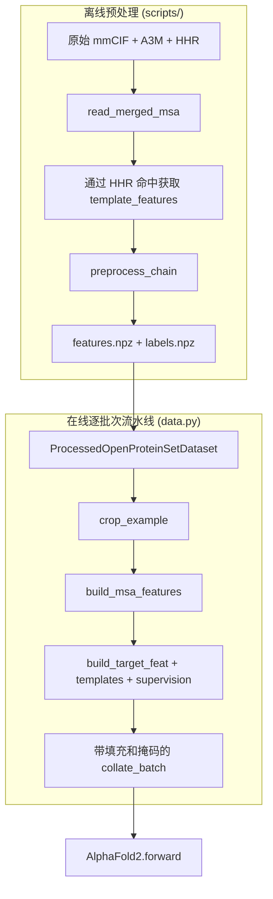

---
slug:14-data-pipeline-and-cropping
blog_type:normal
---


minAlphaFold2 的数据流水线将原始结构生物学产物——mmCIF 文件、A3M 多序列比对和 HHR 模板命中——桥接到 `AlphaFold2.forward` 所消费的精确张量批次。该流水线在两个截然不同的阶段中运行：**离线预处理**步骤，将逐链的 `.npz` 特征/标签缓存具象化；以及**在线逐批次流水线**，加载这些缓存，应用随机 MSA 增强，裁剪至固定的残基预算，构建表 1 特征张量，并将变长样本整理为填充批次。裁剪（补充材料 §1.2.8）是关键的长控制机制：在训练期间，选择均匀随机的连续窗口；而在推理时，则确定性地将裁剪居中，从而同时确保 GPU 内存的稳定可预测性和训练时对完整残基范围的覆盖。

来源: [data.py](/minalphafold/data.py#L1-L33), [preprocess_openproteinset.py](/scripts/preprocess_openproteinset.py#L1-L35)

## 架构：两阶段流水线

该流水线将关注点分离为缓慢的、受磁盘 I/O 限制的预处理阶段和快速的、感知 GPU 的在线阶段。这种拆分是刻意为之的：MSA 合并、模板坐标投影和 mmCIF 解析开销大且具有确定性，因此它们只运行一次并缓存为 NumPy 压缩归档。在线阶段——块删除、簇/额外拆分、BERT 风格掩码、裁剪和特征组装——每个批次都是随机的，且必须在每次前向传播中重新执行以提供数据增强。



来源: [data.py](/minalphafold/data.py#L1-L33), [preprocess_openproteinset.py](/scripts/preprocess_openproteinset.py#L378-L447)

## 离线预处理：`preprocess_openproteinset.py`

`preprocess_chain` 函数是离线工作的原子单元。对于 OpenProteinSet `roda_pdb` 层级结构中的每个链目录，它执行四项操作：（1）通过 `read_merged_msa` 进行 **MSA 合并**，该过程读取一个或多个 `.a3m` 文件，按内容哈希对行去重，并限制为最多 `max_msa_seqs`（默认 2048）条序列；（2）从对应的 mmCIF 中**提取结构**，当晶体序列与 MSA 查询序列不完全匹配时，使用 `project_to_query`——通过 Needleman–Wunsch 全局比对将模板坐标映射到查询位置；（3）通过 `template_features` 计算**模板特征**，该过程解析 `.hhr` 命中文件，从 mmCIF 中解析 PDB 链原子，并投影对齐位置；（4）将数据**序列化**为独立的特征和标签 `.npz` 文件。

`residue_index` 字段始终是连续的（`np.arange(len(query))`），而非 PDB 自身的残基编号。当晶体的无序末端产生编号间隙时，这可以避免冲突——否则相同的 PDB 残基编号会出现在两个不同的查询位置，从而破坏相对位置编码（算法 4）。

| 输出文件 | 关键字段 | 形状 |
|---|---|---|
| `features.npz` | `aatype`, `msa`, `deletions`, `between_segment_residues`, `residue_index` | `(N_res,)`, `(N_seq, N_res)`, `(N_seq, N_res)`, `(N_res,)`, `(N_res,)` |
| `features.npz` | `template_aatype`, `template_atom14_positions`, `template_atom14_mask` | `(N_templ, N_res)`, `(N_templ, N_res, 14, 3)`, `(N_templ, N_res, 14)` |
| `labels.npz` | `atom14_positions`, `atom14_mask`, `resolution` | `(N_res, 14, 4)`, `(N_res, 14)`, 标量 |

来源: [preprocess_openproteinset.py](/scripts/preprocess_openproteinset.py#L378-L447), [preprocess_openproteinset.py](/scripts/preprocess_openproteinset.py#L319-L375), [preprocess_openproteinset.py](/scripts/preprocess_openproteinset.py#L450-L493)

## 数据集：`ProcessedOpenProteinSetDataset`

该数据集是一个轻量级的 `torch.utils.data.Dataset`，用于枚举链级别的 `.npz` 文件对。其构建遵循三步过滤级联：（1）**发现**——`discover_chain_ids` 通过 glob 匹配特征文件，并与标签文件取交集；（2）**清单过滤**——如果提供了 `chains_manifest`（即实现补充材料 §1.2.5 过滤的 `filter_openproteinset.py` 的 JSON 输出），则仅保留 `accepted == True` 的链；（3）**带种子的训练/验证拆分**——`split_chain_ids` 通过带种子的 `random.Random` 进行洗牌，然后按 `val_fraction`（默认 0.1）划分为训练集和验证集。

拆分是在**过滤后**的总体上计算的，确保相同的 `seed` 始终产生相同的训练/验证分配，而不受过滤器拒绝了多少链的影响。`__getitem__` 方法仅加载两个 `.npz` 文件并将它们合并为单个字典——所有的随机增强均发生在下游。

来源: [data.py](/minalphafold/data.py#L248-L293), [data.py](/minalphafold/data.py#L148-L194)

## 裁剪：`crop_example`（补充材料 §1.2.8）

裁剪是将残基维度限制为固定 `crop_size` 的机制，从而实现静态 GPU 内存分配。该函数选择一个包含 `crop_size` 个残基的连续窗口，并沿该窗口对样本字典中**所有**以残基索引的字段进行切片。

起始位置由 `_crop_start` 确定，该函数实现了两种模式：

| 模式 | 起始位置选择 | 依据 |
|---|---|---|
| **训练** | `randint(0, length - crop_size + 1)` | 均匀覆盖——在每个 epoch 中，每个连续窗口被选中的概率相等 |
| **推理** | `(length - crop_size) // 2` | 确定性居中，以保证可复现的评估 |

短于 `crop_size` 的链将原样通过（起始位置 = 0，无切片），并且 `crop_start` 会被记录在输出字典中，以便能够为全局坐标输出重建 `residue_index`。

切片会同时应用于所有张量类别——aatype、MSA 行、deletions、between_segment_residues、residue_index、模板字段和 atom14 监督——以保证批次中的每个张量都引用相同的残基窗口。这一点至关重要：MSA 与监督之间的裁剪错位会导致训练信号被静默破坏。

```mermaid
flowchart LR
    A["完整链 (L 个残基)"] --> B{L > crop_size?}
    B -- 否 --> C["原样通过"]
    B -- 是 --> D{训练模式?}
    D -- 是 --> E["start ~ Uniform(0, L - crop_size)"]
    D -- 否 --> F["start = (L - crop_size) // 2"]
    E --> G["切片 [start : start + crop_size]"]
    F --> G
    G --> H["裁剪后样本 (crop_size 个残基1! |MISSING|_EV! |FOLLOW|_OR! |KEYWORD|! |INDIRECT17!"]
, and |MISSING|_EV! |FOLLOW|_OR! |KEYWORD|! |INDIRECT17! ]
)]
```

来源: [data.py](/minalphafold/data.py#L296-L362)

## 在线 MSA 处理流水线

裁剪之后，在线阶段通过严格有序的五项操作构建随机 MSA 特征，这些操作与补充材料 §1.2 相对应：

**步骤 1 — HHblits 概况**：`hhblits_profile` 计算完整（裁剪后）MSA 上的逐列氨基酸频率，生成一个 `(N_res, 22)` 的概况，稍后用于 BERT 风格的替换采样。该概况在块删除**之前**计算，因此它反映了完整 MSA 的进化信息。

**步骤 2 — 块删除**（`block_delete_msa`，算法 1 / §1.2.6）：在训练期间，移除 `num_blocks`（默认 5）个连续的行块，每个块包含 `msa_fraction_per_block × (N_seq - 1)` 行非查询序列。核心见解是，来自 HHblits 的 MSA 是按 e 值排序的——相似序列聚集在一起，因此删除连续块会移除整个系统发育分支，从而为 Evoformer 生成相关性更低的样本。查询行（索引 0）始终被保留。

**步骤 3 — 簇/额外拆分**（`sample_cluster_and_extra`，§1.2.7）：MSA 被拆分为 `msa_depth` 个簇中心（馈入主 Evoformer 堆栈，O(N_seq² × N_res)）和 `extra_msa_depth` 个额外行（馈入浅层额外 MSA 堆栈，§1.2.7）。在训练时，簇中心在不放回的情况下均匀采样；在推理时，取前 `msa_depth - 1` 行（稳定排序）。

**步骤 4 — BERT 风格掩码**（`masked_msa_inputs`，§1.2.7）：每个位置以 0.15 的概率被掩码。被掩码的位置从以下混合分布中抽取替换：10% MSA 概况，10% 原始残基，10% 均匀氨基酸，70% 掩码词元。损坏的 MSA 作为模型输入；原始词元（独热编码）作为掩码 MSA 损失的监督目标（公式 42）。

**步骤 5 — 簇统计**（`cluster_statistics`）：每行额外 MSA 通过汉明相似度加权一致性（忽略间隙和掩码词元）被软分配到其最近的簇中心。簇概况和平均删除计数通过 scatter-add 累加，然后除以分配计数进行归一化。这些逐簇统计信息填充了 `msa_feat` 的 `cluster_profile`（23 维）和 `cluster_deletion_mean`（1 维）通道。

来源: [data.py](/minalphafold/data.py#L1003-L1071), [data.py](/minalphafold/data.py#L365-L413), [data.py](/minalphafold/data.py#L416-L476), [data.py](/minalphafold/data.py#L559-L620), [data.py](/minalphafold/data.py#L479-L546)

## 特征组装：表 1 构建器

一旦 MSA 处理完成，五个确定性构建器将组装与补充材料表 1 相匹配的张量输入：

| 构建器 | 输出 | 维度 | 组成 |
|---|---|---|---|
| `build_msa_feat` | `msa_feat` | 49 | one_hot(23) + has_deletion(1) + deletion_value(1) + cluster_profile(23) + deletion_mean(1) |
| `build_extra_msa_feat` | `extra_msa_feat` | 25 | one_hot(23) + has_deletion(1) + deletion_value(1) |
| `build_target_feat` | `target_feat` | 22 | between_segment_residues(1) + aatype_one_hot(21) |
| `build_template_pair_feat` | `template_pair_feat` | 88 | distogram(39) + mask(1) + aatype_i(22) + aatype_j(22) + unit_vec(3) + backbone_mask(1) |
| `build_template_angle_feat` | `template_angle_feat` | 57 | aatype(22) + torsion(14) + alt_torsion(14) + torsion_mask(7) |

删除值变换 `atan(d / 3) × 2 / π`（在 `transformed_deletions` 中实现）将大间隙保持在 [0, 1] 范围内，防止无界整数删除计数导致梯度不稳定。

<CgxTip>57 维的 `template_angle_feat` 与表 1 印刷的 51 维不同——论文将扭转掩码计为 14（复制了 sin/cos），但 DeepMind 发布的代码及本实现使用的是 7（每个扭转角一个掩码，独立于 sin/cos 拆分）。此为权威维度。</CgxTip>

来源: [data.py](/minalphafold/data.py#L623-L653), [data.py](/minalphafold/data.py#L656-L680), [data.py](/minalphafold/data.py#L683-L704), [data.py](/minalphafold/data.py#L755-L831), [data.py](/minalphafold/data.py#L834-L873), [data.py](/minalphafold/data.py#L133-L136)

## 真实值：`build_supervision`

监督构建器生成 `AlphaFoldLoss` 消费的每个 `true_*` 张量。骨架帧来自实原子位置（N、Cα、C）的 Gram-Schmidt 正交化，将帧置于论文的 +x = Cα→C 约定中。**侧链刚体帧并非取自 Gram-Schmidt**——相反，它们是通过 `rigid_group_frames_from_torsions`（算法 24 第 1–10 行）参数化重建的，与结构模块的预测路径完全匹配。这确保了当预测与真实值匹配时，侧链 FAPE 可以达到零；来自非理想键长的 Gram-Schmidt 侧链帧会产生不可约的间隙。

该构建器还生成“替代真值”（§1.8.5 / 算法 26）：对于具有对称原子命名的残基（如 ASP OD1↔OD2），计算替代的 atom14 布局和 π 周期替代扭转角，以便损失函数可以在两种对称性中取最小值。

来源: [data.py](/minalphafold/data.py#L876-L986)

## 端到端：`build_processed_example`

顶层编排器 `build_processed_example` 按固定顺序将所有内容串联起来：（1）裁剪 → （2）构建 MSA 特征（随机） → （3）构建 target_feat（确定性） → （4）构建模板特征（确定性） → （5）构建监督（确定性） → （6）合并为单个字典。伴随函数 `build_processed_example_from_cropped` 跳过裁剪步骤，用于在循环/集成 MSA 重采样之间共享同一裁剪的情况。

对于循环和集成（算法 2 第 4 行），`_build_sampled_msa_features` 为每个样本预采样 `num_recycling_samples × num_ensemble_samples` 个独立的 MSA 特征字典，每个字典拥有自己带种子的随机状态。只有依赖于 MSA 的键（`msa_feat`、`msa_mask`、`extra_msa_feat`、`extra_msa_mask`、`masked_msa_target`、`masked_msa_mask`）会获得额外的前导轴——模板和监督张量在重采样间共享。

来源: [data.py](/minalphafold/data.py#L1163-L1192), [data.py](/minalphafold/data.py#L1109-L1160)

##= 批次整理：`collate_batch`

处理后8处理后8处理后，单个样本具有不同的 `N_res` 和 `N_seq` 长度。`collate_batch` 沿每个轴将每个张量向右填充至批次最大长度，并发出显式的浮点掩码（`msa_mask`、`extra_msa_mask` 等），用于标记真实位置与填充位置。填充约定仅为右侧（`pad_tensor` 从索引 0 复制并填充尾部），保持残基/MSA 排序，以便掩码能正确地将填充排除在所有损失项之外。

来源: [data.py](/minalphafold/data.py#L989-L1000)

## 随机种子与可复现性

整个随机流水线的种子是可控的。`build_processed_example` 接受一个 `random_seed`，该种子驱动一个 `torch.Generator`，并传递给每个随机函数——块删除、簇/额外拆分、BERT 掩码和裁剪起始位置选择。种子方案使用 `_example_seed(base_seed, example_index) = base_seed + example_index`，确保同一批次中的不同样本获得独立但可复现的随机流。对于循环重采样，种子偏移 `1000 × sample_index` 以避免与主批次种子发生冲突。

来源: [data.py](/minalphafold/data.py#L103-L112), [data.py](/minalphafold/data.py#L1139-L1156)

<CgxTip>裁剪在 MSA 处理**之前**应用，因此 MSA 概况和块删除在已经裁剪后的残基窗口上操作。这符合 AF2 补充材料的顺序（§1.2.8 裁剪先于 §1.2.6–§1.2.7 MSA 增强），且这一点很重要：这意味着 MSA 增强看到的是更短的、位置局部的视图，而不是全链视图，这同时影响了 HHblits 概况分布和块删除的块大小。</CgxTip>

---

**下一步**：有关 MSA 特定的增强细节（块删除机制、簇/额外拆分和 BERT 掩码），请参阅 [MSA Processing and Masking](15-msa-processing-and-masking)。有关处理后的批次如何馈入模型的输入嵌入器，请参阅 [Input Embedder and RelPos](5-input-embedder-and-relpos)。有关消费监督张量的损失函数，请参阅 [Loss Functions and FAPE](11-loss-functions-and-fape)。