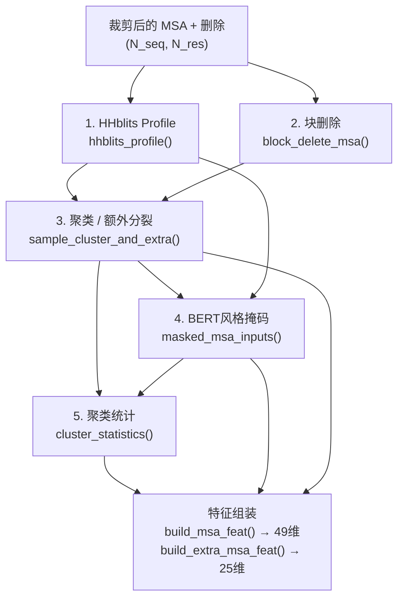

---
slug:15-msa-processing-and-masking
blog_type:normal
---

MSA处理是数据侧的基础，它将原始多序列比对转换为Evoformer所消耗的随机、掩码特征张量。minAlphaFold2实现了完整的补充材料§1.2流程——从A3M解析、块删除、聚类/额外分裂、BERT风格掩码，到表1的特征组装——该流程在[`data.py`](minalphafold/data.py)和[`a3m.py`](minalphafold/a3m.py)中作为可组合函数的确定性序列实现。本页面端到端地追踪该流程，解释每个操作的目的、其补充材料参考以及它生成的张量形状。

来源: [data.py](minalphafold/data.py#L1-L33), [a3m.py](minalphafold/a3m.py#L1-L31)

## A3M解析与词元化

流程从原始A3M文件开始——HHsuite的类FASTA MSA格式。每个序列行编码了三种字符类别：**大写字母**是已对齐的匹配状态（MSA的列），**小写字母**是相对于查询序列的插入且不占据对齐列，**破折号**是占据一列但不携带残基的删除。[`read_a3m`](minalphafold/a3m.py#L161-L191)函数将其解析为包含原始头部和大小写混合序列的[`A3M`](minalphafold/a3m.py#L94-L99)数据类。

关键的转换是[`A3M.to_aligned_msa`](minalphafold/a3m.py#L101-L138)，它将每一行拆分为对齐的大写+破折号字符串和逐列的**删除计数**——即每个匹配状态之前的小写插入数量。此删除计数成为表1中的`cluster_has_deletion` / `cluster_deletion_value`特征。对齐字符串会验证其长度一致性，然后由[`A3M.to_tokens`](minalphafold/a3m.py#L140-L158)进行整型词元化，为MSA和删除计数生成`(N_seq, N_res)`整型数组。

词元化字母表严格遵循补充材料§1.9.9：

| 词元 | ID | 字母表 | 大小 |
|---|---|---|---|
| 20种标准氨基酸 (ARNDCQEGHILKMFPSTWYV) | 0–19 | `RESTYPES` | `SEQ_ALPHABET_SIZE = 21` |
| 未知残基 | 20 | `UNK_ID` | — |
| 对齐空位 `-` | 21 | `GAP_ID` | `MSA_ALPHABET_SIZE = 23` |
| BERT掩码词元 | 22 | `MASK_ID` | — |

**target_feat**路径使用21个类别（无空位，无掩码），而**msa_feat**路径使用完整的23类字母表。规范排序与DeepMind发布的代码相匹配——例如，甘氨酸是索引7，这就是为什么在整个几何和循环模块中`aatype == 7`作为GLY检查的原因。可选的`max_seqs`参数将MSA截断至前N行（查询序列始终是第0行）。[`ungap_query_columns`](minalphafold/a3m.py#L70-L91)工具函数在下游处理之前去除查询行中的任何空位列，返回无空位的MSA、删除计数和连接的目标序列。

来源: [a3m.py](minalphafold/a3m.py#L42-L68), [a3m.py](minalphafold/a3m.py#L101-L158), [a3m.py](minalphafold/a3m.py#L70-L91)

## MSA处理流程

所有随机MSA转换由[`build_msa_features`](minalphafold/data.py#L1003-L1071)协调，它按照补充材料§1.2依序执行五个步骤：

步骤1中计算的HHblits profile既输入到BERT掩码（步骤4，作为profile替换分布），又通过聚类统计被间接消耗。步骤2-4在训练时是随机的，在推理时是恒等映射，这就是为什么它们生成的六个特征键（`msa_feat`、`msa_mask`、`extra_msa_feat`、`extra_msa_mask`、`masked_msa_target`、`masked_msa_mask`）被标记为[`MSA_SAMPLE_FEATURE_KEYS`](minalphafold/data.py#L93-L100)——根据算法2第4行，循环和集成仅对这些字段进行重采样。

来源: [data.py](minalphafold/data.py#L1003-L1071), [data.py](minalphafold/data.py#L90-L100)

## 块删除（算法1 / 补充材料 §1.2.6）

[`block_delete_msa`](minalphafold/data.py#L365-L413)实现了MSA块删除数据增强。在训练时，它从MSA中移除`num_blocks`（默认5）个连续的非查询行，每个块包含`msa_fraction_per_block × (N_seq - 1)`行。默认比例为0.3，因此每个块移除约30%的非查询序列。

核心洞察是**连续**删除是故意的：MSA由搜索工具分组并按e值排序，因此相似的序列聚集在一起。块删除移除了整个系统发育分支，为Evoformer产生了相关性较低的样本——补充材料§1.2.6明确指出了这一点。实现通过构造布尔`keep_mask`来工作，从第1..N_seq行中随机采样`num_blocks`个起始位置，并将每个块的范围标记为`False`。查询行（第0行）始终保留。当`randomize_num_blocks=True`时，块的实际数量从`[0, num_blocks]`中均匀抽取，增加了进一步的随机性。在推理时，该函数为空操作。

来源: [data.py](minalphafold/data.py#L365-L413)

## 聚类 / 额外MSA分裂（补充材料 §1.2.7）

Evoformer主栈的复杂度为O(N_seq² × N_res)，因此无法直接处理完整的MSA。[`sample_cluster_and_extra`](minalphafold/data.py#L416-L476)将（块删除后的）MSA分裂为两个池：

| 池 | 深度 | 目的 | Evoformer路径 |
|---|---|---|---|
| **聚类中心** | `msa_depth`（如128或256） | 主Evoformer栈的核心MSA | 完整Evoformer（算法7-15） |
| **额外MSA** | `extra_msa_depth`（如1024） | 剩余序列 | 浅层ExtraMsaStack（算法18） |

查询行（第0行）始终是第一个聚类中心。在训练时，剩余的`msa_depth - 1`个中心从非查询行中**无放回均匀**采样。在推理时，为了可复现性，按其现有的e值排序取前`msa_depth - 1`个非查询行。剩余行成为额外MSA池，上限为`extra_msa_depth`。该函数返回四个张量：`cluster_msa`、`cluster_deletions`、`extra_msa`、`extra_deletions`。

来源: [data.py](minalphafold/data.py#L416-L476)

## 聚类统计（补充材料 §1.2.7）

[`cluster_statistics`](minalphafold/data.py#L479-L546)从聚类/额外分裂中构建两个表1特征：**cluster_profile**和**cluster_deletion_mean**。每个额外MSA序列通过计算汉明相似度加权的一致性得分，被软分配到其最近的聚类中心——具体来说，是额外序列的独热编码与每个聚类中心profile的点积，其中**空位和掩码词元在一致性权重中被置零**。分配方式为在聚类上的argmax。一旦分配，额外序列的独热编码和删除计数就被散列累加到聚类的累加器中。最后，profile和删除均值都通过逐聚类计数（中心 + 所有分配的额外序列）进行归一化。

输出形状为`cluster_profile: (N_cluster, N_res, 23)`和`cluster_deletion_mean: (N_cluster, N_res)`。这些直接输入到[`build_msa_feat`](minalphafold/data.py#L623-L653)中，作为五个拼接通道中的两个。

来源: [data.py](minalphafold/data.py#L479-L546), [data.py](minalphafold/data.py#L515-L517)

## BERT风格MSA掩码（补充材料 §1.2.7）

[`masked_msa_inputs`](minalphafold/data.py#L559-L620)实现了驱动掩码MSA损失（公式42）的掩码语言建模目标。对于`cluster_msa`中的每个位置，以`mask_probability = 0.15`的伯努利抽取决定是否破坏该位置。对于每个被破坏的位置，从四组分混合物中采样一个**替换词元**：

| 替换来源 | 权重 | 描述 |
|---|---|---|
| MSA profile | 0.1 | 从HHblits列profile中采样 |
| 原始残基 | 0.1 | 保留真实词元（噪声） |
| 均匀氨基酸 | 0.1 | 在20种标准氨基酸上均匀分布（各0.05） |
| 掩码词元 | 0.7 | 替换为`MASK_ID = 22` |

替换概率分布通过累加各分量的加权贡献来构建。HHblits profile提供位置特异性的氨基酸频率；“相同”分量在原始词元处添加一个狄拉克δ函数；均匀分量将0.1的总概率均匀分散到20种氨基酸上；掩码词元吸收剩余的0.7。填充至23类（添加掩码词元槽位）后，重新归一化该分布。通过[`_sample_categorical`](minalphafold/data.py#L549-L556)的分类采样仅替换被掩码的位置。

该函数返回三个张量：**corrupted_msa**（输入模型）、**one_hot_target**（用于损失计算的原始词元独热编码）和**bert_mask**（选择监督位置的浮点掩码）。在推理时不进行掩码——该函数返回未修改的MSA及全零掩码。

<CgxTip>10/10/10/70的分配是刻意不对称的：70%的掩码词元替换为模型提供了关于需重建位置的强烈信号，而10%的“相同”和10%的“均匀”分量防止模型通过真实残基的缺失来平凡地检测掩码位置——这是引入MSA域的标准BERT设计选择。</CgxTip>

来源: [data.py](minalphafold/data.py#L559-L620), [data.py](minalphafold/data.py#L77-L83), [data.py](minalphafold/data.py#L549-L556)

## 特征组装（表1）

两个特征构建器将处理后的MSA数组转换为模型消耗的固定宽度浮点张量：

### msa_feat（49维）

[`build_msa_feat`](minalphafold/data.py#L623-L653)沿特征轴拼接五个通道：

| 通道 | 维度 | 来源 | 变换 |
|---|---|---|---|
| `cluster_msa`独热编码 | 23 | 掩码聚类MSA | 在23类上`F.one_hot` |
| `cluster_has_deletion` | 1 | 聚类删除 | `(deletions > 0).float()` |
| `cluster_deletion_value` | 1 | 聚类删除 | `atan(d / 3) × 2/π` |
| `cluster_profile` | 23 | 聚类统计 | 直接来自`cluster_statistics` |
| `cluster_deletion_mean` | 1 | 聚类统计 | `atan(d / 3) × 2/π` |

[`transformed_deletions`](minalphafold/data.py#L133-L135)函数应用`atan(d / 3) × 2/π`——一种有界单调变换，将无界删除计数映射到[0, 1)，防止大空位计数主导特征。输出形状：`(N_cluster, N_res, 49)`。

### extra_msa_feat（25维）

[`build_extra_msa_feat`](minalphafold/data.py#L656-L680)更简单——额外栈不应用聚类profile或掩码：

| 通道 | 维度 | 变换 |
|---|---|---|
| `extra_msa`独热编码 | 23 | 在23类上`F.one_hot` |
| `extra_msa_has_deletion` | 1 | `(deletions > 0).float()` |
| `extra_msa_deletion_value` | 1 | `atan(d / 3) × 2/π` |

输出形状：`(N_extra, N_res, 25)`。空的额外MSA情况（聚类中心之外无行）返回具有正确形状的零张量。

来源: [data.py](minalphafold/data.py#L623-L680), [data.py](minalphafold/data.py#L133-L135), [data.py](minalphafold/data.py#L64-L70)

## 删除变换与HHblits Profile

两个工具函数支撑该流程：

**[`transformed_deletions`](minalphafold/data.py#L133-L135)**应用有界变换`atan(d / 3) × 2/π`。这将原始整型删除计数（无界——一列可以有任意数量的插入）映射到范围[0, 1)。除数3的选择控制饱和速率：删除计数3映射到约0.5，而计数10+渐近接近1.0。这符合表1的规范并确保输入对梯度友好。

**[`hhblits_profile`](minalphafold/data.py#L138-L145)**计算掩码前所有MSA行的逐位置氨基酸频率。它对每行的词元进行独热编码（截断至22类的HHblits字母表，排除掩码词元）并在序列轴上求平均，生成`(N_res, 22)`的profile。该profile发挥双重作用：它为BERT掩码替换分布提供输入，并捕获聚类profile随后细化的进化保守信号。

来源: [data.py](minalphafold/data.py#L133-L145), [data.py](minalphafold/data.py#L72-L75)

## 随机性、种子设定与重采样

MSA流程中的每个随机操作都接受可选的`torch.Generator`以实现可复现的种子设定。[`build_msa_features`](minalphafold/data.py#L1003-L1071)中的协调器从`random_seed`创建单个生成器，并将其贯穿所有五个步骤——块删除、聚类/额外分裂、BERT掩码，以及用于额外MSA洗牌的辅助Python `random.Random`。这确保了相同的种子始终产生相同的破坏性MSA，这对于确定性训练和评估至关重要。

对于循环和集成（算法2第4行），[`_build_sampled_msa_features`](minalphafold/data.py#L1109-L1160)在`num_recycling_samples × num_ensemble_samples`种组合中预采样独立的MSA特征集，每个组合使用从基础种子派生的独特种子。仅[`MSA_SAMPLE_FEATURE_KEYS`](minalphafold/data.py#L93-L100)中的六个键被重采样——模板特征、目标特征和监督标签在循环和集成中保持确定性。

<CgxTip>调试MSA流程输出时，将`random_seed`设置为固定整数且`training=False`——这会禁用块删除，使用确定性聚类选择，并跳过BERT掩码，为你提供用于检查的“干净”MSA特征，同时仍生成有效的49维和25维特征张量。</CgxTip>

来源: [data.py](minalphafold/data.py#L1109-L1160), [data.py](minalphafold/data.py#L103-L124), [data.py](minalphafold/data.py#L93-L100)

## 综合汇总：流程总结

下表总结了从原始A3M到模型就绪特征的完整MSA处理流程，以及典型配置下各阶段的张量形状：

| 阶段 | 函数 | 输入形状 | 输出形状 | 随机？ |
|---|---|---|---|---|
| A3M解析 | `read_a3m` → `to_tokens` | 原始文本 | `(N_seq, N_res)` int | 否 |
| 查询去空位 | `ungap_query_columns` | `(N_seq, N_res)` | `(N_seq, N_res')` | 否 |
| 裁剪 | `crop_example` | `(N_seq, N_res')` | `(N_seq, crop_size)` | 是（训练） |
| HHblits profile | `hhblits_profile` | `(N_seq, crop_size)` | `(crop_size, 22)` | 否 |
| 块删除 | `block_delete_msa` | `(N_seq, crop_size)` | `(N_seq', crop_size)` | 是（训练） |
| 聚类/额外分裂 | `sample_cluster_and_extra` | `(N_seq', crop_size)` | `(N_cluster, crop_size)` + `(N_extra, crop_size)` | 是（训练） |
| BERT掩码 | `masked_msa_inputs` | `(N_cluster, crop_size)` | 破坏后 + 目标 + 掩码 | 是（训练） |
| 聚类统计 | `cluster_statistics` | 聚类 + 额外 | `(N_cluster, crop_size, 23)` + `(N_cluster, crop_size)` | 否 |
| msa_feat构建 | `build_msa_feat` | 聚类数据 | `(N_cluster, crop_size, 49)` | 否 |
| extra_msa_feat构建 | `build_extra_msa_feat` | 额外数据 | `(N_extra, crop_size, 25)` | 否 |

该流程确保Evoformer的每次前向传播都能接收到进化信息的新鲜、增强视图——块删除解相关MSA，BERT掩码创建自监督重建目标，而聚类/额外分裂在计算成本与信息容量之间取得平衡。

来源: [data.py](minalphafold/data.py#L1003-L1071), [a3m.py](minalphafold/a3m.py#L140-L158), [data.py](minalphafold/data.py#L317-L362)

## 导航

- **上一节**: [数据流程与裁剪](14-data-pipeline-and-cropping) —— 包裹此MSA处理的裁剪和批次整理
- **下一节**: [模型配置Profile](16-model-config-profiles) —— 如何配置`msa_depth`、`extra_msa_depth`和掩码超参数
- **相关**: [MSA与配对表示](8-msa-and-pair-representations) —— 49维的`msa_feat`如何嵌入到Evoformer的`m`表示中
- **相关**: [损失函数与FAPE](11-loss-functions-and-fape) —— 掩码MSA目标与掩码如何输入公式42