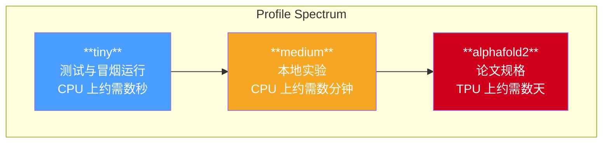
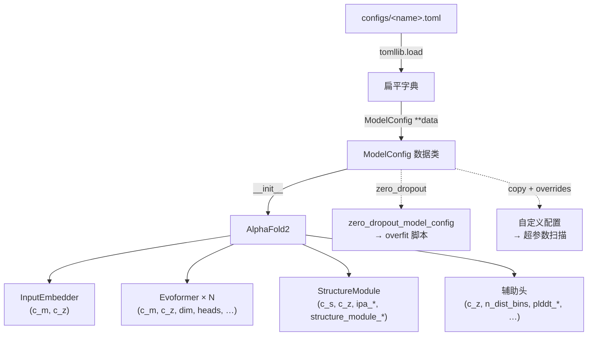

---
slug:16-model-config-profiles
blog_type:normal
---


minAlphaFold2 将**架构超参数**与**训练超参数**分离为两套独立的配置系统：模型配置（定义网络的形状和容量）与训练协议（定义优化方案）。本页重点介绍模型配置——即 `configs/` 目录下的 TOML 文件，它们控制着网络中的每个通道维度、注意力头数、模块深度和 dropout 率。与之配套的训练协议系统（`configs/training_*.toml`）则控制两阶段训练计划，并在 [两阶段训练协议](12-two-stage-training-protocol) 中介绍。

来源：[model_config.py](minalphafold/model_config.py#L1-L18), [trainer.py](minalphafold/trainer.py#L50-L53)

## 类型化 Schema：`ModelConfig`

模型读取的每个旋钮都被捕获在单一的 **`@dataclass`** —— `ModelConfig` 中。这并非松散的字典：每个字段都带有 Python 类型注解，因此 `load_model_config` 能够解析 TOML 文件，并在加载时将文件或 schema 中的拼写错误作为立即抛出的 `TypeError` 呈现，而非在前向传播中引发隐式的 `AttributeError`。Pyright 还会对整个代码库中的每次 `config.c_m` 访问进行类型检查，从而消除一整类形状不匹配的 bug。

来源：[model_config.py](minalphafold/model_config.py#L25-L107)

这 40 多个字段自然地归为六个架构部分，与附录的组织结构相呼应：

| 部分 | 字段 | 附录参考 | 关键参数 |
|---|---|---|---|
| **通道维度** | `c_m`, `c_s`, `c_z`, `c_t`, `c_e` | §1.5, §1.6 | MSA、单一、配对、模板、额外 MSA 通道 |
| **MSA 注意力** | `dim`, `num_heads`, `msa_transition_n`, `outer_product_dim` | Alg 7–10 | 头维度、头数量、过渡扩展、外积隐藏层 |
| **配对更新** | `triangle_mult_c`, `triangle_dim`, `triangle_num_heads`, `pair_transition_n` | Alg 11–15 | 三角乘法/注意力通道、过渡扩展 |
| **模板与额外 MSA** | 12 个字段 (`template_*`, `extra_*`, `num_extra_msa`) | §1.7.1, §1.7.2 | 模板堆栈维度、额外 MSA 模块数量及 dropout |
| **Evoformer 主干** | `num_evoformer`, `evoformer_msa_dropout`, `evoformer_pair_dropout` | Alg 6 | 模块数量（论文：48），行/列 dropout |
| **结构模块与头** | 15 个字段 (`structure_module_*`, `ipa_*`, `n_dist_bins` 等) | §1.8, §1.9 | IPA 几何、侧链通道、辅助头分箱 |

该数据类有意**设为非冻结**（not frozen）——配置通常只加载一次并以只读方式在线程中传递给模型，但 `zero_dropout_model_config` 等辅助函数可以借助 `dataclasses.replace` 受益，而无需手动处理 `object.__setattr__`。

来源：[model_config.py](minalphafold/model_config.py#L14-L17), [model_config.py](minalphafold/model_config.py#L25-L107)

## 加载与发现

加载器 `load_model_config` 接受单独的配置名称（在 `configs/` 目录中查找）或直接的文件系统路径：

```python
from minalphafold.trainer import load_model_config

# 按名称 — 解析为 configs/medium.toml
cfg = load_model_config("medium")

# 按路径 — 任何具有相同 schema 的 TOML 文件
cfg = load_model_config("/path/to/my_custom.toml")
```

在内部，该函数针对 `CONFIGS_DIR`（位于仓库根目录的 `configs/` 目录）解析名称，使用 `tomllib`（标准库，只读，Python 3.11+）解析 TOML，并将顶层表直接传递给 `ModelConfig` 构造函数。缺失的键或多余的键都会立即抛出 `TypeError` —— 在配置数据与模型代码的边界处实现快速失败。

两个发现函数用于枚举磁盘上可用的配置：

- **`list_available_profiles()`** —— 返回模型配置名称（排除 `training_*.toml`）
- **`list_available_training_protocols()`** —— 返回训练协议名称（名为 `training_<name>.toml` 的文件）

来源：[trainer.py](minalphafold/trainer.py#L60-L89), [trainer.py](minalphafold/trainer.py#L280-L301)

## 三种模型配置

minAlphaFold2 提供了三种模型配置，每种都针对容量与成本权衡谱上的不同点：



### `tiny` —— 缩减至 CPU 级别

每个通道维度、注意力头数和模块数量都被缩减，使得 `test_shapes` 能在数秒内运行。这是测试套件中 `MockConfig` 的默认配置，也适用于快速冒烟测试。所有 dropout 率均为 **0.0**，使前向传播具有确定性 —— 非常适合在没有随机噪声的情况下验证形状约定。

来源：[tiny.toml](configs/tiny.toml#L1-L78)

### `medium` —— 本地实验

中等规模的配置，使模型能够在 CPU 上数分钟内真正学习小蛋白质，而非数天。通道维度大约是论文规格的**一半**；Evoformer 运行 **4 个模块**而非 48 个；结构模块使用 **4 层**而非 8 层。默认情况下所有 dropout 为 0.0（适合过拟合/记忆化实验）。

来源：[medium.toml](configs/medium.toml#L1-L78)

### `alphafold2` —— 完整论文规格

与附录 §1.5 / §1.6 / §1.7 / §1.8 及算法 3–24 **完全**匹配。每个值都带有内联的附录参考。这是用于复现运行的配置，也是 `scripts/train_af2.py` 中的默认配置。

来源：[alphafold2.toml](configs/alphafold2.toml#L1-L80)

### 配置对比：关键维度

| 参数 | `tiny` | `medium` | `alphafold2` | 附录 |
|---|---|---|---|---|
| `c_m` (MSA 通道) | 32 | 128 | 256 | §1.5 |
| `c_s` (单一通道) | 32 | 192 | 384 | §1.6 |
| `c_z` (配对通道) | 16 | 64 | 128 | §1.5 |
| `num_heads` (MSA 注意力) | 4 | 8 | 8 | Alg 7 |
| `dim` (MSA 注意力头维度) | 8 | 16 | 32 | Alg 7 |
| `num_evoformer` (模块) | 1 | 4 | 48 | Alg 6 |
| `structure_module_layers` | 2 | 4 | 8 | Alg 20 |
| `structure_module_c` | 16 | 64 | 128 | Alg 20 |
| `ipa_num_heads` | 4 | 8 | 12 | Alg 22 |
| `triangle_mult_c` | 16 | 64 | 128 | Alg 11 |
| `evoformer_msa_dropout` | 0.0 | 0.0 | 0.15 | §1.11.6 |
| `evoformer_pair_dropout` | 0.0 | 0.0 | 0.25 | §1.11.6 |
| `zero_init` | true | true | true | §1.11.4 |

来源：[tiny.toml](configs/tiny.toml#L5-L78), [medium.toml](configs/medium.toml#L5-L78), [alphafold2.toml](configs/alphafold2.toml#L5-L80)

## 基于配置的实用工具函数

两个辅助函数可在不改变原有配置的情况下派生新配置：

### `copy_model_config(config, **overrides)`

`dataclasses.replace` 的轻量封装 —— 返回一个指定字段被覆盖的新 `ModelConfig`。适用于编程式参数扫描：

```python
cfg = load_model_config("medium")
wider = copy_model_config(cfg, c_z=96, num_evoformer=8)
```

来源：[trainer.py](minalphafold/trainer.py#L334-L336)

### `zero_dropout_model_config(config)`

克隆一份**所有 dropout 率强制为 0** 的配置，并在 `model_profile` 标签后附加 `_no_dropout`。这是过拟合/记忆化脚本（`scripts/overfit_*.py`）使用的配置变体，因为在这些场景下，附录 §1.11.6 中的随机正则化会阻碍模型拟合单个样本。被置零的七个字段为：`template_pair_dropout`、`extra_msa_dropout`、`extra_pair_dropout`、`evoformer_msa_dropout`、`evoformer_pair_dropout`、`structure_module_dropout_ipa` 和 `structure_module_dropout_transition`。

来源：[trainer.py](minalphafold/trainer.py#L339-L356)

## 配置在模型中的流转

`ModelConfig` 实例是每个模块构造的唯一事实来源。`AlphaFold2.__init__` 接收该实例，并将其原封不动地传递给每个子模块 —— `InputEmbedder`、`Evoformer`、`TemplatePair`、`ExtraMsaStack`、`StructureModule` 以及所有五个辅助头。每个模块仅通过普通属性访问（如 `config.c_m`、`config.num_heads` 等）读取所需字段，没有中间字典或字符串键查找。



<CgxTip>`model_profile` 字符串标签会传播至检查点元数据和产物目录名称中。当 `zero_dropout_model_config` 附加 `_no_dropout` 时，你无需检查完整配置即可区分过拟合运行产物与标准训练产物。</CgxTip>

来源：[model.py](minalphafold/model.py#L53-L96), [embedders.py](minalphafold/embedders.py#L54-L68)

## 训练协议：配套配置系统

模型配置定义了*网络的具体形态*；训练协议则定义了*如何训练它*。`configs/training_alphafold2.toml` 文件编码了论文中来自补充表 4 和 §1.11 的两阶段方案：

- **`[optimizer]`** —— 共享的 Adam 设置（β₁=0.9, β₂=0.999, ε=1e-6），梯度裁剪为 0.1，EMA 衰减 0.999，迷你批次 128，在 6.4M 样本处一次性 ×0.95 学习率衰减。
- **`[initial]`** —— 阶段 1：裁剪 256，MSA 深度 128，额外 MSA 深度 1024，学习率 1e-3 并带有 128k 样本预热，违规损失**禁用**（权重 0.0），总样本数 10M。
- **`[finetune]`** —— 阶段 2：裁剪 384，MSA 深度 512，额外 MSA 深度 5120，学习率 5e-4 **无预热**，违规损失**启用**（权重 1.0），总样本数 1.5M。

该协议被解析为包含一个 `OptimizerConfig` 和两个 `StageConfig` 实例的 `TrainingProtocol` 数据类。与模型配置一样，拼写错误会在加载时作为 `TypeError` 抛出。完整的训练循环集成详见 [两阶段训练协议](12-two-stage-training-protocol)。

来源：[training_alphafold2.toml](configs/training_alphafold2.toml#L1-L54), [trainer.py](minalphafold/trainer.py#L216-L331)

## 创建自定义配置

若要实验新的容量点，复制现有的 TOML 文件并编辑其中的值即可 —— 无需修改 Python 代码：

```bash
# 从 medium 派生一个 "small" 配置
cp configs/medium.toml configs/small.toml
# 编辑通道维度、模块数量等
```

Schema 在加载时强制执行，因此任何缺失字段或拼写错误都会立即抛出异常。除了架构参数外，唯一必需的字段是 `model_profile`（人类可读的标签）。所有数字字段必须与其声明的类型（`int` 或 `float`）匹配；`zero_init` 为 `bool` 类型。

<CgxTip>创建自定义配置时，请确保 `dim * num_heads` 能被 `c_m`（对于 MSA 注意力）和 `c_z`（对于配对注意力）整除，并且 `ipa_c * ipa_num_heads` 能被 `c_z` 整除。违反这些可整除性约束将在模型构造时而非加载时抛出形状错误。</CgxTip>

来源：[trainer.py](minalphafold/trainer.py#L60-L89), [model_config.py](minalphafold/model_config.py#L25-L107)

## 脚本与测试中的配置使用

每个入口脚本都接受一个 `--model-profile` 标志，该标志经由 `load_model_config` 流转：

| 脚本 | 默认配置 | 备注 |
|---|---|---|
| `scripts/train_af2.py` | `alphafold2` | 同时通过 `--training-protocol` 加载训练协议 |
| `scripts/overfit_processed_chain.py` | `alphafold2` | 自动应用 `zero_dropout_model_config` |
| `scripts/overfit_single_pdb.py` | `medium` | 最小单 PDB 过拟合，无 dropout |
| `scripts/modal_overfit.py` | `alphafold2` | 将 `--model-profile` 转发至远程 GPU |

测试套件使用内联的 `MockConfig` 类，该类完全镜像了 `tiny` 配置的值，确保形状测试能在任何机器上于数秒内运行。

来源：[train_af2.py](scripts/train_af2.py#L179-L180), [overfit_single_pdb.py](scripts/overfit_single_pdb.py#L49-L58), [modal_overfit.py](scripts/modal_overfit.py#L109-L110), [test_shapes.py](tests/test_shapes.py#L22-L81)

---

**下一步**：在 [两阶段训练协议](12-two-stage-training-protocol) 中了解训练协议如何驱动两阶段计划，或在 [循环与集成](17-recycling-and-ensembling) 中查看循环与集成在推理时如何与配置交互。