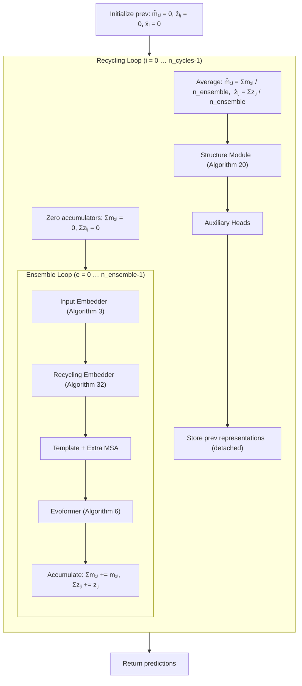
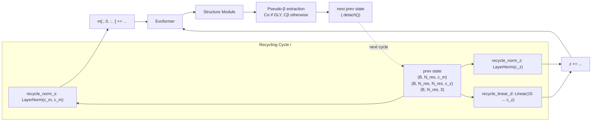

---
slug:17-recycling-and-ensembling
blog_type:normal
---


AlphaFold2 的预测精度不仅取决于其 Evoformer 主干的深度，还取决于在该主干**周围**运行的两个迭代优化机制：**循环**将上一次预测的表征重新输入模型进行下一次计算，**集成**则在单个周期内对多次随机前向传播的结果求平均。minAlphaFold2 忠实实现了这两种机制——循环遵循算法 31 / 32，集成遵循补充材料 1.11.2 / 算法 2 第 4、18、20 行——并通过精细的梯度控制确保训练稳定且推理准确。

来源: [model.py](minalphafold/model.py#L15-L51), [trainer.py](minalphafold/trainer.py#L127-L200)

## 双循环架构

`AlphaFold2` 的前向传播由两个嵌套循环构成：基于 `n_cycles` 次迭代的外层**循环**，以及基于 `n_ensemble` 次采样的内层**集成循环**。每次循环迭代都会运行完整的 输入嵌入 → 模板 → 额外 MSA → Evoformer → 结构模块 流水线，但会将*上一*周期的输出重新注入到嵌入阶段。集成循环在每个周期内仅重复运行结构模块之前的部分，累加求平均后的表征供结构模块一次性消耗。



核心洞察在于：**集成是对表征求平均，而非对预测结果求平均**——求平均后的 `m̂₁ᵢ` 和 `ẑᵢⱼ` 仅作为结构模块的*单次*输入，这使得集成的成本远低于运行 `n_ensemble` 次完整流水线。

来源: [model.py](minalphafold/model.py#L236-L377)

## 循环：迭代表征优化

### 机制（算法 31 / 32）

在首次循环周期中，“上一次”的表征为零张量，因此循环嵌入器不起作用。在随后的周期中，上一周期的三个信号会被重新注入到嵌入中：

| 信号 | 来源 | 目标 | 变换 |
|--------|--------|-------------|-----------|
| 单一表征 `m̂₁ᵢ^prev` | 上一周期的首行 MSA | 加至首行 MSA `m[:, 0, :, :]` | `LayerNorm`（无可学习仿射参数） |
| 配对表征 `ẑᵢⱼ^prev` | 平均配对表征 | 加至 `zᵢⱼ` | `LayerNorm`（无可学习仿射参数） |
| 伪 β 位点 `x̄ᵢ^prev` | 结构模块的 Cα（甘氨酸）或 Cβ（其他所有残基） | 加至 `zᵢⱼ` | 15 区间距离独热编码 → `Linear(15, c_z)` |

伪 β 约定针对甘氨酸 (aatype == 7) 选择 atom14 索引 1 (Cα)，针对其他所有残基选择索引 4 (Cβ)，这与补充材料中关于 AF2 全局配对距离特征的定义一致。

来源: [model.py](minalphafold/model.py#L268-L278), [model.py](minalphafold/model.py#L419-L437)

### 15 区间循环距离嵌入

循环距离嵌入采用了比 distogram 头**更粗粒度的分箱方案**：15 个区间覆盖 [3.375, 21.375] Å，间距为 1.25 Å，而 distogram 则在 [2, 22] Å 范围内划分了 64 个区间。此粗粒度方案由算法 32 规定，并在 `recycling_distance_bin` 中实现——该函数通过 `torch.cdist` 计算配对的 Cβ–Cβ 距离，然后根据算法 5 将每个距离分配至最近的区间中心。

来源: [utils.py](minalphafold/utils.py#L71-L80)

### 训练过程中的梯度控制

训练时采用**随机采样周期数**，以防模型对固定的循环迭代次数过拟合。在每个训练步中，从 `{1, …, n_cycles}` 中均匀抽取 `n'`，且仅有**最后**一个周期携带梯度——所有更早的周期都在 `torch.set_grad_enabled(False)` 上下文中执行，其输出在传入下一周期前均执行了 `.detach()`。这实现了算法 31 第 4 行：反向传播仅精确流经一次展开的循环迭代，在保持内存和计算量可控的同时，依然能有效训练循环路径。

```python
# Sampled cycle count (training only)
if sample_recycles:
    n_cycles = int(torch.randint(1, n_cycles + 1, (1,)).item())

# Gradient gating: only the last cycle is unrolled for backward
for i in range(n_cycles):
    is_last = (i == n_cycles - 1)
    with torch.set_grad_enabled(is_last and outer_grad):
        ...
    # Store detached representations for the next cycle
    single_rep_prev = msa_first_row.detach()
    z_prev = pair_repr.detach()
    x_prev = pseudo_beta.detach()
```

来源: [model.py](minalphafold/model.py#L204-L212), [model.py](minalphafold/model.py#L240-L241), [model.py](minalphafold/model.py#L424-L437)

## 集成：随机表征平均

### 哪些内容参与求平均（哪些不参与）

集成在每个循环周期内运行 `n_ensemble` 次结构模块前的流水线，每次使用不同的随机输入样本（掩码 MSA 特征、dropout 模式）。**仅**首行 MSA `m₁ᵢ` 和配对表征 `zᵢⱼ` 会被累加并求平均：

```
m̂₁ᵢ = (1/N_ensemble) Σ_e m₁ᵢ⁽ᵉ⁾
ẑᵢⱼ = (1/N_ensemble) Σ_e zᵢⱼ⁽ᵉ⁾
```

单一表征 `sᵢ = Linear(m̂₁ᵢ)` 在求平均*之后*计算，由投影的线性性质可知，这等同于对 `sᵢ` 本身求平均。**完整的 MSA 表征** `mₛᵢ` **不**参与求平均——掩码 MSA 头消耗的是最后一次集成样本的完整 MSA 表征，这仅在推理阶段 `n_ensemble > 1` 时才有意义。

| 表征 | 是否求平均？ | 原理 |
|----------------|-----------|-----------|
| `m₁ᵢ`（首行 MSA） | ✅ | 提供单一表征 `sᵢ` → 结构模块 |
| `zᵢⱼ`（配对表征） | ✅ | 提供结构模块 + distogram + TM 头 |
| `mₛᵢ`（完整 MSA，s > 1） | ❌ | 仅被掩码 MSA 头消耗（仅限训练） |
| `sᵢ`（单一表征） | ✅（依线性性质） | `Linear(avg)` = `avg(Linear)` |

来源: [model.py](minalphafold/model.py#L240-L377)

### 特征切片索引

当 `n_cycles > 1` 或 `n_ensemble > 1` 时，数据流水线可能会通过前插外层 `[cycle, ensemble, ...]` 轴，预先物化多个随机特征样本（`msa_feat`、`extra_msa_feat`）。`_sampled_feature_slice` 辅助函数会剥离现有的采样轴，使模型始终只看到单个切片：

```python
if tensor.ndim == base_ndim + 2:   # [cycle, ensemble, ...]
    return tensor[cycle_index, ensemble_index]
if tensor.ndim == base_ndim + 1:   # [cycle, ...]
    return tensor[cycle_index]
return tensor                        # no sampling axes
```

这能优雅地处理三类数据集：预采样所有 `N_cycle × N_ensemble` 抽取的数据集、仅按周期采样的数据集，以及提供单一固定样本的数据集。

来源: [model.py](minalphafold/model.py#L154-L176)

## 训练与推理配置

论文与 minAlphaFold2 在训练和推理时使用了**不同的循环/集成设置**，这反映了训练成本与预测质量之间的权衡：

| 设置 | 训练 | 推理 | 原理 |
|---------|----------|-----------|-----------|
| `n_cycles` | 4（从 {1,…,4} 中采样） | 3（固定） | 补充材料 1.10：推理时 3 个周期；训练时最大 4 个周期并均匀采样 |
| `n_ensemble` | 1 | 8（用于排序预测） | 补充材料 1.11.2：集成仅在推理时使用 |
| `sample_recycles` | `True` | `False` | 随机周期数可防止对固定深度过拟合 |
| 梯度流 | 仅最后周期 | N/A (`no_grad`) | 算法 31 第 4 行 |

`TrainingConfig` 默认设置 `n_cycles=1, n_ensemble=1` 以方便教学；论文规范的训练值为 `n_cycles=4, n_ensemble=1`。`model_inputs_from_batch` 函数会将这些配置值传入每次 `AlphaFold2.forward` 调用中。

来源: [trainer.py](minalphafold/trainer.py#L187-L188), [trainer.py](minalphafold/trainer.py#L630-L648)

## 配置参考

循环和集成在**训练配置**层级（而非模型配置 TOML）进行控制，因为它们属于操作设置而非架构超参数：

| 参数 | 类型 | 默认值 | 论文值 | 描述 |
|-----------|------|---------|-------------|-------------|
| `n_cycles` | `int` | 1 | 4（训练）/ 3（推理） | 最大循环迭代次数 |
| `n_ensemble` | `int` | 1 | 1（训练）/ 8（推理） | 每个周期的集成样本数 |
| `sample_recycles` | `bool\|None` | `None` | — | 自动解析为 `self.training`；可强制覆写 |
| `detach_rotations` | `bool` | `True` | — | 结构模块是否分离旋转梯度 |

<CgxTip>调试循环时，请在前向传播后检查 `model.last_n_cycles` 和 `model.last_n_ensemble`——它们存储了实际使用的值（包括训练期间任何采样缩减后的值）。这也是输出字典中作为 `sampled_n_cycles` 和 `sampled_n_ensemble` 报告的内容。</CgxTip>

来源: [model.py](minalphafold/model.py#L192-L196), [trainer.py](minalphafold/trainer.py#L162-L200)

## 循环状态的数据流

三个循环状态张量在各周期间形成了一个自指循环。理解它们的形状和变换对于调试或扩展流水线至关重要：



在第一个周期（`i = 0`）中，三个 prev 张量全为零——`LayerNorm(0)` 和 `Linear(one_hot(0))` 均产生零，因此循环的加法操作会干净地抵消，模型退化为单次前向传播。此零初始化在算法 2 第 1 行中明确指出。

来源: [model.py](minalphafold/model.py#L231-L234), [model.py](minalphafold/model.py#L60-L64)

## 实践指南

**推理时选择 `n_cycles`**：论文在推理时使用了 3 个周期。收益递减效应会迅速显现——大部分结构改进发生在周期 1→2 中，周期 3 仅提供边缘优化。若需快速近似预测，1–2 个周期通常已足够。

**推理时集成**：推理时设置 `n_ensemble > 1` 可提供随机平均，从而改进排序预测的质量。由于仅重复运行结构模块前的流水线（高开销的 Evoformer 主干，不含结构模块），每增加一个集成样本的代价约为一次完整前向传播的 80%。论文针对排序预测设定的 `n_ensemble = 8` 是质量与成本的权衡。

**带循环的训练**：务必设置 `sample_recycles = True`（训练时的默认值），以避免对特定的周期深度过拟合。按周期隔离梯度的设计意味着，无论 `n_cycles` 多大，显存开销均按*单次*展开的周期缩放，因此训练时增加周期数对显存影响甚微——仅有计算成本呈线性增长。

来源: [model.py](minalphafold/model.py#L204-L212), [model.py](minalphafold/model.py#L405-L417)

## 与其他模块的关系

循环和集成位于调用栈顶端，调度着所有其他模块。循环嵌入器的 `recycle_norm_s` 和 `recycle_norm_z` 是训练期间学习的 `LayerNorm` 模块（补充材料 1.10），而 `recycle_linear_d` 是从 15 区间距离空间到 `c_z` 的可学习线性投影。它们是仅有的循环专属参数——其他所有参数均复用自主流水线。[零初始化与参数 EMA](13-zero-init-and-parameter-ema) 协议不会对这些循环参数进行零初始化，因为它们是采用默认方案初始化的标准 `LayerNorm` 和 `Linear` 模块。[模型配置档案](16-model-config-profiles) 不包含循环/集成设置；这些设置隶属于 `TrainingConfig` 并在调用时传入。