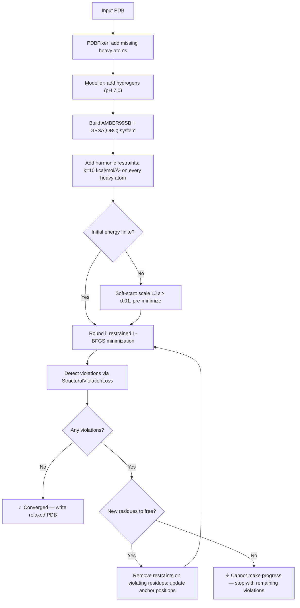
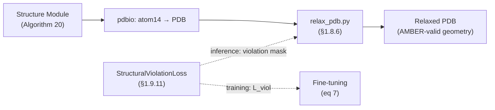

---
slug:18-structure-relaxation
blog_type:normal
---


结构模块的 IPA 驱动帧迭代产生的原子坐标，虽然在骨架层面上几何合理，但可能存在**空间位阻冲突、键长扭曲或肽键几何结构破坏**——尤其是在低置信度区域的侧链中。结构弛豫是预测后的修正手段：一种基于 **AMBER99SB 力场**的迭代受限能量最小化过程，可在解决违规问题的同时保留预测的折叠结构。本页介绍 minAlphaFold2 对 AlphaFold2 补充材料 §1.8.6 的忠实移植，即 `relax_pdb.py` 脚本，以及其与已驱动微调的 `StructuralViolationLoss` 之间的紧密耦合。

来源：[relax_pdb.py](/scripts/relax_pdb.py#L1-L42), [losses.py](/minalphafold/losses.py#L1050-L1100)

## 迭代受限弛豫循环

核心算法是一个 **最小化 → 检测违规 → 释放残基 → 重复** 的迭代循环，直接遵循补充材料 §1.8.6（第 31 页）：

> *"在每一轮中，我们对 AMBER99SB 力场进行最小化，并附加谐波限制以使系统保持在其输入结构附近。这些限制独立施加于重原子上，弹簧常数为 10 kcal/mol Ų。一旦最小化器收敛，我们就确定哪些残基仍包含违规。然后，我们移除这些残基内所有原子的限制，并从上一次迭代的最小化结构开始，再次执行受限最小化。此过程重复进行，直到所有违规均被解决。"*

限制起到了双重作用：它们将折叠良好的区域锚定到预测结果上（防止物理引擎使蛋白质展开），同时允许新释放的残基不受约束地向物理有效的几何结构移动。



循环在以下三种情况下终止：(1) 零剩余违规 → 收敛成功，(2) 所有违规残基均已解除限制 → 无法取得进一步进展，或 (3) `max_rounds` 耗尽。在第 (2) 和 (3) 种情况下，仍会写入输出 PDB，但调用方应检查 `round_stats` 以评估残留问题。

来源：[relax_pdb.py](/scripts/relax_pdb.py#L209-L398)

## 流水线阶段详解

### 阶段 1 — PDB 修复与氢原子放置

来自结构模块的原始预测 PDB 可能缺乏氢原子，并且残基记录可能不完整。流水线使用 **PDBFixer** 添加缺失的重原子（设置 `missingResidues = {}` 以防止填补空缺），并使用 OpenMM 的 **Modeller** 在 pH 7.0 下放置氢原子。在严重退化的输入下，氢原子放置可能会失败——当重原子重叠时，Modeller 使用的内部最小化会遇到无穷大的 Lennard-Jones 势。这会触发一个 `RuntimeError`，其解释性消息区分了收敛预测（轻微破坏的肽键，可正常处理）与早期训练检查点（近乎同一的刚体帧，所有原子位于同一坐标，无法处理）。

来源：[relax_pdb.py](/scripts/relax_pdb.py#L238-L267)

### 阶段 2 — 力场与隐式溶剂

系统使用 **AMBER99SB** 加上 **GBSA-OBC** 隐式溶剂构建——这是蛋白质能量最小化的标准组合，避免了使用显式水的需要。值得注意的是，`constraints=None` 是刻意设置的：SHAKE 风格的氢键限制在原始预测的扭曲初始几何结构上可能会失败，因此最小化器在无约束下运行。

来源：[relax_pdb.py](/scripts/relax_pdb.py#L268-L275)

### 阶段 3 — 逐粒子谐波限制

限制被实现为 OpenMM 的 `CustomExternalForce`，其能量表达式为：

```
E_restraint = 0.5 * k_active * ((x - x0)² + (y - y0)² + (z - z0)²)
```

`k_active` 参数是**逐粒子**的，允许在不重建力场系统的情况下选择性移除限制。在初始化时，每个重原子的 `k_active = k_full`（排除氢原子，与论文一致）。当残基被释放时，其所有重原子的 `k_active` 均设为 0。锚点位置 `(x0, y0, z0)` 在每轮中更新为当前最小化坐标，因此仍受限制的原子将固定在其最新的弛豫位置，而非原始输入位置。

| 参数 | 值 | 来源 |
|-----------|-------|--------|
| 弹簧常数 k | 10 kcal/mol/Ų | 补充材料 §1.8.6 |
| 受限原子 | 所有重原子（非氢） | 补充材料 §1.8.6 |
| 锚点更新 | 每轮（当前位置） | AF2 参考实现 |
| 限制移除 | 残基级别粒度 | 补充材料 §1.8.6 |

来源：[relax_pdb.py](/scripts/relax_pdb.py#L276-L322)

### 阶段 4 — 软启动回退

当初始势能非有限（无穷大或 NaN）时，L-BFGS 最小化器无法迈出第一步。这种情况发生在严重的空间位阻冲突产生无穷大的 Lennard-Jones 势时。`_soft_start_minimize` 函数通过暂时将每个粒子的 Lennard-Jones ε 参数缩放至其真实值的 1% 来处理此问题，在弛豫容差下运行简短的预最小化，然后恢复原始 ε。§1.8.6 中未描述此操作，但与 DeepMind 参考代码的 `amber_minimize.py` 在相同情况下的行为一致。

来源：[relax_pdb.py](/scripts/relax_pdb.py#L131-L159)

## 违规检测 — 训练与弛豫的桥梁

一个关键的设计决策：弛豫期间的违规检测**复用相同的 `StructuralViolationLoss` 类**，该类在微调期间计算 L_viol。这确保了训练与事后弛豫之间的标准位级一致——在微调期间对模型进行惩罚的容差，与在弛豫期间检查的容差完全相同。

检测函数 `_detect_violating_residues` 将 OpenMM 位置转换为 atom14 约定，然后评估三种违规子类型：

| 子类型 | 补充材料参考 | 容差 | 描述 |
|----------|---------------------|-----------|-------------|
| 残基间键长 | 公式 44 | τ = 12 σ_lit | C-N 肽键偏离文献均值 |
| 残基间键角 | 公式 45 | τ = 12 σ_lit | CA-C-N 或 C-N-CA 余弦偏离文献值 |
| 残基间冲突 | 公式 46 | τ = 1.5 Å 重叠 | VDW 半径之和减去距离超过阈值 |
| 残基内边界 | 公式 46（内部） | 来自 `make_atom14_dists_bounds` | 原子间距离违反残基内边界 |

三个逐残基的掩码通过**逻辑或（OR）组合**为一个布尔值：如果某残基的*任何*原子触发了*任何*类型的违规，则该残基被标记。从 OpenMM 的逐原子拓扑到 atom14 约定的转换，使用 `restype_name_to_atom14_names` 将每个残基的重原子映射到其规范的 14 槽排序中，并跳过氢原子和非标准原子。

来源：[relax_pdb.py](/scripts/relax_pdb.py#L78-L129), [losses.py](/minalphafold/losses.py#L1100-L1200)

## StructuralViolationLoss 内部机制

`StructuralViolationLoss` 实现了补充材料 §1.9.11 中的公式 44–47，既用作训练损失项（根据公式 7 在微调中权重为 1.0），也用作弛豫的违规检测器。其三个子方法均返回逐残基和逐原子的掩码以及标量损失：

**`between_residue_bond_and_angle_loss`** — 计算 C-N 键长和两个肽键角度（CA-C-N, C-N-CA）的平底 L1 惩罚。平底阈值为 `violation_tolerance_factor × σ_lit`，因此只有超过 12σ 的偏差才会产生贡献。脯氨酸独特的 C-N 键长通过 `residue_types` 上的条件判断来处理。`has_no_gap_mask` 确保仅评估序列上相邻的残基。

**`between_residue_clash_loss`** — 计算不同残基上重原子之间的成对 VDW 重叠（排除成键的 C-N 对和形成二硫键的 SG–SG 对）。重叠量为 `max(0, r_i_vdw + r_j_vdw - τ_clash - d_ij)`，因此只有距离小于其半径之和减去 1.5 Å 的原子才会受到惩罚。

**`within_residue_violation_loss`** — 根据 `make_atom14_dists_bounds` 预计算的距离边界（下限和上限）检查残基内原子对。这可以捕获侧链原子折叠进骨架或以其他方式违反已知立体化学结构的情况。

来源：[losses.py](/minalphafold/losses.py#L1100-L1399)

## 漂移测量与输出诊断

在收敛（或提前停止）后，流水线测量相对于输入的**最大位置漂移**，并将其分解为三个类别：

| 指标 | 包含的原子 | 解释 |
|--------|---------------|----------------|
| `max_backbone_drift_angstrom` | 仅 N, CA, C | 折叠保留——对于预测良好的区域应小于 1 Å |
| `max_restrained_heavy_drift_angstrom` | 保持受限残基中的所有非氢原子 | 局部几何结构调整 |
| `max_any_heavy_drift_angstrom` | 所有非氢原子 | 最坏情况下的移动，通常发生在已释放（违规）残基中 |

`relax_pdb()` 的返回字典提供了完整的审计跟踪：输入/输出路径、初始和最终能量、软启动使用情况、收敛标志、漂移指标、结束时未受限残基数量，以及逐轮统计信息（能量、按类型划分的违规计数、释放残基数）。

来源：[relax_pdb.py](/scripts/relax_pdb.py#L402-L450)

## CLI 接口与配置

该脚本作为独立的命令行工具调用：

```bash
pip install -e '.[relax]'          # 安装 openmm + pdbfixer
python scripts/relax_pdb.py path/to/predicted.pdb
```

这将在输入文件旁生成 `predicted_relaxed.pdb`。完整参数列表：

| 标志 | 默认值 | 补充材料依据 |
|------|---------|-----------------|
| `--restraint-k` | 10.0 | §1.8.6 弹簧常数 (kcal/mol/Ų) |
| `--max-rounds` | 10 | 迭代循环的实际限制 |
| `--max-iterations-per-round` | 0（无界） | §1.8.6 每轮 L-BFGS 预算 |
| `--force-tolerance` | 10.0 | 收敛阈值 (kJ/mol/nm ≈ 2.39 kcal/mol) |
| `--violation-tolerance-factor` | 12.0 | §1.9.11 键/角容差（σ_lit 单位） |
| `--clash-overlap-tolerance` | 1.5 | §1.9.11 冲突容差 τ (Å) |

`pyproject.toml` 中的 `relax` 可选依赖组指定了 `openmm>=8.0` 和 `pdbfixer>=1.9`。为保持项目纯 PyTorch 的设计理念，这些依赖被有意排除在核心依赖之外——弛豫是一种事后物理清理，而非神经网络本身的一部分。

来源：[relax_pdb.py](/scripts/relax_pdb.py#L452-L550), [pyproject.toml](/pyproject.toml#L40-L46)

## 与更广泛流水线的关系

结构弛豫运行在完整推理流水线**之后**——在循环收敛之后，在集成平均"表示E"之后，以及在结构模块通过 `4` 输出 atom14 坐标之后。它是不可微的，不会将梯度回传至模型。其目的纯粹是清理最终输出的物理结构，以便下游工具（分子动力学、对接、结构验证）接收化学合理的坐标。



共享的 `StructuralViolationLoss` 创建了重要的一致性保证：如果模型使用 L_viol 进行了微调（根据公式 7 权重为 1.0），则弛豫的违规检测器将应用**相同的** σ_lit 和 τ 阈值。因此，一个经过良好微调的模型应该需要更少的弛豫轮次，因为训练损失已经惩罚了弛豫旨在解决的违规问题。

<CgxTip>-training checkpoints, the root cause is typically near-identity rigid frames producing overlapping atoms — the hydrogen-placement step will fail before relaxation even begins. This is expected and does not indicate a bug in the relaxation code.</CgxTip>

<CgxTip>The `k_active` per-particle restraint design avoids rebuilding the OpenMM `System` between rounds — only `setParticleParameters` + `updateParametersInContext` are called, which is orders of magnitude cheaper than re-creating the force field.</CgxTip>

来源：[relax_pdb.py](/scripts/relax_pdb.py#L1-L550), [losses.py](/minalphafold/losses.py#L1050-L1399), [pdbio.py](/minalphafold/pdbio.py#L1-L60)

## 后续步骤

- 了解使弛豫成为可能的损失函数：[损失函数与 FAPE](11-loss-functions-and-fape)
- 了解产生原始预测的结构模块：[结构模块与 IPA](7-structure-module-and-ipa)
- 了解激活 L_viol 的微调协议：[两阶段训练协议](12-two-stage-training-protocol)
- 了解控制推理参数的配置文件：[模型配置文件](16-model-config-profiles)