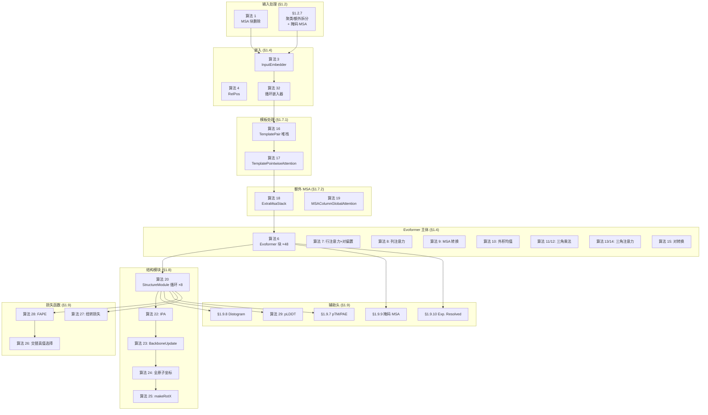

---
slug:19-supplement-algorithm-mapping
blog_type:normal
---

本0E,<41A.<1+DG92!78E$2 supplementary6<!A),!FG!., 本页面提供了 AlphaFold2 补充论文中的E编号算法（算法 1–32）与 minAlphaFold2 代码库中具体实现之间的**权威交叉引用**。补充材料中的每个算法都映射到特定的类、函数或代码路径——此表是你将论文追溯至可运行代码的罗塞塔石碑。

## 算法与代码交叉引用表

此映射的核心是下表。算法编号对应于补充信息中编号的伪代码块；补充材料章节引用（例如 §1.7.1）涵盖仅有文字描述的规范，这些规范虽缺少独立的算法框，但仍然定义了具体的计算。

| 算法 | 补充 § | 名称 | 实现类 / 函数 | 源文件 |
|-----------|-------------|------|--------------------------------|-------------|
| 1 | §1.2.6 | MSA 块删除 | `block_delete*msa()` | [data.py](minalphafold/data.py) |
| 2 | §1.4 | 完整模型（循环 + 集成循环） | `AlphaFold2` | [model.py](minalphafold/model.py) |
| 3 | §1.4 | 输入嵌入（MSA + 对） | `InputEmbedder` | [embedders.py](minalphafold/embedders.py) |
| 4 | §1.4 | 相对位置编码 | `RelPos` | [embedders.py](minalphafold/embedders.py) |
| 6 | §1.4 | Evoformer 块 | `Evoformer` | [evoformer.py](minalphafold/evoformer.py) |
| 7 | §1.4 | 带对偏置的 MSA 行注意力 | `MSARowAttentionWithPairBias` | [evoformer.py](minalphafold/evoformer.py) |
| 8 | §1.4 | MSA 列注意力 | `MSAColumnAttention` | [embedders.py](minalphafold/embedders.py) |
| 9 | §1.4 | MSA 转换 | `MSATransition` | [embedders.py](minalphafold/embedders.py) |
| 10 | §1.4 | 外积均值 | `OuterProductMean` | [embedders.py](minalphafold/embedders.py) |
| 11 | §1.4 | 三角乘法（出向） | `TriangleMultiplicationOutgoing` | [embedders.py](minalphafold/embedders.py) |
| 12 | §1.4 | 三角乘法（入向） | `TriangleMultiplicationIncoming` | [embedders.py](minalphafold/embedders.py) |
| 13 | §1.4 | 三角注意力（起始节点） | `TriangleAttentionStartingNode` | [embedders.py](minalphafold/embedders.py) |
| 14 | §1.4 | 三角注意力（终止节点） | `TriangleAttentionEndingNode` | [embedders.py](minalphafold/embedders.py) |
| 15 | §1.4 | 对转换 | `PairTransition` | [embedders.py](minalphafold/embedders.py) |
| 16 | §1.7.1 | 模板对堆栈 | `TemplatePair` | [embedders.py](minalphafold/embedders.py) |
| 17 | §1.7.1 | 模板逐点注意力 | `TemplatePointwiseAttention` | [embedders.py](minalphafold/embedders.py) |
| 18 | §1.7.2 | 额外 MSA 堆栈 | `ExtraMsaStack` | [embedders.py](minalphafold/embedders.py) |
| 19 | §1.7.2 | MSA 列全局注意力 | `MSAColumnGlobalAttention` | [embedders.py](minalphafold/embedders.py) |
| 20 | §1.8 | 结构模块（迭代循环） | `StructureModule` | [structure_module.py](minalphafold/structure_module.py) |
| 21 | §1.8.1 | 真实值的刚体组帧 | `atom14_to_rigid_group_frames()` | [geometry.py](minalphafold/geometry.py) |
| 22 | §1.8.2 | 不变点注意力 | `InvariantPointAttention` | [structure_module.py](minalphafold/structure_module.py) |
| 23 | §1.8.3 | 骨架更新 | `BackboneUpdate` | [structure_module.py](minalphafold/structure_module.py) |
| 24 | §1.8.4 | 全原子坐标装配 | `compute_all_atom_coordinates()` | [structure_module.py](minalphafold/structure_module.py) |
| 25 | §1.8.4 | 绕 x 轴旋转 | `make_rot_x()` | [structure_module.py](minalphafold/structure_module.py) |
| 26 | §1.8.5 | 180°歧义交替真值选择 | `select_best_atom14_ground_truth()` | [losses.py](minalphafold/losses.py) |
| 27 | §1.9.1 | 扭转角损失 | `TorsionAngleLoss` | [losses.py](minalphafold/losses.py) |
| 28 | §1.9.2 | 帧对齐点误差（FAPE） | `frame_aligned_point_error()` | [losses.py](minalphafold/losses.py) |
| 29 | §1.9.6 | pLDDT 置信度头 | `PLDDTHead` | [heads.py](minalphafold/heads.py) |
| 31 | §1.10 | 循环（随机循环计数） | `AlphaFold2.forward()`（循环） | [model.py](minalphafold/model.py) |
| 32 | §1.10 | 循环嵌入 | `AlphaFold2.__init__()`（循环范数 + 线性层） | [model.py](minalphafold/model.py) |

来源：[model.py](minalphafold/model.py#L1-L440), [evoformer.py](minalphafold/evoformer.py#L1-L195), [embedders.py](minalphafold/embedders.py#L1-L200), [structure_module.py](minalphafold/structure_module.py#L1-L20), [losses.py](minalphafold/losses.py#L1-L35), [heads.py](minalphafold/heads.py#L1-L16), [geometry.py](minalphafold/geometry.py#L1-L43), [data.py](minalphafold/data.py#L1-L33)

## 流水线架构 —— 算法执行位置

补充材料中的算法编号并不遵循执行顺序。下图展示了通过 `AlphaFold2.forward()` 的**实际数据流**，在每个阶段均标注了算法编号，以便你能在同一视图中同时查看论文的逻辑分解和运行时序列。

来源：[model.py](minalphafold/model.py#L178-L440), [evoformer.py](minalphafold/evoformer.py#L28-L95), [structure_module.py](minalphafold/structure_module.py#L117-L313)

## 算法 2 —— 顶层编排器

算法 2 是控制整个前向传播的主循环。它完全在 `AlphaFold2.forward()` 中实现，将循环周期、集成平均以及每个下游算法的顺序调用串联在一起。有三个机制值得特别关注：

**循环（算法 31）** —— 外层循环运行 `n_cycles` 次迭代（默认为 3）。在训练期间，会采样一个随机数 `n' ~ Uniform(1, n_cycles)`，并且只有最后一次迭代携带梯度；更早的迭代通过 `torch.set_grad_enabled(is_last and outer_grad)` 进行分离。上一周期表示 `m_1i^prev`、`z_ij^prev` 和伪 β 位置会在下一个周期中通过算法 32 反馈回来。

**集成（§1.11.2）** —— 在每个周期内，结构模块前的流水线运行 `n_ensemble` 次。只有第一行 MSA `m_1i` 和对表示 `z_ij` 会被累积并取平均（`/= n_ensemble`）。完整的 MSA 表示*不*进行平均——掩码 MSA 头直接使用最后一次集成样本的完整表示。训练时始终使用 `n_ensemble = 1`。

**梯度检查点（§1.11.8）** —— 在训练期间，Evoformer 块和额外 MSA 块均使用 `torch.utils.checkpoint`，这与补充材料中“存储块之间传递的激活，并在反向传播期间在块内重新计算”的规定一致。

来源：[model.py](minalphafold/model.py#L178-L399)

## Evoformer 子算法分解

算法 6（Evoformer 块）是模型的计算核心，在完整配置中堆叠了 48 次。每个块以固定顺序执行七个子算法，并应用特定的丢弃规则。下表记录了精确的序列、残差连接模式以及每一步应用的丢弃变体。

| 步骤 | 子算法 | 类 | 残差 | 丢弃 |
|------|--------------|-------|----------|---------|
| 1 | 算法 7 — 带对偏置的 MSA 行注意力 | `MSARowAttentionWithPairBias` | `m += dropout_rowwise(z)` | MSA 逐行丢弃 |
| 2 | 算法 8 — MSA 列注意力 | `MSAColumnAttention` | `m += col_att(m)` | **无** |
| 3 | 算法 9 — MSA 转换 | `MSATransition` | `m += transition(m)` | **无** |
| 4 | 算法 10 — 外积均值 | `OuterProductMean` | `z += opm(m)` | — |
| 5 | 算法 11 — 出向三角乘法 | `TriangleMultiplicationOutgoing` | `z += dropout_rowwise(...)` | 对表示逐行丢弃 |
| 6 | 算法 12 — 入向三角乘法 | `TriangleMultiplicationIncoming` | `z += dropout_rowwise(...)` | 对表示逐行丢弃 |
| 7 | 算法 13 — 起始节点三角注意力 | `TriangleAttentionStartingNode` | `z += dropout_rowwise(...)` | 对表示逐行丢弃 |
| 8 | 算法 14 — 终止节点三角注意力 | `TriangleAttentionEndingNode` | `z += dropout_columnwise(...)` | 对表示**逐列**丢弃 |
| 9 | 算法 15 — 对转换 | `PairTransition` | `z += transition(z)` | **无** |

丢弃的不对称性是刻意为之的：补充材料（§1.11.6）规定起始节点注意力采用逐行丢弃，而终止节点注意力采用逐列丢弃。这种方向掩码确保了丢弃模式能够遵循对表示的非对称结构。

来源：[evoformer.py](minalphafold/evoformer.py#L28-L95), [evoformer.py](minalphafold/evoformer.py#L97-L194)

## 结构模块子算法分解

算法 20 迭代固定数量的层（默认为 8），每层执行 IPA、一个转换 MLP 以及骨架帧更新。为了辅助监督，在每一层都会计算侧链扭转角和全原子坐标。

| 步骤 | 子算法 | 类 / 函数 | 操作 |
|------|--------------|------------------|-----------|
| 1 | — | `LayerNorm` + `Linear` | 将 `s_i` 投影到内部维度；规范化对表示 |
| 2 | — | 恒等初始化 | 初始化刚体帧 `T_i = (I, 0)`（黑洞初始化） |
| 3 | 算法 22 | `InvariantPointAttention` | `s += IPA(s, z, R, t)` |
| 4 | — | `LayerNorm` + `Dropout` | `s = LN(Dropout(s))` |
| 5 | — | 3层 ReLU MLP | `s += Transition(s)`（最后一次零初始化的转换） |
| 6 | — | `LayerNorm` + `Dropout` | `s = LN(Dropout(s))` |
| 7 | 算法 23 | `BackboneUpdate` | `T_i ← T_i ∘ BackboneUpdate(s_i)` 经由四元数旋转 |
| 8 | §1.8.4 | `MultiRigidSidechain` → `AngleResnet` | 预测 7 个扭转角 `(ω, φ, ψ, χ1-χ4)`，表示为 `(sin, cos)` |
| 9 | 算法 24 | `compute_all_atom_coordinates` | 展开 8 个刚体组帧 → atom14 位置 |
| 10 | 算法 25 | `make_rot_x` | 绕 x 轴的扭转旋转（在算法 24 内部使用） |
| 11 | — | 对旋转执行 `detach()` | 在迭代间对旋转停止梯度（最终迭代后不执行） |

一个关键细节：对旋转的**停止梯度**（步骤 11）应用在骨架更新*之后*、下一次迭代的 IPA *之前*。这意味着当前迭代的侧链 FAPE 和扭转损失仍然可以通过未分离的旋转接收梯度，而下一次迭代的 IPA 看到的是一个没有旋转梯度路径的帧——防止了通过链式帧复合产生杠杆效应。最终迭代完全跳过分离操作。

来源：[structure_module.py](minalphafold/structure_module.py#L117-L313), [structure_module.py](minalphafold/structure_module.py#L316-L541), [structure_module.py](minalphafold/structure_module.py#L543-L610), [structure_module.py](minalphafold/structure_module.py#L675-L779)

## 预测头 —— 补充材料公式

五个辅助预测头从 Evoformer 或结构模块的输出进行投影。根据 §1.11.4，每个头的输出投影均**零初始化**，因此在第 0 步，每个头都会输出均匀分布，只有 FAPE 将梯度信号传入主体。

| 头 | 补充材料 | 输入 | 输出 | 损失类 |
|------|-----------|-------|--------|------------|
| Distogram | §1.9.8, 公式 41 | 平均后的 `z_ij` | `(N_res, N_res, n_dist_bins)` logits（已对称化） | `DistogramLoss` |
| pLDDT | 算法 29, §1.9.6 | IPA 后的单一表示 `s_i` | `(N_res, n_plddt_bins)` logits | `PLDDTLoss` |
| 掩码 MSA | §1.9.9, 公式 42 | 完整 MSA 表示 `m_si`（最后一次集成） | `(N_seq, N_res, 23)` logits | `MSALoss` |
| TM-score / PAE | §1.9.7, 公式 38–40 | 平均后的 `z_ij` | `(N_res, N_res, n_pae_bins)` logits（非对称） | `TMScoreLoss` |
| Exp. Resolved | §1.9.10, 公式 43 | Evoformer 单一表示 `s_i`（结构模块前） | `(N_res, 37)` 二元 logits | `ExperimentallyResolvedLoss` |

**输入路由**非常重要：pLDDT 消费结构模块 IPA 后的单一表示，而实验分辨头消费 Evoformer 结构模块前的单一表示（`s_i = Linear(m_1i)`，来自算法 6 第 12 行）。掩码 MSA 头使用最后一次集成样本的完整 MSA 表示，而非集成平均后的表示。

来源：[heads.py](minalphafold/heads.py#L1-L142), [model.py](minalphafold/model.py#L389-L399)

## 损失全景 —— 公式 7 分解

组合训练损失遵循补充材料公式 7。`AlphaFoldLoss` 类精确实现了此权重分配，为训练和微调阶段设置了独立的项。

| 损失项 | 补充材料 | 权重 | 类 | 输入 |
|-----------|-----------|--------|-------|-------|
| 骨架 FAPE（逐层） | 算法 20 第 17 行 | 0.5（经由 `sidechain_weight_frac`） | `BackboneTrajectoryLoss` | 逐层 Cα 帧 |
| 侧链 FAPE（最终） | 算法 20 第 28 行 | 0.5（经由 `sidechain_weight_frac`） | `AllAtomFAPE` | 最终全原子帧 + 位置 |
| 扭转角 | 算法 27, §1.9.1 | 0.5（包含 0.02 的角度规范化） | `TorsionAngleLoss` | 规范化及未规范化的 `(sin, cos)` |
| Distogram | §1.9.8, 公式 41 | 0.3 | `DistogramLoss` | Distogram logits 对比分桶 Cβ 距离 |
| 掩码 MSA | §1.9.9, 公式 42 | 2.0 | `MSALoss` | MSA logits 对比掩码目标 |
| 置信度 (pLDDT) | 算法 29, §1.9.6 | 0.01 | `PLDDTLoss` | pLDDT logits 对比 LDDT-Cα |
| Exp. Resolved | §1.9.10, 公式 43 | 0.01（仅微调） | `ExperimentallyResolvedLoss` | 37 路 logits 对比原子存在性 |
| 结构违例 | §1.9.11, 公式 44–47 | 1.0（仅微调） | `StructuralViolationLoss` | 键长、键角、冲突 |
| PAE / pTM | §1.9.7, 公式 38–40 | 0.1（仅微调） | `TMScoreLoss` | PAE logits 对比对齐误差 |

**截断 FAPE** 机制（§1.11.5）仅适用于骨架 FAPE：在 90% 的训练小批量中，骨架 FAPE 距离被截断至 10 Å，在剩余的 10% 中不截断。侧链 FAPE 无论何种情况始终截断至 10 Å。

来源：[losses.py](minalphafold/losses.py#L1-L200), [losses.py](minalphafold/losses.py#L49-L127)

## 数据流水线 —— 表 1 特征维度

数据流水线构造了 `AlphaFold2.forward()` 消费的特征张量。它们的维度固定为补充材料表 1 的规定。

| 特征 | 维度 | 构建函数 | 消费者 |
|---------|-----------|-----------------|-------------|
| `target_feat` | 22 (21 aatype + 1 between_segment) | `build_target_feat()` | 算法 3 |
| `msa_feat` | 49 (22 profile + 1 deletion_mean + 22 has_deletion + 4 cluster) | `build_msa_feat()` | 算法 3 |
| `extra_msa_feat` | 25 (22 aatype + 1 deletion_mean + 1 has_deletion + 1 cluster) | `build_extra_msa_feat()` | §1.7.2 |
| `template_pair_feat` | 88 (39 distogram + 1 mask + 22+22 aatype + 3 unit_vec + 1 mask) | `build_template_pair_feat()` | 算法 16 |
| `template_angle_feat` | 57 (22 aatype + 14 torsion + 14 alt_torsion + 7 mask) | `build_template_angle_feat()` | §1.7.1 |

MSA 预处理在构建特征之前应用了四种随机增强：**块删除**（算法 1, §1.2.6）、**聚类/额外拆分**（§1.2.7）、**掩码 MSA**（BERT 风格的 10/10/10/70 替换混合，依据 §1.2.7）以及**裁剪**（§1.2.8）。

来源：[data.py](minalphafold/data.py#L1-L100), [embedders.py](minalphafold/embedders.py#L36-L94)

## 真实值几何 —— 算法 21, 25, 26

`geometry.py` 模块构建了结构模块的监督端。它从不位于预测路径上——预测通过 `structure_module.compute_all_atom_coordinates`（算法 24）进行，而真实值通过 `geometry.atom14_to_rigid_group_frames`（算法 21）进行。两条路径均从扭转角和文献常数参数化构建出相同的 8 个刚体组帧，从而确保当预测与真实值匹配时 FAPE 损失基线为零。

**180°歧义**（算法 26, §1.8.5）影响四种残基类型，在这些类型中扭转旋转会产生无法区分的结构：ASP χ2、GLU χ3、PHE χ2、TYR χ2。`alternative_torsion_angles()` 翻转 π 周期 χ 角的正弦分量，而 `alternative_atom14_ground_truth()` 旋转受影响的原子。在损失计算时，`select_best_atom14_ground_truth()` 会选择两种真值中 FAPE 较小的那一个。

来源：[geometry.py](minalphafold/geometry.py#L1-L200), [losses.py](minalphafold/losses.py#L26-L28)

## 零初始化注册表 —— §1.11.4

补充材料要求“每个残差块的最终权重层初始化为零”。这通过 `AlphaFold2._initialize_alphafold_parameters()` 实现，该函数遍历所有子模块，并基于类名对特定的线性层应用零初始化。下方的注册表记录了哪些层接受何种初始化策略。

| 模块类 | 零初始化层 | 初始化类型 |
|-------------|----------------|-----------|
| `MSARowAttentionWithPairBias` | `linear_output` | 零（最终层） |
| `MSAColumnAttention` | `linear_output` | 零（最终层） |
| `MSAColumnGlobalAttention` | `linear_output` | 零（最终层） |
| `TemplatePointwiseAttention` | `linear_output` | 零（最终层） |
| `ExtraMsaStack` | `linear_output` | 零（最终层） |
| `TriangleAttentionStartingNode` | `linear_output` | 零（最终层） |
| `TriangleAttentionEndingNode` | `linear_output` | 零（最终层） |
| `InvariantPointAttention` | `linear_output` | 零（最终层） |
| `InvariantPointAttention` | `head_weights` | `log(e-1)` 使得 `softplus(w)=1` |
| `MSATransition` | `linear_down` | 零（最终层） |
| `PairTransition` | `linear_down` | 零（最终层） |
| `OuterProductMean` | `linear_out` | 零（最终层） |
| `TriangleMultiplicationOutgoing` | `out_linear` | 零（最终层）；`gate1`, `gate2`, `gate` → 门控初始化 |
| `TriangleMultiplicationIncoming` | `out_linear` | 零（最终层）；`gate1`, `gate2`, `gate` → 门控初始化 |
| `StructureModule` | `transition_linear_3` | 零（最终层） |
| `BackboneUpdate` | `linear` | 零（最终层） |
| `AngleResnetBlock` | `linear_2` | 零（最终层） |
| 所有头（`DistogramHead` 等） | 最终的 `Linear` | 零（最终层） |

<CgxTip>零初始化模式是理解早期训练动态的关键：在第 0 步，每个残差块表现为恒等变换，每个头输出均匀的 logits。只有 FAPE 损失（在初始恒等帧上操作）提供梯度信号来打破对称性。这意味着模型最早期的有效预测是纯粹由 FAPE 驱动的骨架平移。</CgxTip>

来源：[model.py](minalphafold/model.py#L106-L153), [initialization.py](minalphafold/initialization.py), [heads.py](minalphafold/heads.py#L21-L25)

## 无算法编号的补充章节

若干补充材料章节定义了重要逻辑，它们虽缺少独立的算法框，但依然映射到特定的代码路径。

| 补充 § | 主题 | 实现 | 源文件 |
|-------------|-------|---------------|-------------|
| §1.2.5 | 数据过滤（分辨率、长度、聚类大小） | `filter_openproteinset.py` | [scripts/](scripts/filter_openproteinset.py) |
| §1.2.7 | 聚类/额外 MSA 拆分 + 掩码 MSA | `sample_cluster_and_extra()`, `masked_msa_inputs()` | [data.py](minalphafold/data.py) |
| §1.2.8 | 裁剪（连续 + 随机） | `crop_example()` | [data.py](minalphafold/data.py) |
| §1.7.1 | 模板角嵌入（拼接至 MSA） | `AlphaFold2.forward()` 中的 `template_angle_linear_1/2` | [model.py](minalphafold/model.py#L284-L295) |
| §1.8.4 | AngleResnet（扭转角 MLP） | `AngleResnet` / `AngleResnetBlock` | [structure_module.py](minalphafold/structure_module.py#L55-L115) |
| §1.8.5 | 180°旋转对称性 / π 周期 χ | `CHI_PI_PERIODIC`, `alternative_torsion_angles()` | [geometry.py](minalphafold/geometry.py#L75-L78) |
| §1.9.11 | 结构违例损失（键、键角、冲突） | `StructuralViolationLoss` | [losses.py](minalphafold/losses.py#L24-L25) |
| §1.10 | 循环随机周期采样 | `AlphaFold2.forward()` 中的 `n_cycles ~ Uniform(1, N_cycle)` | [model.py](minalphafold/model.py#L207-L211) |
| §1.11.2 | 集成平均（仅推理） | `AlphaFold2.forward()` 中的累加与除法循环 | [model.py](minalphafold/model.py#L254-L375) |
| §1.11.5 | 90/10 截断/未截断 FAPE | `AlphaFoldLoss` 中的 `use_clamped_fape` | [losses.py](minalphafold/losses.py#L158-L162) |
| §1.11.6 | 丢弃方向（逐行与逐列） | `dropout_rowwise()`, `dropout_columnwise()` | [utils.py](minalphafold/utils.py) |
| §1.11.8 | 梯度检查点 | Evoformer + 额外 MSA 块上的 `torch.utils.checkpoint` | [model.py](minalphafold/model.py#L329-L363) |

来源：[model.py](minalphafold/model.py#L284-L363), [data.py](minalphafold/data.py#L1-L100), [geometry.py](minalphafold/geometry.py#L75-L95), [losses.py](minalphafold/losses.py#L158-L200)

## 交叉引用快速入门

在阅读补充材料并遇到算法编号时，使用此简明查找表可直接跳转至实现代码：

- **算法 3–4** → `minalphafold/embedders.py`（类 `InputEmbedder`, `RelPos`）
- **算法 6–7** → `minalphafold/evoformer.py`（类 `Evoformer`, `MSARowAttentionWithPairBias`）
- **算法 8–15** → `minalphafold/embedders.py`（所有剩余的 Evoformer 子块）
- **算法 16–19** → `minalphafold/embedders.py`（模板 + 额外 MSA 堆栈）
- **算法 20, 22–25** → `minalphafold/structure_module.py`（结构模块 + IPA + 骨架）
- **算法 21** → `minalphafold/geometry.py`（真实值帧构建）
- **算法 26–28** → `minalphafold/losses.py`（FAPE 核心 + 交替真值选择）
- **算法 29** → `minalphafold/heads.py`（pLDDT 头）
- **算法 31–32** → `minalphafold/model.py`（循环循环 + 嵌入）

<CgxTip>代码库的文档字符串提供了最精确的算法映射——每个类和函数均以其算法编号和补充材料章节开头。存疑时，请首先阅读文档字符串；它会引用所实现伪代码的精确行号。</CgxTip>