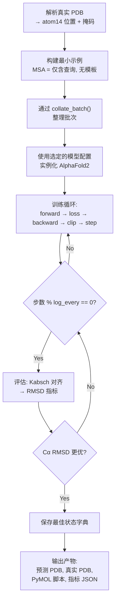
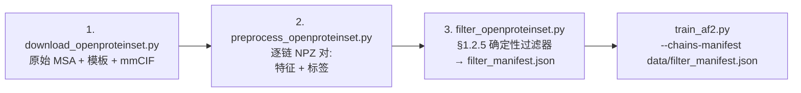

---
slug:2-quick-start
blog_type:normal
---


minAlphaFold2 是 AlphaFold2 的一个极简、教学向的 PyTorch 重实现——完整模型架构仅约 3,000 行纯 PyTorch 代码，整个包约 9,000 行。每个模块与 AlphaFold2 补充材料中的编号算法一一对应，且整个训练流程可在单 GPU 上端到端运行。本页将引导你在五分钟内，从克隆仓库到完成首个结构预测。


来源: [README.md](/README.md#L1-L9)

## 前提条件

minAlphaFold2 要求 **Python ≥ 3.11**，且仅有 **两个运行时依赖** —— `torch` 和 `numpy` ——这与项目坚持的纯 PyTorch 理念一致。其他所有内容（结构弛豫、云端 GPU 运行器、测试）均为可选。

| 依赖组 | 安装标志 | 包 | 用途 |
|---|---|---|---|
| **核心** | *(默认)* | `torch>=2.3`, `numpy>=1.24` | 模型、训练、推理 |
| **开发** | `[dev]` | `pytest>=7.0` | 测试套件 |
| **弛豫** | `[relax]` | `openmm>=8.0`, `pdbfixer>=1.9` | Amber 结构弛豫 (§1.8.6) |
| **云端** | `[modal]` | `modal>=0.60` | 在 H200/A100 上进行云端 GPU 训练 |
| **全部** | `[all]` | *(上述所有)* | 一键安装 |

来源: [pyproject.toml](/pyproject.toml#L1-L57)

## 安装

```bash
git clone https://github.com/ChrisHayduk/minAlphaFold2
cd minAlphaFold2
pip install -e '.[dev]'
```

可编辑安装 (`-e`) 使得 `minalphafold` 包可被导入，同时允许你编辑源码并立即查看变更。`[dev]` 附加项会引入测试套件所需的 `pytest`；若你只需模型，可省略该附加项。可安装的包**仅**包含 **`minalphafold/`** —— `scripts/`、`configs/`、`tests/` 和 `data/` 均为独立的顶层目录，不属于该包。

来源: [pyproject.toml](/pyproject.toml#L59-L63), [README.md](/README.md#L29-L33)

## 五分钟健全性检查：过拟合单个 PDB

确认整个流程可运行的最快方法是对单个真实 PDB 进行过拟合。此过程演练了前向传播、所有损失函数及优化器管线，且**无需**任何 MSA/模板机制——MSA 被设为仅含查询（单行），模板为空。

```bash
python scripts/overfit_single_pdb.py \
  --pdb artifacts/overfit_single_pdb/1a0m_A/ground_truth_1a0m_A.pdb \
  --steps 1000
```

此脚本在 CPU 上运行约 1 分钟，在笔记本 GPU 上约 20 秒，并收敛至亚埃级 Cα RMSD。该脚本会在每个日志记录步报告每步损失、Kabsch 对齐后的骨干/Cα/全原子 RMSD 以及肽键统计数据。

来源: [README.md](/README.md#L34-L40), [scripts/overfit_single_pdb.py](/scripts/overfit_single_pdb.py#L1-L24)

### 过拟合脚本的工作原理

该脚本遵循一个紧凑循环，将几何学习与数据复杂度隔离开来：



来源: [scripts/overfit_single_pdb.py](/scripts/overfit_single_pdb.py#L294-L491)

### 过拟合产物

所有输出均存放于 `artifacts/overfit_single_pdb/<chain_id>/`：

| 产物 | 描述 |
|---|---|
| `predicted_<chain_id>.pdb` | 按 Cα RMSD 最优的预测结构 (Kabsch 对齐) |
| `ground_truth_<chain_id>.pdb` | 输入真实值的副本 |
| `view_in_pymol.pml` | PyMOL 脚本：加载两者、着色、对齐 |
| `metrics.json` | 最终 + 最佳指标摘要 |
| `losses.json` | 每步损失 + RMSD 日志 |

在 PyMOL 中查看结果：

```bash
pymol artifacts/overfit_single_pdb/1a0m_A/view_in_pymol.pml
```

来源: [scripts/overfit_single_pdb.py](/scripts/overfit_single_pdb.py#L451-L487)

### 过拟合 CLI 选项

| 标志 | 默认值 | 描述 |
|---|---|---|
| `--pdb` | *(必填)* | 真实 PDB 文件的路径 |
| `--steps` | 1000 | 优化器步数 |
| `--model-profile` | `medium` | 配置文件：`tiny`、`medium` 或 `alphafold2` |
| `--learning-rate` | 1e-3 | 基础学习率 |
| `--n-cycles` | 1 | 循环回收次数 (§1.10) |
| `--device` | auto | 若可用则为 `cuda`，否则为 `cpu` |
| `--violations-after-step` | *(关闭)* | 在此步之后启用违例损失 (§1.9.11) |

来源: [scripts/overfit_single_pdb.py](/scripts/overfit_single_pdb.py#L294-L333)

## 模型配置文件

minAlphaFold2 提供三种模型配置，每个都是 `configs/` 下的一个 TOML 文件。`alphafold2` 配置中的每个值均注明了其补充材料来源；较小的配置通过缩减通道维度、头数和块数来实现更快的迭代。

| 参数 | `tiny` | `medium` | `alphafold2` (论文规格) |
|---|---|---|---|
| MSA 维度 `c_m` | 32 | 128 | 256 |
| 单表征维度 `c_s` | 32 | 192 | 384 |
| 对表征维度 `c_z` | 16 | 64 | 128 |
| Evoformer 块 | 1 | 4 | 48 |
| 结构模块层 | 2 | 4 | 8 |
| IPA 头 | 4 | 8 | 12 |
| Dropout | 0.0 (全部) | 0.0 (全部) | 论文值 |
| **适用场景** | 形状测试, CI | CPU 过拟合, <50 残基 | 完整复现 |

<CgxTip>使用 `tiny` 进行快速形状测试和 CI，使用 `medium` 在 CPU 上进行单蛋白过拟合，仅在复现论文或使用梯度检查点在 GPU 上训练时使用 `alphafold2`。`--model-profile` 标志接受配置名称，或具有相同 schema 的任意 TOML 文件的直接路径。</CgxTip>

来源: [configs/tiny.toml](/configs/tiny.toml#L1-L78), [configs/medium.toml](/configs/medium.toml#L1-L78), [configs/alphafold2.toml](/configs/alphafold2.toml#L1-L80)

## 多链训练

一旦过拟合健全性检查通过，下一阶段是对少量预处理链进行小规模训练。此过程演练了完整流程——MSA 聚类、模板处理、块删除、裁剪、损失及检查点保存。

```bash
python scripts/train_af2.py \
  --stage initial \
  --model-config tiny \
  --training-protocol alphafold2 \
  --checkpoint-dir checkpoints/smoke \
  --processed-features-dir data/processed_features \
  --processed-labels-dir data/processed_labels \
  --batch-size 1 --grad-accum-steps 1 \
  --epochs 2
```

当设置 `--grad-accum-steps 1` 时，每条链运行一次优化器步——即使只有一个预处理 NPZ 文件也能正常运行。训练协议超参数（裁剪尺寸、学习率、预热、违例损失调度）来自 `configs/training_alphafold2.toml`，该文件与补充表 4 逐行对应。

来源: [README.md](/README.md#L52-L67), [scripts/train_af2.py](/scripts/train_af2.py#L1-L37)

### 训练脚本关键参数

| 标志 | 默认值 | 描述 |
|---|---|---|
| `--stage` | *(必填)* | `initial` 或 `finetune` |
| `--checkpoint-dir` | *(必填)* | `<stage>_latest.pt` / `<stage>_best.pt` 的目录 |
| `--model-config` | `alphafold2` | 模型配置名称或 TOML 路径 |
| `--training-protocol` | `alphafold2` | 训练协议名称 |
| `--batch-size` | 1 | 每步的微批次大小 |
| `--grad-accum-steps` | auto | 推导得出，使 `batch_size × grad_accum = 128` (论文规格) |
| `--n-cycles` | 4 | 循环回收次数 (§1.10) |
| `--init-from` | *(无)* | 微调：用于初始化权重的检查点 |
| `--resume` | *(无)* | 阶段内从检查点恢复 |
| `--epochs` | auto | 由 `total_samples / dataset_size` 推导得出 |

来源: [scripts/train_af2.py](/scripts/train_af2.py#L169-L215)

## 准备训练数据

训练使用 [OpenProteinSet](https://registry.opendata.aws/openfold/)——AlphaFold2 训练集的社区复现版本。三个脚本负责处理该流程：



**步骤 1 —— 下载** 少量链用于冒烟测试：

```bash
echo -e "1a0m_A\n6m0j_E" > data/chains.txt
python scripts/download_openproteinset.py \
  --data-root data/openproteinset \
  --chain-id-file data/chains.txt
```

**步骤 2 —— 预处理** 为逐链 NPZ 对（atom14 位置、聚类 MSA、模板原子）：

```bash
python scripts/preprocess_openproteinset.py \
  --raw-root data/openproteinset \
  --processed-features-dir data/processed_features \
  --processed-labels-dir data/processed_labels
```

**步骤 3 —— 过滤** 使用补充材料 §1.2.5 标准（分辨率 < 9 Å，无单一氨基酸占比 > 序列的 80%，最小长度）：

```bash
python scripts/filter_openproteinset.py \
  --processed-features-dir data/processed_features \
  --processed-labels-dir data/processed_labels \
  --manifest-out data/filter_manifest.json
```

将清单传递给 `train_af2.py`，使用 `--chains-manifest data/filter_manifest.json` 将训练限制在过滤后的数据集。

来源: [README.md](/README.md#L110-L145), [scripts/download_openproteinset.py](/scripts/download_openproteinset.py#L12-L23)

## 弛豫预测结构

原始预测具有正确的折叠，但具有理想化的骨干键长——FAPE 是帧不变的，且从不直接约束肽键几何结构。补充材料 §1.8.6 通过迭代受约束的 Amber 最小化解决了此问题：

```bash
pip install -e '.[relax]'     # OpenMM + pdbfixer
python scripts/relax_pdb.py artifacts/overfit_single_pdb/1a0m_A/predicted_1a0m_A.pdb
```

这将在输入文件旁写入 `predicted_1a0m_A_relaxed.pdb`。每轮最小化均在所有重原子上施加谐和约束（k = 10 kcal/mol/Ų）的 AMBER99SB + GBSA 隐式溶剂下进行，然后释放仍违反 §1.9.11 标准的残基的约束（复用 `losses.StructuralViolationLoss` 以实现位级一致规则），并重复此过程直到所有违例消除。

来源: [README.md](/README.md#L148-L159), [scripts/relax_pdb.py](/scripts/relax_pdb.py#L1-L30)

## 编程式用法

你也可以将 minAlphaFold2 作为 Python 库使用。核心模型类为 `AlphaFold2`，通过 `ModelConfig` 进行配置：

```python
from minalphafold.model import AlphaFold2
from minalphafold.trainer import load_model_config

# 加载模型配置 (tiny, medium, 或 alphafold2)
config = load_model_config("medium")
model = AlphaFold2(config)

# 前向传播需要来自整理流程的批次字典
outputs = model(**model_inputs)  # 参见 trainer.model_inputs_from_batch
```

`load_model_config` 函数可从 `configs/` 解析配置名称，或接受直接的 TOML 路径。`ModelConfig` 数据类实现了端到端类型检查——TOML 文件或 schema 中的拼写错误会在加载时立即抛出 `TypeError`，而非在前向传播期间才暴露为 `AttributeError`。

来源: [minalphafold/model.py](/minalphafold/model.py#L15-L51), [minalphafold/model_config.py](/minalphafold/model_config.py#L25-L106), [minalphafold/trainer.py](/minalphafold/trainer.py#L60-L89)

## 验证安装

运行测试套件以确认一切配置正确：

```bash
pip install -e '.[dev]'
pytest tests/
```

测试套件涵盖 MSA 处理、几何操作、数据管线整理、PDB I/O、损失函数及训练器配置——全部使用 `tiny` 配置以确保速度。

来源: [pyproject.toml](/pyproject.toml#L38-L53)

## 接下来去哪

你现在已拥有可运行的 minAlphaFold2 安装，并已端到端验证了流程。逻辑上的下一步取决于你的目标：

- **理解架构** → [架构概览](4-architecture-overview)，获取从输入嵌入到结构模块的完整流程图
- **运行完整训练阶梯** → [训练阶梯](3-training-ladder)，了解从单蛋白过拟合到论文规模复现的三阶段渐进过程
- **深入特定模块** → [Evoformer 堆栈](6-evoformer-stack) 或 [结构模块与 IPA](7-structure-module-and-ipa)，探索核心计算块
- **配置自定义运行** → [模型配置文件](16-model-config-profiles)，进行配置创建与参数调优