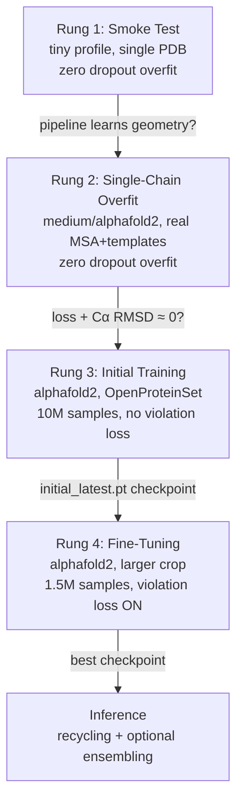
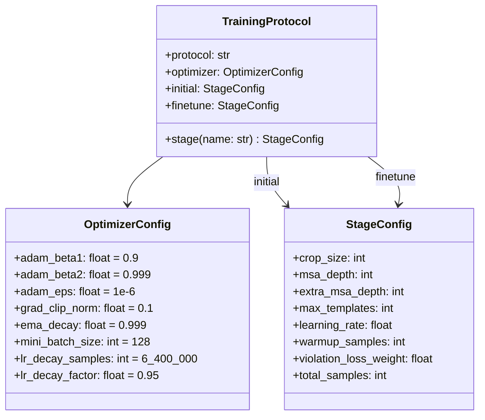

---
slug:3-training-ladder
blog_type:normal
---


minAlphaFold2 提供了一套**循序渐进的方案**，从五秒钟的冒烟测试，到在 TPU 规模硬件上符合论文规范的训练。我们将其称为*训练阶梯* (Training Ladder)：每一级阶梯都会增加模型容量、数据保真度和计算成本，并在你进入下一阶段之前，为你提供一个已验证的检查点。本页将引导你了解每一级阶梯——从在单个 PDB 上的零依赖过拟合，到完整的两阶段 AlphaFold2 协议——让你始终清楚下一步该运行什么，以及预期会得到什么结果。

## 阶梯概述

该阶梯有三个同步缩放的维度：**模型配置** (架构大小)、**数据保真度** (合成数据 → 真实 MSA/模板) 和**训练协议** (过拟合 → 初始训练 → 微调)。下表列出了你实际会使用的四个阶梯层级。

| 阶梯层级 | 模型配置 | 数据来源 | 协议 | 典型硬件 | 首次出结果时间 |
|------|---------------|-------------|----------|------------------|---------------------|
| 1 — 冒烟测试 | `tiny` | 单个 PDB (仅查询序列的 MSA) | 过拟合 (dropout 为零) | CPU | 秒级 |
| 2 — 单链过拟合 | `medium` 或 `alphafold2` | 单条预处理链 (真实 MSA，真实模板) | 过拟合 (dropout 为零) | GPU (A100-80GB) | 分钟级 |
| 3 — 初始训练 | `alphafold2` | OpenProteinSet (裁剪至 256，N_seq 128) | 10M 样本，违规损失**关闭** | 多 GPU / TPU | 天级 |
| 4 — 微调 | `alphafold2` | OpenProteinSet (裁剪至 384，N_seq 512) | 1.5M 样本，违规损失**开启**，学习率减半 | 多 GPU / TPU | 天级 |

下方的 Mermaid 流程图展示了各层级之间的依赖关系——每一层级都会产生一个检查点或健全性检查，供下一层级使用。



来源: [tiny.toml](/configs/tiny.toml#L1-L78), [medium.toml](/configs/medium.toml#L1-L78), [alphafold2.toml](/configs/alphafold2.toml#L1-L80), [training_alphafold2.toml](/configs/training_alphafold2.toml#L1-L54)

## 第 1 级 — 冒烟测试 (tiny 配置，单个 PDB)

**tiny** 配置将每个通道维度、注意力头数和块数缩减到最低限度，同时依然能运行完整的算法流水线。它的存在使得 `test_shapes` 和快速的冒烟测试能在笔记本 CPU 上几秒钟内完成。与论文相比的关键维度如下：

| 参数 | 论文 (alphafold2) | tiny | 缩减倍数 |
|-----------|-------------------|------|-----------|
| `c_m` (MSA 通道) | 256 | 32 | 8× |
| `c_z` (配对通道) | 128 | 16 | 8× |
| `num_evoformer` | 48 | 1 | 48× |
| `structure_module_layers` | 8 | 2 | 4× |
| `ipa_num_heads` | 12 | 4 | 3× |

使用 tiny 配置对单个 PDB 进行过拟合（将所有 dropout 置零，以便模型能够记忆）：

```bash
python scripts/overfit_single_pdb.py \
    --pdb artifacts/overfit_1a0m_A/ground_truth_1a0m_A.pdb \
    --steps 1000 \
    --model-profile tiny
```

该脚本解析一个真实标注的 PDB，构建最小化特征（MSA = 仅查询序列，无模板），并运行普通的训练循环直到损失趋于平稳。它会报告训练损失、Kabsch 对齐后的骨架/Cα/全原子 RMSD，并写入预测的 PDB 文件以便与真实标注进行可视化对比。无需下载 OpenProteinSet，无需 JackHMMER，无需预处理——仅需一个文件和模型。

<CgxTip>`overfit_single_pdb.py` 脚本内部调用了 `zero_dropout_model_config`，该函数会克隆你所选的配置，并将所有 dropout 率设置为 0.0。这对于记忆实验至关重要——否则，补充材料 §1.11.6 中的随机正则化会阻止模型拟合单个样本。你永远无需手动编辑 TOML 来禁用 dropout。</CgxTip>

来源: [overfit_single_pdb.py](/scripts/overfit_single_pdb.py#L1-L48), [trainer.py](/minalphafold/trainer.py#L283-L296), [model_config.py](/minalphafold/model_config.py#L34-L107)

## 第 2 级 — 单链过拟合 (真实 MSA，真实模板)

一旦冒烟测试确认流水线能够学习几何结构，下一级阶梯将在单条链上对**完整数据流水线**进行压力测试。脚本 `overfit_processed_chain.py` 消耗预处理脚本生成的 NPZ 缓存——因此每个训练步骤看到的特征与完整 AlphaFold2 训练循环中看到的特征完全相同：

- **真实 UniRef90 MSA** —— 每步采样，块删除 (算法 1)，聚类 (§1.2.7)，BERT 掩码 (§1.2.7)。
- **来自 pdb70 的真实模板** —— 每步最多 `--max-templates` 个。
- **真实监督信号** —— 来自 mmCIF 真实标注的刚体组帧、扭转角、atom37 掩码。
- **随机残基裁剪** (§1.2.8) —— 当链长于 `--crop-size` 时触发。

```bash
python scripts/overfit_processed_chain.py \
    --chain-id 6m0j_E \
    --steps 5000 \
    --model-profile medium
```

**medium** 配置是本地单 GPU 实验的最佳平衡点：通道维度比论文规范小 4–8 倍，4 个 Evoformer 块，4 个结构模块层——其容量足以在几分钟而非几天内真正学会小蛋白质，且无需 H100 的内存。

| 参数 | 论文 (alphafold2) | medium | 缩减倍数 |
|-----------|-------------------|--------|-----------|
| `c_m` | 256 | 128 | 2× |
| `c_z` | 128 | 64 | 2× |
| `num_evoformer` | 48 | 4 | 12× |
| `structure_module_layers` | 8 | 4 | 2× |

如果你可以使用内存 ≥80 GB 的 GPU (A100-80GB)，你也可以使用完整的 `alphafold2` 配置进行过拟合——这是论文使用的配置，Modal 封装使其变得非常简单：

```bash
# 使用完整配置进行本地运行
python scripts/overfit_processed_chain.py \
    --chain-id 6m0j_E --steps 10000 --model-profile alphafold2

# 或在 Modal 上运行 (自动分配 GPU，优先使用 H200)
modal run scripts/modal_overfit.py --chain-id 6m0j_E --model-profile alphafold2
```

模型应该能使损失和 Cα RMSD 趋近于零：每次增强都是随机的，但底层只有一个目标。如果不是这样，说明上游某些部分（特征提取、损失加权、初始化）存在问题——在扩大规模之前，请在此处修复它。

来源: [overfit_processed_chain.py](/scripts/overfit_processed_chain.py#L1-L30), [medium.toml](/configs/medium.toml#L1-L78), [modal_overfit.py](/scripts/modal_overfit.py#L1-L48)

## 第 3 级 — 初始训练 (10M 样本，违规损失关闭)

在单链上验证了流水线后，你将进入论文的两阶段训练协议。阶段 1 —— **初始训练** —— 从随机初始化开始，在 256 残基的裁剪尺寸上训练约 1000 万个样本。结构违规损失 (§1.9.11) 被故意**禁用**：补充材料指出它“仅在微调阶段才添加”。

`train_af2.py` 脚本负责驱动此过程。它从 `configs/training_alphafold2.toml` 加载 `TrainingProtocol`，该文件将表 4 的两个阶段捕获为数据：

```bash
python scripts/train_af2.py \
    --stage initial \
    --checkpoint-dir checkpoints/af2 \
    --model-config alphafold2 \
    --training-protocol alphafold2
```

协议文件逐字记录了表 4 中的每个值。以下是 **initial** 阶段的配置：

| 设置 | 值 | 补充材料参考 |
|---------|-------|---------------------|
| `crop_size` | 256 残基 | 表 4，"Initial training" |
| `msa_depth` | 128 序列 | 表 4 |
| `extra_msa_depth` | 1024 | 表 4 |
| `learning_rate` | 1×10⁻³ | §1.11.3 |
| `warmup_samples` | 128,000 | §1.11.3 线性预热 |
| `violation_loss_weight` | 0.0 | §1.9.11 在阶段 1 中禁用 |
| `total_samples` | 10,000,000 | 表 4 (在 TPUv3 上约 7 天) |

学习率调度完全遵循论文：前 128k 个样本从 0 开始**线性预热**，然后保持基础学习率**不变**，接着在 6.4M 样本时进行**一次性 ×0.95 衰减** (§1.11.3)。在单 GPU 硬件上，梯度累积弥补了论文中 128 的迷你批次大小与你硬件所能承受的批次大小之间的差距——脚本会自动推导 `--grad-accum-steps`，使得 `batch_size × grad_accum_steps = 128`。

脚本通过 `ceil(target_samples / dataset_size)` 将样本预算转换为轮数。OpenProteinSet 中约有 10⁵ 条链，目标为 10⁷ 个样本，计算得出初始训练大约为 100 个轮次。

来源: [train_af2.py](/scripts/train_af2.py#L1-L50), [training_alphafold2.toml](/configs/training_alphafold2.toml#L1-L54), [trainer.py](/minalphafold/trainer.py#L230-L280)

## 第 4 级 — 微调 (1.5M 样本，违规损失开启，学习率减半)

微调从初始阶段的检查点（而非随机初始化）加载，切换到**更大的 384 残基裁剪**，将**基础学习率减半**，并**启用结构违规损失**，以修正肽键几何结构和空间位阻冲突。根据 §1.11.3，此阶段没有预热。

```bash
python scripts/train_af2.py \
    --stage finetune \
    --checkpoint-dir checkpoints/af2 \
    --init-from checkpoints/af2/initial_latest.pt
```

`--init-from` 标志实现了 §1.11.1 中描述的跨阶段权重交接：它将初始阶段的模型权重加载到一个带有零计数器和全新 EMA 的新优化器中。相比之下，`--resume` 标志恢复模型 + 优化器 + EMA + 步数计数器，用于**阶段内**的续训——如果同时设置了两者，`--resume` 将覆盖 `--init-from`。

| 设置 | 初始训练 | 微调 | 变化 |
|---------|---------|-----------|--------|
| `crop_size` | 256 | 384 | +50% |
| `msa_depth` | 128 | 512 | 4× |
| `extra_msa_depth` | 1024 | 5120 | 5× |
| `learning_rate` | 1×10⁻³ | 5×10⁻⁴ | ÷2 |
| `warmup_samples` | 128,000 | 0 | 禁用 |
| `violation_loss_weight` | 0.0 | 1.0 | 开启 |
| `total_samples` | 10,000,000 | 1,500,000 | 在 TPUv3 上约 4 天 |

<CgxTip>两阶段的划分不仅是为了方便——它在架构上具有重要意义。违规损失会惩罚键长、键角和空间位阻偏差 (§1.9.11，公式 44–47)。如果从第 0 步就添加它，将会在 Evoformer 学到有意义的配对表示之前与之产生冲突。论文的设计让模型首先学习粗粒度的结构模式，然后在阶段 2 中精修几何结构。如果你跳过阶段 1，并在开启违规损失的情况下从随机初始化开始微调，训练将会发散或收敛到较差的局部极小值。</CgxTip>

来源: [train_af2.py](/scripts/train_af2.py#L200-L316), [training_alphafold2.toml](/configs/training_alphafold2.toml#L39-L54), [trainer.py](/minalphafold/trainer.py#L830-L860)

## 将训练协议作为数据

一个关键的设计决策：训练协议是**数据，而非代码**。`TrainingProtocol`、`StageConfig` 和 `OptimizerConfig` 是纯数据类，不包含 torch，也不涉及 IO。TOML 文件 `configs/training_alphafold2.toml` 是唯一的真实来源：



加载通过 `load_training_protocol("alphafold2")` 完成，该函数使用 `tomllib` 解析 TOML，并将顶层表直接传递给数据类构造函数。文件或模式中拼写错误的键会立即以 `TypeError` 的形式暴露出来——而不会在训练中途以静默的 `AttributeError` 出现。同样的模式也适用于通过 `load_model_config("tiny")` / `load_model_config("alphafold2")` 加载的模型配置。

来源: [trainer.py](/minalphafold/trainer.py#L230-L340), [training_alphafold2.toml](/configs/training_alphafold2.toml#L1-L54)

## 梯度累积与有效迷你批次

论文中的迷你批次大小为 128——每个 TPU 核心一个样本，分布在 TPU Pod 上。在单个 GPU 上，你无法将 128 个样本装入内存。minAlphaFold2 通过**梯度累积**弥补了这一差距：有效迷你批次等于 `batch_size × grad_accum_steps`。

当你未显式设置时，`train_af2.py` 脚本会从协议的 `mini_batch_size` 自动推导 `grad_accum_steps`：

```python
grad_accum_steps = max(protocol.optimizer.mini_batch_size // batch_size, 1)
```

因此，在 `--batch-size 1` (默认值) 的情况下，`grad_accum_steps` 变为 128，并且每次优化器步骤看到的梯度幅度与论文中每个核心的更新相同。训练器在 `.backward()` 之前将微批次损失除以 `grad_accum_steps`，根据全局范数裁剪微批次梯度 (§1.11.3，值为 0.1)，并累积到专用缓冲区中。在每个累积窗口结束时，它将求和后的梯度复制到 `.grad`，通过基于样本的调度设置学习率，并调用 `optimizer.step`。

来源: [trainer.py](/minalphafold/trainer.py#L860-L960), [train_af2.py](/scripts/train_af2.py#L210-L230)

## 用于检查点选择的参数 EMA

两个训练阶段都使用衰减为 0.999 的**参数 EMA** (指数移动平均，§1.11.7) 来进行检查点选择。EMA 影子模型是模型的一个独立副本，在每次优化器步骤后跟踪 `ema ← 0.999·ema + 0.001·current`。训练器在 EMA 模型上评估验证损失，而非实时模型，并在验证损失改善时保存 `best_checkpoint_path`。实时的 `model.state_dict()` 继续保存训练参数——EMA 纯粹是一种评估侧机制。

当微调通过 `--init-from` 从初始阶段检查点初始化时，EMA 会从刚加载的权重**重新播种**（而非从阶段 1 继承）。这与补充材料的描述一致：微调以初始阶段的参数开始，但带有全新的优化器状态。

来源: [trainer.py](/minalphafold/trainer.py#L567-L590), [training_alphafold2.toml](/configs/training_alphafold2.toml#L25-L27)

## 零初始化与门控初始化

训练阶梯依赖于 §1.11.4 中的一种关键初始化方案，该方案使得早期的阶梯层级保持稳定。残差块的每个**输出投影**都进行零初始化，因此每一层最初都作为恒等操作。每个**门控线性层** (输入到 sigmoid) 使用零权重和偏置 = 1 进行初始化，因此门控在 `sigmoid(1) ≈ 0.73` 处打开——大部分处于直通状态。每个配置 TOML 中的 `zero_init = true` 标志通过 `AlphaFold2._initialize_alphafold_parameters` 激活整个网络中的这种初始化扫描。

这就是为什么第 1 级 (tiny) 可以在几秒内学习的原因：网络从接近恒等映射的状态开始，梯度从第一步就能流畅传播。如果没有零初始化，Evoformer 的 48 个块 (甚至 1 个块) 在随机初始化时会产生梯度爆炸或消失，冒烟测试在开始前就会失败。

来源: [initialization.py](/minalphafold/initialization.py#L1-L81), [model.py](/minalphafold/model.py#L133-L170)

## 接下来阅读什么

训练阶梯涉及了每个主要子系统。要深入了解你刚刚实践的组件：

- **各项损失如何组合** → [Loss Functions and FAPE](11-loss-functions-and-fape) 解释了 FAPE、扭转角损失、距离图以及区分两个阶段的违规损失。
- **为什么零初始化有效以及 EMA 如何稳定检查点** → [Zero-Init and Parameter EMA](13-zero-init-and-parameter-ema) 详细介绍了初始化扫描和 EMA 更新规则。
- **数据流水线如何为每个层级提供数据** → [Data Pipeline and Cropping](14-data-pipeline-and-cropping) 涵盖了 OpenProteinSet 预处理、随机裁剪和 MSA 块删除。
- **两阶段协议在架构上的合理性** → [Two-Stage Training Protocol](12-two-stage-training-protocol) 将违规损失调度与 Evoformer 的表示学习联系起来。
- **每个配置的内容** → [Model Config Profiles](16-model-config-profiles) 是三个 TOML 文件中每个参数的参考。