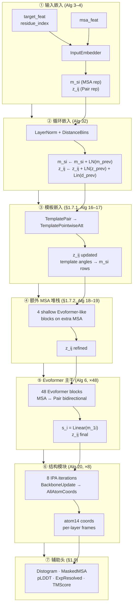
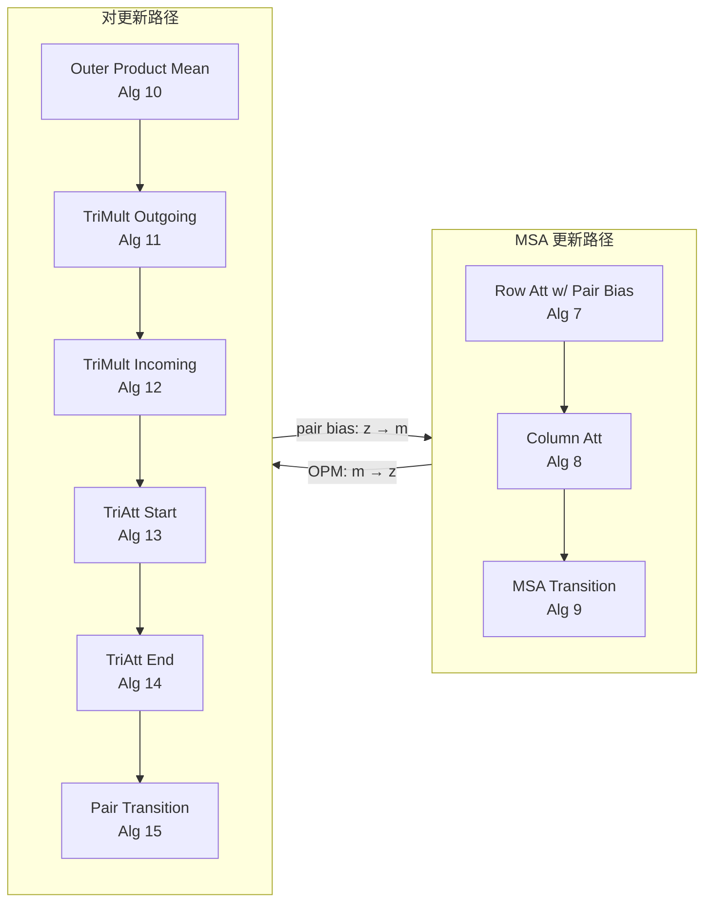

---
slug:4-architecture-overview
blog_type:normal
---


minAlphaFold2 是 AlphaFold2 的一个最小化、面向教学的 PyTorch 重实现版本，它将每个模块 1:1 地映射到补充信息中编号的算法。整个模型架构仅用单个包内约 3,000 行纯 PyTorch 代码实现，除 `torch` 本身外无任何外部 ML 依赖。本页提供了结构蓝图——主要的流水线阶段、在阶段之间流动的表示空间，以及控制参数初始化、循环和损失组合的设计不变量。随后的每个深入解析（Deep Dive）页面将展开特定的子系统；此处的目标是在研究任何单个齿轮之前，先纵览整台机器。

来源: [model.py](minalphafold/model.py#L15-L51), [README.md](README.md#L1-L17)


## 七阶段流水线

`AlphaFold2.forward` 方法将七个不同的处理阶段连接在一起，每个阶段对应补充资料中的一个编号小节。数据流经两个核心表示张量——形状为 `(batch, N_seq, N_res, c_m)` 的 **MSA 表示** `m_si` 和形状为 `(batch, N_res, N_res, c_z)` 的 **对表示** `z_ij`——然后提取单一表示 `s_i` 并传入 3D 坐标生成模块。



该流水线在一个**循环**（补充资料 1.10）内部执行：整个序列 ①–⑦ 最多运行 `n_cycles` 次，并将前一次循环的输出反馈到阶段 ②。在训练期间，会随机采样循环次数（Algorithm 31），并且只有最后一次循环携带梯度——之前的迭代均被 `detach()`。在推理时，所有循环均以完整梯度展开。

来源: [model.py](minalphafold/model.py#L178-L439), [model.py](minalphafold/model.py#L231-L278)

## 表示空间

三个张量空间作为流水线阶段之间的通信骨干。它们的维度是主要的架构旋钮，在三个配置文件中进行缩放：

| 表示 | 符号 | 形状 | 作用 |
|---|---|---|---|
| **MSA** | `m_si` | `(B, N_seq, N_res, c_m)` | 每序列每残基特征；Evoformer 的主工作空间 |
| **对** | `z_ij` | `(B, N_res, N_res, c_z)` | 残基对的几何与进化信号；驱动注意力偏置和距离分布图 |
| **单一** | `s_i` | `(B, N_res, c_s)` | 从 MSA 第一行提取的每残基摘要；馈入结构模块 |

**MSA 表示**最为丰富——它将整个多序列比对编码为残基特征向量的堆栈。**对表示**捕获残基间关系，并且是唯一在所有阶段中持续存在的张量（它以加法方式累积模板、额外 MSA 和 Evoformer 的更新）。**单一表示**是一种后期提取：`s_i = Linear(m_{1i})` 仅将 MSA 表示的查询序列行投影到结构模块的通道维度 `c_s` 中。

来源: [model.py](minalphafold/model.py#L53-L68), [embedders.py](minalphafold/embedders.py#L36-L94)

## 跨配置文件的通道维度

`configs/` 中提供了三个 TOML 配置文件，每个文件在保持架构拓扑的同时，缩放每个通道维度和块计数：

| 参数 | `tiny` | `medium` | `alphafold2` | 补充资料 § |
|---|---|---|---|---|
| `c_m` (MSA 通道) | 32 | 128 | **256** | §1.5 |
| `c_s` (单一通道) | 32 | 192 | **384** | §1.6 |
| `c_z` (对通道) | 16 | 64 | **128** | §1.5 |
| `c_t` (模板对) | 16 | 64 | **64** | §1.7.1 |
| `c_e` (额外 MSA) | 24 | 64 | **64** | §1.7.2 |
| `num_evoformer` (块) | 1 | 4 | **48** | §1.6 |
| `structure_module_layers` | 2 | 4 | **8** | §1.8 |
| 注意力头 (MSA 行) | 4 | 8 | **8** | Alg 7 |
| IPA 头 | 4 | 8 | **12** | Alg 22 |

**`tiny`** 配置将所有维度降低到可在 CPU 上运行的水平，用于冒烟测试。**`medium`** 面向单 GPU 过拟合实验。**`alphafold2`** 完全匹配论文——48 个 Evoformer 块，256 个 MSA 通道，8 次 IPA 迭代。

来源: [alphafold2.toml](configs/alphafold2.toml#L1-L80), [tiny.toml](configs/tiny.toml#L1-L78), [medium.toml](configs/medium.toml#L1-L78)

## 模块到文件映射

`minalphafold/` 中的每个文件都实现了补充资料中不相交的子集。此表是代码导航的权威索引：

| 模块文件 | 实现的算法 | 流水线阶段 |
|---|---|---|
| `embedders.py` | 3, 4, 8, 9, 10, 11, 12, 13, 14, 15, 16, 17, 18, 19 | ① 输入, ③ 模板, ④ 额外 MSA, Evoformer 子块 |
| `evoformer.py` | 6, 7 | ⑤ Evoformer 主干 |
| `structure_module.py` | 20, 22, 23, 24, 25 | ⑥ 结构模块 |
| `model.py` | 2, 30, 31, 32 | 顶层编排, 循环 |
| `heads.py` | 29 | ⑦ 辅助头 |
| `losses.py` | 26, 27, 28 | 训练监督 |
| `geometry.py` | 21 | 真值帧构造 |
| `data.py` | 1 | 数据流水线, MSA 增强 |
| `initialization.py` | §1.11.4 | 参数初始化方案 |
| `model_config.py` | — | 带类型的配置模式 |

来源: [evoformer.py](minalphafold/evoformer.py#L1-L9), [structure_module.py](minalphafold/structure_module.py#L1-L20), [heads.py](minalphafold/heads.py#L1-L16), [initialization.py](minalphafold/initialization.py#L1-L24)

## Evoformer 块剖析

Evoformer 是计算核心——48 个相同的块在 MSA 和对表示之间双向交换信息。每个块遵循固定的七步协议：



Algorithm 7 中的**对偏置**是关键的信息流机制：对表示 `z_ij` 被投影为逐头的标量偏置，用于调节 MSA 行注意力，让几何/进化的对上下文引导每残基的注意力模式。反向路径——**外积均值**（Algorithm 10）——将 MSA 压缩为对 `z_ij` 的秩为 1 的外积贡献，完成双向循环。根据补充资料 §1.11.6，丢弃沿 MSA 路径按行应用，沿对路径按行/列应用。

来源: [evoformer.py](minalphafold/evoformer.py#L28-L95), [evoformer.py](minalphafold/evoformer.py#L97-L194)

## 结构模块与不变点注意力

结构模块通过**不变点注意力**（Invariant Point Attention, IPA）和 **BackboneUpdate** 的迭代循环，将抽象的单一/对表示转换为 3D 原子坐标。关键设计不变量：

- **SE(3)-等变性**：IPA 在由逐残基刚体帧变换的 3D 查询/值点上操作，使注意力权重对全局旋转/平移保持不变。这是让模型无需依赖特权坐标系即可推理结构的几何基础。
- **黑洞初始化**：所有刚体帧均以恒等变换 `(I, 0)` 开始，这意味着每个残基初始时均位于原点。8 次 IPA 迭代逐步将残基分离至其最终的 3D 位置。
- **分离旋转**：在迭代之间，帧旋转被 `detach()`（停止梯度），而平移保留梯度——这让辅助的逐层 FAPE 损失在 Cα 位置上的信号能传播到 Evoformer，而不破坏帧递归的稳定性。
- **纳米级内部计算**：所有坐标均以 nm 计算（Å ÷ `position_scale`，其中 `position_scale = 10`），符合补充资料的约定。输出重新缩放回埃（Ångström）。

来源: [structure_module.py](minalphafold/structure_module.py#L117-L196)

## 零初始化与门控策略

AlphaFold2 的一大标志性架构模式——在此被忠实地复现——是**零初始化扫掠**（补充资料 §1.11.4）。每个残差块的最终线性层均以零权重和零偏置开始，这带来两个结果：

1. **每个块初始为恒等映射**——网络起始于直通状态，仅随训练推进才学习偏离。这在极深的 48 块 Evoformer 中稳定了早期训练。
2. **所有预测头在第 0 步输出均匀分布**——起初仅有 FAPE（依赖于预测坐标而非头的逻辑值）向主干传递梯度信号。

门控模式强化了这一点：每个门控注意力输出使用 `sigmoid(Linear(x)) ⊙ attention_output`，其中门控的线性层以**零权重、偏置 = 1** 初始化，因此 `sigmoid(1) ≈ 0.73`——门初始时基本打开，允许信息流过的同时保持可控性。

`AlphaFold2._initialize_alphafold_parameters` 方法在构造后扫掠整个模块树，按类将这些规则应用于特定的命名层：

| 层类 | 零初始化目标 | 效果 |
|---|---|---|
| 所有注意力块 | `linear_output` | 残差恒等起始 |
| `MSATransition`, `PairTransition` | `linear_down` | 瓶颈恒等起始 |
| `OuterProductMean` | `linear_out` | 对更新恒等起始 |
| `TriangleMultiplication*` | `out_linear` (+ 门控初始化) | 乘性恒等起始 |
| `StructureModule` | `transition_linear_3` | SM 过渡恒等起始 |
| `BackboneUpdate` | `linear` | 无初始骨架运动 |
| `AngleResnetBlock` | `linear_2` | 扭角恒等起始 |

来源: [model.py](minalphafold/model.py#L106-L153), [initialization.py](minalphafold/initialization.py#L38-L80), [heads.py](minalphafold/heads.py#L21-L25)

## 损失组合与两阶段训练

组合损失遵循补充资料 §1.9 公式 7，对**初始训练**和**微调**阶段采用不同的权重调度：

| 损失项 | 权重 | 来源 | 阶段 |
|---|---|---|---|
| 骨架 FAPE (逐层) | 0.5 | Alg 20 行 17 | 两者 |
| 全原子 FAPE (最终) | 0.5 | Alg 20 行 28 | 两者 |
| 扭角 | 0.5 | Alg 27 | 两者 |
| 距离分布图 | 0.3 | §1.9.8 公式 41 | 两者 |
| 掩码 MSA | 2.0 | §1.9.9 公式 42 | 两者 |
| pLDDT 置信度 | 0.01 | Alg 29 | 两者 |
| 实验已解析 | 0.01 | §1.9.10 公式 43 | 仅微调 |
| 结构违规 | 1.0 | §1.9.11 公式 47 | 仅微调 |
| TM-score / PAE | 0.1 | §1.9.7 公式 38–40 | 仅微调 |

骨架 FAPE 实现了 §1.11.5 中的 90/10 截断-未截断混合：90% 的小批量将误差距离截断至 10 Å，10% 保持未截断。侧链 FAPE 始终截断。这种双机制策略防止了大距离误差主导梯度，同时偶尔允许模型观测无界信号。

来源: [losses.py](minalphafold/losses.py#L129-L199)

## 循环与集成

循环机制（补充资料 §1.10）将整个流水线重新运行最多 `n_cycles` 次，将前一次循环的输出注入回阶段 ②：

- **循环嵌入**（Algorithm 32）：`m_{1i} += LayerNorm(m_{1i}^{prev})`，`z_{ij} += LayerNorm(z_{ij}^{prev}) + Linear(one_hot(d_{ij}^{prev}))`，其中 `d_{ij}^{prev}` 是由前一次循环的预测坐标计算得出的分桶成对伪 β 距离。
- **训练**（Algorithm 31）：`n' ~ Uniform(1, N_cycle)`；仅最后一次迭代携带梯度——之前的循环均被 `detach()`。
- **推理**（Algorithm 30）：所有 `n_cycles` 次迭代均以完整梯度运行。

**集成**（§1.11.2）在每个循环中运行 `n_ensemble` 次结构模块前的流水线，并对随机特征进行重采样，仅对各集成成员的 `m_{1i}` 和 `z_{ij}` 求平均。训练时，`n_ensemble = 1`；推理时，论文同样使用 `n_ensemble = 1`（DeepMind 发布的模型）。

来源: [model.py](minalphafold/model.py#L231-L278), [model.py](minalphafold/model.py#L365-L38@), [model.py](minalphafold/model.py#L419-L437)

## 梯度检查点

48 块 Evoformer 主导了内存消耗。补充资料 §1.11.8 规定仅存储块之间传递的激活，并在反向传播期间重新计算块内激活——这正是 `torch.utils.checkpoint` 的功能。当 `self.training` 为 `True` 时，minAlphaFold2 对每个 Evoformer 块和每个额外 MSA 块应用检查点，在评估期间则跳过（此时期它只会增加开销而无内存收益）。这使得完整论文规格的模型在论文的裁剪尺寸下能够装入单块 GPU。

来源: [model.py](minalphafold/model.py#L326-L363)

## 可视化项目结构

```
minalphafold/
├── model.py              ← AlphaFold2 (Alg 2) — 顶层编排
├── embedders.py          ← InputEmbedder (3), RelPos (4), 所有 Evoformer 子块
├── evoformer.py          ← Evoformer 块 (6), MSARowAttPairBias (7)
├── structure_module.py   ← StructureModule (20), IPA (22), BackboneUpdate (23)
├── heads.py              ← Distogram, pLDDT, MaskedMSA, TMScore, ExpResolved
├── losses.py             ← FAPE (28), Torsion (27), 所有 §1.9 损失
├── geometry.py           ← 真值帧 (21), 扭角, 替代真值 (26)
├── data.py               ← 数据集, MSA 增强 (1), 特征构建器 (表 1)
├── model_config.py       ← 带类型的 ModelConfig 数据类
├── initialization.py     ← §1.11.4 初始化方案 (zero, gate, final, relu, glorot)
├── trainer.py            ← 训练循环, LR 调度, EMA, 两阶段协议
├── utils.py              ← 距离分桶, 丢弃辅助函数
├── residue_constants.py  ← 氨基酸查找表, atom14 几何
├── a3m.py                ← MSA 解析, 字母表定义
└── mmcif.py              ← mmCIF 结构解析
```

<CgxTip>最实用的导航模式：每个类的文档字符串都引用了其算法编号。在任何文件中搜索 `Algorithm XX` 即可直达特定补充步骤的实现。</CgxTip>

<CgxTip>在正向传播中追踪数据流时，请跟随"两"个张量：`msa_repr`（MSA 表示）和 `pair_repr`（对表示）。每个阶段均以加法方式更新二者之一或全部——不存在原位覆盖。单一表示 `s&ub;i` 仅在 Evoformer@nbsp;之后通过 `single_rep_proj` 提取一次。</CgxTip>

---

### 接下来去哪

上面的架构概述在高层级+勾勒了每个阶段。深入解析部分的每个后续页面将一个阶段展开为完整的实现细节：

- **核心流水线**：从 [输入嵌入器与相对位置](5-input-embedder-and-relpos) 开始，了解原始 MSA 和残基索引如何变为初始的 `m_si` 和 `z_ij`；然后通过 [Evoformer 堆栈](6-evoformer-stack) 了解 48 块注意力机制；最后'通过 [结构模块与 IPA](7-structure-module-and-ipa) 了解 3D 坐标生成。
- **表示与几何**：[MSA 与对表示](8-msa-and-pair-representations) 解释了8这些张量在语义上编码了什么；[刚体帧与扭角](9-rigid-frames-and-torsions) 涵盖了 SE(3) 帧约定；[不变点注意力](10-invariant-point-attention) 推导了几何注意力机制。
- **训练与损失**：[损失函数与 FAPE](11-loss-functions-and-fape) 详述了公式 7 中的每一项；[两阶段训练协议](12-two-stage)training-protocol) 解释了初始@nbsp;初始→微调'的过渡；[零初始化与参数 E2EMA](13-zero-init-and-parameter-ema) 涵盖了稳定化机制。
- **数据与预处理**：[数据流水线与裁剪](14-data-pipeline-and-cropping) 和 [MSA 处理与掩码](15-msa-processing-and-masking) 涵盖了模型上游的所有内容。
- **配置与推理**：[模型配置文件](16-model-config-profiles)、[循环与集成](17-recycling-and-ensembling) 和 [结构弛豫](18-structure-relaxation) 涵盖了模型下游的所有内容。
- **参考**：[补充算法映射](19-supplement-algorithm-mapping) 是从算法编号到源码位置的权威索引。