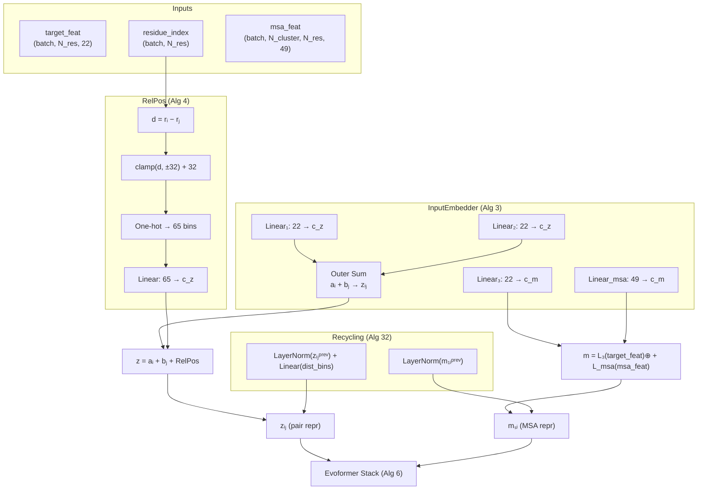

---
slug:5-input-embedder-and-relpos
blog_type:normal
---


输入嵌入器（算法 3）和相对位置编码（算法 4）是 AlphaFold2 流水线中的**首批可学习操作**——它们将原始输入特征转换为初始 MSA 表示 **m** 和对表示 **z**，作为整个 Evoformer 主干的种子。网络中的每个后续块都会消耗并精炼这两个张量，这使得嵌入器成为模型的可学习参数首次接触生物信号的唯一起点。本页将详细剖析每个输入张量的具体内容、这两种表示的构建方式，以及为什么相对位置编码对于空间推理不可或缺。

来源：[embedders.py](/minalphafold/embedders.py#L36-L118), [model.py](/minalphafold/model.py#L15-L51)

## 架构一览

下图展示了从原始特征经嵌入器到 Evoformer 的数据流，包括 RelPos 子系统以及在主干运行前将上一轮表示合并回来的下游循环注入。



嵌入器在**算法 2 第 5 行**被调用——这是每个循环周期内的首个操作——这意味着其输出在每个周期都会被全新覆写，随后才会重新加上循环残差。

来源：[model.py](/minalphafold/model.py#L261-L266), [embedders.py](/minalphafold/embedders.py#L70-L94)

## 输入张量：嵌入器接收了什么

有三个张量会进入 `InputEmbedder.forward` 方法。它们的维度被固定为源自 AF2 补充材料表 1 的常量。

| 张量 | 形状 | 维度 | 来源构建器 | 内容 |
|--------|-------|------|---------------|----------|
| `target_feat` | `(B, N_res, 22)` | `SEQ_ALPHABET_SIZE + 1` | `build_target_feat` | 1 维 `between_segment_residues` 标志 + 21 维氨基酸类型独热编码 |
| `residue_index` | `(B, N_res)` | 标量 | 原始特征缓存 | 从 1 开始的残基位置（多链时可能包含间隔） |
| `msa_feat` | `(B, N_cluster, N_res, 49)` | `MSA_FEAT_DIM` | `build_msa_feat` | 23 维独热 MSA + 1 维缺失标志 + 1 维缺失值 + 23 维簇频率 + 1 维簇缺失均值 |

**`target_feat`** 编码了查询序列的标识。21 维氨基酸独热编码涵盖了 20 种标准残基外加一个“未知”类别（`UNK_ID = 20`）。前导的 `between_segment_residues` 标志仅在多链输入的链断裂处非零；对于单链训练，它处处为零，这使得第一列成为一个死维度，线性层必须学会忽略它。

**`msa_feat`** 是信息最丰富的输入——每个簇行、每个残基对应 49 个通道的特征。它由五个组成子特征构成：

| 子特征 | 维度 | 描述 |
|------------|------|-------------|
| `cluster_msa` 独热编码 | 23 | 20 种氨基酸 + 未知 + 间隔 + 掩码词元 |
| `cluster_has_deletion` | 1 | 二值：此列前是否有插入？ |
| `cluster_deletion_value` | 1 | `atan(d/3) · 2/π` — 原始缺失计数的有界变换 |
| `cluster_profile` | 23 | 簇内的软氨基酸频率（包括额外 MSA 成员） |
| `cluster_deletion_mean` | 1 | 簇内变换后缺失的均值 |

缺失变换 `atan(d/3) · 2/π` 在间隔非常大时会饱和至 1.0，防止极端值破坏线性投影的稳定性。这就是补充材料 §1.2.9 表 1 中指定的“变换缺失”函数。

来源：[embedders.py](/minalphafold/embedders.py#L70-L79), [data.py](/minalphafold/data.py#L68-L70), [data.py](/minalphafold/data.py#L623-L653), [data.py](/minalphafold/data.py#L683-L704), [a3m.py](/minalphafold/a3m.py#L52-L54)

## 对表示构建 (z_ij)

对表示 **z** 由两个独立的信号相加构建：

### 信号 1 — 目标特征的外部和

两个独立的线性投影在 **c_z** 维空间中生成逐残基嵌入：

```
a_i = Linear₁(target_feat_i)    → (B, N_res, c_z)
b_j = Linear₂(target_feat_j)    → (B, N_res, c_z)
z_ij = a_i.unsqueeze(-2) + b_j.unsqueeze(-3)
```

`unsqueeze` + 广播技巧创建了一个 `(B, N_res, N_res, c_z)` 张量，其中位置 `(i, j)` 接收 `a_i + b_j`。这种**外和**分解至关重要：它意味着对表示可以表达那些能分解为逐残基函数之和的残基对属性——例如“残基 i 是疏水的 **且** 残基 j 是疏水的”（在学习的嵌入下可分解为 `f(i) + g(j)`）。这两个线性层是**独立的**（权重分离），因此它们可以学习查询序列的不同方面，分别放置在 i 轴和 j 轴上。

### 信号 2 — 相对位置编码

`RelPos` 模块添加了一个学习到的空间先验，告知网络两个残基在序列空间中相距多远。这将在下一节详述。

最终的对初始化为：

> **z_ij = Linear₁(target_feat_i) + Linear₂(target_feat_j) + RelPos(r_i − r_j)**

来源：[embedders.py](/minalphafold/embedders.py#L81-L89)

## MSA 表示构建 (m_si)

MSA 表示 **m** 类似地由两项之和构成：

```
m_si = Linear₃(target_feat_i).unsqueeze(1) + Linear_msa(msa_feat_si)
```

`Linear₃` 将 `target_feat` 投影到 **c_m** 维，然后 `unsqueeze(1)` 沿 MSA 序列轴进行广播（所有簇行共享相同的查询序列信号）。`Linear_msa` 则独立地将每个 `(s, i)` 位置的 49 维 `msa_feat` 投影到 **c_m** 维。求和意味着查询的氨基酸标识提供了一个跨所有 MSA 行共享的残基特定偏置，而每行自身的序列与缺失特征则携带了行特定的变异。

输出形状为 `(B, N_cluster, N_res, c_m)`——每个簇序列、每个残基对应一个向量。

来源：[embedders.py](/minalphafold/embedders.py#L91-L94)

## RelPos：相对位置编码（算法 4）

`RelPos` 模块将残基对之间的**序列距离**编码为学习到的嵌入，并添加到 **z** 中。若没有它，Evoformer 将不具备任何内建的邻接概念——对表示将纯粹从氨基酸标识出发，无法得知残基 5 紧挨着残基 6，却远离残基 200。

### 工作原理

```python
d = residue_index[:, :, None] - residue_index[:, None, :]   # (B, N_res, N_res)
d = d.clamp(-max_rel, max_rel) + max_rel                     # 平移至 [0, 2·max_rel]
oh = F.one_hot(d.long(), 2 * max_rel + 1).float()           # (B, N_res, N_res, 65)
return self.linear(oh)                                       # (B, N_res, N_res, c_z)
```

计算过程分四步进行：

1. **差值矩阵** — 计算所有残基对的 `r_i − r_j`。对于连续单链，这简化为 `i − j`，但 `residue_index` 在多链输入或插入码的情况下可能包含间隔，因此使用原始索引而非假设连续性。

2. **截断** — 值被截断至 `[-max_rel, max_rel]`，其中 `max_rel = 32`（论文默认值）。这意味着序列中相距超过 32 个位置的残基对，将获得与恰好相距 32 时相同的编码。通过 `+max_rel` 的平移，将范围映射到非负整数 `[0, 64]`。

3. **独热编码** — 65 个整数区间（0 到 64）转化为每对残基一个 65 维的独热向量。这是截断后距离的无损表示——后续的线性层可以学习这 65 个区间上的任意函数。

4. **线性投影** — 学习到的 `Linear(65 → c_z)` 将独热编码映射到对表示的通道空间，生成最终的位置嵌入。

### 为什么在 ±32 处截断？

截断半径 32 是补充材料中的设计选择，反映了一种**局部性偏置**：序列邻接对于邻近残基（那些可能相互接触或共享二级结构的残基）信息量最大。超过约 32 个位置后，确切的序列距离不如 Evoformer 将在后续块中学习到的进化与结构信号重要。独热 + 线性的公式允许网络为 65 个区间中的每一个学习不同的嵌入（包括为“相同位置”、“相距 ±1”、“相距 ±2”等提供独立的嵌入），同时将距离 > 32 的所有残基对折叠为两个共享区间（一个代表“+远”，一个代表“−远”）。

### 对称性属性

差值矩阵 `d_ij = r_i − r_j` 是**反对称的**：`d_ij = −d_ji`。经过独热编码后，偏移 `+k` 的区间和偏移 `−k` 的区间是线性层的**独立**输入维度，因此学习到的 `+k` 和 `−k` 的嵌入不必对称。这是刻意为之——Evoformer 的三角注意力模式在 `i` 和 `j` 上并不对称，因此对表示能从具有方向感知的位置信号中受益。

来源：[embedders.py](/minalphafold/embedders.py#L96-L118)

## 线性层初始化

`InputEmbedder` 和 `RelPos` 中的所有五个线性层均使用 **LeCun 扇入截断正态**方案（`init="default"`），该方案以 `std = √(1/fan_in)` 初始化权重并将偏置设为零，分布截断至 ±2σ。这是补充材料 §1.11.4 中为普通（非门控、非输出）线性层指定的标准初始化方式。

| 层 | fan_in | fan_out | 初始化 |
|-------|--------|---------|------|
| `linear_target_feat_1` | 22 | c_z (128) | LeCun 扇入 |
| `linear_target_feat_2` | 22 | c_z (128) | LeCun 扇入 |
| `linear_target_feat_3` | 22 | c_m (256) | LeCun 扇入 |
| `linear_msa` | 49 | c_m (256) | LeCun 扇入 |
| `RelPos.linear` | 65 | c_z (128) | LeCun 扇入 |

`fan_in` 值（22、49 和 65）相对于输出维度较小，因此初始权重的幅度相对较大（对于 22 输入的线性层 `std ≈ 0.21`，49 输入的 `≈ 0.14`，65 输入的 `≈ 0.12`）。这是合适的，因为它们是网络中**首批**可学习操作——它们必须在 Evoformer 的残差块（使用零初始化输出投影）开始贡献之前，向表示中注入足够的信号方差。

<CgxTip>InputEmbedder 是 `target_feat` 进入网络的唯一位置。其 22 维输入是查询氨基酸序列的唯一载体——所有关于“我们在预测哪种蛋白质”的下游知识都流经这三个线性投影。类似地，`msa_feat` 仅在此处和额外 MSA 线性投影中被消耗。这种瓶颈架构意味着嵌入器的线性权重对模型质量具有超乎寻常的重要性。</CgxTip>

来源：[embedders.py](/minalphafold/embedders.py#L57-L68), [embedders.py](/minalphafold/embedders.py#L110-L111), [initialization.py](/minalphafold/initialization.py#L38-L59)

## 配置文件：通道维度

嵌入器的输出维度 `c_m` 和 `c_z` 由模型配置文件设定。本仓库附带三个配置文件：

| 配置 | c_m | c_z | RelPos 区间 | 嵌入器参数量 |
|---------|-----|-----|-------------|----------------------|
| `alphafold2` | 256 | 128 | 65 | 22×128 + 22×128 + 22×256 + 49×256 + 65×128 = **28,416** |
| `medium` | 64 | 64 | 65 | 22×64 + 22×64 + 22×64 + 49×64 + 65×64 = **11,520** |
| `tiny` | 32 | 16 | 65 | 22×16 + 22×16 + 22×32 + 49×32 + 65×16 = **3,808** |

完整的 AlphaFold2 配置使用 `c_m = 256` 和 `c_z = 128`（参见补充材料 §1.5）。MSA 表示的宽度是对表示的两倍，这反映了非对称的计算预算：MSA 行/列注意力在 `N_cluster × N_res` 个位置上操作，而对三角模块在 `N_res × N_res` 个位置上操作，且通常 `N_cluster ≫ N_res`。

来源：[alphafold2.toml](/configs/alphafold2.toml#L7-L12), [tiny.toml](/configs/tiny.toml#L7-L12)

## 集成至完整流水线

`InputEmbedder` 在 `AlphaFold2.__init__` 中实例化一次，并在 `AlphaFold2.forward` 内每个循环周期的开始时调用。单个周期的调用顺序为：

1. **InputEmbedder** 从原始特征生成初始 `m` 和 `z`
2. **循环嵌入器**（算法 32）将 `LayerNorm(m₁ᵢᵖʳᵉᵛ)` 加到第一 MSA 行，并将 `LayerNorm(zᵢⱼᵖʳᵉᵛ) + Linear(dist_bins)` 加到对表示
3. **模板嵌入** 将模板角度行追加到 `m`，并将模板对特征加到 `z`
4. **额外 MSA 堆栈** 通过浅层类 Evoformer 块更新 `z`
5. **Evoformer 主干** 迭代 48 个块处理 `(m, z)`
6. **结构模块** 消耗最终的 `(s_i, z_ij)`

在**首个循环周期**，“上一轮”的表示为零张量，因此循环加项消失，嵌入器的输出原样通过。在后续周期中，嵌入器依然从头运行（生成相同的初始 `m` 和 `z`），而循环嵌入器将归一化后的上一周期表示**加**在上方。这种设计意味着嵌入器的权重在所有周期中共享——它们学习从特征到表示的固定映射，而循环机制提供依赖于周期的精修，作为加性修正。

<CgxTip>`model.py` 第 262 行的 `InputEmbedder.forward` 调用使用了**当前周期**的 `msa_feat_current`（若数据流水线按算法 2 第 4 行对 MSA 重采样，它可能跨周期不同），但每个周期的 `target_feat` 和 `residue_index` 保持不变。这意味着对初始化 `z_ij` 在各周期完全相同（相同 target_feat、相同 residue_index → 相同 RelPos），仅 MSA 初始化 `m_si` 因 MSA 重采样而变化。对表示跨周期的变化仅源于循环加性修正。</CgxTip>

来源：[model.py](/minalphafold/model.py#L58-L68), [model.py](/minalphafold/model.py#L261-L278)

## 接下来去哪

由 InputEmbedder 生成的初始 `m` 和 `z` 直接流入 Evoformer 主干，后者通过 48 个堆叠块迭代精炼这两种表示。若要理解这些表示是如何演化的：

- **[Evoformer 堆栈](6-evoformer-stack)** — 对 `m` 和 `z` 进行 48 块迭代精修
- **[MSA 与对表示](8-msa-and-pair-representations)** — `m` 和 `z` 在语义上编码了什么，以及它们的形状如何约束架构
- **[循环与集成](17-recycling-and-ensembling)** — 循环加性修正如何在第 2 轮及之后的周期中修改嵌入器的输出