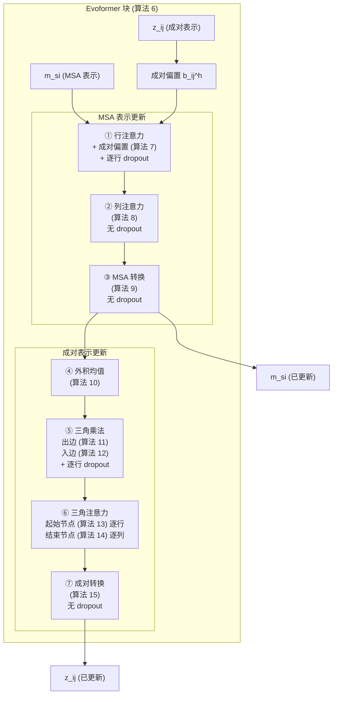
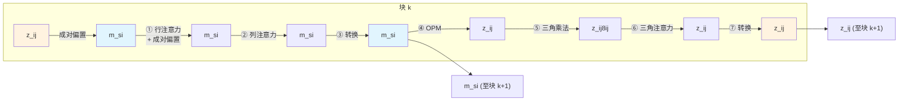

---
slug:6-evoformer-stack
blog_type:normal
---


Evoformer 是 AlphaFold2 的计算核心——一个 48 块的残差堆栈，通过双向信息流联合演进 MSA 表示 **m** ∈ ℝ^(N_seq × N_res × c_m) 和成对表示 **z** ∈ ℝ^(N_res × N_res × c_z)。每个块按照算法 6 规定的固定顺序执行七个子操作，在消耗成对信息的 MSA 行更新（通过成对偏置注意力）与消耗 MSA 信息的成对更新（通过外积均值）之间交替进行。其结果是一个深度交织的表示，在提取单一表示并传递给结构模块之前，进化耦合和几何约束在所有 48 次迭代中相互精炼。

来源: [evoformer.py](minalphafold/evoformer.py#L28-L95), [model.py](minalphafold/model.py#L53-L55)

## 架构概述

Evoformer 块实现了一个双更新残差图，其中 MSA 和成对表示通过一系列精心排序的操作进行更新。这种排序并非任意——它确保在单个块内，成对表示能够影响 MSA（步骤 1：成对偏置行注意力），而更新后的 MSA 也能影响成对表示（步骤 4：外积均值），从而在每个块中创建一轮完整的双向交换。



完整的 Evoformer 堆栈将此块实例化 `num_evoformer` 次（默认 48 次），作为一个 `torch.nn.ModuleList`。在训练期间，梯度检查点 (`torch.utils.checkpoint`) 包装每个块，以计算换内存——块之间的激活被丢弃，并在反向传播时重新计算，这遵循了补充材料中声明的策略 (§1.11.8)：“我们存储在 N_block = 48 个 Evoformer 块之间传递的激活。在反向传播期间，我们重新计算块内的所有激活。”

来源: [evoformer.py](minalphafold/evoformer.py#L28-L50), [model.py](minalphafold/model.py#L347-L363)

## 块组合与数据流

每次 `Evoformer.forward` 调用接受 `(msa_representation, pair_representation, msa_mask, pair_mask)` 并在一次完整更新后返回相同的一对张量。该实现严格遵循残差连接——每个子模块的输出都加到输入表示上，而不是替换它。这保留了使得 48 块深度变得可处理的梯度高速通路。

前向传播按此确切顺序执行：

| 步骤 | 算法 | 操作 | 输入 → 输出 | Dropout |
|------|-----------|-----------|----------------|---------|
| 1 | 算法 7 | `MSARowAttentionWithPairBias` | (m, z) → Δm | 逐行 (p=0.15) |
| 2 | 算法 8 | `MSAColumnAttention` | m → Δm | 无 |
| 3 | 算法 9 | `MSATransition` | m → Δm | 无 |
| 4 | 算法 10 | `OuterProductMean` | m → Δz | 无 |
| 5 | 算法 11 | `TriangleMultiplicationOutgoing` | z → Δz | 逐行 (p=0.25) |
| 5 | 算法 12 | `TriangleMultiplicationIncoming` | z → Δz | 逐行 (p=0.25) |
| 6 | 算法 13 | `TriangleAttentionStartingNode` | z → Δz | 逐行 (p=0.25) |
| 6 | 算法 14 | `TriangleAttentionEndingNode` | z → Δz | 逐列 (p=0.25) |
| 7 | 算法 15 | `$PairTransition` | z → Δz | 无 |

dropout 调度在设计上是不对称的。MSA 更新使用仅应用于行注意力的单一比率 (`evoformer_msa_dropout = 0.15`)。成对更新使用应用于三角乘法和三角注意力输出的 `evoformer_pair_dropout = 0.25`——但具有关键的结构区别：起始节点三角注意力和两个三角乘法使用**逐行** dropout，而结束节点三角注意力使用**逐列** dropout。这遵循了补充材料 §1.11.6 的规定，即共享掩码模式应与注意力的空间轴保持一致。

来源: [evoformer.py](minalphafold/evoformer.py#L70-L95), [alphafold2.toml](configs/alphafold2.toml#L53-L56)

## 带有成对偏置的 MSA 行注意力 (算法 7)

这是成对表示将几何和结构信息注入 MSA 的机制。对于每个 MSA 序列行 *s*，在残基位置 *i, j* 上计算标准的多头自注意力，但注意力 logits 接收一个源自成对表示的逐头附加偏置：

**a_{sij}^h = softmax_j(q · k / √d + b_{ij}^h)**

其中偏置 **b_{ij}^h = LinearNoBias(LayerNorm(z_{ij}))** 将成对表示从 c_z 维投影到 `num_heads` 个标量——每个注意力头一个偏置，在所有 MSA 行之间共享。这种共享是刻意为之的：成对表示编码了残基对关系（距离、方向、接触），这些关系与我们在哪个进化序列内进行注意力计算*无关*，因此沿序列维度广播既正确又高效。

输出是门控的：**sigmoid(Linear(m)) ⊙ attention_output**，然后投影回 c_m。门控机制允许网络选择性地抑制没有信息量的注意力输出，这在初始化时尤其重要——零初始化方案确保门控起始值接近零，使得每个块在训练开始时近似为恒等映射。

```python
# 核心注意力计算（简化自实际代码）
Q = self.linear_q(LayerNorm(m))   # (B, N_seq, N_res, num_heads * head_dim)
K = self.linear_k(LayerNorm(m))
V = self.linear_v(LayerNorm(m))
B = self.linear_pair(LayerNorm(z))  # (B, N_res, N_res, num_heads) — 成对偏置
scores = einsum('bsihd, bsjhd -> bshij', Q, K) / sqrt(d) + B  # 沿序列维度广播
attention = softmax(scores, dim=-1)
values = einsum('bshij, bsjhd -> bsihd', attention, V)
output = Linear(sigmoid(Linear(m)) * values)  # 门控输出
```

<CgxTip>成对偏置 `b_{ij}^h` 的形状为 `(batch, num_heads, N_res, N_res)`——它由 z 计算一次，并为每个 MSA 行重用。沿序列维度的 `unsqueeze(1)` 广播意味着所有 N_seq 行都以相同的结构先验进行注意力计算，这既是预期的语义，也显著节省了内存。</CgxTip>

来源: [evoformer.py](minalphafold/evoformer.py#L97-L194)

## MSA 列注意力 (算法 8)

对于每个残基位置 *i*，注意力**在 MSA 序列** *s = 1, ..., N_seq* **之间**计算。这是行注意力的转置视角：列注意力不再询问“在一个进化序列中哪些残基位置是相关的？”，而是询问“哪些进化序列在此残基位置上达成一致？” 列注意力没有成对偏置——成对信息仅通过行注意力路径进入 MSA。

该实现使用 einsum 模式 `'bsihd, btihd -> bihst'`，其中 *s* 索引查询序列，*t* 索引键序列，softmax 作用于 *t* 维度。与行注意力一样，输出是门控和掩码化的：填充的序列位置通过 -1e9 的偏置获得零注意力 logits。

来源: [embedders.py](minalphafold/embedders.py#L575-L652)

## MSA 转换 (算法 9)

一个独立应用于 MSA 表示每个单元格的位置式双层前馈网络：`LayerNorm → Linear(c_m → 4·c_m) → ReLU → Linear(4·c_m → c_m)`。扩展因子 4 是补充材料的默认值。不应用 dropout——残差连接是纯加性的。这是块中最简单的子模块，在两个注意力步骤之间提供逐位置的非线性特征精炼。

来源: [embedders.py](minalphafold/embedders.py#L655-L684)

## 外积均值 (算法 10)

这是在单个 Evoformer 块内 MSA 表示写入成对表示的**唯一通道**。它计算 MSA 的对称摘要，以捕获残基位置之间的协变：

1. 将每个 MSA 单元格投影到两个隐藏向量：**a_{si} = Linear_left(LayerNorm(m_{si}))**，**b_{sj} = Linear_right(LayerNorm(m_{sj}))**，两者均在 ℝ^c_hidden 中
2. 取它们外积的序列均值：**mean_s(a_{si} ⊗ b_{sj})** ∈ ℝ^(c_hidden × c_hidden)
3. 展平并投影：**Linear_out(flatten(outer))** → ℝ^c_z

掩码感知的归一化除以有效 (s,i)×(s,j) 对的数量而不是 N_seq，确保填充位置不会破坏均值。此操作是互信息估计器的神经网络类比——它发现哪些残基位置在进化过程中共同变化，这正是决定接触结构的信号。

<CgxTip>当 N_seq 很大时，外积均值是 Evoformer 块中计算量 (FLOP) 最大的子模块，因为 einsum `'bsic, bsjd -> bijcd'` 沿序列维度收缩的计算复杂度为 O(N_seq × N_res² × c_hidden²)。隐藏维度 c=32（对比 c_m=256）使其保持可控。</CgxTip>

来源: [embedders.py](minalphafold/embedders.py#L686-L743)

## 三角乘法更新 (算法 11 & 12)

这两个模块在成对表示中强制执行**三角不等式结构**。成对表示 z_{ij} 在概念上编码了残基 i 和 j 之间的关系；三角更新确保如果 z_{ik} 和 z_{jk} 都有信息量，那么 z_{ij} 应该由它们的一致性（或矛盾性）提供信息。

**出边 (算法 11)：** 通过从 *i* 和 *j* 发出的*出边*在中间节点 *k* 上进行池化：

**z_{ij} ← g_{ij} ⊙ Linear(LayerNorm(Σ_k a_{ik} ⊙ b_{jk}))**

其中 `a = sigmoid(gate_a(z)) * Linear_a(z)`，`b` 同理。einsum `'bikc, bjkc -> bijc'` 在 *k* 上收缩 A[i,k] 与 B[j,k]，要求两条边都从其源节点*指向*共享的中间节点。

**入边 (算法 12)：** 使用*入边*的镜像操作：

**z_{ij} ← g_{ij} ⊙ Linear(LayerNorm(Σ_k a_{ki} ⊙ b_{kj}))**

einsum `'bkic, bkjc -> bijc'` 收缩 A[k,i] 与 B[k,j]，其中两条边都从共享源节点 *k* *指向*其目标节点。

两种变体都使用三个门控层（投影上的 gate1、gate2；输出上的 gate）和收缩后的 LayerNorm。输出投影 (`out_linear`) 是零初始化的，因此在训练开始时，三角更新不产生任何贡献，Evoformer 块以近似恒等映射开始。

| 属性 | 出边 (算法 11) | 入边 (算法 12) |
|----------|-------------------|-------------------|
| 收缩 | `Σ_k a_{ik} · b_{jk}` | `Σ_k a_{ki} · b_{kj}` |
| 边语义 | i→k 和 j→k (出边) | k→i 和 k→j (入边) |
| einsum | `'bikc, bjkc -> bijc'` | `'bkic, bkjc -> bijc'` |
| Dropout | 逐行 | 逐行 |
| 隐藏维度 | 128 | 128 |

来源: [embedders.py](minalphafold/embedders.py#L745-L866)

## 三角自注意力 (算法 13 & 14)

这些是**沿着成对表示的行或列**操作的注意力机制，将一个残基索引视为“批次”维度，而在另一个上进行注意力计算。

**起始节点 (算法 13)：** 对于每个起始节点 *i*，使用来自 z_{ij} 的查询/键和三角偏置 b_{jk} = LinearNoBias(LayerNorm(z_{jk}))，对结束节点 *j* 进行注意力计算。einsum `'bijhd, bikhd -> bijkh'` 计算注意力分数，其中 *j* 是查询位置，*k* 是键位置，两者共享相同的起始节点 *i*。偏置 z_{jk} 直接连接两个结束节点，提供三角一致性信号。应用**逐行 dropout**。

**结束节点 (算法 14)：** 转置操作——对于每个结束节点 *j*，使用偏置 b_{ki} 对起始节点 *i* 进行注意力计算。根据补充材料 §1.11.6，应用**逐列 dropout**。

| 属性 | 起始 (算法 13) | 结束 (算法 14) |
|----------|-------------------|-----------------|
| 固定轴 | i (起始节点) | j (结束节点) |
| 注意力计算范围 | j → k | i → k |
| 偏置来源 | z_{jk} | z_{ki} |
| 分数 einsum | `'bijhd, bikhd -> bijkh'` | `'bkjd, bkhd -> bkjh'` (转置) |
| Dropout | 逐行 | 逐列 |
| 头维度 | 32 | 32 |
| 头数 | 4 | 4 |

来源: [embedders.py](minalphafold/embedders.py#L868-L1053)

## 成对转换 (算法 15)

成对表示上的位置式双层前馈网络，结构与 MSA 转换相同，但在 c_z 通道上操作：`LayerNorm → Linear(c_z → 4·c_z) → ReLU → Linear(4·c_z → c_z)`。无 dropout。这在具有几何结构的三角更新之后提供逐对的非线性精炼，类似于 MSA 转换在注意力步骤之后进行精炼。

来源: [embedders.py](minalphafold/embedders.py#L1055-L1081)

## 共享掩码 Dropout (补充材料 §1.11.6)

Evoformer 使用一种非标准的 dropout 变体，其中二值掩码**沿一个空间维度共享**。这对于成对表示至关重要，因为单个被丢弃的行或列会影响引用该残基的每个成对元素，从而保持几何一致性：

- **`dropout_rowwise(x, p)`**：生成形状为 `(B, 1, N_res, D)` 的掩码——跨行共享 (维度 1)，跨列变化 (维度 2)。每行看到相同的列丢弃模式。
- **`dropout_columnwise(x, p)`**：生成形状为 `(B, N_res, 1, D)` 的掩码——跨列共享 (维度 2)，跨行变化 (维度 1)。每列看到相同的行丢弃模式。

这不是标准的 PyTorch dropout，后者按元素独立采样。共享掩码方法确保如果残基 *k* 从一个三角更新中被丢弃，它就会从所有更新中被丢弃，防止网络在单次前向传播中看到残基图的不一致子集。

来源: [utils.py](minalphafold/utils.py#L25-L52)

## 梯度堆叠与内存策略

48 块的 Evoformer 堆栈是 AlphaFold2 网络中最深的部分，朴素地物化所有块间激活将耗尽 GPU 内存。该实现在训练期间对每个块使用 `torch.utils.checkpoint`：

```python
for block in self.evoformer_blocks:
    if self.training:
        msa_repr, pair_repr = torch_checkpoint.checkpoint(
            block, msa_repr, pair_repr,
            msa_mask=evo_msa_mask, pair_mask=pair_mask,
            use_reentrant=False,
        )
    else:
        msa_repr, pair_repr = block(msa_repr, pair_repr, ...)
```

在前向传播期间，只存储每个块的输入；块的内部激活被丢弃。在反向传播期间，重新执行每个块以重建所需的激活。这将内存从 O(48 × block_activations) 减少到 O(48 × block_input + 1 × block_activations)，代价是每个块多一次额外的前向传播。`use_reentrant=False` 标志使用 PyTorch 的现代检查点 API，该 API 与 autograd 钩子和自定义梯度兼容。

来源: [model.py](minalphafold/model.py#L347-L363)

## 配置参数

完整的 AlphaFold2 配置定义了以下与 Evoformer 相关参数：

| 参数 | 值 | 参考 | 描述 |
|-----------|-------|-----------|-------------|
| `num_evoformer` | 48 | §1.6 | Evoformer 块的数量 |
| `c_m` | 256 | §1.5 | MSA 表示通道维度 |
| `c_z` | 128 | §1.5 | 成对表示通道维度 |
| `dim` | 32 | 算法 7/8 | MSA 行/列注意力的头维度 |
| `num_heads` | 8 | 算法 7/8 | MSA 行/列注意力的头数 |
| `msa_transition_n` | 4 | 算法 9 | MSA 转换扩展因子 |
| `outer_product_dim` | 32 | 算法 10 | OPM 隐藏维度 |
| `triangle_mult_c` | 128 | 算法 11/12 | 三角乘法隐藏维度 |
| `triangle_dim` | 32 | 算法 13/14 | 三角注意力头维度 |
| `triangle_num_heads` | 4 | 算法 13/14 | 三角注意力头数 |
| `pair_transition_n` | 4 | 算法 15 | 成对转换扩展因子 |
| `evoformer_msa_dropout` | 0.15 | §1.11.6 | MSA 行注意力 dropout 率 |
| `evoformer_pair_dropout` | 0.25 | §1.11.6 | 三角更新 dropout 率 |

来源: [alphafold2.toml](configs/alphafold2.toml#L1-L56)

## 零初始化与门控策略

Evoformer 在 48 个块中的可训练性关键取决于其初始化方案，该方案在 `AlphaFold2._initialize_alphafold_parameters` 中实现。使用了两种互补的策略：

**零初始化的输出投影：** `MSARowAttentionWithPairBias`、`MSAColumnAttention`、`TriangleAttentionStartingNode` 和 `TriangleAttentionEndingNode` 的 `linear_output` 被零初始化。这意味着每个注意力子模块在训练开始时产生零输出，使得每个 Evoformer 块成为近似恒等映射。梯度随后可以从一开始就干净地流过 48 个残差连接，并且网络随着学习逐渐“开启”每个子模块。

**门控输出：** 每个注意力和三角乘法模块计算 `sigmoid(gate) * output`，其中门控通过 `init_gate_linear` 初始化（小的随机权重，零偏置 → 起始时 sigmoid ≈ 0.5）。这为每个模块提供了一个可学习的开关，与零初始化协同工作——即使在输出投影发展出非零权重之后，门控也可以抑制无益的贡献。

来源: [model.py](minalphafold/model.py#L106-L153), [initialization.py](minalphafold/initialization.py#L1-L1)

## 信息流摘要



m 和 z 之间的**双向耦合**是 Evoformer 的决定性特征。在单个块内：z → m 发生在步骤 1（行注意力中的成对偏置），m → z 发生在步骤 4（外积均值）。跨 48 个块，这创建了 48 轮相互精炼，其中在 MSA 中发现的进化耦合为成对表示中的几何约束提供信息，进而锐化 MSA 中的注意力模式。这种迭代协同进化使得 AlphaFold2 能够从稀疏的 MSA 信号中解析出模糊的接触。

在所有 48 个块之后，通过第一行 MSA 的线性投影提取单一表示：**s_i = Linear(m_{1i})**，其中第一行对应于目标序列。此 s_i 连同最终的 z_ij 一起输入到[结构模块与 IPA](7-structure-module-and-ipa)。