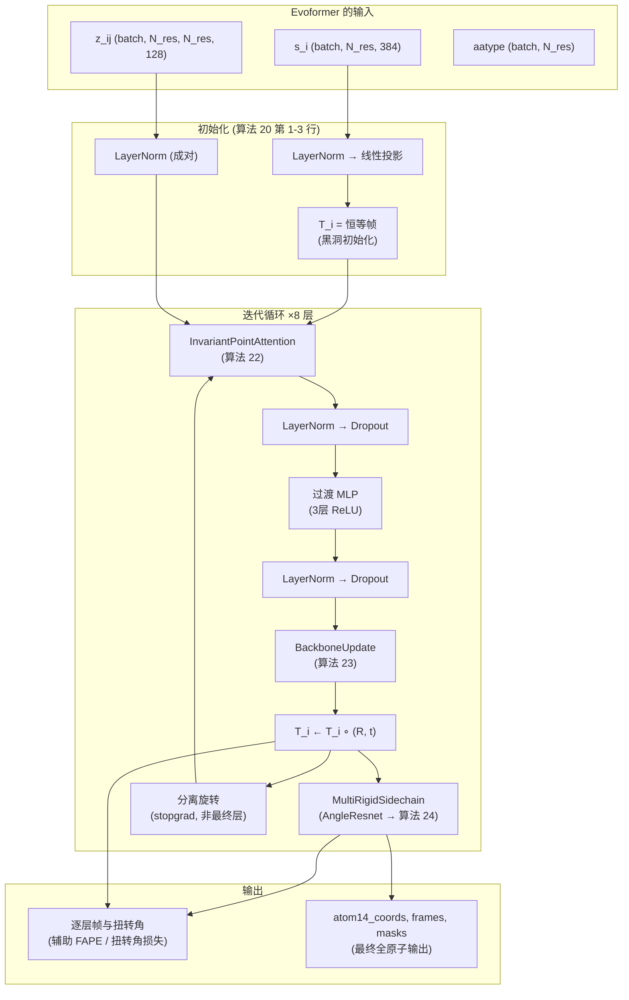

---
slug:7-structure-module-and-ipa
blog_type:normal
---


结构模块是 AlphaFold2 流水线的最后阶段——这个架构组件将 Evoformer 的抽象表示转换为具体的 3D 原子坐标。它通过**不变点注意力**（Invariant Point Attention, IPA）的迭代循环来实现这一点，这是一种保持刚体运动等变性的几何感知注意力机制，随后进行逐残基的主链帧更新和侧链扭转角预测。本页涵盖了完整的迭代循环（算法 20）、它的三个子模块（IPA / 算法 22、BackboneUpdate / 算法 23 以及扭转角头 / 算法 24），以及使训练稳定的关键设计决策——零初始化、旋转分离和单位缩放。

来源: [structure_module.py](/minalphafold/structure_module.py#L1-L20)

## 架构概述

结构模块位于 AlphaFold2 前向传播的末端。在 48 个 Evoformer 块生成单一表示 `s_i ∈ ℝ^{c_s}` 和成对表示 `z_ij ∈ ℝ^{c_z}` 之后，结构模块消耗这两者并生成：每次迭代中每个残基的刚体帧 `(R_i, t_i)`（用于辅助 FAPE 损失），每个残基的七个扭转角（以 (sin, cos) 对的形式），以及最终的 atom14 坐标。下图展示了内部的数据流：



该循环默认运行 8 次迭代（`structure_module_layers = 8`）。每次迭代利用来自 IPA 的几何上下文来优化单一表示，应用过渡 MLP，更新主链帧，并预测侧链扭转角。关键的是，每个帧的旋转分量在迭代之间（最后一次除外）被分离，防止梯度通过链式帧组合产生“杠杆效应”，同时仍然允许平移梯度在每一层流向辅助 Cα FAPE 损失。

来源: [structure_module.py](/minalphafold/structure_module.py#L117-L141), [structure_module.py](/minalphafold/structure_module.py#L198-L313)

## 迭代循环 — StructureModule.forward

`StructureModule.forward` 方法逐步实现了算法 20。以下是每个阶段的详细解析，附带了补充材料中对应的算法行号。

**阶段 1 — 输入归一化（第 1-2 行）。** `s_i` 和 `z_ij` 都经过 LayerNorm。然后单一表示通过 `single_rep_proj`（一个带有默认初始化的 `Linear(c_s → c_s)`）进行投影。IPA 前的单一表示被保存为 `initial_single_representation`——扭转角头随后会同时消耗当前和初始表示，这使得侧链路径能够访问未变形的 Evoformer 信号。

**阶段 2 — 黑洞初始化（第 3 行）。** 所有逐残基帧初始化为恒等变换：`R_i = I₃`，`t_i = 0`。这种“黑洞”初始化将每个残基置于原点且无旋转——IPA 迭代必须从零开始发现正确的几何结构。

**阶段 3 — IPA 循环（第 6-21 行）。** 对于 8 层中的每一层：
1. `s ← s + IPA(s, z, R, t)` — IPA 添加几何上下文（算法 22）。
2. `s* ← LayerNorm(Dropout(s))` — 稳定化和正则化。
3. `s ← s + Transition(s)` — 扩展因子为 1 的 3 层 ReLU MLP（即 `c_s → c_s → c_s → c_s`），最后一个线性层是零初始化的，因此该块初始为恒等映射。
4. `s ← LayerNorm(Dropout(s))` — 第二轮归一化。
5. `(R_update, t_update) ← BackboneUpdate(s)` — 预测局部旋转 + 平移。
6. `T_i ← T_i ∘ (R_update, t_update)` — 将更新组合到世界帧中。
7. 侧链扭转角和 atom14 坐标通过 `MultiRigidSidechain` 从更新后的帧中计算得出。
8. **旋转分离：** 如果这不是最后一层，则 `R_i ← R_i.detach()`。平移保留梯度。

**阶段 4 — 输出组装。** 所有逐层的帧、平移和扭转角都被堆叠成轨迹。内部纳米坐标通过将平移和原子位置乘以 `position_scale = 10.0` 转换回埃。输出字典包含键 `traj_rotations`、`traj_translations`、`traj_torsion_angles`、`final_rotations`、`final_translations`、`all_frames_R`、`all_frames_t`、`atom14_coords`、`atom14_mask` 和 `single`。

| 输出键 | 形状 | 用途 |
|---|---|---|
| `traj_rotations` | `(8, B, N, 3, 3)` | 用于辅助 FAPE 的逐层主链帧 |
| `traj_translations` | `(8, B, N, 3)` | 逐层主链位置 (Å) |
| `traj_torsion_angles` | `(8, B, N, 7, 2)` | 逐层归一化的 (sin, cos) 对 |
| `atom14_coords` | `(B, N, 14, 3)` | 最终的全原子坐标 (Å) |
| `atom14_mask` | `(B, N, 14)` | 逐原子有效性掩码 |
| `single` | `(B, N, c_s)` | IPA 后的单一表示（用于 pLDDT, distogram） |

来源: [structure_module.py](/minalphafold/structure_module.py#L198-L313), [alphafold2.toml](/configs/alphafold2.toml#L58-L72)

## 不变点注意力 — 算法 22

IPA 是结构模块的几何核心。它是一种改进的多头注意力机制，从**三个**独立的来源——标量、成对偏置和点——计算注意力分数，并从**三个**对应的通道汇聚值。其关键特性是 **SE(3) 不变性**：如果每个帧 `T_i` 和每个点都经历相同的刚体运动，输出只会将该相同运动应用于点值输出而发生变化。这意味着 IPA 的标量输出是不变的（不受刚体运动影响），而其点输出是等变的（能正确变换）。

### 三种注意力分数贡献

对于每个头 `h` 和残基对 `(i, j)`，注意力 logit 为：

$$\text{logit}_{ij}^h = \frac{1}{\sqrt{3}} \left( \underbrace{\frac{q_i^h \cdot k_j^h}{\sqrt{c}}}_{\text{标量}} + \underbrace{b_{ij}^h}_{\text{成对偏置}} + \underbrace{-\frac{\gamma_h}{2} \sum_p \|T_i(q_{ip}^h) - T_j(k_{jp}^h)\|^2}_{\text{点}} \right)$$

| 组件 | 投影 | 每头形状 | 作用 |
|---|---|---|---|
| **标量** | 来自 `Linear(c_s → N_head·c)` 的 `q_i^h, k_j^h, v_j^h` | `(c=16)` | 序列特征上的标准注意力 |
| **成对偏置** | `b_{ij} = Linear(z_{ij})` | 每头 `(1)` | 成对表示作为加性分数偏置 |
| **点** | 来自点投影的 `q_ip^h, k_jp^h, v_jp^h`，通过 `T_i` 转换到全局帧 | `(N_q=4, N_v=8, 3D)` | 几何感知：在 3D 空间中距离更近的残基具有更大的注意力 |

`1/√3` 前置因子和 `1/√(3·c)` 标量缩放确保了当维度平衡时各项的贡献相等。点注意力使用一个**可学习的逐头权重** `γ_h = softplus(head_weights_h) · √(1 / (3 · N_q · 9/2))`，其中 `9/2` 因子对 3D 点维度进行了归一化。

### 点投影与帧变换

`_project_points` 辅助函数通过将输出切分为 x/y/z 分量并将它们堆叠为最后一个轴，将原始线性输出重塑为 `(batch, N_res, N_head, N_points, 3)` 格式。这些局部帧点随后被转换为全局坐标：

```python
query_points_global = R_i @ q_points + t_i
key_points_global   = R_j @ k_points + t_j
value_points_global = R_j @ v_points + t_j
```

这种帧变换使得 IPA 具备几何感知能力。平方距离 `||T_i(q_i) - T_j(k_j)||²` 对同时应用于所有帧的任何全局刚体运动是不变的，因为帧和点是共同运动的。

### 输出特征组装

在 `j` 维度上进行 softmax 后，三个值流被组装并拼接：

1. **标量值**：`output_scalar = softmax · v` → 形状 `(B, N, N_head · c)`
2. **点值**：经过注意力加权的全局点被转换回每个查询残基的局部帧，然后被切分为 x/y/z 分量**以及**它们的 L2 范数——为每个点值提供 `4 + 1 = 5` 个通道。最终形状：切分分量为 `(B, N, N_head · N_v · 4)`，范数为 `(B, N, N_head · N_v)`。
3. **成对值**：`output_pair = softmax · z_ij` → 形状 `(B, N, N_head · c_z)`

拼接后的特征通过 `linear_output`（零初始化 / "final" 初始化），因此 IPA 初始为恒等映射——结构模块最初原封不动地传递 `s_i`。

<CgxTip>IPA 的 `linear_output` 使用 `init="final"`（零权重/偏置）。这意味着在初始化时，IPA **没有任何**贡献——结构模块的第一次迭代是纯粹的恒等映射。结合 `BackboneUpdate` 的零初始化，整个结构模块最初作为一个空操作启动，必须通过训练来发现几何更新。这就是补充材料 1.11.4 中的“零初始化最终权重层”规则。</CgxTip>

来源: [structure_module.py](/minalphafold/structure_module.py#L316-L541)

## 主链帧更新 — 算法 23

在 IPA 和过渡 MLP 更新了单一表示之后，`BackboneUpdate` 从 `s_i` 中提取逐残基的刚体变换。该机制刻意保持简单：

1. **投影为 6 个标量**：`vals = Linear(c_s → 6)`，其中线性层是零初始化的。
2. **通过四元数旋转**：前 3 个值 `(b, c, d)` 定义了一个未归一化的四元数 `(1, b, c, d)`，它被归一化为单位长度。相应的旋转矩阵由标准的四元数到旋转公式构建。这种参数化总是产生一个正规旋转（det = +1），且恒等变换对应于 `(b, c, d) = (0, 0, 0)`——这与零初始化相匹配。
3. **平移**：剩余的 3 个值 `(t_x, t_y, t_z)` 是局部帧的平移更新。

帧组合 `T_i ← T_i ∘ (R, t)` 意味着更新是在残基自身的局部帧中应用的——旋转围绕残基的局部轴进行，平移沿着它们移动。在世界坐标系中：

```python
translations = R_i @ t_update + t_i    # 将局部平移旋转到世界帧中，并相加
rotations    = R_i @ R_update           # 组合旋转
```

来源: [structure_module.py](/minalphafold/structure_module.py#L543-L610)

## 侧链扭转角与原子放置 — 算法 24-25

主链帧更新后，`MultiRigidSidechain` 预测每个残基的七个扭转角，并将其展开为完整的 atom14 坐标。这是一个两阶段过程：通过 AngleResnet 进行**扭转角预测**，然后通过 `compute_all_atom_coordinates` 进行**原子放置**。

### AngleResnet — 扭转角预测

`AngleResnet` 接收当前的单一表示 `s_i` 和初始（IPA 前）单一表示，将它们分别线性投影到隐藏空间，将它们求和，并将结果通过 `num_blocks` 个残差块。每个 `AngleResnetBlock` 实现 `a → a + Linear₂(ReLU(Linear₁(ReLU(a))))`，其中 `Linear₂` 是零初始化的——因此该块初始为恒等映射。最后的线性层输出 `7 × 2` 个值（七个角，每个作为未归一化的 (sin, cos) 对）。这些值被 L2 归一化为单位 (sin, cos) 向量，用于旋转矩阵的构建，而未归一化的版本则被保留用于角度范数损失项。

| 参数 | 值 | 来源 |
|---|---|---|
| `c_in2` | 384 (= c_s) | Evoformer 单一表示维度 |
| `c_hiddenBhidden` | 128 (= structure_module_c) | 第 1.8 节 |
| `num_blocks` | 2 | 算法 20 第 12-13 行 |
| `num_angles` | 7 | ωC φ6 ψ, χG1, χ2, χ3, χ4 |

### 刚体组帧G构造 —7— 算法 24

`rigid_group_frames_from_torsions` 根据主链帧和扭转角构建每个残基的八个帧。七个扭转角为 `[ω, φ, ψ, χ1, χ2, χ3, χ4]`。帧构建遵循特定的拓扑结构：

- **帧 0** — 直接使用主链帧 `(R_i, t_i)`。
- **帧 1-4** (ω, φ, ψ, χ1) — 每个帧从主链帧分支出来：`T_i ∘ T^lit_{r,f→bb} ∘ makeRotX(α_f)`。文献变换 `T^lit` 是一个特定于残基类型的常数，它将扭转旋转轴相对于主链进行定位。
- **帧 5-7** (χ2, χ3, χ4) — 这些帧从前一个帧**链式**分支出来：χ2 从 χ1 分支，χ3 从 χ2 分支，χ4 从 χ3 分支。这种链式拓扑反映了侧链的物理结构——每个连续的 χ 旋转都是相对于前一个定义的。

### makeRotX — 扭转旋转 — 算法 25

每个扭转角 α 产生一个绕局部 x 轴的旋转：

```
| 1      0        0    |
| 0   cos(α)   -sin(α) |
| 0   sin(α)    cos(α) |
```

来自 AngleResnet 的 (sin, cos) 对被直接使用——不需要反正切。这在数值上既稳定又处处可微（不像 arctan 在 ±π 处那样）。

### 从帧进行原子放置

一旦构建了 8 个刚体组帧，每个原子的位置由以下步骤确定：(1) 通过 `atom_frame_idx_table` 查找它属于哪个刚体组，(2) 通过 `lit_positions` 查找它在该组内的文献位置，(3) 应用该组的帧：`x_global = R_frame @ x_lit + t_frame`。这是一个在帧索引表上使用 `torch.gather` 的批量收集并应用操作。

来源: [structure_module.py](/minalphafold/structure_module.py#L55-L115), [structure_module.py](/minalphafold/structure_module.py#L613-L839)

## 单位制与坐标缩放

补充材料内部使用**纳米**——文献中的键长单位为 nm，平移缩放因子 `s = 10` 用于在 nm（内部）和 Å（外部）之间转换。边界转换发生在两点：

1. **`__init__`** — `default_frames[..., :3, 3]` 和 `lit_positions` 除以 `position_scale` (10.0) 以将 Å 转换为 nm。这些是注册缓冲区，因此转换在构造时只发生一次。
2. **`forward`** — 输出平移和原子位置乘以 `position_scale` 以将 nm 转换为 Å。旋转是无量纲的，不需要转换。

这种设计将所有内部算术保持在补充材料的 nm 单位中，同时以更传统的埃尺度呈现面向用户的输出。

来源: [structure_module.py](/minalphafold/structure_module.py#L192-L196), [structure_module.py](/minalphafold/structure_module.py#L288-L311)

## 旋转分离与梯度流

结构模块中最微妙的设计决策之一是迭代之间的**选择性旋转分离**。在每次非最终迭代之后，旋转矩阵 `R_i` 会从计算图中分离（`rotations = rotations.detach()`），而平移则保留完整的梯度流。这实现了算法 20 第 19-21 行规定的旋转“stop_gradient”。

其动机是防止**杠杆效应**——如果旋转梯度流经所有 8 次迭代，早期迭代中单一表示的微小变化将通过一串组合旋转传播，产生巨大且嘈杂的梯度信号。通过分离旋转，每次迭代只能看到当前旋转的*值*，但无法通过其计算过程进行反向传播。平移保持附着，以便在每一层计算的**辅助 Cα FAPE 损失**仍然可以通过平移分量获得通往 Evoformer 的梯度路径。

最后一次迭代的旋转**不**被分离，因此最终的全原子 FAPE 损失可以端到端地优化最后一次主链更新。

<CgxTip>`detach_rotations` 标志默认为 `True`（AF2 标准），但可以设置为 `False` 以用于记忆或调试，从而允许梯度流经所有的旋转组合。这作为 `StructureModule.forward` 中的一个参数暴露出来。</CgxTip>

来源: [structure_module.py](/minalphafold/structure_module.py#L269-L274), [structure_module.py](/minalphafold/structure_module.py#L200-L208)

## 零初始化设计模式

根据补充材料 1.11.4，零初始化在结构模块中被广泛使用。这确保了该模块作为恒等函数启动，并且必须**学习**其几何更新：

| 组件 | 零初始化目标 | 初始化时的效果 |
|---|---|---|
| `IPA.linear_output` | 权重和偏置 → 0 | IPA 输出为零（无注意力信号） |
| `BackboneUpdate.linear` | 权重和偏置 → 0 | 帧更新为恒等变换（无旋转/平移） |
| `AngleResnetBlock.linear_2` | 权重和偏置 → 0 | 残差块为恒等映射（无角度校正） |
| `Transition linear_3` | 权重和偏置 → 0 | 过渡 MLP 为恒等映射（无通道混合） |

综合效果是，在初始化时，结构模块将所有残基生成在原点，具有恒等旋转和零扭转角。训练逐渐发现正确的几何结构，零初始化提供了一个稳定的起点，避免了随机的大帧更新。

来源: [structure_module.py](/minalphafold/structure_module.py#L34-L52), [structure_module.py](/minalphafold/structure_module.py#L180-L183)

## 配置参考

下表总结了所有结构模块和 IPA 的配置参数及其 AlphaFold2 论文中的默认值：

| 参数 | 默认值 | 补充材料引用 | 描述 |
|---|---|---|---|
| `structure_module_c` | 128 | §1.8 | 内部通道维度 |
| `structure_module_layers` | 8 | 算法 20 | IPA 迭代次数 |
| `structure_module_dropout_ipa` | 0.1 | 算法 20 第 7 行 | IPA 后的 Dropout |
| `structure_module_dropout_transition` | 0.1 | 算法 20 第 9 行 | 过渡后的 Dropout |
| `position_scale` | 10.0 | §1.8.3 | Å↔nm 转换因子 (s = 10) |
| `ipa_num_heads` | 12 | 算法 22 | IPA 注意力头数 |
| `ipa_c` | 16 | 算法 22 | 每头通道维度 |
| `ipa_n_query_points` | 4 | 算法 22 | 每头查询点数 |
| `ipa_n_value_points` | 8 | 算法 22 | 每头值点数 |
| `sidechain_num_channel` | 128 | §1.8.4 | AngleResnet 隐藏层宽度 |
| `sidechain_num_residual_block` | 2 | 算法 20 | AngleResnet 残差块数 |

来源: [alphafold2.toml](/configs/alphafold2.toml#L58-L72)

## 算法映射摘要

| minAlphaFold2 类/函数 | 补充材料算法 | 章节 |
|---|---|---|
| `StructureModule` | 算法 20 | §1.8 (完整迭代循环) |
| `InvariantPointAttention` | 算法 22 | §1.8.2 |
| `BackboneUpdate` | 算法 23 | §1.8.3 |
| `compute_all_atom_coordinates` | 算法 24 | §1.8.4 |
| `make_rot_x` | 算法 25 | §1.8.4 第 1 行 |
| `MultiRigidSidechain` | §1.8.4 文本 | 扭转角头 |
| `AngleResnet` / `AngleResnetBlock` | §1.8.4 文本 | ReLU-MLP 主干 |

来源: [structure_module.py](/minalphafold/structure_module.py#L1-L20)

## 相关页面

结构模块依赖于几个在专门页面中涵盖的架构概念：IPA 操作所基于的**刚体帧和扭转角约定**详见[刚体帧与扭转角](9-rigid-frames-and-torsions)；**IPA 不变性的完整数学推导**详见[不变点注意力](10-invariant-point-attention)；消耗结构模块逐层输出的**FAPE 和扭转角损失**详见[损失函数与 FAPE](11-loss-functions-and-fape)；以及使结构模块稳定的**零初始化和 EMA**训练基础设施详见[零初始化与参数 EMA](13-zero-init-and-parameter-ema)。