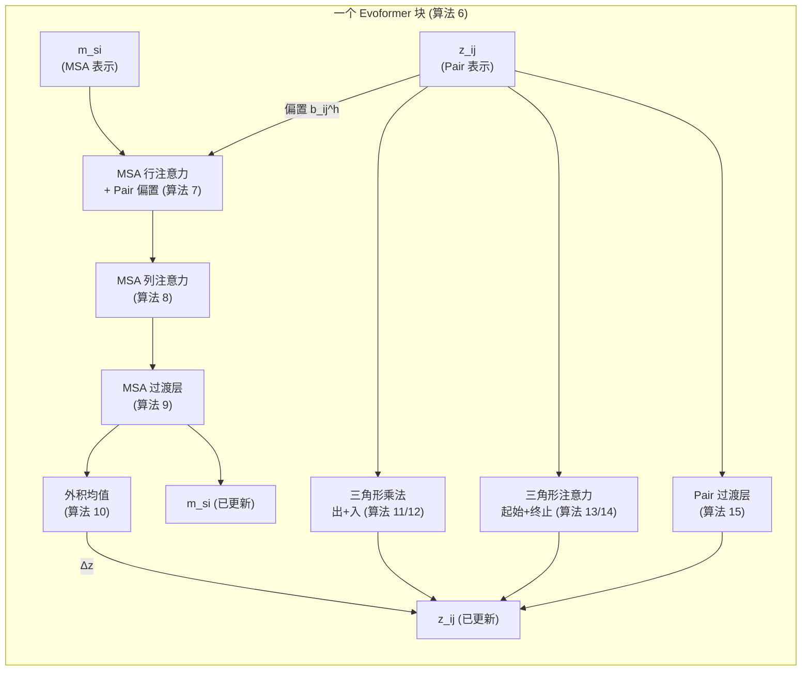

---
slug:8-msa-and-pair-representations
blog_type:normal
---


MSA 和 pair 表示是贯穿 Evoformer 主干（即 AlphaFold2 的计算核心）的两个核心数据结构。**MSA 表示** `m` 编码了跨序列和残基的进化信息，而 **pair 表示** `z` 捕获了残基与残基之间的关系。每个 Evoformer 块通过精心编排的信息交换来迭代微调这两个张量：pair 表示为 MSA 行注意力提供偏置，而 MSA 表示通过外积均值写回 pair 表示。理解这两个张量的形状、构建和更新规则，是理解整个 Evoformer 的关键。

## 表示的形状与语义

这两个表示占据不同的张量空间，整个代码库严格执行精确的维度约束：

| 表示 | 符号 | 形状 | 通道维度 | 论文默认值 | 含义 |
|---|---|---|---|---|---|
| MSA | `m` | `(B, N_seq, N_res, c_m)` | `c_m` | 256 | 逐序列、逐残基特征 |
| Pair | `z` | `(B, N_res, N_res, c_z)` | `c_z` | 128 | 逐残基对特征 |

MSA 表示堆叠了 `N_seq` 行——即查询序列加上来自聚类 MSA 的 `N_cluster − 1` 条同源序列。每一行是一个长度为 `N_res`、由 `c_m` 维特征向量组成的序列。pair 表示是一个对称的 `N_res × N_res` 矩阵，其中元素 `z_ij` 描述了残基 `i` 和 `j` 之间的关系。这两个张量均由 `InputEmbedder`（算法 3）从原始输入特征构建，然后通过 48 个 Evoformer 块逐步微调。

来源：[embedders.py](/minalphafold/embedders.py#L36-L94), [model_config.py](/minalphafold/model_config.py#L34-L38)

## 构建初始表示

`InputEmbedder` 从三个输入源构建初始的 `m` 和 `z`：**目标特征**（查询残基类型的独热编码，22 个通道）、**相对位置编码**（来自残基索引），以及 **MSA 特征**（49 通道的聚类轮廓 + 删除特征）。构建遵循精确的配方：

**Pair 初始化**使用 `target_feat` 的两个独立线性投影的外和，然后加上相对位置编码：

```
a = Linear_1(target_feat)          # (B, N_res, c_z)
b = Linear_2(target_feat)          # (B, N_res, c_z)
z = a.unsqueeze(-2) + b.unsqueeze(-3) + RelPos(residue_index)
```

外和 `a_i + b_j` 将每个残基的投影广播至所有对，在任何成对交互发生之前，为 pair 表示提供了一个初始的逐残基分解。随后 `RelPos` 模块注入空间邻接信息：它将截断后的残基索引差值 `clamp(r_i − r_j, −32, +32)` 进行独热编码，分入 65 个区间并投影至 `c_z`，确保 Evoformer 从第一个块就能知道哪些残基是序列上的邻居。

**MSA 初始化**结合了广播的目标特征投影与逐行的 MSA 特征投影：

```
m = Linear_3(target_feat).unsqueeze(1) + Linear_msa(msa_feat)
```

`unsqueeze` 将查询序列的嵌入广播至所有 MSA 行，`Linear_msa` 则添加逐行的进化特征。结果为 `(B, N_cluster, N_res, c_m)`。

来源：[embedders.py](/minalphafold/embedders.py#L70-L94), [embedders.py](/minalphafold/embedders.py#L96-L118)

## 信息交换架构

Evoformer 的决定性特征是 `m` 和 `z` 之间的**双向信息流**。这并非简单的前馈流水线——它是一个紧密耦合的循环，在每一个块中，两种表示都会相互影响：



**pair → MSA** 路径通过带有 pair 偏置的 MSA 行注意力（算法 7）运行，其中 pair 表示被投影为逐头的加性偏置 `b_ij^h = LinearNoBias(LayerNorm(z_ij))`，用于调节注意力分数。**MSA → pair** 路径通过外积均值（算法 10）运行，将 MSA 表示收缩为 pair 形状的更新。这两条路径在每个块内反向触发，创造了迭代的协同演化。

来源：[evoformer.py](/minalphafold/evoformer.py#L70-L95), [evoformer.py](/minalphafold/evoformer.py#L97-L194)

## MSA 表示更新路径

每个 Evoformer 块通过三个连续的残差加法更新 `m`：

1. **带有 Pair 偏置的 MSA 行注意力**（算法 7）：对于每个序列 `s`，在残基 `i, j` 上执行标准的多头自注意力，并将 pair 表示作为可学习的偏置注入。注意力分数为 `a_{sij}^h = softmax_j(q · k / √c + b_{ij}^h)`。输出由 `sigmoid(Linear(m)) ⊙ attention_output` **门控**，并通过零初始化的输出线性层投影回 `c_m`，确保该块初始为恒等映射。应用比率为 `evoformer_msa_dropout` (0.15) 的逐行 dropout。

2. **MSA 列注意力**（算法 8）：对于每个残基列 `i`，在序列 `s = 1, …, N_seq` 上进行注意力计算。不使用 pair 偏置——此步骤让每个残基位置能够沿 MSA 的进化深度聚合信息。同样采用门控与零初始化输出。根据算法 6，**无 dropout**。

3. **MSA 过渡层**（算法 9）：每个单元一个简单的双层前馈网络：`LayerNorm → Linear(c_m → 4·c_m) → ReLU → Linear(4·c_m → c_m)`。扩展因子默认为 4。**无 dropout**。下投影使用 `final`（零）初始化。

经过这三个步骤后，更新后的 `m` 将输入到外积均值中产生 pair 更新。

来源：[evoformer.py](/minalphafold/evoformer.py#L78-L84), [embedders.py](/minalphafold/embedders.py#L575-L652), [embedders.py](/minalphafold/embedders.py#L655-L684)

## Pair 表示更新路径

Pair 表示 `z` 在每个块中通过五个残差加法进行更新。第一个来自 MSA；其余四个完全在 pair 空间内操作：

### 外积均值 —— MSA → Pair 的桥梁

这是**唯一**将 `m` 写入 `z` 的模块。它将每个 MSA 单元投影为两个隐藏向量 `a_{si}, b_{si} ∈ R^{c_hidden}`（默认 `c_hidden = 32`），然后计算跨序列的掩码归一化外积均值：

```
output = Linear_out(mean_s(a_{si} ⊗ b_{sj}))    # 形状 (B, N_res, N_res, c_z)
```

爱因斯坦求和 `bsic, bsjd → bijcd` 收缩了序列维度，产生一个 `(c_hidden × c_hidden)` 通道的 pair 形状张量，随后被投影至 `c_z`。掩码感知的归一化会除以有效 `(s,i)·(s,j)` 对的数量，从而避免填充行削弱信号。输出线性层使用 `final`（零）初始化，因此在初始化时该模块不产生任何贡献——pair 表示只有在学习开始后才会演化。

来源：[embedders.py](/minalphafold/embedders.py#L686-L743)

### 三角乘法更新 —— 强制几何一致性

pair 表示描述了成对关系，**三角形更新**则强制残基三角形的一致性。两种方向背对背触发：

| 模块 | 算法 | 收缩 | 几何意义 |
|---|---|---|---|
| `TriangleMultiplicationOutgoing` | 11 | `Σ_k a_{ik} ⊙ b_{jk}` | 沿着从 `i` 和 `j` 出发的边进行池化 |
| `TriangleMultiplicationIncoming` | 12 | `Σ_k a_{ki} ⊙ b_{kj}` | 沿着进入 `i` 和 `j` 的边进行池化 |

每种均使用三个门控投影。对于 outgoing 变体：`A = sigmoid(gate1(z)) ⊙ linear1(z)` 和 `B = sigmoid(gate2(z)) ⊙ linear2(z)` 通过爱因斯坦求和进行收缩，然后输出再次被门控：`out = sigmoid(gate(z))# ⊙ out_linear(LayerNorm(vals))`3`。隐藏维度 `triangle_mult_c = 128` 提供了<mark>丰富的瓶颈</mark>。三个门控均使用门控初始化（weight=0, bias=1，在 sigmoid(1) ≈ 0.73 处开启），输出线性层使用零初始化。逐行 dropout 比率为 `evoformer_pair_dropout = 0.25`。

来源：[embedders.py](/minalphafold/embedders.py#L745-L805), [embedders.py](/minalphafold/embedders.py#L808-L866)

### 三角自注意力 —— 带有三角形偏置的成对注意力

两个注意力模块在 pair 表示上操作，每个模块固定三角形的一个节点，并对另一个节点进行注意力计算：

**起始节点**（算法 13）：固定起始节点 `i`，使用来自 `z_{ij}` 的键和来自 `z_{ik}` 的值对终止节点 `j` 进行注意力计算，并附加偏置 `b_{jk} = LinearNoBias(LayerNorm(z_{jk}))`。注意力分数为 `a_{ijk}^h = softmax_k(q_{ij}^h · k_{ik}^h / √c + b_{jk}^h)`。逐行 dropout。

**终止节点**（算法 14）：镜像操作——固定终止节点 `j`，使用索引为 `(k, j)` 的键/值和偏置 `b_{ki}` 对起始节点 `i` 进行注意力计算。**逐列** dropout（这是该块中唯一使用逐列而非逐行 dropout 的模块，依据补充材料 1.11.6）。

两者均使用每头 `triangle_dim = 32`、共 `triangle_num_heads = 4` 个头，门控输出以及零初始化输出投影。

来源：[embedders.py](/minalphafold/embedders.py#L868-L953), [embedders.py](/minalphafold/embedders.py#L955-L1053)

### Pair 过渡层

一个作用于 `z` 的逐对前馈网络，结构与 `MSATransition` 相同：`LayerNorm → Linear(c_z → 4·c_z) → ReLU → Linear(4·c_z → c_z)`。无 dropout。下投影的零初始化确保该过渡层初始为恒等映射。

来源：[embedders.py](/minalphafold/embedders.py#L1055-L1081)

## 完整的块数据流

结合形状和 dropout 总结完整的 Evoformer 块：

| 步骤 | 操作 | 输入 → 输出 | Dropout |
|---|---|---|---|
| 1 | 行注意力 + Pair 偏置 (算法 7) | `(m, z) → Δm` | 逐行, p=0.15 |
| 2 | 列注意力 (算法 8) | `m → Δm` | 无 |
| 3 | MSA 过渡层 (算法 9) | `m → Δm` | 无 |
| 4 | 外积均值 (算法 10) | `m → Δz` | 无 |
| 5 | 三角乘法 Outgoing (算法 11) | `z → Δz` | 逐行, p=0.25 |
| 6 | 三角乘法 Incoming (算法 12) | `z → Δz` | 逐行, p=0.25 |
| 7 | 三角注意力 Starting (算法 13) | `z → Δz` | 逐行, p=0.25 |
| 8 | 三角注意力 Ending (算法 14) | `z → Δz` | 逐列, p=0.25 |
| 9 | Pair 过渡层 (算法 15) | `z → Δz` | 无 |

每一步都是**残差加法**——每个子模块的输出都会加到其输入表示上。结合零初始化的输出投影和门控初始化（在 ≈0.73 处开启），这确保了整个 Evoformer 堆叠初始时接近于恒等变换，并在训练过程中逐步学习调节表示。

来源：[evoformer.py](/minalphafold/evoformer.py#L70-L95)

## 额外 MSA 和模板对 Pair 表示的贡献

在主 Evoformer 运行之前，还有两条额外的路径写入 pair 表示：

**额外 MSA 堆叠**（算法 18）：一个浅层的类 Evoformer 堆叠处理未聚类的“额外”MSA（`N_extra_seq = 1024`，通道维度 `c_e = 64`）。它使用相同的 pair 更新子模块（三角形乘法、三角形注意力、pair 过渡层），但 dropout 率不同（`extra_msa_dropout = 0.15`，`extra_pair_dropout = 0.25`）。列注意力被替换为 `MSAColumnGlobalAttention`（算法 19），该模块在头之间共享 K/V，以保持列步骤在数千条序列上的计算可行性。额外 MSA 表示通过外积均值更新 `z`，用来自更广进化采样的信息丰富了 pair 表示。

**模板 Pair 堆叠**（算法 16）：每个模板的特征通过一个浅层的纯 pair Evoformer（2 个块，缩减维度：`template_triangle_mult_c = 64`，`template_triangle_attn_c = 64`，`template_pair_transition_n = 2`），然后通过 `TemplatePointwiseAttention`（算法 17）跨模板进行池化，该模块对每个 `(i, j)` 独立地在模板维度上执行注意力计算。池化输出被加到 `z` 中。

来源：[embedders.py](/minalphafold/embedders.py#L315-L485), [embedders.py](/minalphafold/embedders.py#L120-L228), [model.py](/minalphafold/model.py#L280-L314)

## 循环回收：跨迭代的表示

表示在循环回收周期（算法 31/32）中持久存在。在每个周期开始时（第一次之后），前一个周期的输出被重新注入：

- **MSA**：`m[0, i, :] += LayerNorm(m_1i^prev)`——仅用先前的单一表示更新第一行（查询行）。
- **Pair**：`z += LayerNorm(z_ij^prev) + Linear(one_hot(d_ij^prev))`——先前的 pair 表示和来自先前结构伪 β 位置的装箱距离编码均被加入。

在第一个周期中，prev 张量为零，因此这些加法无效。在训练期间，只有最后一个采样周期携带梯度；早期周期的梯度被截断。

来源：[model.py](/minalphafold/model.py#L268-L278), [model.py](/minalphafold/model.py#L231-L234)

## 从 MSA 到单一表示

在最后一个 Evoformer 块之后，**单一表示** `s_i` 从第一行 MSA 通过线性投影提取：`s_i = Linear(m_1i)`（算法 6 第 12 行）。这个 `(B, N_res, c_s)` 张量——在完整配置中 `c_s = 384`——是结构模块与平均后的 pair 表示一同使用的输入。当集成处于活跃状态时，`m_1i` 和 `z_ij` 在投影前会跨集成样本进行平均；根据线性性质，投影前后平均是等价的。

来源：[model.py](/minalphafold/model.py#L369-L381)

## 不同配置的通道维度

表示通道维度是缩放模型的主要杠杆：

| 参数 | 完整 (AF2) | 中等 | 微小 | 角色 |
|---|---|---|---|---|
| `c_m` | 256 | 128 | 64 | MSA 表示宽度 |
| `c_z` | 128 | 64 | 48 | Pair 表示宽度 |
| `c_e` | 64 | 32 | 16 | 额外 MSA 表示宽度 |
| `c_s` | 384 | 192 | 96 | 单一表示（投影后）宽度 |
| `c_t` | 64 | 32 | 16 | 模板 pair 特征宽度 |

比率 `c_m : c_z = 2 : 1` 在所有配置中保持不变，反映了论文中的设计：MSA 表示在每个单元中比 pair 表示（几何特征）承载更多信息（进化特征）。

<CgxTip>MSA 和 pair 表示在每个 Evoformer 块中仅通过两条通道耦合：行注意力中的 pair 偏置（pair → MSA）和外积均值（MSA → pair）。其他所有子模块均在单一的表示空间内操作。这种双向耦合使得 Evoformer 不仅仅是两个独立的注意力堆叠——它是一个协同演化系统。</CgxTip>

<CgxTip>Evoformer 中所有输出投影均使用零初始化（`final` 方案），所有门控线性层均使用门控初始化（weight=0, bias=1）。这意味着在初始化时，每个块都是恒等操作——表示将原样传递，直到训练开始。这对于 48 层堆叠的稳定训练至关重要，并由顶层模型中的 `_initialize_alphafold_parameters` 强制执行。</CgxTip>

来源：[configs/alphafold2.toml](/configs/alphafold2.toml#L7-L12), [model.py](/minalphafold/model.py#L106-L153), [initialization.py](/minalphafold/initialization.py#L38-L59)

## 下一步

MSA 和 pair 表示为随后的几何推理奠定了基础。pair 表示 `z_ij` 直接输入到结构模块的[等变点注意力](10-invariant-point-attention)中，而单一表示 `s_i` 则通过[刚体帧与扭角](9-rigid-frames-and-torsions)驱动迭代的主链更新。要了解这些表示最初是如何从原始 MSA 数据构建的，请参阅[输入嵌入器与 RelPos](5-input-embedder-and-relpos)；要了解微调它们的完整 Evoformer 堆叠，请参阅[Evoformer 堆叠](6-evoformer-stack)。