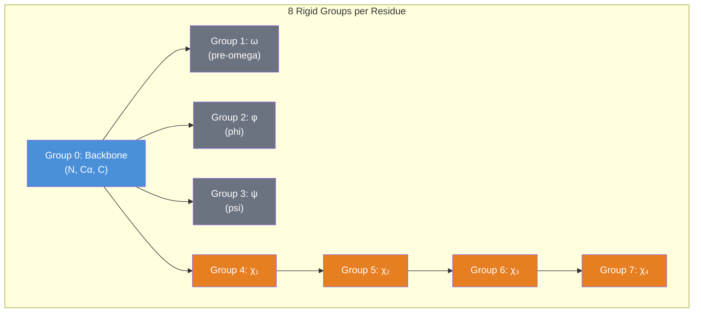
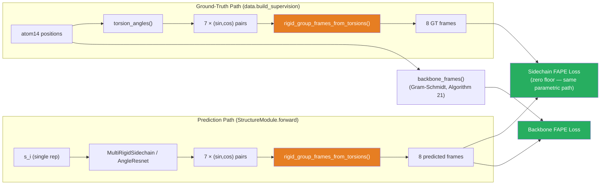

---
slug:9-rigid-frames-and-torsions
blog_type:normal
---


AlphaFold2 通过双路径几何系统重建三维蛋白质结构：**刚体坐标系**定义了每个残基原子群在空间中的位置和方向，而**扭转角**则参数化了这些原子群之间的旋转。minAlphaFold2 通过两个互补的模块实现了该系统——`geometry.py` 从真实的原子坐标构建真值监督目标，`structure_module.py` 则从网络输出以参数化方式构建预测坐标系。理解这两条路径如何保持一致性，是掌握结构模块损失景观在训练期间表现良好这一关键问题的关键。

来源: [geometry.py](/minalphafold/geometry.py#L1-L43), [structure_module.py](/minalphafold/structure_module.py#L1-L20)

## 刚体坐标系：将 SE(3) 表示为 (R, t)

**刚体坐标系**是特殊欧几里得群 SE(3) 的一个元素，表示为旋转矩阵 **R** ∈ SO(3) 和平移向量 **t** ∈ ℝ³。给定一个用局部坐标表示的点 **x**（例如，原子相对于其残基主干的位置），其全局位置可通过 **x**_global = **R**·**x** + **t** 恢复。两个坐标系的复合为 T₁ ∘ T₂ = (R₁·R₂, R₁·t₂ + t₁)，该复合操作在 `compose_transforms` 中实现。AlphaFold2 中的每个残基携带**八个**这样的坐标系——一个用于主干，七个用于由扭转角驱动的侧链群——从而形成一条运动链，放置每个残基的全部 14 个原子槽位。

来源: [structure_module.py](/minalphafold/structure_module.py#L707-L711)



上图展示了算法 24 中的**链式结构**。群 1–4 (ω, φ, ψ, χ₁) 各自独立地从主坐标系 (群 0) 分支出来。群 5–7 (χ₂–χ₄) 则顺序链接——χ₂ 基于 χ₁ 的坐标系构建，χ₃ 基于 χ₂，χ₄ 基于 χ₃。这反映了蛋白质主干的物理现实：主干扭转是独立的，但每个后续的侧链扭转都是相对于其前一个扭转进行旋转的。

来源: [structure_module.py](/minalphafold/structure_module.py#L714-L779)

## 真值坐标系：从原子坐标进行 Gram–Schmidt 正交化

`geometry.py` 中的真值路径使用 **Gram–Schmidt 正交化**（算法 21）从实际的三维原子位置构建坐标系。函数 `rigid_frame_from_three_points` 接收三个原子——`point_on_neg_x_axis`、`origin` 和 `point_on_xy_plane`——并构建一个正交的右手坐标系：x 轴从负 x 原子指向原点，z 轴是 x 与指向 xy 平面原子的向量的叉积，y 轴补全右手系统。对于 8 个刚体群中的每一个，从预计算表 (`RIGID_GROUP_BASE_ATOM14_INDICES`) 中查找其三个定义原子，并将其输入此构造函数。

来源: [geometry.py](/minalphafold/geometry.py#L219-L251), [geometry.py](/minalphafold/geometry.py#L254-L325)

### 主坐标系约定的细微差别

补充材料 1.8.1 使用 (x₁, x₂, x₃) = (N, Cα, C) 定义主坐标系，得到 **e₁** = (C − Cα)/‖C − Cα‖——即 +x 轴从 Cα 指向 C。然而，`rigid_frame_from_three_points` 在被调用时传入的原子顺序为 (C, Cα, N)，这产生的 x 轴从 C 指向 Cα——方向**相反**。常量 `BACKBONE_FRAME_ADAPTATION = diag(−1, 1, −1)` 调和了这一差异：它是绕 y 轴的 180° 旋转（行列式 = +1，因此是正当旋转），在保持手性的同时翻转了 x 和 z。这种适应**仅**应用于主坐标系 (群 0)；非主群使用按照该包装函数产生的相同约定推导出的文献常量，因此无需校正。

来源: [geometry.py](/minalphafold/geometry.py#L21-L42), [geometry.py](/minalphafold/geometry.py#L92-L95), [geometry.py](/minalphafold/geometry.py#L305-L308)

## 七个扭转角

每个残基由**七个扭转角**参数化，表示为 (sin, cos) 对：**α = [ω, φ, ψ, χ₁, χ₂, χ₃, χ₄]**。使用 sin/cos 对代替原始弧度可以避免在 ±π 处的不连续性，并能自然地向损失函数同时提供角度及其归一化状态。

| 索引 | 角度 | 定义原子 | 定义域 | 备注 |
|-------|-------|---------------|--------|-------|
| 0 | ω (omega) | Cα_{i-1}–C_{i-1}–N_i–Cα_i | 残基间 | 对于残基 0 未定义 |
| 1 | φ (phi) | C_{i-1}–N_i–Cα_i–C_i | 残基间 | 对于残基 0 未定义 |
| 2 | ψ (psi) | N_i–Cα_i–C_i–O_i | 残基内 | 使用羰基 O，而非下一个 N |
| 3 | χ₁ | N–Cα–CB–CG (多变) | 侧链 | 取决于残基类型 |
| 4 | χ₂ | Cα–CB–CG–CD (多变) | 侧链 | 例如 ASP: Cα–CB–CG–OD1 |
| 5 | χ₃ | CB–CG–CD–NE (多变) | 侧链 | 仅 ARG, GLN, GLU, LYS, MET |
| 6 | χ₄ | CG–CD–NE–CZ (多变) | 侧链 | 仅 ARG, LYS |

来源: [geometry.py](/minalphafold/geometry.py#L370-L478), [residue_constants.py](/minalphafold/residue_constants.py#L27-L54)

### 测量扭转角：四点法

函数 `torsion_sin_cos_from_four_points` 通过从定义二面角的四个原子 (p₁–p₂–p₃–p₄) 中构建局部坐标系来测量二面角：首先通过 `rigid_frame_from_three_points` 从 (p₁, p₂, p₃) 构建坐标系，然后在该坐标系中表示 p₄。p₄ 的 x 分量沿旋转轴，因此无关紧要；其 分量直接给出旋转角 (sin, cos) = (z, y)/‖(y, z)‖——sin 取自 z 是因为关于 +x 的右手定则会在 +90° 时将点从 +y 旋转至 +z。

一个关键的约定细节：**ψ** 是从 (N, Cα, C, O) 测量的，而不是 (N, Cα, C, N_{next})，这导致相对于算法 24 的 ψ 坐标系引入了 180° 的偏移。`flip_sin=True, flip_cos=True` 标志通过取反这两个分量来进行补偿，这等效于绕扭转轴旋转 180°。这确保了扭转损失能在相同的坐标系下观测预测角和真值角。

来源: [geometry.py](/minalphafold/geometry.py#L173-L216), [geometry.py](/minalphafold/geometry.py#L426-L439)

## 预测坐标系：参数化路径 (算法 24)

`structure_module.py` 中的预测路径从预测的扭转角**参数化**地构建坐标系，而不是从原子坐标构建。这是 `rigid_group_frames_from_torsions` 的核心，它实现了算法 24 的第 1–10 行：

1. 将扭转角**归一化**为单位 向量。
2. 从 `restype_rigid_group_default_frame` 中**查找**各残基类型的文献变换 T^lit——这些编码了理想化的键几何（来自参数化模型的键长和键角）。
3. 通过 `make_rot_x`（算法 25）**构建扭转旋转**——即使用 对关于局部 x 轴的旋转。
4. **复合坐标系**：对于群 1–4 (ω, φ, ψ, χ₁)，每个坐标系为 `T_backbone ∘ T^lit ∘ makeRotX(α)`。对于群 5–7 (χ₂–χ₄)，每个坐标系链式依赖于其前驱：`T_χₖ₋₁ ∘ T^lit ∘ makeRotX(α)`。

来源: [structure_module.py](/minalphafold/structure_module.py#L714-L779)

### make_rot_x：扭转作为 X 轴旋转

`make_rot_x` 构建算法 25 的旋转矩阵。给定一个 对，它构建：

```
| 1      0        0    |
| 0   cos α   -sin α   |
| 0   sin α    cos α   |
```

这是一个零平移的纯绕 x 轴旋转——平移分量来自于 `compute_all_atom_coordinates` 将此旋转与之复合的文献坐标系 T^lit。根据构造，x 轴即为扭转轴：在每个刚体群的局部坐标系中，定义扭转的化学键沿 x 轴放置，因此绕 x 旋转恰好就是二面角旋转。

来源: [structure_module.py](/minalphafold/structure_module.py#L675-L705)

### 从坐标系放置原子

一旦构建了 8 个坐标系，`compute_all_atom_coordinates` 便会通过查找每个原子所属的刚体群 (`atom_frame_idx_table`) 及其在该群中的理想化局部位置 (`lit_positions`)，来放置 14 个原子槽位中的每一个。其全局位置为 **x**_global = R_frame · **x**_lit + t_frame。这两个步骤的过程——先由扭转角构建坐标系，再由坐标系放置原子——干净利落地将旋转自由度与固定的键长/键角几何分离开来。

来源: [structure_module.py](/minalphafold/structure_module.py#L782-L839)

## 双路径一致性：为何两条路径均采用参数化构建

一个微妙但至关重要的设计决策：真值监督坐标系也是参数化构建的（通过 `data.build_supervision` 中的 `rigid_group_frames_from_torsions`），即使原始的 atom14 坐标可用于 Gram–Schmidt 构建也是如此。如果真值路径对真实原子使用 Gram–Schmidt，而预测路径使用参数化构建，那么侧链 FAPE 损失将获得一个**非零下限**，该下限等于文献几何与真实 PDB 原子之间的键长理想化失配——即使预测与真值完全匹配时也是如此。两条路径均采用参数化构建可使此下限消失（仅降至原子级别的理想化误差，该误差可忽略不计）。

Gram–Schmidt 路径 (`atom14_to_rigid_group_frames`) 依然存在，并用于**主干 FAPE** 损失（通过 `backbone_frames`），在此处参数化/真实原子的区分影响较小，因为主干几何受到的约束严格得多。

来源: [geometry.py](/minalphafold/geometry.py#L328-L347), [structure_module.py](/minalphafold/structure_module.py#L721-L731)



## 主干更新：四元数参数化 (算法 23)

每次 IPA 迭代都会通过 `BackboneUpdate` 更新主坐标系，该过程将单一表示 s_i 投影为每个残基的**六个标量**：三个旋转参数 和三个平移参数。旋转构造为单位四元数 (1, b, c, d) / ‖(1, b, c, d)‖，然后转换为 3×3 旋转矩阵。这种参数化保证了正当旋转（行列式 = +1），而无需显式正交化。平移在残基自身的局部坐标系中应用。坐标系更新为 T_i ← T_i ∘ (R, t)，其中 ∘ 表示 SE(3) 复合。关键的是，输出投影使用了**最终**（零）初始化——每次迭代最初作为恒等操作，由训练去发现更新幅度。

来源: [structure_module.py](/minalphafold/structure_module.py#L543-L610)

## 180° 对称性：替代真值 (补充材料 1.8.5)

某些侧链群在绕其扭转轴旋转 180° 时是**不可区分的**——例如，ASP 的 Oδ1 和 Oδ2 在化学上是等价的，因此交换它们（绕 χ₂ 旋转 π）会产生相同的物理结构。这在真值扭转标签中产生了歧义：测量到的角度和角度 + π 都是正确的。

| 残基 | 对称 χ | 原因 |
|---------|-------------|--------|
| ASP | χ₂ | Oδ1/Oδ2 交换 |
| GLU | χ₃ | Oε1/Oε2 交换 |
| PHE | χ₂ | CD1/CD2 交换 (环翻转) |
| TYR | χ₂ | CD1/CD2 交换 (环翻转) |

minAlphaFold2 通过两种互补的方式处理此问题。**在扭转层面**，`alternative_torsion_angles` 对 π 周期的 χ 角取反 对——等效于给角度加上 π。扭转角损失（算法 27）取两个标签中的最小值。**在坐标系层面**，`atom14_to_rigid_group_frames` 通过将每个歧义群的旋转与预计算的 180° 局部旋转 (`RIGID_GROUP_ALT_ROTATIONS`) 进行右复合，来计算“替代真值”坐标系。**在原子层面**，`alternative_atom14_ground_truth` 应用各残基类型的重命名矩阵，这些矩阵对 atom14 槽位进行置换（例如，交换 ASP 的 Oδ1 和 Oδ2 坐标）。算法 26 选择最匹配预测的命名方式。

来源: [geometry.py](/minalphafold/geometry.py#L510-L530), [geometry.py](/minalphafold/geometry.py#L315-L323), [geometry.py](/minalphafold/geometry.py#L533-L565)

<CgxTip>`BACKBONE_FRAME_ADAPTATION = diag(−1, 1, −1)` 是一次 180° 的 y 轴旋转，它调和了 Gram–Schmidt 坐标系约定（x 从 C→Cα）与论文约定（x 从 Cα→C）。它**仅**应用于群 0 (主干)；所有其他群使用的文献常量已处于正确的约定中。缺少此适应会导致主干 FAPE 损失在每个残基上观测到系统性的 180° 偏移。</CgxTip>

<CgxTip>`StructureModule.forward` 中的 `detach_rotations` 标志实现了算法 20 中迭代间的“旋转停止梯度”——但**不**在最终迭代之后应用，且**不**应用于平移。这种非对称的梯度阻断防止了通过链式坐标系复合产生的杠杆效应不稳定，同时仍允许辅助的逐层 Cα FAPE 损失通过平移路径将信号反向传播至 Evoformer。</CgxTip>

## 扭转角预测：AngleResnet

`MultiRigidSidechain` 模块通过 `AngleResnet` 预测每个残基的 7 个扭转角——这是一个小型残差 MLP，同时接收**当前**的单一表示 s_i（IPA 更新后）和**初始**单一表示（IPA 前，来自 Evoformer）作为输入。这种双输入设计确保了扭转头即使在多次 IPA 迭代变换了 s_i 之后，仍能保留对未变形 Evoformer 信号的访问。AngleResnet 输出未归一化的 对，这些对被 L2 归一化为单位向量；未归一化的版本被单独暴露出来，用于扭转角范数损失项。

来源: [structure_module.py](/minalphafold/structure_module.py#L613-L673), [structure_module.py](/minalphafold/structure_module.py#L55-L115)

## 总结：坐标系与扭转角的数据流

| 组件 | 路径 | 输入 | 输出 | 算法 |
|-----------|------|-------|--------|-----------|
| `rigid_frame_from_three_points` | GT | 3 个原子位置 | (R, t) | 21 |
| `atom14_to_rigid_group_frames` | GT | atom14 坐标 | 8 个坐标系 + 替代坐标系 | 21 + 26 |
| `torsion_angles` | GT | atom14 坐标 | 7 × (sin,cos) + 掩码 | — |
| `BackboneUpdate` | Pred | s_i | 经四元数的 (R, t) | 23 |
| `make_rot_x` | Pred | (sin α, cos α) | x 轴旋转 | 25 |
| `rigid_group_frames_from_torsions` | Both | 主坐标系 + 7 个角度 | 8 个坐标系 | 24 (第 1-10 行) |
| `compute_all_atom_coordinates` | Pred | 8 个坐标系 + lit 位置 | atom14 坐标 | 24 (完整) |
| `alternative_torsion_angles` | GT | 扭转角 + 氨基酸类型 | 替代 (sin,cos) | 27 |

该架构确保了刚体坐标系和扭转角形成一个**闭环**：真值原子位置产生扭转角，扭转角产生参数化坐标系，参数化坐标系又产生重建的原子位置。预测路径完全映射了这一过程——网络预测扭转角，以相同方式构建坐标系，并以相同方式放置原子。正是这种对称性使得 FAPE 损失条件良好且训练稳定。

来源: [geometry.py](/minalphafold/geometry.py#L1-L566), [structure_module.py](/minalphafold/structure_module.py#L1-L840)

对于*在这些坐标系上*操作的注意力机制，请参阅 [Invariant Point Attention](10-invariant-point-attention)。关于坐标系预测如何被监督，请参阅 [Loss Functions and FAPE](11-loss-functions-and-fape)。