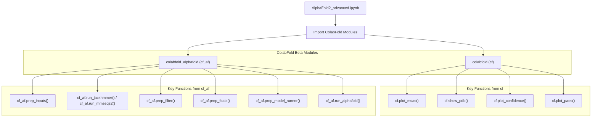
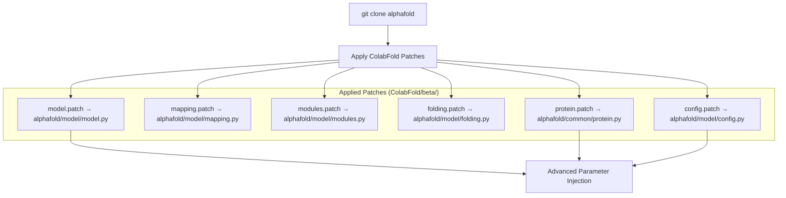

# Advanced AlphaFold2 Notebooks

> **Relevant source files**
> * [.gitignore](https://github.com/sokrypton/ColabFold/blob/0c788a0e/.gitignore)
> * [BioEmu.ipynb](https://github.com/sokrypton/ColabFold/blob/0c788a0e/BioEmu.ipynb)
> * [beta/AlphaFold2_advanced.ipynb](https://github.com/sokrypton/ColabFold/blob/0c788a0e/beta/AlphaFold2_advanced.ipynb)
> * [beta/AlphaFold2_advanced_beta.ipynb](https://github.com/sokrypton/ColabFold/blob/0c788a0e/beta/AlphaFold2_advanced_beta.ipynb)
> * [beta/AlphaFold2_advanced_old.ipynb](https://github.com/sokrypton/ColabFold/blob/0c788a0e/beta/AlphaFold2_advanced_old.ipynb)
> * [beta/AlphaFold_wJackhmmer.ipynb](https://github.com/sokrypton/ColabFold/blob/0c788a0e/beta/AlphaFold_wJackhmmer.ipynb)
> * [beta/alphafold_output_at_each_recycle.ipynb](https://github.com/sokrypton/ColabFold/blob/0c788a0e/beta/alphafold_output_at_each_recycle.ipynb)
> * [beta/colabfold_alphafold.py](https://github.com/sokrypton/ColabFold/blob/0c788a0e/beta/colabfold_alphafold.py)
> * [beta/relax_amber.ipynb](https://github.com/sokrypton/ColabFold/blob/0c788a0e/beta/relax_amber.ipynb)

## Overview

The Advanced AlphaFold2 Notebooks provide enhanced functionality beyond the standard AlphaFold2 prediction pipeline, offering experimental features for complex protein modeling, advanced MSA generation options, and detailed prediction control. These notebooks are built on a modified version of DeepMind's original AlphaFold notebook, extended with ColabFold's innovations for complex modeling and faster MSA generation.

## Available Advanced AlphaFold2 Notebooks

The advanced AlphaFold2 notebooks include:

| Notebook | Status | Primary Purpose |
| --- | --- | --- |
| `beta/AlphaFold2_advanced.ipynb` | Stable | Complex modeling, advanced MSA options, and experimental features |
| `beta/AlphaFold2_advanced_beta.ipynb` | Development | Beta version redirecting to stable version |
| `beta/alphafold_output_at_each_recycle.ipynb` | Experimental | Captures and animates structural changes across recycling steps |
| `beta/AlphaFold_wJackhmmer.ipynb` | Retired | Legacy notebook replaced by the advanced version |

Sources: [beta/AlphaFold2_advanced.ipynb L36-L49](https://github.com/sokrypton/ColabFold/blob/0c788a0e/beta/AlphaFold2_advanced.ipynb#L36-L49)

 [beta/AlphaFold2_advanced_beta.ipynb L37-L40](https://github.com/sokrypton/ColabFold/blob/0c788a0e/beta/AlphaFold2_advanced_beta.ipynb#L37-L40)

 [beta/alphafold_output_at_each_recycle.ipynb L51-L56](https://github.com/sokrypton/ColabFold/blob/0c788a0e/beta/alphafold_output_at_each_recycle.ipynb#L51-L56)

 [beta/AlphaFold_wJackhmmer.ipynb L40-L43](https://github.com/sokrypton/ColabFold/blob/0c788a0e/beta/AlphaFold_wJackhmmer.ipynb#L40-L43)

## Advanced AlphaFold2 Notebook Architecture

### Code Integration with ColabFold Modules



Sources: [beta/AlphaFold2_advanced.ipynb L151-L160](https://github.com/sokrypton/ColabFold/blob/0c788a0e/beta/AlphaFold2_advanced.ipynb#L151-L160)

 [beta/colabfold_alphafold.py L41](https://github.com/sokrypton/ColabFold/blob/0c788a0e/beta/colabfold_alphafold.py#L41-L41)

 [beta/colabfold_alphafold.py L109](https://github.com/sokrypton/ColabFold/blob/0c788a0e/beta/colabfold_alphafold.py#L109-L109)

### AlphaFold Patching System

The advanced notebooks rely on a sophisticated patching system to inject multi-chain and recycling logic into the standard AlphaFold2 library.



Sources: [beta/AlphaFold2_advanced.ipynb L107-L120](https://github.com/sokrypton/ColabFold/blob/0c788a0e/beta/AlphaFold2_advanced.ipynb#L107-L120)

 [beta/alphafold_output_at_each_recycle.ipynb L51-L56](https://github.com/sokrypton/ColabFold/blob/0c788a0e/beta/alphafold_output_at_each_recycle.ipynb#L51-L56)

## AlphaFold2_advanced.ipynb

The `AlphaFold2_advanced.ipynb` notebook extends DeepMind's original AlphaFold notebook with experimental support for protein complexes, advanced MSA generation, and detailed prediction control. This notebook predates AlphaFold-Multimer and implements complex modeling through patches to the original AlphaFold monomer codebase.

### Core Capabilities

| Feature Category | Capabilities |
| --- | --- |
| **Complex Modeling** | Homo-oligomers, hetero-oligomers, chain break notation |
| **MSA Generation** | MMseqs2, jackhmmer, single_sequence, precomputed, custom MSA |
| **Prediction Control** | Model selection (1-5), recycles, ensemble, sampling |
| **Structure Refinement** | Optional Amber relaxation |
| **Output & Analysis** | 3D visualization, confidence metrics, raw data export |

### Input Syntax and Processing

The notebook supports complex protein modeling through specialized sequence notation handled by `prep_inputs`:

* `/` - Intra-protein chainbreaks (trimming regions within protein).
* `:` - Inter-protein chainbreaks (modeling protein-protein complexes).
* `homooligomer` parameter - Define copy numbers for homo-oligomeric assemblies.

Example: sequence `AC/DE:FGH` with `homooligomer:2:1` models `AC`, `DE` as a homodimer and `FGH` as a monomer.

Sources: [beta/AlphaFold2_advanced.ipynb L186-L197](https://github.com/sokrypton/ColabFold/blob/0c788a0e/beta/AlphaFold2_advanced.ipynb#L186-L197)

 [beta/colabfold_alphafold.py L41-L80](https://github.com/sokrypton/ColabFold/blob/0c788a0e/beta/colabfold_alphafold.py#L41-L80)

### MSA Generation and Pairing

The notebook provides advanced MSA options through `cf_af.run_jackhmmer()` and `cf_af.run_mmseqs2()`:

| Parameter | Values | Description |
| --- | --- | --- |
| `msa_method` | `mmseqs2`, `jackhmmer`, `single_sequence`, `precomputed` | MSA generation method |
| `pair_mode` | `unpaired`, `unpaired+paired`, `paired` | MSA pairing strategy for complexes |
| `pair_cov` | `0-90` | Minimum coverage (%) before pairing |
| `pair_qid` | `0-50` | Minimum sequence identity (%) before pairing |
| `add_custom_msa` | `True/False` | Enable custom MSA upload |

Sources: [beta/AlphaFold2_advanced.ipynb L220-L253](https://github.com/sokrypton/ColabFold/blob/0c788a0e/beta/AlphaFold2_advanced.ipynb#L220-L253)

 [beta/colabfold_alphafold.py L109-L173](https://github.com/sokrypton/ColabFold/blob/0c788a0e/beta/colabfold_alphafold.py#L109-L173)

### Prediction Configuration

The `cf_af.run_alphafold()` function accepts detailed configuration through an options dictionary, including `use_turbo` which enables faster inference by skipping certain processing steps:

```
opt = {    "N": len(feature_dict["msa"]),    "L": len(feature_dict["residue_index"]),    "use_ptm": use_ptm,    "use_turbo": use_turbo,    "max_recycles": max_recycles,    "tol": 0.0,    "num_ensemble": num_ensemble,    "max_msa_clusters": max_msa_clusters,    "max_extra_msa": max_extra_msa,    "is_training": is_training}
```

Sources: [beta/AlphaFold2_advanced.ipynb L348-L358](https://github.com/sokrypton/ColabFold/blob/0c788a0e/beta/AlphaFold2_advanced.ipynb#L348-L358)

 [beta/colabfold_alphafold.py L270-L285](https://github.com/sokrypton/ColabFold/blob/0c788a0e/beta/colabfold_alphafold.py#L270-L285)

## Specialized Advanced Notebooks

### AlphaFold Output at Each Recycle

The `alphafold_output_at_each_recycle.ipynb` notebook uses a specific patch to `alphafold/model/model.py` and `modules.py` to return the structure module's state at every recycling iteration.

* **Implementation**: It modifies `model.RunModel.predict` to return both `outputs` and `prev_outputs` [beta/alphafold_output_at_each_recycle.ipynb L151-L153](https://github.com/sokrypton/ColabFold/blob/0c788a0e/beta/alphafold_output_at_each_recycle.ipynb#L151-L153)
* **Visualization**: Includes a `make_animation` function that uses `cf.kabsch` for CA alignment to visualize the folding trajectory [beta/alphafold_output_at_each_recycle.ipynb L178-L192](https://github.com/sokrypton/ColabFold/blob/0c788a0e/beta/alphafold_output_at_each_recycle.ipynb#L178-L192)

### BioEmu Integration

The `BioEmu.ipynb` notebook integrates the Biomolecular Emulator with ColabFold.

* **Workflow**: Uses `bioemu.sample.main` to generate structural ensembles [BioEmu.ipynb L137-L139](https://github.com/sokrypton/ColabFold/blob/0c788a0e/BioEmu.ipynb#L137-L139)
* **Analysis**: Runs `foldseek` for clustering generated conformations [BioEmu.ipynb L159-L166](https://github.com/sokrypton/ColabFold/blob/0c788a0e/BioEmu.ipynb#L159-L166)

## System Limitations

* **No Templates**: Structure prediction without template information [beta/AlphaFold2_advanced.ipynb L46](https://github.com/sokrypton/ColabFold/blob/0c788a0e/beta/AlphaFold2_advanced.ipynb#L46-L46)
* **Legacy Complex Modeling**: Uses patched monomer models rather than the official AlphaFold-Multimer [beta/AlphaFold2_advanced.ipynb L47](https://github.com/sokrypton/ColabFold/blob/0c788a0e/beta/AlphaFold2_advanced.ipynb#L47-L47)
* **Memory Constraints**: Maximum ~1400 residues for 16GB GPU, ~1000 residues for 12GB GPU [beta/AlphaFold2_advanced.ipynb L48](https://github.com/sokrypton/ColabFold/blob/0c788a0e/beta/AlphaFold2_advanced.ipynb#L48-L48)
* **B-factor Populating**: The B-factor column is populated with pLDDT confidence values, requiring conversion for tools like Phenix [beta/AlphaFold2_advanced.ipynb L49](https://github.com/sokrypton/ColabFold/blob/0c788a0e/beta/AlphaFold2_advanced.ipynb#L49-L49)

## Installation and Setup

The setup cell in advanced notebooks performs environment preparation:

1. **TPU/GPU Check**: Uses `jax.tools.colab_tpu` or `jax.local_devices()` to identify the accelerator [beta/AlphaFold2_advanced.ipynb L72-L84](https://github.com/sokrypton/ColabFold/blob/0c788a0e/beta/AlphaFold2_advanced.ipynb#L72-L84)
2. **Ramdisk Creation**: Creates a 9GB `tmpfs` at `/tmp/ramdisk` to speed up Jackhmmer database access [beta/AlphaFold2_advanced.ipynb L138-L140](https://github.com/sokrypton/ColabFold/blob/0c788a0e/beta/AlphaFold2_advanced.ipynb#L138-L140)
3. **Patch Application**: Uses `patch -u` to apply `.patch` files from the `ColabFold/beta/` directory to the cloned `alphafold` source [beta/AlphaFold2_advanced.ipynb L112-L119](https://github.com/sokrypton/ColabFold/blob/0c788a0e/beta/AlphaFold2_advanced.ipynb#L112-L119)

Sources: [beta/AlphaFold2_advanced.ipynb L72-L140](https://github.com/sokrypton/ColabFold/blob/0c788a0e/beta/AlphaFold2_advanced.ipynb#L72-L140)

 [beta/relax_amber.ipynb L58-L75](https://github.com/sokrypton/ColabFold/blob/0c788a0e/beta/relax_amber.ipynb#L58-L75)