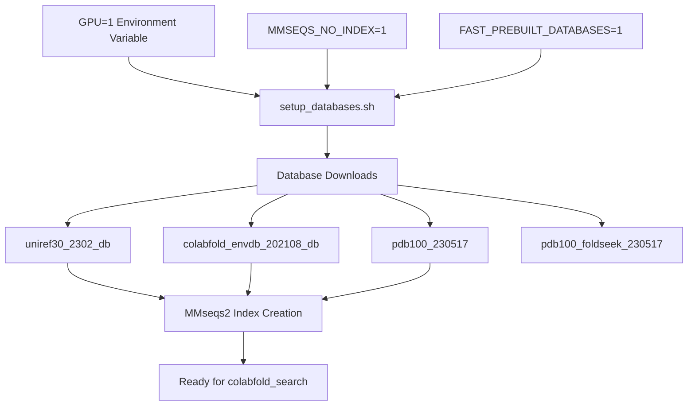
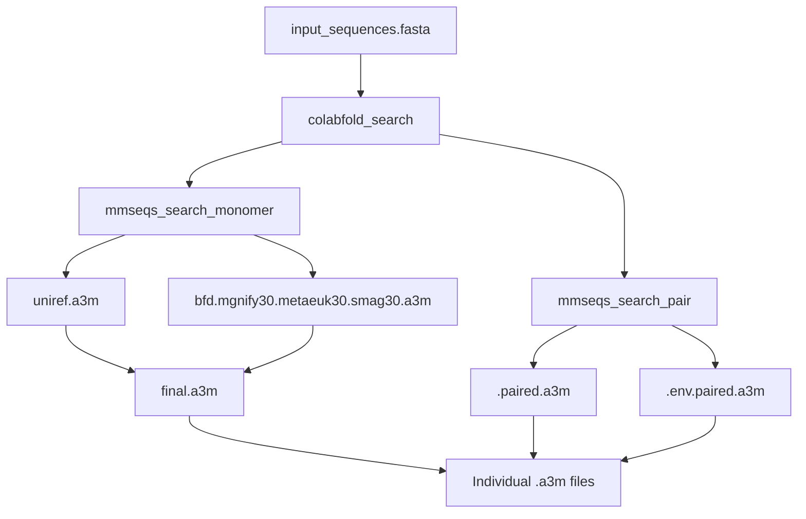
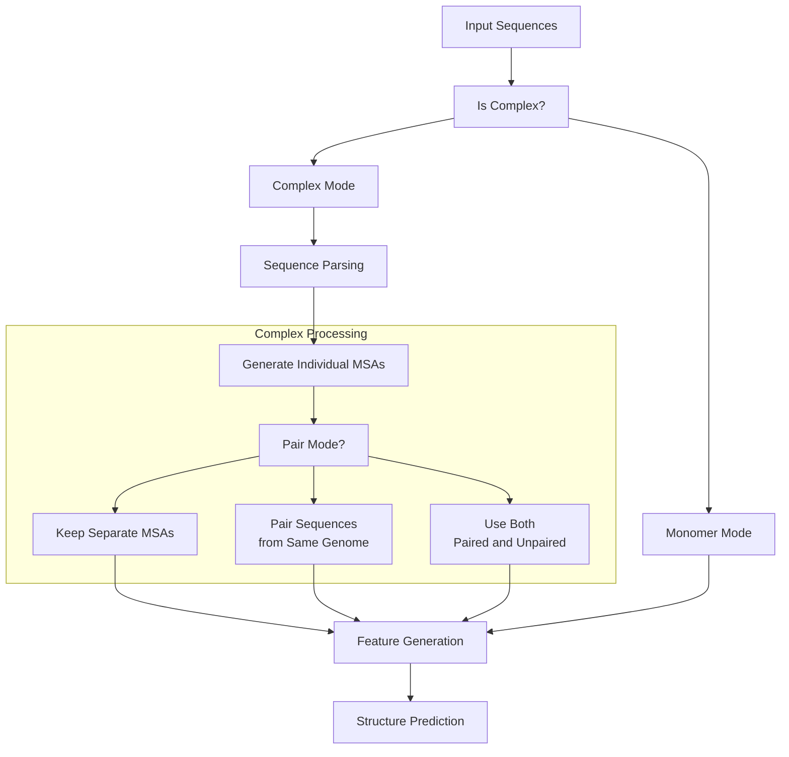
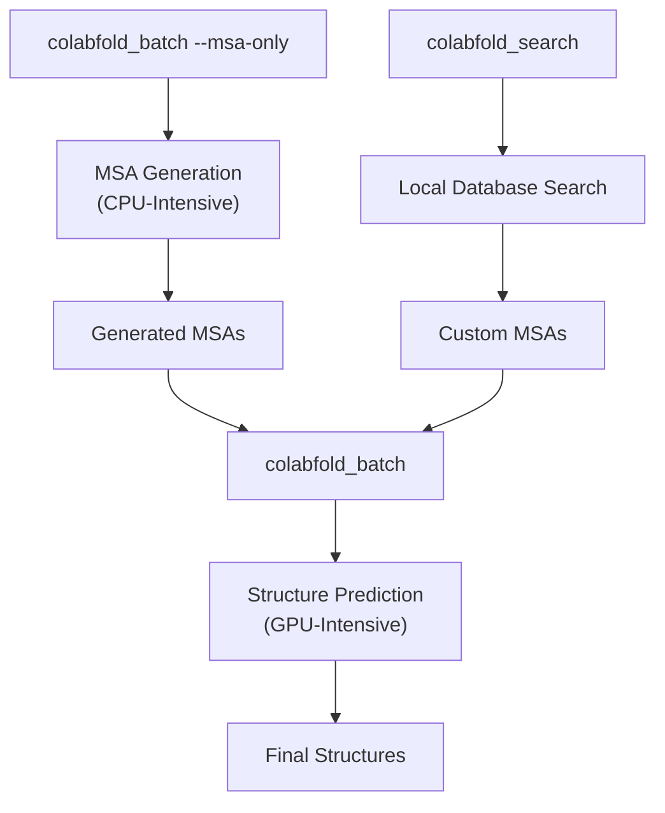
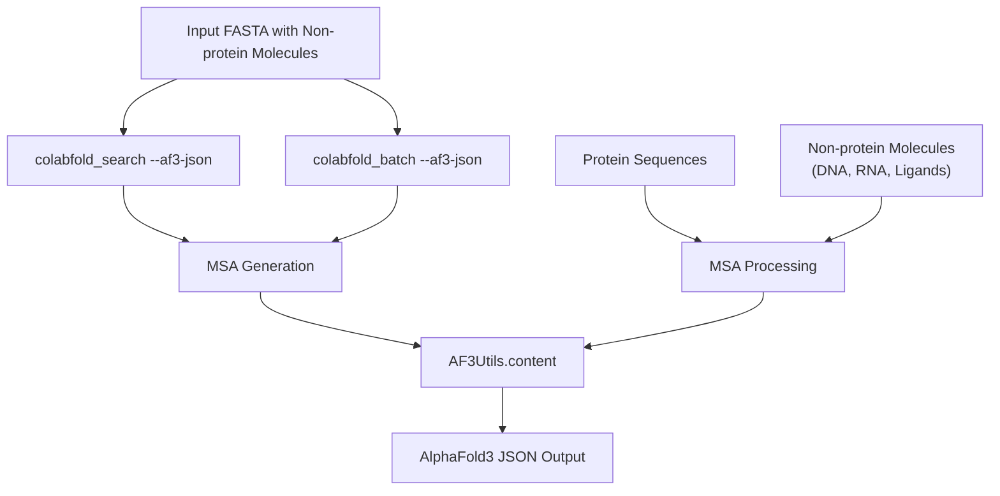

# Advanced Usage

> **Relevant source files**
> * [README.md](https://github.com/sokrypton/ColabFold/blob/0c788a0e/README.md?plain=1)
> * [colabfold_search.sh](https://github.com/sokrypton/ColabFold/blob/0c788a0e/colabfold_search.sh)
> * [setup_databases.sh](https://github.com/sokrypton/ColabFold/blob/0c788a0e/setup_databases.sh)

This page covers advanced features, local execution, and performance optimization for ColabFold. It provides detailed information for power users who want to leverage ColabFold's full capabilities for large-scale predictions, custom databases, and optimized workflows.

## Local Execution and Database Setup

For large-scale predictions and maximum control over the process, ColabFold supports local execution with custom databases. This approach provides significant advantages for production workflows, including privacy, performance, and cost control. For a detailed guide on environment setup and database management, see **[Local Execution](/sokrypton/ColabFold/5.1-local-execution)**.

### Database Setup Architecture

The `setup_databases.sh` script handles database initialization with several advanced configuration options:

| Environment Variable | Purpose | Default |
| --- | --- | --- |
| `MMSEQS_NO_INDEX=1` | Skip index creation for faster setup | Not set |
| `GPU=1` | Setup GPU-compatible databases | Not set |
| `FAST_PREBUILT_DATABASES=1` | Use prebuilt databases | 1 |
| `DOWNLOADS_ONLY=1` | Only download, don't process | Not set |

Sources: [setup_databases.sh L1-L21](https://github.com/sokrypton/ColabFold/blob/0c788a0e/setup_databases.sh#L1-L21)

 [setup_databases.sh L75-L187](https://github.com/sokrypton/ColabFold/blob/0c788a0e/setup_databases.sh#L75-L187)

 [README.md L83-L112](https://github.com/sokrypton/ColabFold/blob/0c788a0e/README.md?plain=1#L83-L112)

### Local MSA Generation with colabfold_search

The `colabfold_search` command provides local MSA generation with extensive configuration options. For details on configuring search sensitivity and memory mapping, see **[Local Execution](/sokrypton/ColabFold/5.1-local-execution)**.

Sources: [colabfold/mmseqs/search.py L289-L413](https://github.com/sokrypton/ColabFold/blob/0c788a0e/colabfold/mmseqs/search.py#L289-L413)

 [colabfold_search.sh L36-L64](https://github.com/sokrypton/ColabFold/blob/0c788a0e/colabfold_search.sh#L36-L64)

## Complex Prediction

ColabFold supports prediction of protein complexes, including both homo-oligomers and hetero-complexes. It offers advanced MSA pairing strategies to improve multimer accuracy. For detailed instructions on multimer modeling and AlphaFold3 JSON generation, see **[Complex Prediction](/sokrypton/ColabFold/5.2-complex-prediction)**.

### Multimer Workflow

Sources: [colabfold/batch.py L787-L876](https://github.com/sokrypton/ColabFold/blob/0c788a0e/colabfold/batch.py#L787-L876)

 [README.md L51-L52](https://github.com/sokrypton/ColabFold/blob/0c788a0e/README.md?plain=1#L51-L52)

## Performance Optimization

Computational efficiency is critical for high-throughput folding. ColabFold provides several mechanisms for GPU acceleration and memory management, including JAX compilation caching and specialized kernels. For details on tuning these parameters, see **[Performance Optimization](/sokrypton/ColabFold/5.3-performance-optimization)**.

### Resource Optimization Strategies

Key optimization parameters include:

* `--use-pallas`: Uses Pallas/Triton kernels for memory efficiency.
* `--recompile-padding`: Reduces JAX recompilation frequency.
* `--db-load-mode`: Controls database loading strategy (mmap vs. preload).

Sources: [colabfold/mmseqs/search.py L387-L391](https://github.com/sokrypton/ColabFold/blob/0c788a0e/colabfold/mmseqs/search.py#L387-L391)

 [README.md L68-L112](https://github.com/sokrypton/ColabFold/blob/0c788a0e/README.md?plain=1#L68-L112)

## AlphaFold3 Integration

ColabFold supports exporting MSAs in AlphaFold3-compatible JSON format, enabling seamless integration with AlphaFold3 workflows, including support for ligands and non-protein molecules. For a complete guide on AF3 JSON generation, see **[Complex Prediction](/sokrypton/ColabFold/5.2-complex-prediction)**.

### AF3 JSON Export Workflow

Sources: [README.md L114-L156](https://github.com/sokrypton/ColabFold/blob/0c788a0e/README.md?plain=1#L114-L156)

 [colabfold/mmseqs/search.py L406-L412](https://github.com/sokrypton/ColabFold/blob/0c788a0e/colabfold/mmseqs/search.py#L406-L412)

 [colabfold/mmseqs/search.py L558-L582](https://github.com/sokrypton/ColabFold/blob/0c788a0e/colabfold/mmseqs/search.py#L558-L582)