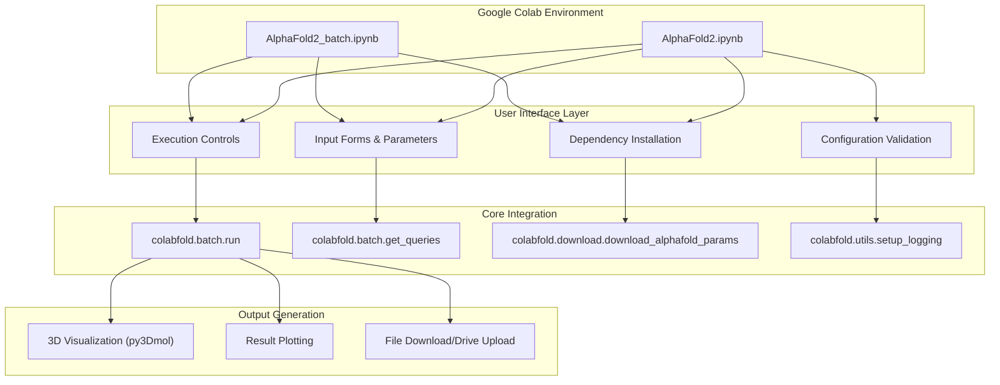
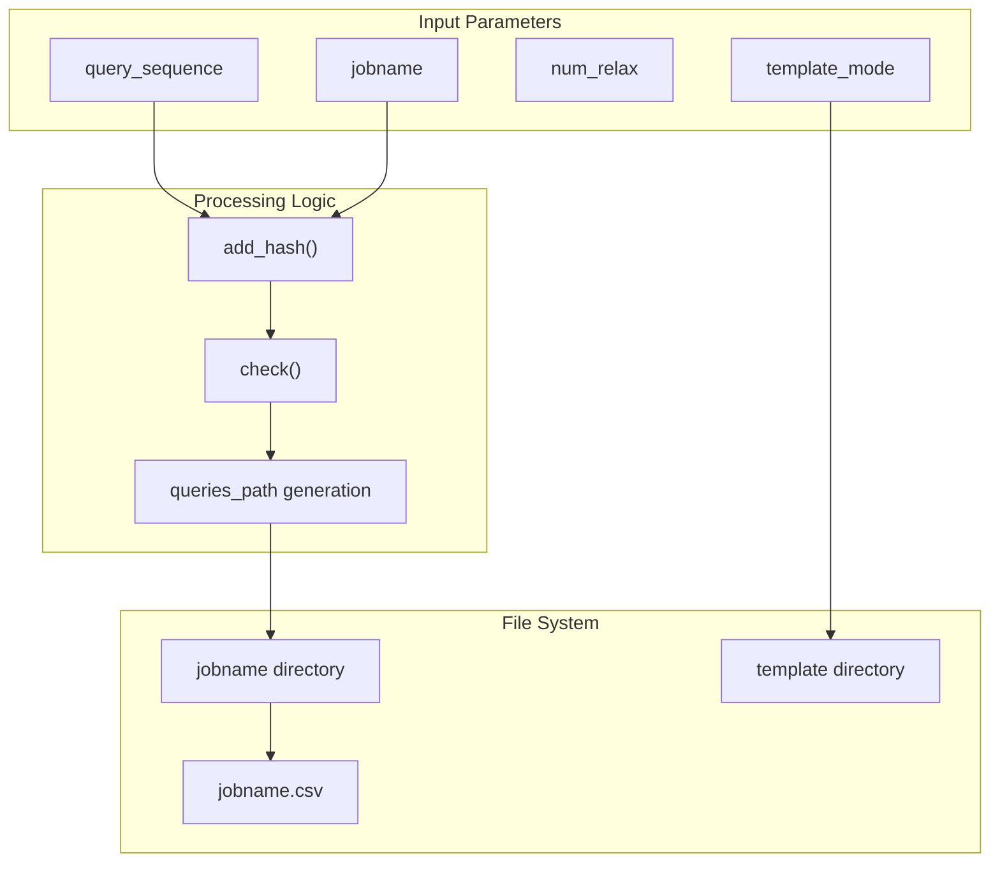
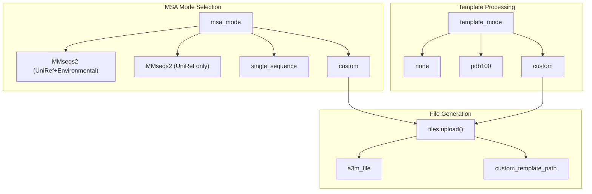
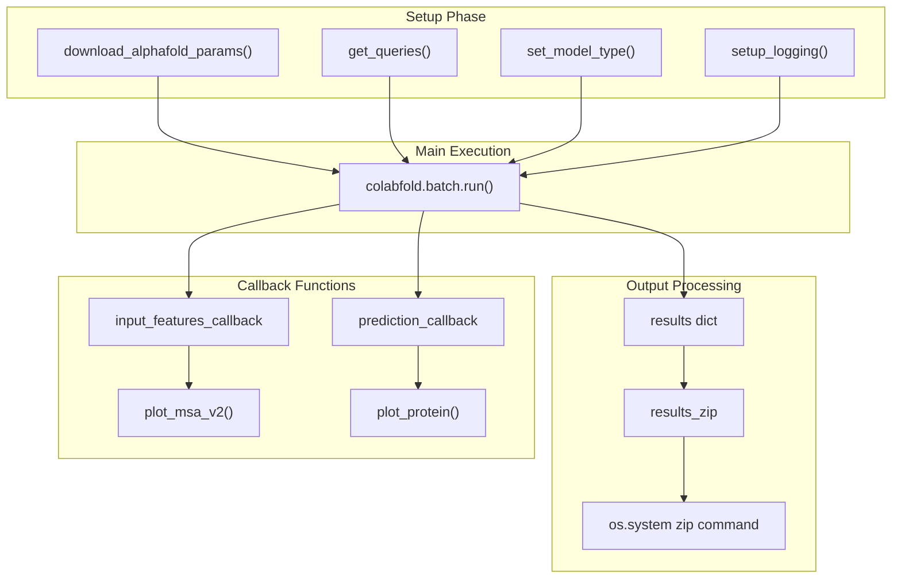
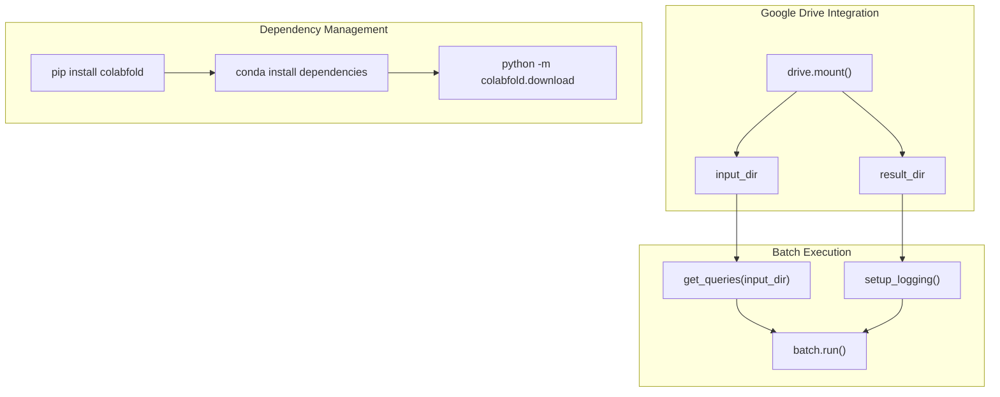
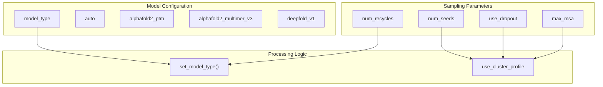
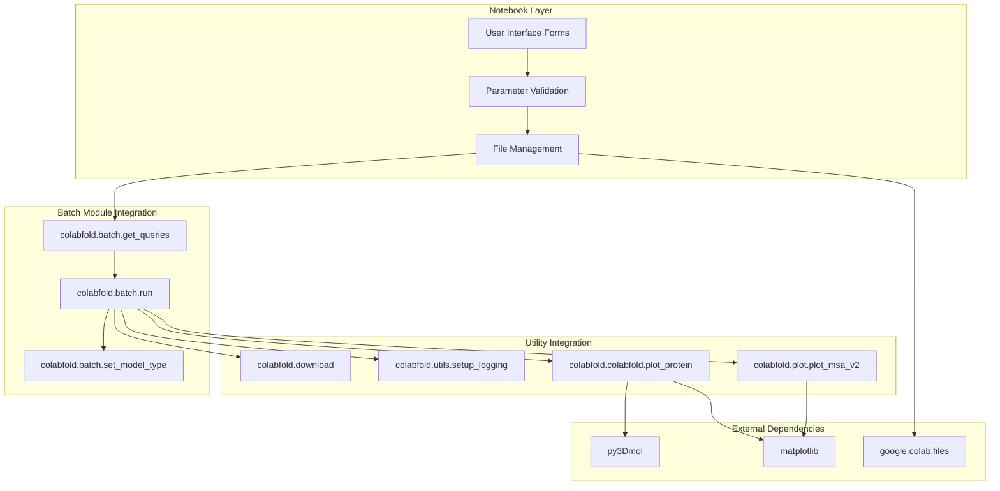
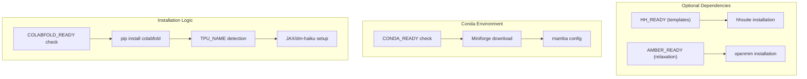

# AlphaFold2 Notebooks

> **Relevant source files**
> * [AlphaFold2.ipynb](https://github.com/sokrypton/ColabFold/blob/0c788a0e/AlphaFold2.ipynb)
> * [Boltz1.ipynb](https://github.com/sokrypton/ColabFold/blob/0c788a0e/Boltz1.ipynb)
> * [batch/AlphaFold2_batch.ipynb](https://github.com/sokrypton/ColabFold/blob/0c788a0e/batch/AlphaFold2_batch.ipynb)

## Purpose and Scope

The AlphaFold2 Notebooks provide interactive Google Colab interfaces for protein structure prediction using the ColabFold system. These notebooks serve as the primary user-facing entry points, offering form-based interfaces for configuring and executing protein folding predictions. This document covers the two main AlphaFold2 notebooks: the standard prediction notebook (`AlphaFold2.ipynb`) and the batch processing notebook (`batch/AlphaFold2_batch.ipynb`).

For information about advanced modeling features and experimental options, see [Advanced AlphaFold2 Notebooks](/sokrypton/ColabFold/3.2.2-advanced-alphafold2-notebooks). For alternative protein folding models, see [Alternative Model Notebooks](/sokrypton/ColabFold/3.2.3-alternative-model-notebooks).

## Notebook Architecture Overview

**Sources:** [AlphaFold2.ipynb L1-L643](https://github.com/sokrypton/ColabFold/blob/0c788a0e/AlphaFold2.ipynb#L1-L643)

 [batch/AlphaFold2_batch.ipynb L1-L275](https://github.com/sokrypton/ColabFold/blob/0c788a0e/batch/AlphaFold2_batch.ipynb#L1-L275)

## Single Sequence Prediction Notebook

The main `AlphaFold2.ipynb` notebook provides an interactive interface for predicting individual protein structures or complexes.

### Input Configuration

The notebook accepts protein sequences with `:` as chain separators for complex modeling [AlphaFold2.ipynb L78](https://github.com/sokrypton/ColabFold/blob/0c788a0e/AlphaFold2.ipynb#L78-L78)

 The `add_hash` function [AlphaFold2.ipynb L74-L75](https://github.com/sokrypton/ColabFold/blob/0c788a0e/AlphaFold2.ipynb#L74-L75)

 generates unique job identifiers by combining the base job name with a hash of the query sequence.

**Sources:** [AlphaFold2.ipynb L74-L130](https://github.com/sokrypton/ColabFold/blob/0c788a0e/AlphaFold2.ipynb#L74-L130)

### MSA and Template Configuration

The MSA configuration logic [AlphaFold2.ipynb L195-L222](https://github.com/sokrypton/ColabFold/blob/0c788a0e/AlphaFold2.ipynb#L195-L222)

 determines the alignment file path based on the selected mode. Custom template uploads are processed through Google Colab's `files.upload()` interface [AlphaFold2.ipynb L120](https://github.com/sokrypton/ColabFold/blob/0c788a0e/AlphaFold2.ipynb#L120-L120)

**Sources:** [AlphaFold2.ipynb L83-L84](https://github.com/sokrypton/ColabFold/blob/0c788a0e/AlphaFold2.ipynb#L83-L84)

 [AlphaFold2.ipynb L114-L127](https://github.com/sokrypton/ColabFold/blob/0c788a0e/AlphaFold2.ipynb#L114-L127)

 [AlphaFold2.ipynb L190-L227](https://github.com/sokrypton/ColabFold/blob/0c788a0e/AlphaFold2.ipynb#L190-L227)

### Prediction Execution Pipeline

The main prediction execution [AlphaFold2.ipynb L355-L387](https://github.com/sokrypton/ColabFold/blob/0c788a0e/AlphaFold2.ipynb#L355-L387)

 calls `colabfold.batch.run` with comprehensive configuration parameters and callback functions for real-time visualization.

**Sources:** [AlphaFold2.ipynb L300-L396](https://github.com/sokrypton/ColabFold/blob/0c788a0e/AlphaFold2.ipynb#L300-L396)

## Batch Processing Notebook

The `AlphaFold2_batch.ipynb` notebook handles multiple protein predictions from Google Drive directories [batch/AlphaFold2_batch.ipynb L48-L53](https://github.com/sokrypton/ColabFold/blob/0c788a0e/batch/AlphaFold2_batch.ipynb#L48-L53)

### Batch Configuration Structure

| Parameter | Type | Purpose |
| --- | --- | --- |
| `input_dir` | string | Google Drive path containing FASTA files or MSAs |
| `result_dir` | string | Output directory for results |
| `num_models` | int | Number of models to generate (1-5) |
| `num_recycles` | int | Recycling iterations (1-48) |
| `stop_at_score` | float | Early stopping threshold |
| `use_templates` | boolean | Enable template search |
| `zip_results` | boolean | Archive output files |

**Sources:** [batch/AlphaFold2_batch.ipynb L91-L108](https://github.com/sokrypton/ColabFold/blob/0c788a0e/batch/AlphaFold2_batch.ipynb#L91-L108)

### Batch Processing Flow

The batch notebook [batch/AlphaFold2_batch.ipynb L175-L210](https://github.com/sokrypton/ColabFold/blob/0c788a0e/batch/AlphaFold2_batch.ipynb#L175-L210)

 processes all input files through a single `colabfold.batch.run` call with standardized parameters.

**Sources:** [batch/AlphaFold2_batch.ipynb L71-L213](https://github.com/sokrypton/ColabFold/blob/0c788a0e/batch/AlphaFold2_batch.ipynb#L71-L213)

## Advanced Configuration Parameters

### Model and Sampling Settings

The advanced settings [AlphaFold2.ipynb L235-L258](https://github.com/sokrypton/ColabFold/blob/0c788a0e/AlphaFold2.ipynb#L235-L258)

 control model selection, sampling behavior, and uncertainty estimation through dropout and MSA subsampling.

**Sources:** [AlphaFold2.ipynb L234-L287](https://github.com/sokrypton/ColabFold/blob/0c788a0e/AlphaFold2.ipynb#L234-L287)

### Pairing and Complex Prediction

| Parameter | Values | Description |
| --- | --- | --- |
| `pair_mode` | `unpaired_paired`, `paired`, `unpaired` | MSA pairing strategy |
| `pairing_strategy` | `greedy`, `complete` | Taxonomic matching approach |
| `calc_extra_ptm` | boolean | Additional pTM calculations |

**Sources:** [AlphaFold2.ipynb L192-L247](https://github.com/sokrypton/ColabFold/blob/0c788a0e/AlphaFold2.ipynb#L192-L247)

 [batch/AlphaFold2_batch.ipynb L63](https://github.com/sokrypton/ColabFold/blob/0c788a0e/batch/AlphaFold2_batch.ipynb#L63-L63)

## Integration with Core System

The notebooks serve as configuration interfaces that translate user inputs into calls to the core `colabfold.batch.run` system [AlphaFold2.ipynb L355-L387](https://github.com/sokrypton/ColabFold/blob/0c788a0e/AlphaFold2.ipynb#L355-L387)

 with integrated visualization and file management capabilities.

**Sources:** [AlphaFold2.ipynb L300-L302](https://github.com/sokrypton/ColabFold/blob/0c788a0e/AlphaFold2.ipynb#L300-L302)

 [batch/AlphaFold2_batch.ipynb L179-L181](https://github.com/sokrypton/ColabFold/blob/0c788a0e/batch/AlphaFold2_batch.ipynb#L179-L181)

## Dependency Installation and Environment Setup

### Installation Cell Structure

Both notebooks implement comprehensive dependency management [AlphaFold2.ipynb L145-L178](https://github.com/sokrypton/ColabFold/blob/0c788a0e/AlphaFold2.ipynb#L145-L178)

 using sentinel files to track installation state and conditional installation based on feature requirements like Amber relaxation or templates.

**Sources:** [AlphaFold2.ipynb L138-L186](https://github.com/sokrypton/ColabFold/blob/0c788a0e/AlphaFold2.ipynb#L138-L186)

 [batch/AlphaFold2_batch.ipynb L118-L163](https://github.com/sokrypton/ColabFold/blob/0c788a0e/batch/AlphaFold2_batch.ipynb#L118-L163)