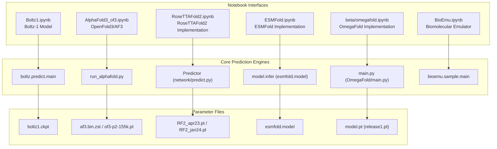
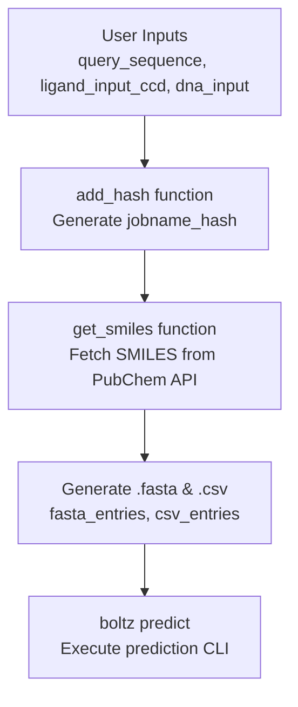
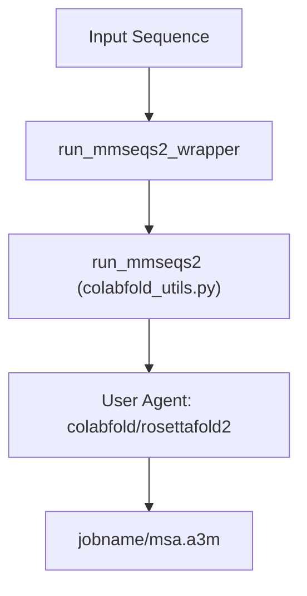
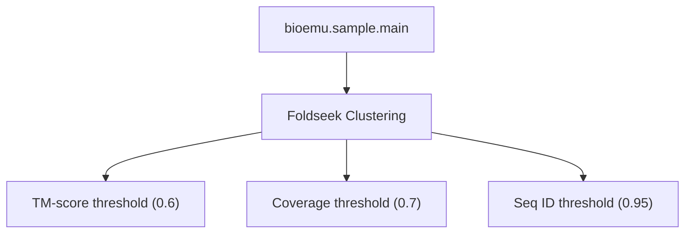

# Alternative Model Notebooks

> **Relevant source files**
> * [AlphaFold3_of3.ipynb](https://github.com/sokrypton/ColabFold/blob/0c788a0e/AlphaFold3_of3.ipynb)
> * [BioEmu.ipynb](https://github.com/sokrypton/ColabFold/blob/0c788a0e/BioEmu.ipynb)
> * [Boltz1.ipynb](https://github.com/sokrypton/ColabFold/blob/0c788a0e/Boltz1.ipynb)
> * [ESMFold.ipynb](https://github.com/sokrypton/ColabFold/blob/0c788a0e/ESMFold.ipynb)
> * [RoseTTAFold.ipynb](https://github.com/sokrypton/ColabFold/blob/0c788a0e/RoseTTAFold.ipynb)
> * [RoseTTAFold2.ipynb](https://github.com/sokrypton/ColabFold/blob/0c788a0e/RoseTTAFold2.ipynb)
> * [batch/AlphaFold2_batch.ipynb](https://github.com/sokrypton/ColabFold/blob/0c788a0e/batch/AlphaFold2_batch.ipynb)
> * [beta/AlphaFold2_advanced_old.ipynb](https://github.com/sokrypton/ColabFold/blob/0c788a0e/beta/AlphaFold2_advanced_old.ipynb)
> * [beta/AlphaFold_wJackhmmer.ipynb](https://github.com/sokrypton/ColabFold/blob/0c788a0e/beta/AlphaFold_wJackhmmer.ipynb)
> * [beta/ESMFold_advanced.ipynb](https://github.com/sokrypton/ColabFold/blob/0c788a0e/beta/ESMFold_advanced.ipynb)
> * [beta/RoseTTAFold.ipynb](https://github.com/sokrypton/ColabFold/blob/0c788a0e/beta/RoseTTAFold.ipynb)
> * [beta/RoseTTAFold_install.sh](https://github.com/sokrypton/ColabFold/blob/0c788a0e/beta/RoseTTAFold_install.sh)
> * [beta/RoseTTAFold_run.sh](https://github.com/sokrypton/ColabFold/blob/0c788a0e/beta/RoseTTAFold_run.sh)
> * [beta/omegafold.ipynb](https://github.com/sokrypton/ColabFold/blob/0c788a0e/beta/omegafold.ipynb)
> * [beta/relax_amber.ipynb](https://github.com/sokrypton/ColabFold/blob/0c788a0e/beta/relax_amber.ipynb)

This section covers ColabFold's interactive Google Colab notebooks for protein structure prediction models other than AlphaFold2. These notebooks provide user-friendly interfaces for alternative folding methods including Boltz-1, AlphaFold 3 (OpenFold3), RoseTTAFold, RoseTTAFold2, ESMFold, OmegaFold, and BioEmu.

For the main AlphaFold2 prediction notebooks, see [AlphaFold2 Notebooks](/sokrypton/ColabFold/3.2.1-alphafold2-notebooks). For advanced AlphaFold2 features and experimental options, see [Advanced AlphaFold2 Notebooks](/sokrypton/ColabFold/3.2.2-advanced-alphafold2-notebooks).

## Notebook Architecture Overview

The alternative model notebooks follow a common architectural pattern while integrating different prediction engines. Each notebook provides a complete workflow from sequence input to structure visualization and download.

### Model Ecosystem Diagram

The following diagram bridges the user-facing notebooks with the underlying model parameters and code entities.

Sources: [Boltz1.ipynb L34-L42](https://github.com/sokrypton/ColabFold/blob/0c788a0e/Boltz1.ipynb#L34-L42)

 [AlphaFold3_of3.ipynb L20-L33](https://github.com/sokrypton/ColabFold/blob/0c788a0e/AlphaFold3_of3.ipynb#L20-L33)

 [RoseTTAFold2.ipynb L52-L138](https://github.com/sokrypton/ColabFold/blob/0c788a0e/RoseTTAFold2.ipynb#L52-L138)

 [ESMFold.ipynb L62-L91](https://github.com/sokrypton/ColabFold/blob/0c788a0e/ESMFold.ipynb#L62-L91)

 [beta/omegafold.ipynb L55-L70](https://github.com/sokrypton/ColabFold/blob/0c788a0e/beta/omegafold.ipynb#L55-L70)

 [BioEmu.ipynb L19-L30](https://github.com/sokrypton/ColabFold/blob/0c788a0e/BioEmu.ipynb#L19-L30)

## Boltz-1 Notebook

The `Boltz1.ipynb` notebook provides a work-in-progress interface for the Boltz-1 model, supporting proteins, DNA, and small molecule ligands.

### Input Processing Logic

The notebook implements complex mapping logic to handle multiple molecule types and convert common names to SMILES via the PubChem API.

* **Ligand Handling**: Supports SMILES strings, CCD codes (three-letter codes), and common names [Boltz1.ipynb L63-L68](https://github.com/sokrypton/ColabFold/blob/0c788a0e/Boltz1.ipynb#L63-L68)
* **PubChem Integration**: The `get_smiles` function uses the PubChem REST API to resolve compound names to Canonical SMILES [Boltz1.ipynb L105-L130](https://github.com/sokrypton/ColabFold/blob/0c788a0e/Boltz1.ipynb#L105-L130)
* **Job Naming**: Uses `hashlib.sha1` to append a unique 5-character suffix to job names based on the query sequence [Boltz1.ipynb L57-L58](https://github.com/sokrypton/ColabFold/blob/0c788a0e/Boltz1.ipynb#L57-L58)

Sources: [Boltz1.ipynb L47-L152](https://github.com/sokrypton/ColabFold/blob/0c788a0e/Boltz1.ipynb#L47-L152)

## AlphaFold 3 (OpenFold3) Notebook

The `AlphaFold3_of3.ipynb` notebook enables prediction of protein, RNA, DNA, and small-molecule structures using either official AlphaFold 3 weights or OpenFold3 weights.

### Weight and Dependency Management

| Component | Source/Method | Note |
| --- | --- | --- |
| **AF3 Weights** | `https://storage.googleapis.com/alphafold3/af3.bin.zst` | Requires user acceptance of terms [AlphaFold3_of3.ipynb L50-L56](https://github.com/sokrypton/ColabFold/blob/0c788a0e/AlphaFold3_of3.ipynb#L50-L56) |
| **OF3 Weights** | `s3://openfold/staging/of3-p2-155k.pt` | Converted via `convert_of3_weights.py` [AlphaFold3_of3.ipynb L97-L115](https://github.com/sokrypton/ColabFold/blob/0c788a0e/AlphaFold3_of3.ipynb#L97-L115) |
| **GPU Optimization** | `tokamax` patch | Restricts Triton kernels to datacenter GPUs (A100/H100) [AlphaFold3_of3.ipynb L74-L85](https://github.com/sokrypton/ColabFold/blob/0c788a0e/AlphaFold3_of3.ipynb#L74-L85) |

Sources: [AlphaFold3_of3.ipynb L46-L118](https://github.com/sokrypton/ColabFold/blob/0c788a0e/AlphaFold3_of3.ipynb#L46-L118)

## RoseTTAFold2 Notebook

The `RoseTTAFold2.ipynb` notebook implements the RoseTTAFold2 method with support for symmetry and stochastic sampling.

### MSA Generation and Search

RoseTTAFold2 utilizes a custom wrapper for the MMseqs2 API to generate MSAs.

* **Symmetry Modeling**: Supports symmetry types `X`, `C`, `D`, `T`, `I`, `O` [RoseTTAFold2.ipynb L243-L245](https://github.com/sokrypton/ColabFold/blob/0c788a0e/RoseTTAFold2.ipynb#L243-L245)
* **Stochasticity**: Includes options for `use_mlm` (Masked Language Model) and `use_dropout` during inference [RoseTTAFold2.ipynb L254-L255](https://github.com/sokrypton/ColabFold/blob/0c788a0e/RoseTTAFold2.ipynb#L254-L255)

Sources: [RoseTTAFold2.ipynb L143-L145](https://github.com/sokrypton/ColabFold/blob/0c788a0e/RoseTTAFold2.ipynb#L143-L145)

 [RoseTTAFold2.ipynb L243-L261](https://github.com/sokrypton/ColabFold/blob/0c788a0e/RoseTTAFold2.ipynb#L243-L261)

## ESMFold Notebook

The `ESMFold.ipynb` and `beta/ESMFold_advanced.ipynb` notebooks provide access to Meta's ESMFold model, which predicts structures directly from single sequences using a large language model.

### Key Features and Implementation

* **Model Loading**: Uses `torch.load` to load `esmfold.model` [ESMFold.ipynb L159-L161](https://github.com/sokrypton/ColabFold/blob/0c788a0e/ESMFold.ipynb#L159-L161)
* **Dynamic Chunking**: Adjusts `model.set_chunk_size` based on sequence length (64 for L>700, 128 otherwise) to optimize for Tesla T4 GPUs [ESMFold.ipynb L164-L167](https://github.com/sokrypton/ColabFold/blob/0c788a0e/ESMFold.ipynb#L164-L167)
* **Advanced Sampling**: The advanced notebook supports `stochastic_mode` ("LM", "LM_SM", "SM") and `masking_rate` for generating structural ensembles [beta/ESMFold_advanced.ipynb L122-L159](https://github.com/sokrypton/ColabFold/blob/0c788a0e/beta/ESMFold_advanced.ipynb#L122-L159)

Sources: [ESMFold.ipynb L151-L172](https://github.com/sokrypton/ColabFold/blob/0c788a0e/ESMFold.ipynb#L151-L172)

 [beta/ESMFold_advanced.ipynb L122-L159](https://github.com/sokrypton/ColabFold/blob/0c788a0e/beta/ESMFold_advanced.ipynb#L122-L159)

## OmegaFold Notebook

The `beta/omegafold.ipynb` notebook implements the OmegaFold model, which uses rotary position embeddings (RoPE).

* **Implementation**: Clones the OmegaFold repository and downloads `release1.pt` [beta/omegafold.ipynb L62-L69](https://github.com/sokrypton/ColabFold/blob/0c788a0e/beta/omegafold.ipynb#L62-L69)
* **CLI Execution**: Runs `OmegaFold/main.py` with configurable `num_cycle` and `subbatch_size` [beta/omegafold.ipynb L117](https://github.com/sokrypton/ColabFold/blob/0c788a0e/beta/omegafold.ipynb#L117-L117)
* **PDB Processing**: Includes a `renum_pdb_str` function to handle chain renumbering and labeling for multimeric outputs [beta/omegafold.ipynb L119-L148](https://github.com/sokrypton/ColabFold/blob/0c788a0e/beta/omegafold.ipynb#L119-L148)

Sources: [beta/omegafold.ipynb L47-L152](https://github.com/sokrypton/ColabFold/blob/0c788a0e/beta/omegafold.ipynb#L47-L152)

## BioEmu Notebook

The `BioEmu.ipynb` notebook implements the Biomolecular Emulator framework for sampling structural dynamics.

### Pipeline Implementation

* **Clustering**: Uses Foldseek to group sampled conformations based on structural similarity [BioEmu.ipynb L159-L168](https://github.com/sokrypton/ColabFold/blob/0c788a0e/BioEmu.ipynb#L159-L168)
* **Relaxation**: Optional sidechain reconstruction and MD relaxation using OpenMM [BioEmu.ipynb L112-L114](https://github.com/sokrypton/ColabFold/blob/0c788a0e/BioEmu.ipynb#L112-L114)

Sources: [BioEmu.ipynb L135-L168](https://github.com/sokrypton/ColabFold/blob/0c788a0e/BioEmu.ipynb#L135-L168)

## Standard Output and Visualization

All alternative notebooks integrate standardized ColabFold visualization and output patterns:

* **3D Visualization**: Uses `py3Dmol` for interactive structure display [RoseTTAFold.ipynb L91](https://github.com/sokrypton/ColabFold/blob/0c788a0e/RoseTTAFold.ipynb#L91-L91)  [beta/omegafold.ipynb L65](https://github.com/sokrypton/ColabFold/blob/0c788a0e/beta/omegafold.ipynb#L65-L65)  [ESMFold.ipynb L73](https://github.com/sokrypton/ColabFold/blob/0c788a0e/ESMFold.ipynb#L73-L73)
* **Result Packaging**: Standardized logic for zipping results and downloading to the local machine [batch/AlphaFold2_batch.ipynb L108](https://github.com/sokrypton/ColabFold/blob/0c788a0e/batch/AlphaFold2_batch.ipynb#L108-L108)  [RoseTTAFold2.ipynb L413-L432](https://github.com/sokrypton/ColabFold/blob/0c788a0e/RoseTTAFold2.ipynb#L413-L432)
* **Confidence Coloring**: PDB files typically store pLDDT or similar confidence metrics in the B-factor column for visualization [RoseTTAFold.ipynb L111-L118](https://github.com/sokrypton/ColabFold/blob/0c788a0e/RoseTTAFold.ipynb#L111-L118)

Sources: [RoseTTAFold.ipynb L91-L125](https://github.com/sokrypton/ColabFold/blob/0c788a0e/RoseTTAFold.ipynb#L91-L125)

 [RoseTTAFold2.ipynb L413-L432](https://github.com/sokrypton/ColabFold/blob/0c788a0e/RoseTTAFold2.ipynb#L413-L432)

 [beta/omegafold.ipynb L165-L215](https://github.com/sokrypton/ColabFold/blob/0c788a0e/beta/omegafold.ipynb#L165-L215)