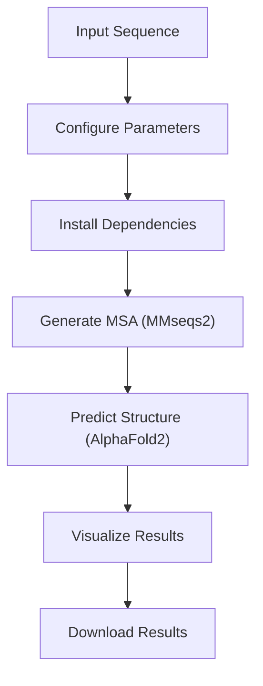
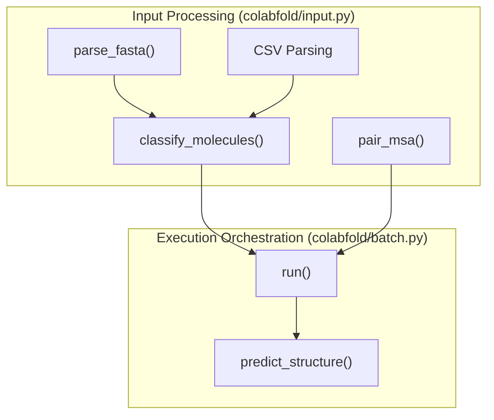

# Basic Usage

> **Relevant source files**
> * [AlphaFold2.ipynb](https://github.com/sokrypton/ColabFold/blob/0c788a0e/AlphaFold2.ipynb)
> * [README.md](https://github.com/sokrypton/ColabFold/blob/0c788a0e/README.md?plain=1)
> * [colabfold/input.py](https://github.com/sokrypton/ColabFold/blob/0c788a0e/colabfold/input.py)

This document covers the fundamental ways to use ColabFold for protein structure prediction, focusing on the two primary interfaces: the interactive Google Colab notebooks and basic command line usage. For advanced configuration and local database setup, see [Local Execution](/sokrypton/ColabFold/5.1-local-execution). For complex prediction scenarios, see [Complex Prediction](/sokrypton/ColabFold/5.2-complex-prediction).

## Overview

ColabFold provides two main approaches for basic protein structure prediction:

1. **Interactive Notebooks** - Web-based interfaces running in Google Colab for single sequences or small batches.
2. **Command Line Interface** - Local or server-based tools for automated processing.

Both interfaces utilize the same core prediction pipeline orchestrated by `colabfold.batch.run`, but offer different levels of interactivity and control.

## Notebook-Based Usage

### Primary Notebook Interface

The main entry point for most users is the `AlphaFold2.ipynb` notebook, which provides an interactive web interface for single protein structure prediction [AlphaFold2.ipynb L47-L55](https://github.com/sokrypton/ColabFold/blob/0c788a0e/AlphaFold2.ipynb#L47-L55)

#### Basic Workflow



**Basic Notebook Workflow**

#### Key Input Parameters

The notebook accepts protein sequences and configuration through form fields [AlphaFold2.ipynb L77-L83](https://github.com/sokrypton/ColabFold/blob/0c788a0e/AlphaFold2.ipynb#L77-L83)

:

| Parameter | Description | Default |
| --- | --- | --- |
| `query_sequence` | Protein sequence(s), use `:` for chain breaks [AlphaFold2.ipynb L78](https://github.com/sokrypton/ColabFold/blob/0c788a0e/AlphaFold2.ipynb#L78-L78) | Required |
| `jobname` | Identifier for the prediction job [AlphaFold2.ipynb L79](https://github.com/sokrypton/ColabFold/blob/0c788a0e/AlphaFold2.ipynb#L79-L79) | `"test"` |
| `template_mode` | Template usage: `"none"`, `"pdb100"`, `"custom"` [AlphaFold2.ipynb L83](https://github.com/sokrypton/ColabFold/blob/0c788a0e/AlphaFold2.ipynb#L83-L83) | `"none"` |
| `num_relax` | Number of structures to relax using Amber [AlphaFold2.ipynb L81](https://github.com/sokrypton/ColabFold/blob/0c788a0e/AlphaFold2.ipynb#L81-L81) | `0` |

#### Input Parsing and Sanitization

The notebook performs basic sanitization on inputs. It removes whitespaces from sequences and job names, and generates a unique hash for the job to avoid directory collisions [AlphaFold2.ipynb L88-L107](https://github.com/sokrypton/ColabFold/blob/0c788a0e/AlphaFold2.ipynb#L88-L107)

```markdown
# From AlphaFold2.ipynb:91-93basejobname = "".join(jobname.split())basejobname = re.sub(r'\W+', '', basejobname)jobname = add_hash(basejobname, query_sequence)
```

**Sources:** [AlphaFold2.ipynb L47-L55](https://github.com/sokrypton/ColabFold/blob/0c788a0e/AlphaFold2.ipynb#L47-L55)

 [AlphaFold2.ipynb L77-L83](https://github.com/sokrypton/ColabFold/blob/0c788a0e/AlphaFold2.ipynb#L77-L83)

 [AlphaFold2.ipynb L88-L107](https://github.com/sokrypton/ColabFold/blob/0c788a0e/AlphaFold2.ipynb#L88-L107)

## Command Line Usage

### Basic Command Structure

ColabFold provides several command line tools. The primary tool is `colabfold_batch`, which handles the full pipeline [README.md L68-L79](https://github.com/sokrypton/ColabFold/blob/0c788a0e/README.md?plain=1#L68-L79)

```
colabfold_batch input_sequences.fasta output_directory
```

### Entrypoints and Implementation

The CLI tools are defined as entrypoints in the project configuration.

| CLI Command | Code Entrypoint | Purpose |
| --- | --- | --- |
| `colabfold_batch` | `colabfold.batch:main` | End-to-end structure prediction |
| `colabfold_search` | `colabfold.colabfold_search:main` | MSA generation using MMseqs2 |

#### Common Usage Patterns

* **Standard Run**: Process sequences from MSA generation through structure prediction [README.md L73-L74](https://github.com/sokrypton/ColabFold/blob/0c788a0e/README.md?plain=1#L73-L74)
* **MSA-Only**: Generate MSAs without running structure prediction [README.md L77-L78](https://github.com/sokrypton/ColabFold/blob/0c788a0e/README.md?plain=1#L77-L78)
* **AF3-JSON Export**: Generate input files compatible with AlphaFold3 [README.md L127-L130](https://github.com/sokrypton/ColabFold/blob/0c788a0e/README.md?plain=1#L127-L130)

**Sources:** [README.md L68-L79](https://github.com/sokrypton/ColabFold/blob/0c788a0e/README.md?plain=1#L68-L79)

 [README.md L127-L130](https://github.com/sokrypton/ColabFold/blob/0c788a0e/README.md?plain=1#L127-L130)

## Input Formats

### Sequence Input

ColabFold supports multiple input formats via `colabfold.input` utilities.

#### FASTA and CSV

Standard FASTA files are parsed using `parse_fasta` [colabfold/input.py L88-L116](https://github.com/sokrypton/ColabFold/blob/0c788a0e/colabfold/input.py#L88-L116)

 CSV files are also supported for batch processing, requiring `id` and `sequence` columns [AlphaFold2.ipynb L110-L112](https://github.com/sokrypton/ColabFold/blob/0c788a0e/AlphaFold2.ipynb#L110-L112)

#### Complex Notation

For protein complexes, ColabFold uses a `:` delimiter to separate chains [AlphaFold2.ipynb L78](https://github.com/sokrypton/ColabFold/blob/0c788a0e/AlphaFold2.ipynb#L78-L78)

 The `classify_molecules` function splits these strings and identifies individual protein components [colabfold/input.py L118-L143](https://github.com/sokrypton/ColabFold/blob/0c788a0e/colabfold/input.py#L118-L143)

```markdown
# From colabfold/input.py:125-126sequences = query_sequence.upper().split(":")protein_queries = []
```

### MSA Input (A3M)

Custom MSA input is supported in A3M format. The `pair_msa` and `msa_to_str` functions handle the formatting of these alignments for the model, supporting both paired and unpaired sequences [colabfold/input.py L51-L86](https://github.com/sokrypton/ColabFold/blob/0c788a0e/colabfold/input.py#L51-L86)

**Sources:** [colabfold/input.py L51-L86](https://github.com/sokrypton/ColabFold/blob/0c788a0e/colabfold/input.py#L51-L86)

 [colabfold/input.py L88-L116](https://github.com/sokrypton/ColabFold/blob/0c788a0e/colabfold/input.py#L88-L116)

 [colabfold/input.py L118-L143](https://github.com/sokrypton/ColabFold/blob/0c788a0e/colabfold/input.py#L118-L143)

 [AlphaFold2.ipynb L78](https://github.com/sokrypton/ColabFold/blob/0c788a0e/AlphaFold2.ipynb#L78-L78)

 [AlphaFold2.ipynb L110-L112](https://github.com/sokrypton/ColabFold/blob/0c788a0e/AlphaFold2.ipynb#L110-L112)

## Data Flow: Input to Execution

The following diagram maps the relationship between input processing functions and the core execution logic.



**Natural Language to Code Entity Space: Input Pipeline**

**Sources:** [colabfold/input.py L51-L86](https://github.com/sokrypton/ColabFold/blob/0c788a0e/colabfold/input.py#L51-L86)

 [colabfold/input.py L88-L116](https://github.com/sokrypton/ColabFold/blob/0c788a0e/colabfold/input.py#L88-L116)

 [colabfold/input.py L118-L143](https://github.com/sokrypton/ColabFold/blob/0c788a0e/colabfold/input.py#L118-L143)

## Understanding Outputs

### Standard Output Files

Each prediction job generates a structured output directory [AlphaFold2.ipynb L388-L389](https://github.com/sokrypton/ColabFold/blob/0c788a0e/AlphaFold2.ipynb#L388-L389)

:

| File Pattern | Description |
| --- | --- |
| `*_unrelaxed_rank_*.pdb` | Predicted structures ranked by confidence |
| `*_relaxed_rank_*.pdb` | Amber-relaxed structures (if `num_relax > 0`) |
| `*_scores.json` | JSON containing pLDDT, PAE, and pTM metrics |
| `*_pae.png` | Predicted Aligned Error heatmap |
| `*_plddt.png` | Per-residue confidence plot |
| `*.a3m` | The final MSA used for prediction |

### Result Packaging

In the notebook environment, results are automatically compressed into a ZIP file for easy download [AlphaFold2.ipynb L388-L389](https://github.com/sokrypton/ColabFold/blob/0c788a0e/AlphaFold2.ipynb#L388-L389)

```css
# From AlphaFold2.ipynb:388-389!zip -q -r {jobname}.result.zip {jobname}files.download(f"{jobname}.result.zip")
```

**Sources:** [AlphaFold2.ipynb L388-L389](https://github.com/sokrypton/ColabFold/blob/0c788a0e/AlphaFold2.ipynb#L388-L389)