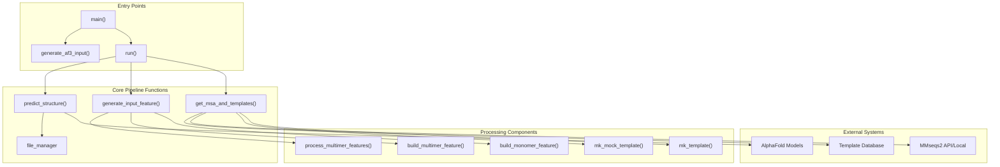
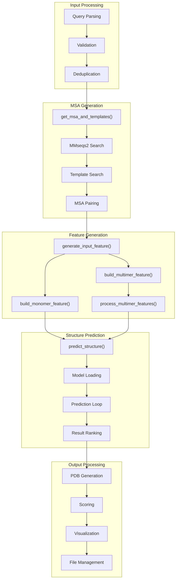
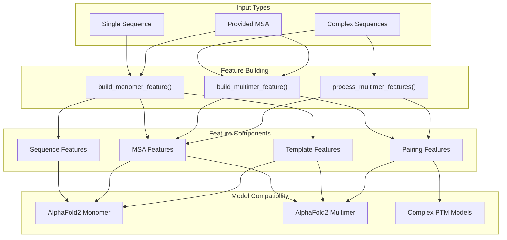
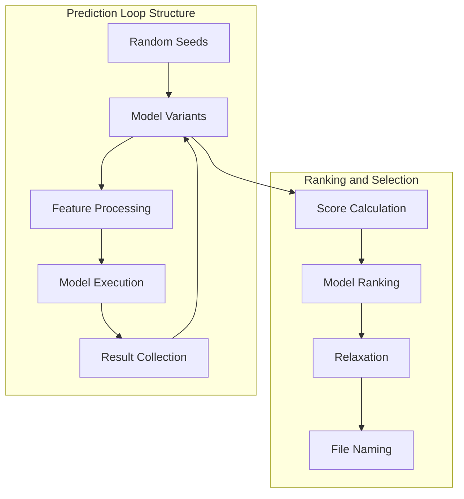
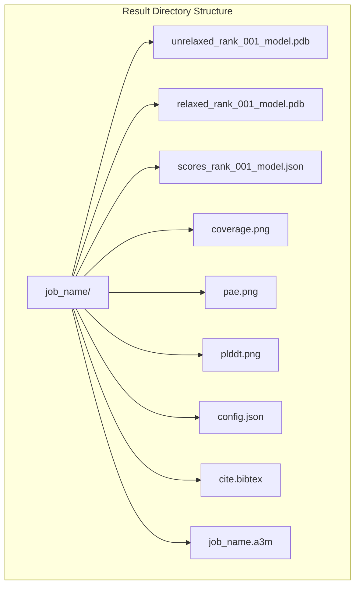

# Batch Processing System

> **Relevant source files**
> * [colabfold/batch.py](https://github.com/sokrypton/ColabFold/blob/0c788a0e/colabfold/batch.py)
> * [colabfold/utils.py](https://github.com/sokrypton/ColabFold/blob/0c788a0e/colabfold/utils.py)

The Batch Processing System is the central orchestration engine of ColabFold that coordinates the entire protein structure prediction workflow. This system manages the complete pipeline from input processing through MSA generation, structure prediction, and output formatting for both single sequences and protein complexes.

For information about the interactive notebook interfaces that build upon this system, see [Notebook Interfaces](/sokrypton/ColabFold/3.2-notebook-interfaces). For details about command-line tools that invoke this system, see [Command Line Interface](/sokrypton/ColabFold/4-command-line-interface).

## Architecture Overview

The batch processing system is primarily implemented in the `run` function within `colabfold/batch.py`, which serves as the central coordinator for all prediction workflows. The system follows a modular design where each major processing step is handled by specialized functions.

### System Architecture



**Sources:** [colabfold/batch.py L1031-L1492](https://github.com/sokrypton/ColabFold/blob/0c788a0e/colabfold/batch.py#L1031-L1492)

 [colabfold/batch.py L558-L706](https://github.com/sokrypton/ColabFold/blob/0c788a0e/colabfold/batch.py#L558-L706)

 [colabfold/batch.py L785-L874](https://github.com/sokrypton/ColabFold/blob/0c788a0e/colabfold/batch.py#L785-L874)

 [colabfold/batch.py L313-L556](https://github.com/sokrypton/ColabFold/blob/0c788a0e/colabfold/batch.py#L313-L556)

## Core Pipeline Components

The batch processing system consists of three main pipeline stages that are executed sequentially for each input query.

### Pipeline Flow



**Sources:** [colabfold/batch.py L1243-L1490](https://github.com/sokrypton/ColabFold/blob/0c788a0e/colabfold/batch.py#L1243-L1490)

 [colabfold/batch.py L1272-L1305](https://github.com/sokrypton/ColabFold/blob/0c788a0e/colabfold/batch.py#L1272-L1305)

 [colabfold/batch.py L1309-L1320](https://github.com/sokrypton/ColabFold/blob/0c788a0e/colabfold/batch.py#L1309-L1320)

 [colabfold/batch.py L1346-L1436](https://github.com/sokrypton/ColabFold/blob/0c788a0e/colabfold/batch.py#L1346-L1436)

### MSA and Template Processing

The `get_msa_and_templates` function coordinates Multiple Sequence Alignment generation and template discovery. It handles different MSA modes and manages both local and remote MMseqs2 searches [colabfold/batch.py L558-L706](https://github.com/sokrypton/ColabFold/blob/0c788a0e/colabfold/batch.py#L558-L706)

| MSA Mode | Description | Use Case |
| --- | --- | --- |
| `mmseqs2_uniref_env` | UniRef30 + Environmental databases | Default, balanced coverage |
| `mmseqs2_uniref_env_envpair` | UniRef30 + Environmental + pairing | Complex prediction with pairing |
| `mmseqs2_uniref` | UniRef30 only | Faster, reduced coverage |
| `single_sequence` | No MSA search | Testing or when MSA provided |

**Sources:** [colabfold/batch.py L558-L706](https://github.com/sokrypton/ColabFold/blob/0c788a0e/colabfold/batch.py#L558-L706)

 [colabfold/batch.py L575-L576](https://github.com/sokrypton/ColabFold/blob/0c788a0e/colabfold/batch.py#L575-L576)

 [colabfold/batch.py L659-L697](https://github.com/sokrypton/ColabFold/blob/0c788a0e/colabfold/batch.py#L659-L697)

### Feature Engineering Pipeline

The system converts raw sequences and MSAs into AlphaFold-compatible feature dictionaries. `build_monomer_feature` handles single chains [colabfold/batch.py L728-L783](https://github.com/sokrypton/ColabFold/blob/0c788a0e/colabfold/batch.py#L728-L783)

 while `build_multimer_feature` and `process_multimer_features` manage complex inputs [colabfold/batch.py L785-L874](https://github.com/sokrypton/ColabFold/blob/0c788a0e/colabfold/batch.py#L785-L874)



**Sources:** [colabfold/batch.py L708-L719](https://github.com/sokrypton/ColabFold/blob/0c788a0e/colabfold/batch.py#L708-L719)

 [colabfold/batch.py L721-L726](https://github.com/sokrypton/ColabFold/blob/0c788a0e/colabfold/batch.py#L721-L726)

 [colabfold/batch.py L728-L783](https://github.com/sokrypton/ColabFold/blob/0c788a0e/colabfold/batch.py#L728-L783)

 [colabfold/batch.py L785-L874](https://github.com/sokrypton/ColabFold/blob/0c788a0e/colabfold/batch.py#L785-L874)

## Entry Points and Interfaces

The batch processing system provides multiple entry points for different use cases and integration scenarios.

### Command Line Interface

The `main` function provides a comprehensive CLI with argument groups for different aspects of the pipeline [colabfold/batch.py L1570-L2038](https://github.com/sokrypton/ColabFold/blob/0c788a0e/colabfold/batch.py#L1570-L2038)

:

| Argument Group | Purpose | Key Parameters |
| --- | --- | --- |
| MSA arguments | Control MSA generation | `--msa-mode`, `--pair-mode`, `--templates` |
| Prediction arguments | Configure model behavior | `--num-models`, `--model-type`, `--num-recycles` |
| Relaxation arguments | Control structure refinement | `--amber`, `--num-relax` |
| Output arguments | Manage result formatting | `--rank`, `--save-all`, `--zip` |

**Sources:** [colabfold/batch.py L1570-L2038](https://github.com/sokrypton/ColabFold/blob/0c788a0e/colabfold/batch.py#L1570-L2038)

 [colabfold/batch.py L1579-L1643](https://github.com/sokrypton/ColabFold/blob/0c788a0e/colabfold/batch.py#L1579-L1643)

 [colabfold/batch.py L1645-L1762](https://github.com/sokrypton/ColabFold/blob/0c788a0e/colabfold/batch.py#L1645-L1762)

### Programmatic Interface

The `run` function serves as the primary programmatic interface, accepting structured query data and configuration parameters [colabfold/batch.py L1031-L1080](https://github.com/sokrypton/ColabFold/blob/0c788a0e/colabfold/batch.py#L1031-L1080)

:

```markdown
# Query format: (jobname, sequence(s), msa_lines, other_molecules)queries = [("protein1", "MKLLVL...", None, None)] # Main executionresults = run(    queries=queries,    result_dir="/path/to/output",    num_models=5,    is_complex=False,    model_type="alphafold2_ptm")
```

**Sources:** [colabfold/batch.py L1031-L1080](https://github.com/sokrypton/ColabFold/blob/0c788a0e/colabfold/batch.py#L1031-L1080)

 [colabfold/batch.py L1989-L2035](https://github.com/sokrypton/ColabFold/blob/0c788a0e/colabfold/batch.py#L1989-L2035)

## Data Flow and Processing

The system implements a sophisticated data flow that handles both single sequences and protein complexes with various optimization strategies.

### Query Processing Loop

```mermaid
sequenceDiagram
  participant User Input
  participant run()
  participant get_msa_and_templates()
  participant generate_input_feature()
  participant predict_structure()
  participant Output Manager

  User Input->>run(): "Submit queries"
  loop ["For each query"]
    run()->>run(): "Check existing results"
    run()->>get_msa_and_templates(): "Generate MSA & templates"
    get_msa_and_templates()->>get_msa_and_templates(): "Search databases"
    get_msa_and_templates()->>run(): "Return MSA data"
    run()->>generate_input_feature(): "Build feature dict"
    generate_input_feature()->>generate_input_feature(): "Process sequences"
    generate_input_feature()->>run(): "Return features"
    run()->>predict_structure(): "Predict structure"
    predict_structure()->>predict_structure(): "Run models"
    predict_structure()->>predict_structure(): "Rank results"
    predict_structure()->>run(): "Return predictions"
    run()->>Output Manager: "Save outputs"
    Output Manager->>Output Manager: "Generate plots"
  end
  run()->>User Input: "Return summary"
```

**Sources:** [colabfold/batch.py L1243-L1490](https://github.com/sokrypton/ColabFold/blob/0c788a0e/colabfold/batch.py#L1243-L1490)

 [colabfold/batch.py L1254-L1264](https://github.com/sokrypton/ColabFold/blob/0c788a0e/colabfold/batch.py#L1254-L1264)

 [colabfold/batch.py L1272-L1305](https://github.com/sokrypton/ColabFold/blob/0c788a0e/colabfold/batch.py#L1272-L1305)

### Model Prediction Workflow

The `predict_structure` function implements a nested loop structure for comprehensive model evaluation, handling random seeds and multiple model variants [colabfold/batch.py L313-L556](https://github.com/sokrypton/ColabFold/blob/0c788a0e/colabfold/batch.py#L313-L556)



**Sources:** [colabfold/batch.py L313-L556](https://github.com/sokrypton/ColabFold/blob/0c788a0e/colabfold/batch.py#L313-L556)

 [colabfold/batch.py L352-L518](https://github.com/sokrypton/ColabFold/blob/0c788a0e/colabfold/batch.py#L352-L518)

 [colabfold/batch.py L520-L556](https://github.com/sokrypton/ColabFold/blob/0c788a0e/colabfold/batch.py#L520-L556)

## Configuration and Parameters

The system supports extensive configuration through parameters that control every aspect of the prediction pipeline.

### Model Configuration

| Parameter | Default | Description |
| --- | --- | --- |
| `model_type` | "auto" | Model architecture selection |
| `num_models` | 5 | Number of models to run |
| `num_recycles` | None | Prediction recycles per model |
| `model_order` | [1,2,3,4,5] | Model execution sequence |

### MSA Configuration

| Parameter | Default | Description |
| --- | --- | --- |
| `msa_mode` | "mmseqs2_uniref_env" | Database selection strategy |
| `pair_mode` | "unpaired_paired" | Complex pairing strategy |
| `max_seq` | Auto | Maximum MSA sequences |
| `use_templates` | False | Enable template search |

**Sources:** [colabfold/batch.py L1031-L1080](https://github.com/sokrypton/ColabFold/blob/0c788a0e/colabfold/batch.py#L1031-L1080)

 [colabfold/batch.py L1109-L1166](https://github.com/sokrypton/ColabFold/blob/0c788a0e/colabfold/batch.py#L1109-L1166)

 [colabfold/batch.py L1132-L1142](https://github.com/sokrypton/ColabFold/blob/0c788a0e/colabfold/batch.py#L1132-L1142)

### Performance Optimization

The system includes several optimization mechanisms:

* **Padding Strategy**: Sequences are padded to avoid recompilation via `recompile_padding` [colabfold/batch.py L1059](https://github.com/sokrypton/ColabFold/blob/0c788a0e/colabfold/batch.py#L1059-L1059)
* **Early Stopping**: Prediction stops when confidence thresholds are met via `stop_at_score` [colabfold/batch.py L1069](https://github.com/sokrypton/ColabFold/blob/0c788a0e/colabfold/batch.py#L1069-L1069)
* **Result Caching**: MSA results are cached to avoid redundant searches [colabfold/batch.py L1273-L1296](https://github.com/sokrypton/ColabFold/blob/0c788a0e/colabfold/batch.py#L1273-L1296)
* **JAX Memory Management**: Environment variables `TF_FORCE_UNIFIED_MEMORY` and `XLA_PYTHON_CLIENT_MEM_FRACTION` are configured to optimize GPU memory usage [colabfold/batch.py L4-L6](https://github.com/sokrypton/ColabFold/blob/0c788a0e/colabfold/batch.py#L4-L6)

**Sources:** [colabfold/batch.py L1059](https://github.com/sokrypton/ColabFold/blob/0c788a0e/colabfold/batch.py#L1059-L1059)

 [colabfold/batch.py L1069](https://github.com/sokrypton/ColabFold/blob/0c788a0e/colabfold/batch.py#L1069-L1069)

 [colabfold/batch.py L1273-L1296](https://github.com/sokrypton/ColabFold/blob/0c788a0e/colabfold/batch.py#L1273-L1296)

 [colabfold/batch.py L4-L6](https://github.com/sokrypton/ColabFold/blob/0c788a0e/colabfold/batch.py#L4-L6)

## Output Management

The system provides comprehensive output management through the `file_manager` class and structured result organization.

### File Organization



### Result Ranking and Selection

The system implements configurable ranking strategies based on different confidence metrics [colabfold/batch.py L296-L312](https://github.com/sokrypton/ColabFold/blob/0c788a0e/colabfold/batch.py#L296-L312)

:

| Ranking Method | Metric | Use Case |
| --- | --- | --- |
| `plddt` | Mean pLDDT score | Single sequences |
| `ptm` | pTM score | Single sequences with PTM models |
| `multimer` | Combined pTM/ipTM | Protein complexes |
| `auto` | Context-dependent | Automatic selection |

**Sources:** [colabfold/batch.py L296-L312](https://github.com/sokrypton/ColabFold/blob/0c788a0e/colabfold/batch.py#L296-L312)

 [colabfold/batch.py L520-L556](https://github.com/sokrypton/ColabFold/blob/0c788a0e/colabfold/batch.py#L520-L556)

 [colabfold/batch.py L1132-L1136](https://github.com/sokrypton/ColabFold/blob/0c788a0e/colabfold/batch.py#L1132-L1136)

### Visualization and Reporting

The system automatically generates comprehensive visualizations and reports:

* **Coverage plots**: MSA depth and quality visualization [colabfold/batch.py L1328-L1342](https://github.com/sokrypton/ColabFold/blob/0c788a0e/colabfold/batch.py#L1328-L1342)
* **Confidence plots**: pLDDT and PAE heatmaps [colabfold/batch.py L1450-L1476](https://github.com/sokrypton/ColabFold/blob/0c788a0e/colabfold/batch.py#L1450-L1476)
* **Structure files**: PDB/mmCIF format with confidence scores. The `CFMMCIFIO` class is used to ensure compatibility by adding `poly_seq` and `revision_date` to mmCIF outputs [colabfold/utils.py L126-L210](https://github.com/sokrypton/ColabFold/blob/0c788a0e/colabfold/utils.py#L126-L210)

**Sources:** [colabfold/batch.py L1328-L1342](https://github.com/sokrypton/ColabFold/blob/0c788a0e/colabfold/batch.py#L1328-L1342)

 [colabfold/batch.py L1450-L1476](https://github.com/sokrypton/ColabFold/blob/0c788a0e/colabfold/batch.py#L1450-L1476)

 [colabfold/batch.py L492-L506](https://github.com/sokrypton/ColabFold/blob/0c788a0e/colabfold/batch.py#L492-L506)

 [colabfold/utils.py L126-L210](https://github.com/sokrypton/ColabFold/blob/0c788a0e/colabfold/utils.py#L126-L210)