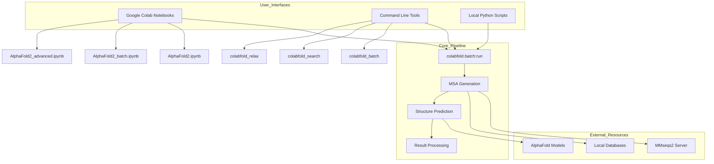
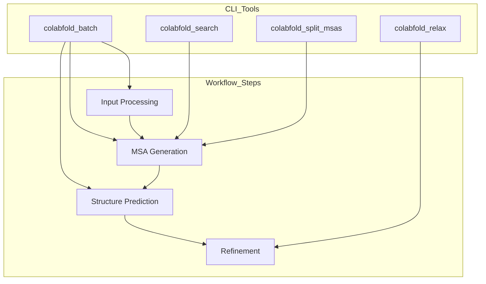
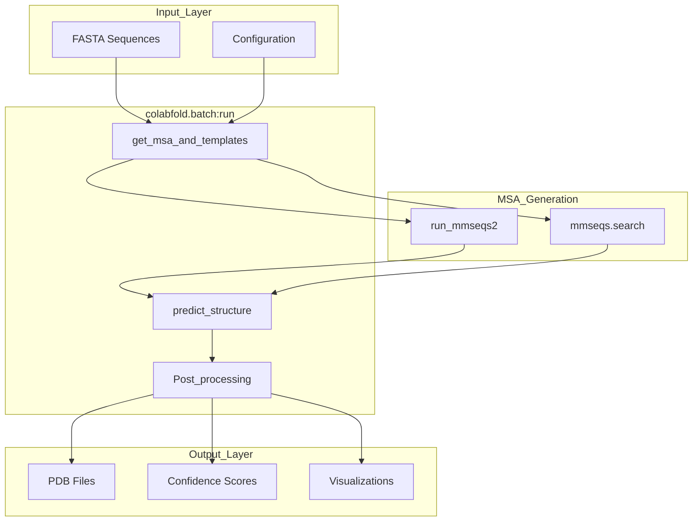
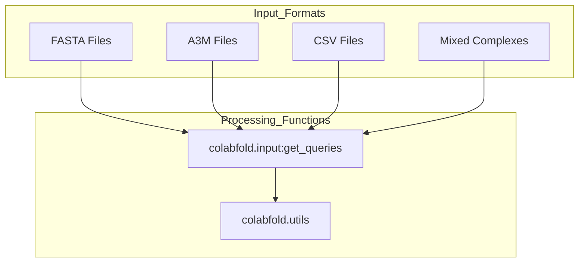

# Getting Started

# Getting Started

> **Relevant source files**
> - [README\.md](https://github.com/sokrypton/ColabFold/blob/0c788a0e/README.md?plain=1)
> - [poetry\.lock](https://github.com/sokrypton/ColabFold/blob/0c788a0e/poetry.lock)
> - [pyproject\.toml](https://github.com/sokrypton/ColabFold/blob/0c788a0e/pyproject.toml)

 This document provides an overview of ColabFold and guides you through the basic concepts needed to start predicting protein structures\. It covers the different ways to use ColabFold, fundamental workflows, and quick examples to get you running\. For detailed installation instructions, see [Installation](https://deepwiki.com/sokrypton/ColabFold/2.1-installation)\. For comprehensive usage examples, see [Basic Usage](https://deepwiki.com/sokrypton/ColabFold/2.2-basic-usage)\. For understanding the underlying architecture, see [Core Components](https://deepwiki.com/sokrypton/ColabFold/3-core-components)\.

## Overview

 ColabFold makes protein structure prediction accessible through multiple interfaces, from interactive Google Colab notebooks to command\-line tools for batch processing\. The system integrates AlphaFold2, AlphaFold2\-multimer, and other folding models with fast MSA generation using MMseqs2\. The codebase is managed via `pyproject.toml` [pyproject\.toml L1-L79](https://github.com/sokrypton/ColabFold/blob/0c788a0e/pyproject.toml#L1-L79) and provides several CLI entrypoints [pyproject\.toml L55-L59](https://github.com/sokrypton/ColabFold/blob/0c788a0e/pyproject.toml#L55-L59)

### System Architecture Overview



 **Sources:** [README\.md?plain=1 L9-L23](https://github.com/sokrypton/ColabFold/blob/0c788a0e/README.md?plain=1#L9-L23) [pyproject\.toml L55-L59](https://github.com/sokrypton/ColabFold/blob/0c788a0e/pyproject.toml#L55-L59)

## Usage Modes

 ColabFold supports three primary usage modes, each optimized for different scenarios and technical requirements\.

### Interactive Notebook Mode

 The most accessible way to use ColabFold is through Google Colab notebooks that provide a web\-based interface with GPU access [README\.md?plain=1 L9-L23](https://github.com/sokrypton/ColabFold/blob/0c788a0e/README.md?plain=1#L9-L23)

| Notebook | Use Case | Features |
| --- | --- | --- |
| AlphaFold2\.ipynb | Single sequences and complexes | MMseqs2 MSA, templates, visualization |
| AlphaFold3\_of3\.ipynb | AlphaFold3 \(OpenFold3\) | Newest model support |
| AlphaFold2\_batch\.ipynb | Multiple predictions | Batch processing, download results |
| Boltz1\.ipynb | Boltz\-1 model | Alternative structure prediction |
| ESMFold\.ipynb | Language model folding | Fast predictions without MSA |

### Command Line Mode

 For automation and integration into workflows, ColabFold provides command\-line tools defined in `pyproject.toml` [pyproject\.toml L55-L59](https://github.com/sokrypton/ColabFold/blob/0c788a0e/pyproject.toml#L55-L59)



### Local Database Mode

 For large\-scale predictions or when internet access is limited, you can run ColabFold with local databases\. Databases are available at `colabfold.mmseqs.com` [README\.md?plain=1 L37-L38](https://github.com/sokrypton/ColabFold/blob/0c788a0e/README.md?plain=1#L37-L38)

 **Sources:** [README\.md?plain=1 L9-L23](https://github.com/sokrypton/ColabFold/blob/0c788a0e/README.md?plain=1#L9-L23) [README\.md?plain=1 L68-L87](https://github.com/sokrypton/ColabFold/blob/0c788a0e/README.md?plain=1#L68-L87) [pyproject\.toml L55-L59](https://github.com/sokrypton/ColabFold/blob/0c788a0e/pyproject.toml#L55-L59)

## Basic Workflow Concepts

### Core Pipeline Components



 The central orchestration happens in `colabfold.batch:run` [pyproject\.toml L56](https://github.com/sokrypton/ColabFold/blob/0c788a0e/pyproject.toml#L56-L56) which coordinates:

 1. **MSA Generation**: Creating multiple sequence alignments using MMseqs2\.
2. **Template Search**: Finding structural templates when available\.
3. **Feature Engineering**: Preparing input features for the neural network\.
4. **Structure Prediction**: Running AlphaFold2 or other models\.
5. **Post\-processing**: Generating outputs, confidence scores, and visualizations\.

 **Sources:** [README\.md?plain=1 L9-L23](https://github.com/sokrypton/ColabFold/blob/0c788a0e/README.md?plain=1#L9-L23) [pyproject\.toml L55-L59](https://github.com/sokrypton/ColabFold/blob/0c788a0e/pyproject.toml#L55-L59)

## Quick Start Examples

### Using Google Colab \(Recommended for Beginners\)

 1. Open the [AlphaFold2 notebook](https://colab.research.google.com/github/sokrypton/ColabFold/blob/main/AlphaFold2.ipynb) [README\.md?plain=1 L11](https://github.com/sokrypton/ColabFold/blob/0c788a0e/README.md?plain=1#L11-L11)
2. Paste your protein sequence in FASTA format\.
3. Configure basic options \(model type, number of models\)\.
4. Run the prediction cells\.
5. Download results as PDB files\.

### Using Command Line Interface

 For users with ColabFold installed locally via `pip` or `conda` [README\.md?plain=1 L68-L79](https://github.com/sokrypton/ColabFold/blob/0c788a0e/README.md?plain=1#L68-L79):

```
# Basic single sequence predictioncolabfold_batch sequence.fasta output_dir/ # Batch processing multiple sequencescolabfold_batch sequences.fasta output_dir/ # Generate MSAs only (useful for large batches)colabfold_batch sequences.fasta output_dir/ --msa-only
```

### Using Local Databases

 For high\-throughput scenarios, use the local search tool [pyproject\.toml L57](https://github.com/sokrypton/ColabFold/blob/0c788a0e/pyproject.toml#L57-L57):

```python
# Generate MSAs locally using colabfold_searchcolabfold_search input.fasta /path/to/db_folder msas/ # Predict structures from generated MSAscolabfold_batch msas/ predictions/
```

 **Sources:** [README\.md?plain=1 L68-L87](https://github.com/sokrypton/ColabFold/blob/0c788a0e/README.md?plain=1#L68-L87) [pyproject\.toml L55-L59](https://github.com/sokrypton/ColabFold/blob/0c788a0e/pyproject.toml#L55-L59)

## Input and Output Formats

### Supported Input Formats



 - **FASTA**: Standard protein sequences\.
- **A3M**: Pre\-computed multiple sequence alignments\.
- **CSV**: Batch input with metadata\.
- **Complex notation**: Multiple chains separated by `:` in sequence [README\.md?plain=1 L52](https://github.com/sokrypton/ColabFold/blob/0c788a0e/README.md?plain=1#L52-L52)

### Output Files

 ColabFold generates several output files for each prediction, including PDB coordinates and confidence metrics [README\.md?plain=1 L30-L31](https://github.com/sokrypton/ColabFold/blob/0c788a0e/README.md?plain=1#L30-L31)

| File Type | Description | Contains |
| --- | --- | --- |
| \.pdb | Structure coordinates | 3D atomic coordinates \(B\-factor column holds pLDDT\) |
| \.json | Confidence metrics | pLDDT, PAE, pTM scores |
| \.png | Visualizations | Structure plots, confidence graphs |
| \_coverage\.png | MSA coverage | Sequence alignment quality |

 **Sources:** [README\.md?plain=1 L30-L31](https://github.com/sokrypton/ColabFold/blob/0c788a0e/README.md?plain=1#L30-L31) [README\.md?plain=1 L39-L50](https://github.com/sokrypton/ColabFold/blob/0c788a0e/README.md?plain=1#L39-L50)

## Next Steps

 Based on your use case, proceed to the appropriate documentation:

 - **New users**: Start with [Basic Usage](https://deepwiki.com/sokrypton/ColabFold/2.2-basic-usage) for step\-by\-step tutorials\.
- **Installation needed**: Follow [Installation](https://deepwiki.com/sokrypton/ColabFold/2.1-installation) for local setup using `pip`, `conda`, or Docker [README\.md?plain=1 L68-L87](https://github.com/sokrypton/ColabFold/blob/0c788a0e/README.md?plain=1#L68-L87)
- **Batch processing**: See [Command Line Interface](https://deepwiki.com/sokrypton/ColabFold/4-command-line-interface) for automation\.
- **Complex predictions**: Explore [Complex Prediction](https://deepwiki.com/sokrypton/ColabFold/5.2-complex-prediction) for multimers [README\.md?plain=1 L51-L52](https://github.com/sokrypton/ColabFold/blob/0c788a0e/README.md?plain=1#L51-L52)
- **Local deployment**: Check [Local Execution](https://deepwiki.com/sokrypton/ColabFold/5.1-local-execution) for database setup\.
- **Performance tuning**: Review [Performance Optimization](https://deepwiki.com/sokrypton/ColabFold/5.3-performance-optimization) for GPU acceleration\.

 For understanding the system architecture in detail, see [Core Components](https://deepwiki.com/sokrypton/ColabFold/3-core-components)\.

 **Sources:** [README\.md?plain=1 L1-L87](https://github.com/sokrypton/ColabFold/blob/0c788a0e/README.md?plain=1#L1-L87) [pyproject\.toml L1-L79](https://github.com/sokrypton/ColabFold/blob/0c788a0e/pyproject.toml#L1-L79)

---
*Source: [https://deepwiki.com/sokrypton/ColabFold/2-getting-started](https://deepwiki.com/sokrypton/ColabFold/2-getting-started) on DeepWiki*