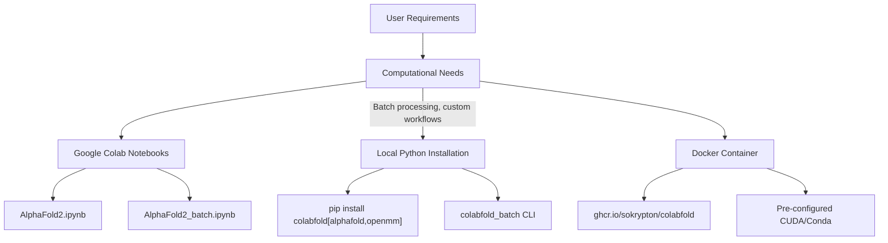
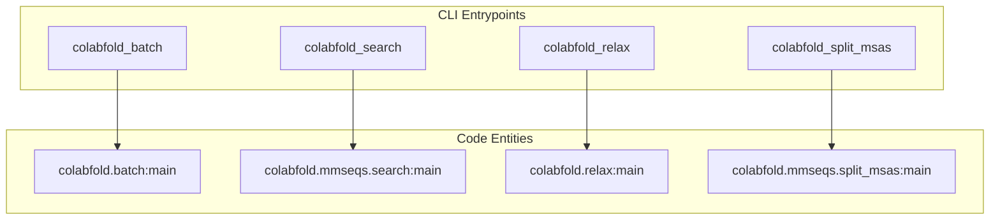

# Installation

# Installation

> **Relevant source files**
> - [\.github/workflows/docker\.yml](https://github.com/sokrypton/ColabFold/blob/0c788a0e/.github/workflows/docker.yml)
> - [Dockerfile](https://github.com/sokrypton/ColabFold/blob/0c788a0e/Dockerfile)
> - [poetry\.lock](https://github.com/sokrypton/ColabFold/blob/0c788a0e/poetry.lock)
> - [pyproject\.toml](https://github.com/sokrypton/ColabFold/blob/0c788a0e/pyproject.toml)

 This document covers the installation and setup procedures for ColabFold, a protein structure prediction toolkit\. It includes both cloud\-based usage through Google Colab notebooks and local installation options for running ColabFold on your own hardware\.

 For information about basic usage after installation, see [Basic Usage](https://deepwiki.com/sokrypton/ColabFold/2.2-basic-usage)\. For advanced local execution with databases, see [Local Execution](https://deepwiki.com/sokrypton/ColabFold/5.1-local-execution)\.

## Installation Options Overview

 ColabFold provides multiple installation and execution paths depending on your computational needs and environment:



 Sources: [pyproject\.toml L1-L60](https://github.com/sokrypton/ColabFold/blob/0c788a0e/pyproject.toml#L1-L60) [Dockerfile L28-L59](https://github.com/sokrypton/ColabFold/blob/0c788a0e/Dockerfile#L28-L59)

## Local Python Package Installation

### Prerequisites

 - **Python**: Version 3\.10 or higher is required \[pyproject\.toml:22\-22\]\.
- **Hardware**: CUDA\-compatible GPU is recommended for AlphaFold2 model inference\.

### Core Package Installation via Pip

 The installation is managed through `poetry` or `pip`\. The `pyproject.toml` defines several "extras" to manage heavy dependencies like AlphaFold and OpenMM \[pyproject\.toml:47\-50\]\.

```
# Basic installation (core utilities only)pip install colabfold # Recommended: Full installation with AlphaFold and OpenMM (for relaxation)pip install "colabfold[alphafold,openmm]" # Installation for CPU-only or external JAX managementpip install colabfold[alphafold-minus-jax]
```

### Dependency Management

 The `pyproject.toml` configuration specifies the following key dependencies and optional extras:

| Component | Version | Role |
| --- | --- | --- |
| alphafold\-colabfold | 2\.3\.18 | Patched AlphaFold v2\.3\.1 inference pipeline \[pyproject\.toml:29\-29\] |
| jax | \>=0\.5\.2, <0\.11 | High\-performance array computing \[pyproject\.toml:24\-24\] |
| biopython | <1\.86 | Sequence and PDB file handling \[pyproject\.toml:26\-26\] |
| openmm | ^8\.2\.0 | Force field simulations for structure relaxation \[pyproject\.toml:39\-39\] |
| numpy | ^2\.0\.2 | Numerical backend \[pyproject\.toml:27\-27\] |

 **Extras Definition:**

 - `alphafold`: Includes `alphafold-colabfold`, `jax`, `absl-py`, `dm-tree`, `dm-haiku`, and `py3Dmol` \[pyproject\.toml:48\-48\]\.
- `openmm`: Includes `openmm` and `pdbfixer` \[pyproject\.toml:50\-50\]\.

 Sources: [pyproject\.toml L21-L51](https://github.com/sokrypton/ColabFold/blob/0c788a0e/pyproject.toml#L21-L51) [poetry\.lock L17-L41](https://github.com/sokrypton/ColabFold/blob/0c788a0e/poetry.lock#L17-L41)

## Docker Installation

 ColabFold provides a multi\-stage Dockerfile for reproducible environments\. It utilizes a Debian\-based image with a Miniforge \(Conda\) environment \[Dockerfile:28\-45\]\.

### Docker Build Process

 The Docker image automates the installation of complex bioinformatics tools:

 1. **MMseqs2**: Downloads and extracts GPU\-optimized binaries \[Dockerfile:1\-26\]\.
2. **Conda Environment**: Installs `kalign2` \(v2\.04\) and `hhsuite` \(v3\.3\.0\) via bioconda \[Dockerfile:48\-49\]\.
3. **Python Stack**: Installs the `colabfold` package with `alphafold` and `openmm` extras, specifically targeting the requested CUDA version for JAX \[Dockerfile:55\-58\]\.

### Building and Running

 The GitHub Actions workflow automates builds for `cuda12` and `cuda13` across `amd64` and `arm64` platforms \[\.github/workflows/docker\.yml:22\-26\]\.

```
# Build locallydocker build -t colabfold --build-arg CUDA=cuda12 . # Run with GPU supportdocker run --gpus all -v $(pwd)/cache:/cache colabfold colabfold_batch input.fasta output/
```

 Sources: [Dockerfile L1-L59](https://github.com/sokrypton/ColabFold/blob/0c788a0e/Dockerfile#L1-L59) [docker\.yml L60-L69](https://github.com/sokrypton/ColabFold/blob/0c788a0e/.github/workflows/docker.yml#L60-L69)

## Code Entity Mapping: CLI Entrypoints

 When installed, the package registers several executable scripts defined in the `[tool.poetry.scripts]` section of `pyproject.toml` \[pyproject\.toml:55\-59\]\.



 Sources: [pyproject\.toml L55-L59](https://github.com/sokrypton/ColabFold/blob/0c788a0e/pyproject.toml#L55-L59)

## Configuration and Development

### Project Structure

 The project uses `poetry-core` as the build backend \[pyproject\.toml:77\-79\]\. Development dependencies include `black` for formatting and `pytest` for testing \[pyproject\.toml:42\-45\]\.

### Formatting Rules

 `black` is configured to format the `colabfold` and `tests` directories, while explicitly excluding legacy components like `colabfold/colabfold.py` \[pyproject\.toml:61\-75\]\.

 Sources: [pyproject\.toml L42-L79](https://github.com/sokrypton/ColabFold/blob/0c788a0e/pyproject.toml#L42-L79)

---
*Source: [https://deepwiki.com/sokrypton/ColabFold/2.1-installation](https://deepwiki.com/sokrypton/ColabFold/2.1-installation) on DeepWiki*