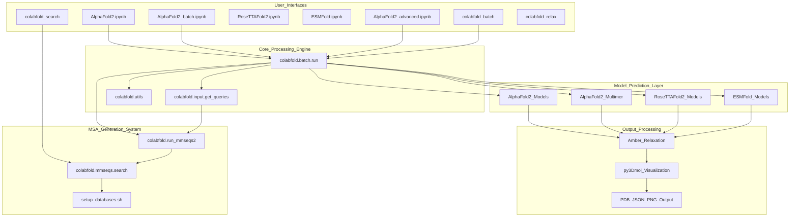
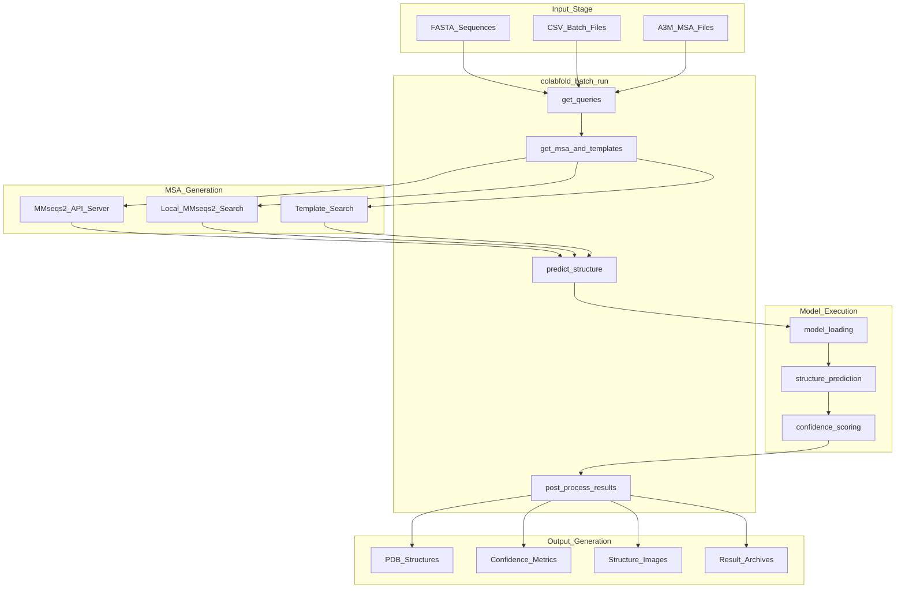
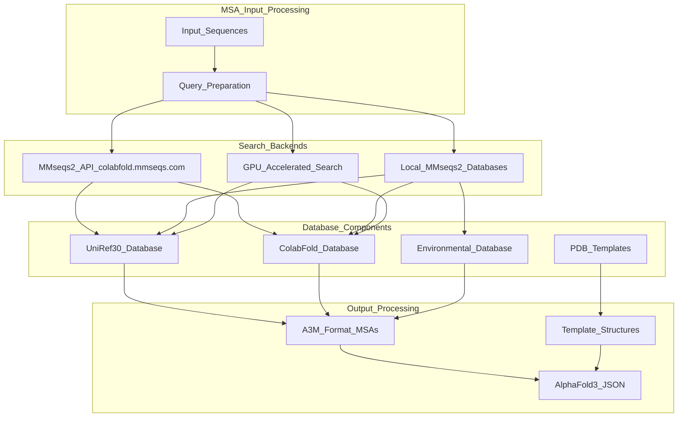

# Overview

# Overview

> **Relevant source files**
> - [README\.md](https://github.com/sokrypton/ColabFold/blob/c3e8ab01/README.md?plain=1)
> - [poetry\.lock](https://github.com/sokrypton/ColabFold/blob/c3e8ab01/poetry.lock)
> - [pyproject\.toml](https://github.com/sokrypton/ColabFold/blob/c3e8ab01/pyproject.toml)

## Purpose and Scope

 ColabFold is a comprehensive protein structure prediction system that makes advanced folding models accessible through Google Colab notebooks and command\-line interfaces\. This system provides end\-to\-end workflows for predicting protein structures using AlphaFold2, RoseTTAFold2, ESMFold, and other state\-of\-the\-art models, with integrated multiple sequence alignment \(MSA\) generation and visualization capabilities\.

 This document provides a high\-level overview of ColabFold's architecture, core components, and data flow\. For detailed installation instructions, see [Installation](https://deepwiki.com/sokrypton/ColabFold/2.1-installation)\. For specific usage patterns including batch processing and complex prediction workflows, see [Basic Usage](https://deepwiki.com/sokrypton/ColabFold/2.2-basic-usage) and [Advanced Usage](https://deepwiki.com/sokrypton/ColabFold/5-advanced-usage)\.

## System Architecture

 ColabFold operates as a multi\-layered system with three primary execution environments: interactive Google Colab notebooks, command\-line batch processing tools, and local database\-driven workflows\.

### Core Component Architecture

 **Sources:** [README\.md?plain=1 L1-L239](https://github.com/sokrypton/ColabFold/blob/c3e8ab01/README.md?plain=1#L1-L239) [pyproject\.toml L54-L58](https://github.com/sokrypton/ColabFold/blob/c3e8ab01/pyproject.toml#L54-L58)

### Data Flow and Processing Pipeline

 **Sources:** [README\.md?plain=1 L70-L131](https://github.com/sokrypton/ColabFold/blob/c3e8ab01/README.md?plain=1#L70-L131) [pyproject\.toml L21-L39](https://github.com/sokrypton/ColabFold/blob/c3e8ab01/pyproject.toml#L21-L39)

## Key Components

### Notebook Interfaces

 ColabFold provides specialized Jupyter notebooks for different prediction scenarios, each optimized for specific use cases and model types\.

| Notebook | Primary Use Case | Supported Models | MSA Method |
| --- | --- | --- | --- |
| AlphaFold2\.ipynb | Single sequences and complexes | AlphaFold2, AlphaFold2\-multimer | MMseqs2 API |
| AlphaFold2\_batch\.ipynb | High\-throughput processing | AlphaFold2, AlphaFold2\-multimer | MMseqs2 API |
| AlphaFold2\_advanced\.ipynb | Experimental features | AlphaFold2 with custom options | MMseqs2 API |
| RoseTTAFold2\.ipynb | Alternative folding model | RoseTTAFold2 | MMseqs2 API |
| ESMFold\.ipynb | Language model\-based folding | ESMFold | No MSA required |

 **Sources:** [README\.md?plain=1 L12-L26](https://github.com/sokrypton/ColabFold/blob/c3e8ab01/README.md?plain=1#L12-L26)

### Command Line Interface

 The system exposes four primary command\-line tools for programmatic access and automation:

 - `colabfold_batch`: Main pipeline orchestrator for structure prediction workflows
- `colabfold_search`: MSA generation using local MMseqs2 databases
- `colabfold_split_msas`: MSA file processing and manipulation utilities
- `colabfold_relax`: Structure refinement using Amber molecular dynamics

 **Sources:** [pyproject\.toml L54-L58](https://github.com/sokrypton/ColabFold/blob/c3e8ab01/pyproject.toml#L54-L58) [README\.md?plain=1 L70-L98](https://github.com/sokrypton/ColabFold/blob/c3e8ab01/README.md?plain=1#L70-L98)

### MSA Generation System

 **Sources:** [README\.md?plain=1 L38-L41](https://github.com/sokrypton/ColabFold/blob/c3e8ab01/README.md?plain=1#L38-L41) [README\.md?plain=1 L83-L204](https://github.com/sokrypton/ColabFold/blob/c3e8ab01/README.md?plain=1#L83-L204)

## Execution Environments

### Google Colab Integration

 ColabFold leverages Google Colab's cloud infrastructure to provide GPU/TPU access without local installation requirements\. The notebook interfaces handle dependency management, model downloading, and result visualization automatically\.

### Local Installation Options

 For high\-throughput or private data processing, ColabFold supports local execution through:

 - **LocalColabFold**: Standalone installer for Windows, macOS, and Linux systems
- **Docker containers**: Containerized deployment for reproducible environments
- **Direct pip installation**: Python package installation with manual dependency management

 **Sources:** [README\.md?plain=1 L56-L57](https://github.com/sokrypton/ColabFold/blob/c3e8ab01/README.md?plain=1#L56-L57) [README\.md?plain=1 L65-L66](https://github.com/sokrypton/ColabFold/blob/c3e8ab01/README.md?plain=1#L65-L66)

### Database Management

 Large\-scale local deployments require database setup using `setup_databases.sh`, which downloads and configures:

 - UniRef30 \(930GB\): Primary sequence database
- ColabFold Database: Curated protein sequences
- Environmental Database: Metagenomic sequences
- PDB Templates: Structure templates for homology modeling

 **Sources:** [README\.md?plain=1 L83-L112](https://github.com/sokrypton/ColabFold/blob/c3e8ab01/README.md?plain=1#L83-L112)

## Input and Output Formats

### Supported Input Formats

 - **FASTA**: Single or multiple protein sequences
- **CSV**: Batch processing with metadata
- **A3M**: Pre\-computed multiple sequence alignments
- **Complex notation**: Protein complexes using `:` separator
- **AlphaFold3 extensions**: Non\-protein molecules \(DNA, RNA, ligands\) using `molecule_type|sequence|copies` format

### Generated Outputs

 - **PDB files**: 3D structure coordinates
- **JSON files**: Confidence metrics \(pLDDT, PAE, pTM scores\)
- **PNG images**: Structure visualizations and confidence plots
- **ZIP archives**: Complete result packages
- **AlphaFold3 JSON**: Compatible input for AlphaFold3 server

 **Sources:** [README\.md?plain=1 L114-L155](https://github.com/sokrypton/ColabFold/blob/c3e8ab01/README.md?plain=1#L114-L155)

## Integration with External Systems

 ColabFold integrates with multiple external tools and databases:

 - **MMseqs2**: Sequence search and MSA generation
- **AlphaFold models**: DeepMind's trained neural networks
- **Amber/OpenMM**: Molecular dynamics for structure refinement
- **py3Dmol**: Interactive 3D structure visualization
- **BioPython**: Sequence and structure data handling

 The system abstracts these dependencies through standardized interfaces, allowing users to focus on biological questions rather than technical implementation details\.

 **Sources:** [pyproject\.toml L21-L39](https://github.com/sokrypton/ColabFold/blob/c3e8ab01/pyproject.toml#L21-L39) [README\.md?plain=1 L219-L222](https://github.com/sokrypton/ColabFold/blob/c3e8ab01/README.md?plain=1#L219-L222)

---
*Source: [https://deepwiki.com/sokrypton/ColabFold/1-overview](https://deepwiki.com/sokrypton/ColabFold/1-overview) on DeepWiki*