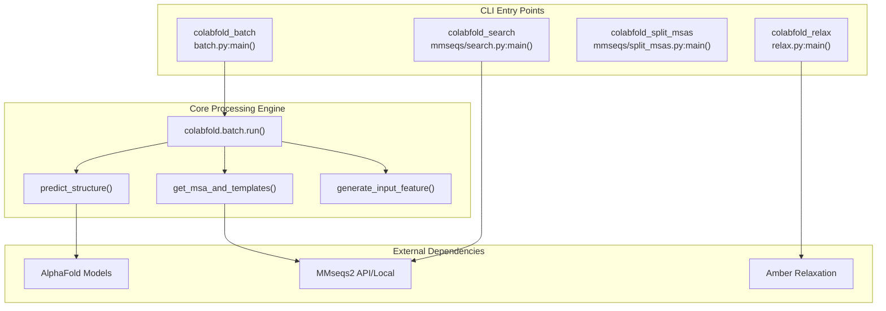
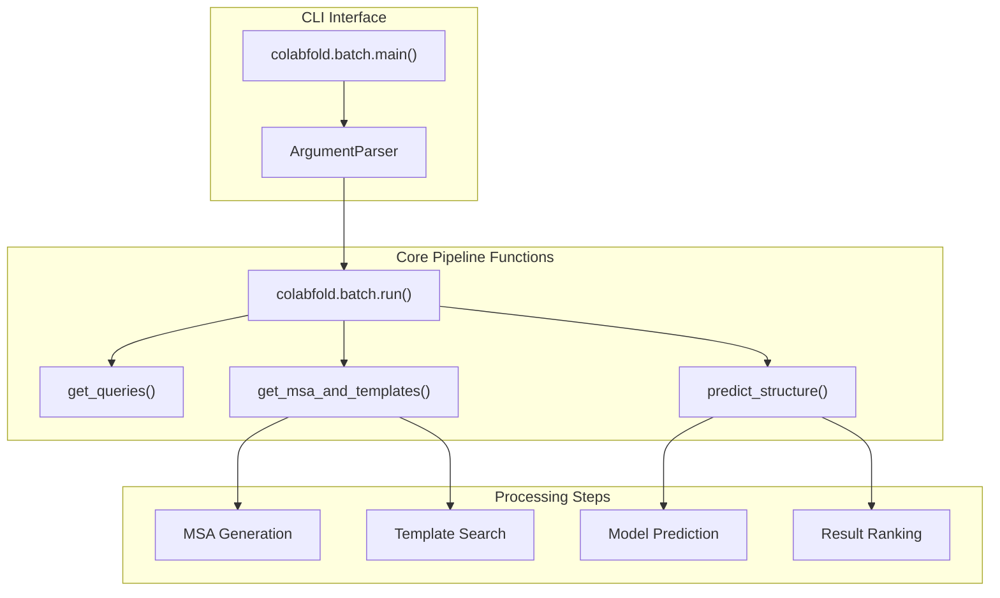

# Command Line Interface

> **Relevant source files**
> * [README.md](https://github.com/sokrypton/ColabFold/blob/0c788a0e/README.md?plain=1)
> * [colabfold/alphafold/msa.py](https://github.com/sokrypton/ColabFold/blob/0c788a0e/colabfold/alphafold/msa.py)
> * [colabfold/batch.py](https://github.com/sokrypton/ColabFold/blob/0c788a0e/colabfold/batch.py)
> * [colabfold/mmseqs/search.py](https://github.com/sokrypton/ColabFold/blob/0c788a0e/colabfold/mmseqs/search.py)
> * [colabfold/mmseqs/split_msas.py](https://github.com/sokrypton/ColabFold/blob/0c788a0e/colabfold/mmseqs/split_msas.py)
> * [colabfold/relax.py](https://github.com/sokrypton/ColabFold/blob/0c788a0e/colabfold/relax.py)

This page covers ColabFold's command line interface tools for batch processing and automation of protein structure prediction workflows. The CLI provides programmatic access to ColabFold's core functionality without requiring interactive notebooks.

For information about the core batch processing system that powers these CLI tools, see [Batch Processing System](/sokrypton/ColabFold/3.1-batch-processing-system). For interactive usage through Google Colab notebooks, see [Notebook Interfaces](/sokrypton/ColabFold/3.2-notebook-interfaces).

## Overview

ColabFold provides four main command line tools for different aspects of the protein folding pipeline:

| Command | Purpose | Entry Point |
| --- | --- | --- |
| `colabfold_batch` | Main structure prediction pipeline | `colabfold.batch:main` |
| `colabfold_search` | MSA generation using MMseqs2 | `colabfold.mmseqs.search:main` |
| `colabfold_split_msas` | MSA file processing utilities | `colabfold.mmseqs.split_msas:main` |
| `colabfold_relax` | Structure relaxation using Amber | `colabfold.relax:main` |

Sources: [pyproject.toml L54-L58](https://github.com/sokrypton/ColabFold/blob/0c788a0e/pyproject.toml#L54-L58)

## CLI Architecture Overview

The CLI tools are registered as entry points in the package configuration and map directly to specific module `main()` functions.

Sources: [pyproject.toml L54-L58](https://github.com/sokrypton/ColabFold/blob/0c788a0e/pyproject.toml#L54-L58)

 [colabfold/batch.py L1031-L1080](https://github.com/sokrypton/ColabFold/blob/0c788a0e/colabfold/batch.py#L1031-L1080)

 [colabfold/mmseqs/search.py L12-L14](https://github.com/sokrypton/ColabFold/blob/0c788a0e/colabfold/mmseqs/search.py#L12-L14)

 [colabfold/relax.py L33-L75](https://github.com/sokrypton/ColabFold/blob/0c788a0e/colabfold/relax.py#L33-L75)

## Primary Command: colabfold_batch

The `colabfold_batch` command is the main entry point for protein structure prediction, orchestrating the complete pipeline from input sequences to predicted structures. It handles JAX memory management by setting environment variables `TF_FORCE_UNIFIED_MEMORY="1"` and `XLA_PYTHON_CLIENT_MEM_FRACTION="4.0"` at the start of execution [colabfold/batch.py L4-L6](https://github.com/sokrypton/ColabFold/blob/0c788a0e/colabfold/batch.py#L4-L6)

### Core Function Mapping

Sources: [colabfold/batch.py L1031-L1303](https://github.com/sokrypton/ColabFold/blob/0c788a0e/colabfold/batch.py#L1031-L1303)

 [colabfold/batch.py L558-L706](https://github.com/sokrypton/ColabFold/blob/0c788a0e/colabfold/batch.py#L558-L706)

 [colabfold/batch.py L313-L556](https://github.com/sokrypton/ColabFold/blob/0c788a0e/colabfold/batch.py#L313-L556)

### Key Parameters and Configuration

The `run()` function accepts numerous parameters that control the prediction pipeline:

| Parameter Category | Key Options | Default Values |
| --- | --- | --- |
| **Model Selection** | `model_type`, `num_models` | `"auto"`, `5` |
| **MSA Generation** | `msa_mode`, `pair_mode`, `use_templates` | `"mmseqs2_uniref_env"`, `"unpaired_paired"`, `False` |
| **Prediction Control** | `num_recycles`, `num_seeds` | `None`, `1` |
| **Structure Refinement** | `num_relax`, `relax_max_iterations` | `0`, `2000` |
| **Performance** | `use_pallas`, `use_dropout` | `True`, `False` |

Sources: [colabfold/batch.py L1031-L1080](https://github.com/sokrypton/ColabFold/blob/0c788a0e/colabfold/batch.py#L1031-L1080)

 [colabfold/relax.py L49](https://github.com/sokrypton/ColabFold/blob/0c788a0e/colabfold/relax.py#L49-L49)

## MSA Search Command: colabfold_search

The `colabfold_search` command provides standalone MSA generation capabilities using local MMseqs2 databases. It supports monomer searches (`mmseqs_search_monomer`) and complex/pairing searches (`mmseqs_search_pair`) [colabfold/mmseqs/search.py L50-L160](https://github.com/sokrypton/ColabFold/blob/0c788a0e/colabfold/mmseqs/search.py#L50-L160)

### Local Search Configuration

The tool uses several database components:

* **UniRef30**: Primary sequence database [colabfold/mmseqs/search.py L53](https://github.com/sokrypton/ColabFold/blob/0c788a0e/colabfold/mmseqs/search.py#L53-L53)
* **ColabFold EnvDB**: Metagenomic database for increased alignment depth [colabfold/mmseqs/search.py L55](https://github.com/sokrypton/ColabFold/blob/0c788a0e/colabfold/mmseqs/search.py#L55-L55)
* **PDB70**: Used for template search if `use_templates` is enabled [colabfold/mmseqs/search.py L87](https://github.com/sokrypton/ColabFold/blob/0c788a0e/colabfold/mmseqs/search.py#L87-L87)

Sources: [colabfold/mmseqs/search.py L50-L91](https://github.com/sokrypton/ColabFold/blob/0c788a0e/colabfold/mmseqs/search.py#L50-L91)

## MSA Processing: colabfold_split_msas

The `colabfold_split_msas` command handles the output of `colabfold_search`. When running batch searches, MMseqs2 may produce merged A3M files where MSAs are separated by null characters (`\0`). This utility splits them into individual files named after the query sequence [colabfold/mmseqs/split_msas.py L14-L32](https://github.com/sokrypton/ColabFold/blob/0c788a0e/colabfold/mmseqs/split_msas.py#L14-L32)

### Workflow

1. Read merged `final.a3m` file.
2. Detect null separators.
3. Extract sequence headers to generate safe filenames.
4. Write individual `.a3m` files to the output directory.

Sources: [colabfold/mmseqs/split_msas.py L14-L52](https://github.com/sokrypton/ColabFold/blob/0c788a0e/colabfold/mmseqs/split_msas.py#L14-L52)

## Structure Relaxation: colabfold_relax

The `colabfold_relax` command provides standalone structure refinement using `alphafold.relax.relax.AmberRelaxation` [colabfold/relax.py L21-L28](https://github.com/sokrypton/ColabFold/blob/0c788a0e/colabfold/relax.py#L21-L28)

### Key Parameters

* **`--max-iterations`**: Maximum iterations for OpenMM minimizer (Default: 2000) [colabfold/relax.py L49](https://github.com/sokrypton/ColabFold/blob/0c788a0e/colabfold/relax.py#L49-L49)
* **`--tolerance`**: Energy convergence tolerance in kJ/mol (Default: 2.39) [colabfold/relax.py L55](https://github.com/sokrypton/ColabFold/blob/0c788a0e/colabfold/relax.py#L55-L55)
* **`--stiffness`**: Force constant for position restraints (Default: 10.0) [colabfold/relax.py L62](https://github.com/sokrypton/ColabFold/blob/0c788a0e/colabfold/relax.py#L62-L62)
* **`--use-gpu`**: Enables CUDA acceleration for the Amber potential [colabfold/relax.py L73](https://github.com/sokrypton/ColabFold/blob/0c788a0e/colabfold/relax.py#L73-L73)

Sources: [colabfold/relax.py L39-L75](https://github.com/sokrypton/ColabFold/blob/0c788a0e/colabfold/relax.py#L39-L75)

## Error Handling and Device Detection

ColabFold CLI performs several environment checks before starting:

1. **AlphaFold Installation**: Checks if `alphafold` is in the path, raising a `RuntimeError` with installation instructions if missing [colabfold/batch.py L37-L41](https://github.com/sokrypton/ColabFold/blob/0c788a0e/colabfold/batch.py#L37-L41)
2. **GPU Availability**: Uses `jax.local_devices()` to detect accelerators. If no GPU is found, it issues a warning via `NO_GPU_FOUND` [colabfold/batch.py L1088-L1093](https://github.com/sokrypton/ColabFold/blob/0c788a0e/colabfold/batch.py#L1088-L1093)
3. **mmCIF Validation**: For template usage, it validates the presence of required fields like `_entity_poly_seq.mon_id` and adds missing revision dates to ensure compatibility with AlphaFold's template parser [colabfold/batch.py L172-L193](https://github.com/sokrypton/ColabFold/blob/0c788a0e/colabfold/batch.py#L172-L193)

Sources: [colabfold/batch.py L37-L41](https://github.com/sokrypton/ColabFold/blob/0c788a0e/colabfold/batch.py#L37-L41)

 [colabfold/batch.py L1081-L1100](https://github.com/sokrypton/ColabFold/blob/0c788a0e/colabfold/batch.py#L1081-L1100)

 [colabfold/batch.py L172-L193](https://github.com/sokrypton/ColabFold/blob/0c788a0e/colabfold/batch.py#L172-L193)