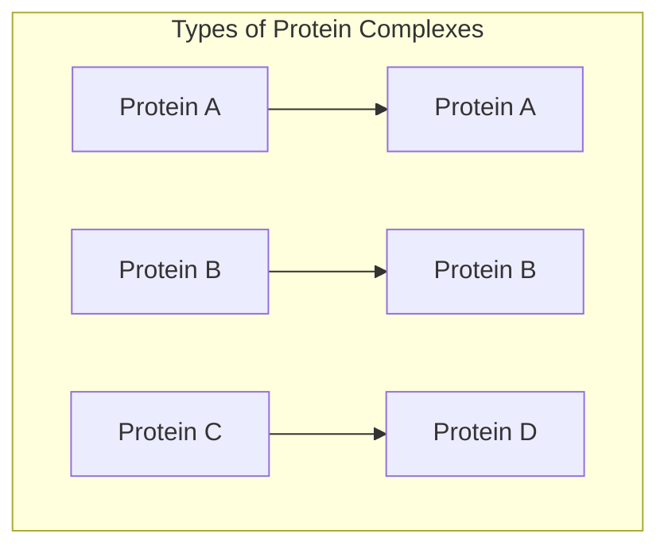
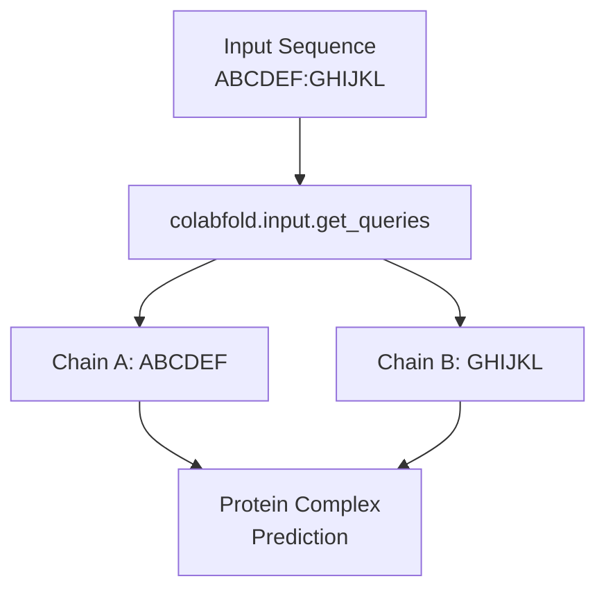
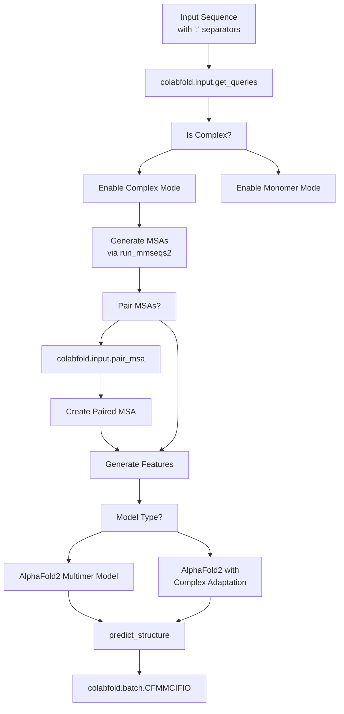
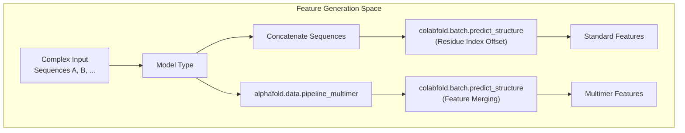

# Complex Prediction

> **Relevant source files**
> * [.gitignore](https://github.com/sokrypton/ColabFold/blob/0c788a0e/.gitignore)
> * [AlphaFold3_of3.ipynb](https://github.com/sokrypton/ColabFold/blob/0c788a0e/AlphaFold3_of3.ipynb)
> * [beta/AlphaFold2_advanced.ipynb](https://github.com/sokrypton/ColabFold/blob/0c788a0e/beta/AlphaFold2_advanced.ipynb)
> * [beta/alphafold_output_at_each_recycle.ipynb](https://github.com/sokrypton/ColabFold/blob/0c788a0e/beta/alphafold_output_at_each_recycle.ipynb)
> * [beta/colabfold.py](https://github.com/sokrypton/ColabFold/blob/0c788a0e/beta/colabfold.py)
> * [colabfold/__init__.py](https://github.com/sokrypton/ColabFold/blob/0c788a0e/colabfold/__init__.py)
> * [colabfold/batch.py](https://github.com/sokrypton/ColabFold/blob/0c788a0e/colabfold/batch.py)

This document covers how to use ColabFold to predict the three-dimensional structures of protein complexes (multiple interacting proteins). ColabFold provides efficient ways to model both homooligomeric assemblies (multiple copies of the same protein) and heteromeric complexes (different proteins interacting together), utilizing AlphaFold-Multimer and AlphaFold3-based logic.

For information about single protein prediction, see [Basic Usage](/sokrypton/ColabFold/2.2-basic-usage).

## Understanding Protein Complexes

In biological systems, proteins rarely function in isolation. Many proteins form stable complexes with copies of themselves (homo-oligomers) or with other proteins (hetero-oligomers). Predicting the structure of these complexes is crucial for understanding protein function, interactions, and developing therapeutics.

ColabFold supports prediction of:

1. **Homo-oligomers** - Assemblies of multiple copies of the same protein (e.g., dimers, trimers, tetramers).
2. **Hetero-oligomers** - Complexes composed of different protein chains.
3. **Mixed complexes** - Combinations of homo-oligomers and hetero-oligomers.
4. **Advanced Complexes** - Protein-ligand, protein-nucleic acid (DNA/RNA) interactions via AlphaFold3/OpenFold3 integration [AlphaFold3_of3.ipynb L20-L33](https://github.com/sokrypton/ColabFold/blob/0c788a0e/AlphaFold3_of3.ipynb#L20-L33)

Sources: [colabfold/batch.py L784-L803](https://github.com/sokrypton/ColabFold/blob/0c788a0e/colabfold/batch.py#L784-L803)

 [AlphaFold3_of3.ipynb L20-L33](https://github.com/sokrypton/ColabFold/blob/0c788a0e/AlphaFold3_of3.ipynb#L20-L33)

## Specifying Complexes in ColabFold

### Input Format

To specify a protein complex in ColabFold, use the colon character (`:`) as a chain separator in your input sequence. Each segment separated by a colon will be treated as a distinct protein chain.

For example:

* `ABCDEF:GHIJKL` - A complex of two different proteins (hetero-dimer).
* `ABCDEF:ABCDEF` - A complex of two identical proteins (homo-dimer).

Sources: [colabfold/batch.py L784-L803](https://github.com/sokrypton/ColabFold/blob/0c788a0e/colabfold/batch.py#L784-L803)

 [colabfold/input.py L76](https://github.com/sokrypton/ColabFold/blob/0c788a0e/colabfold/input.py#L76-L76)

### Homooligomer Specification

For homooligomeric assemblies, you can simplify the input by specifying the protein sequence once and indicating the number of copies. In the notebooks, this is handled through the `homooligomer` parameter.

Examples of complex specifications:

1. **Homodimer**: Enter sequence once and set `homooligomer` to "2".
2. **Heterodimer**: Enter sequences separated by colon "ABCDEF:GHIJKL" and set `homooligomer` to "1".
3. **Mixed complex**: (e.g., 2 copies of protein A and 3 copies of protein B): Enter sequences separated by colon "ABCDEF:GHIJKL" and set `homooligomer` to "2:3".

Sources: [colabfold/batch.py L793-L797](https://github.com/sokrypton/ColabFold/blob/0c788a0e/colabfold/batch.py#L793-L797)

 [beta/AlphaFold2_advanced.ipynb L188-L194](https://github.com/sokrypton/ColabFold/blob/0c788a0e/beta/AlphaFold2_advanced.ipynb#L188-L194)

## Complex Prediction Pipeline

The overall workflow for predicting protein complexes involves specialized steps for MSA pairing and feature merging.

Sources: [colabfold/batch.py L328-L383](https://github.com/sokrypton/ColabFold/blob/0c788a0e/colabfold/batch.py#L328-L383)

 [colabfold/batch.py L560-L701](https://github.com/sokrypton/ColabFold/blob/0c788a0e/colabfold/batch.py#L560-L701)

 [colabfold/input.py L74](https://github.com/sokrypton/ColabFold/blob/0c788a0e/colabfold/input.py#L74-L74)

## MSA Generation and Pairing Strategies

### MSA Modes

1. **Unpaired MSAs (Default)**: Generate separate MSAs for each protein chain independently.
2. **Paired MSAs**: Attempt to find sequences where all components of the complex are present in the same organism using taxonomy IDs.
3. **Combined Approach (unpaired_paired)**: Use both paired and unpaired MSAs to maximize co-evolutionary signals.

Sources: [colabfold/batch.py L560-L701](https://github.com/sokrypton/ColabFold/blob/0c788a0e/colabfold/batch.py#L560-L701)

 [colabfold/input.py L74](https://github.com/sokrypton/ColabFold/blob/0c788a0e/colabfold/input.py#L74-L74)

### Pairing Strategy Implementation

When generating paired MSAs, ColabFold utilizes `colabfold.input.pair_msa` [colabfold/input.py L74](https://github.com/sokrypton/ColabFold/blob/0c788a0e/colabfold/input.py#L74-L74)

 which implements strategies to match sequences across chains:

1. **Greedy Pairing**: Pair any taxonomically matching subsets of sequences.
2. **Complete Pairing**: Require all sequences in a multi-chain query to match taxonomically.

Sources: [colabfold/batch.py L667-L691](https://github.com/sokrypton/ColabFold/blob/0c788a0e/colabfold/batch.py#L667-L691)

 [colabfold/input.py L74](https://github.com/sokrypton/ColabFold/blob/0c788a0e/colabfold/input.py#L74-L74)

## Model Selection for Complex Prediction

ColabFold supports different AlphaFold model variants:

1. **alphafold2_multimer_v1, v2, v3**: Specialized models trained specifically for protein complexes. Recommended for complex prediction.
2. **alphafold2_ptm**: Standard AlphaFold model adapted for complexes by inserting chain breaks.
3. **AlphaFold3 / OpenFold3**: Next-generation model supporting ligands and nucleic acids [AlphaFold3_of3.ipynb L20-L33](https://github.com/sokrypton/ColabFold/blob/0c788a0e/AlphaFold3_of3.ipynb#L20-L33)

When "auto" is selected as the model type, ColabFold automatically chooses `alphafold2_multimer_v3` for complex prediction [colabfold/batch.py L782-L870](https://github.com/sokrypton/ColabFold/blob/0c788a0e/colabfold/batch.py#L782-L870)

Sources: [colabfold/batch.py L782-L870](https://github.com/sokrypton/ColabFold/blob/0c788a0e/colabfold/batch.py#L782-L870)

 [AlphaFold3_of3.ipynb L20-L33](https://github.com/sokrypton/ColabFold/blob/0c788a0e/AlphaFold3_of3.ipynb#L20-L33)

## Implementation Details

### Feature Generation for Complexes

ColabFold handles the transition from monomer features to multimer features using `alphafold.data.pipeline_multimer`.

1. **Standard AlphaFold (alphafold2_ptm)**: * Concatenates all sequences into a single sequence. * Adjusts `residue_index` to maintain chain information (adding a large offset between chains) [colabfold/batch.py L835-L867](https://github.com/sokrypton/ColabFold/blob/0c788a0e/colabfold/batch.py#L835-L867) * Sets `asym_id` to distinguish chains.
2. **AlphaFold Multimer**: * Processes each chain separately using `pipeline_multimer.convert_monomer_features`. * Combines features across chains using `pipeline_multimer.add_assembly_features` [colabfold/batch.py L710-L785](https://github.com/sokrypton/ColabFold/blob/0c788a0e/colabfold/batch.py#L710-L785)

Sources: [colabfold/batch.py L710-L785](https://github.com/sokrypton/ColabFold/blob/0c788a0e/colabfold/batch.py#L710-L785)

 [colabfold/batch.py L835-L867](https://github.com/sokrypton/ColabFold/blob/0c788a0e/colabfold/batch.py#L835-L867)

### AlphaFold3 JSON Generation

For AlphaFold3 scenarios, ColabFold provides `AF3Utils.generate_af3_input` to convert queries into the JSON format required by the AF3/OF3 pipeline, including handling of ligands and modifications [colabfold/batch.py L71](https://github.com/sokrypton/ColabFold/blob/0c788a0e/colabfold/batch.py#L71-L71)

Sources: [colabfold/batch.py L71](https://github.com/sokrypton/ColabFold/blob/0c788a0e/colabfold/batch.py#L71-L71)

 [AlphaFold3_of3.ipynb L130-L150](https://github.com/sokrypton/ColabFold/blob/0c788a0e/AlphaFold3_of3.ipynb#L130-L150)

## Ranking and Analysis

For complex predictions, ColabFold generates confidence metrics specialized for multi-chain structures:

1. **pLDDT**: Per-residue confidence.
2. **pTM-score**: Overall model quality.
3. **ipTM**: Interface predicted TM-score (Confidence in the predicted interfaces between chains) [colabfold/batch.py L435-L458](https://github.com/sokrypton/ColabFold/blob/0c788a0e/colabfold/batch.py#L435-L458)
4. **extra_ptm**: Additional interface analysis matrices (e.g., `actifpTM`) [colabfold/alphafold.py L82](https://github.com/sokrypton/ColabFold/blob/0c788a0e/colabfold/alphafold.py#L82-L82)

By default, ColabFold ranks complex predictions by a weighted combination of `pTM` and `ipTM` (typically `0.2*pTM + 0.8*ipTM`) [colabfold/batch.py L497-L505](https://github.com/sokrypton/ColabFold/blob/0c788a0e/colabfold/batch.py#L497-L505)

Sources: [colabfold/batch.py L435-L458](https://github.com/sokrypton/ColabFold/blob/0c788a0e/colabfold/batch.py#L435-L458)

 [colabfold/batch.py L497-L505](https://github.com/sokrypton/ColabFold/blob/0c788a0e/colabfold/batch.py#L497-L505)

 [colabfold/alphafold.py L82](https://github.com/sokrypton/ColabFold/blob/0c788a0e/colabfold/alphafold.py#L82-L82)

## Limitations and Best Practices

1. **Size limitations**: Total sequence length (sum of all chains) should typically be under 1400 residues for standard Google Colab GPUs.
2. **Interface confidence**: Low `ipTM` scores (<0.3) suggest the interface may not be reliable.
3. **MSA depth**: Complex prediction benefits from "unpaired_paired" MSA mode to maximize evolutionary signals.
4. **Recycle parameters**: Complex prediction often benefits from more recycles (e.g., `num_recycles=20`).

Sources: [beta/AlphaFold2_advanced.ipynb L45-L50](https://github.com/sokrypton/ColabFold/blob/0c788a0e/beta/AlphaFold2_advanced.ipynb#L45-L50)

 [colabfold/batch.py L328-L383](https://github.com/sokrypton/ColabFold/blob/0c788a0e/colabfold/batch.py#L328-L383)