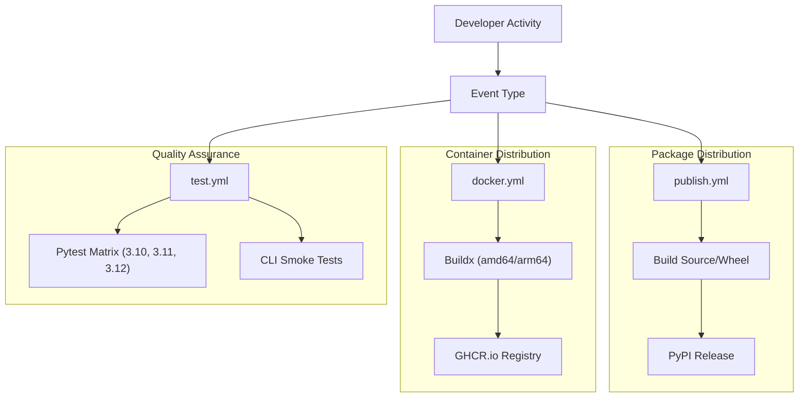
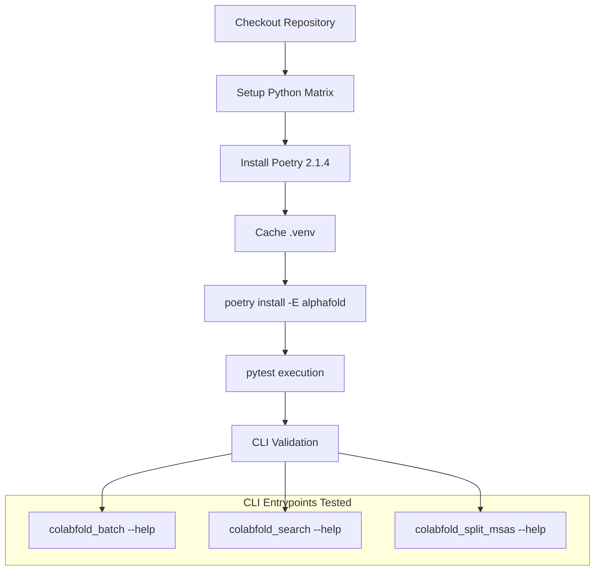
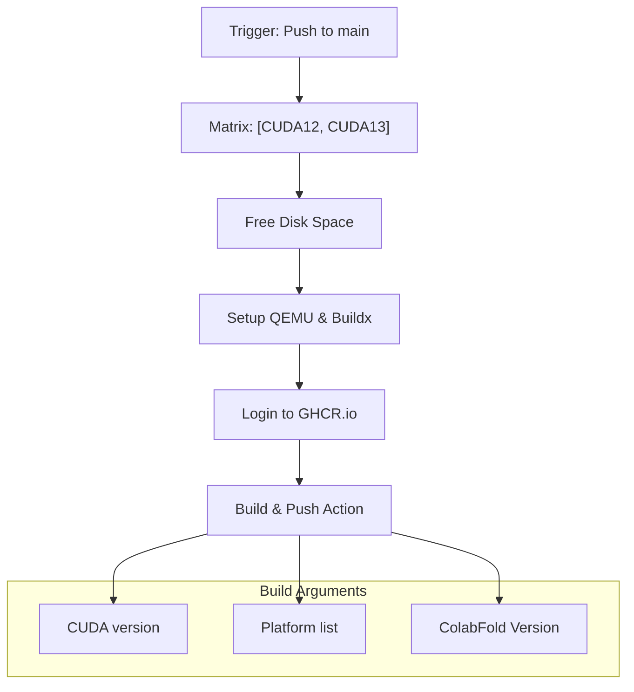

# Continuous Integration

> **Relevant source files**
> * [.github/workflows/docker.yml](https://github.com/sokrypton/ColabFold/blob/0c788a0e/.github/workflows/docker.yml)
> * [.github/workflows/publish.yml](https://github.com/sokrypton/ColabFold/blob/0c788a0e/.github/workflows/publish.yml)
> * [.github/workflows/test.yml](https://github.com/sokrypton/ColabFold/blob/0c788a0e/.github/workflows/test.yml)
> * [Dockerfile](https://github.com/sokrypton/ColabFold/blob/0c788a0e/Dockerfile)

This document describes the Continuous Integration (CI) and Continuous Deployment (CD) pipelines implemented for the ColabFold project. It covers automated testing, Docker image builds, and PyPI release processes that maintain code quality and facilitate distribution across different platforms.

## Overview of CI/CD System

ColabFold utilizes GitHub Actions to automate lifecycle management. The system is composed of three primary workflows targeting different distribution channels and quality gates.

### GitHub Actions Workflow Architecture

### Workflow Triggers and Jobs

| Workflow File | Job Name | Trigger Events | Purpose |
| --- | --- | --- | --- |
| `test.yml` | `run-tests` | push/PR to main | Unit testing and CLI validation across Python versions. |
| `docker.yml` | `build-and-push-image` | push to main, workflow_dispatch | Multi-arch Docker image builds for CUDA environments. |
| `publish.yml` | `release-pypi` | push tags `v*.*.*` | Automated PyPI package distribution. |

Sources: [.github/workflows/test.yml L3-L9](https://github.com/sokrypton/ColabFold/blob/0c788a0e/.github/workflows/test.yml#L3-L9)

 [.github/workflows/docker.yml L3-L13](https://github.com/sokrypton/ColabFold/blob/0c788a0e/.github/workflows/docker.yml#L3-L13)

 [.github/workflows/publish.yml L3-L7](https://github.com/sokrypton/ColabFold/blob/0c788a0e/.github/workflows/publish.yml#L3-L7)

## Test Workflow

The test workflow ensures compatibility with modern Python environments and validates the core CLI entry points.

### Test Workflow Implementation

The `run-tests` job utilizes a matrix strategy to verify the codebase against Python 3.10, 3.11, and 3.12.

### Configuration Details

| Step | Configuration | Purpose |
| --- | --- | --- |
| Python Versions | `3.10, 3.11, 3.12` | Ensures compatibility with current stable releases [.github/workflows/test.yml L16](https://github.com/sokrypton/ColabFold/blob/0c788a0e/.github/workflows/test.yml#L16-L16) |
| Poetry | `version 2.1.4` | Enforces reproducible builds [.github/workflows/test.yml L25](https://github.com/sokrypton/ColabFold/blob/0c788a0e/.github/workflows/test.yml#L25-L25) |
| Extras | `-E alphafold` | Includes AlphaFold-specific dependencies for testing [.github/workflows/test.yml L32](https://github.com/sokrypton/ColabFold/blob/0c788a0e/.github/workflows/test.yml#L32-L32) |
| CLI Tests | `--help` checks | Ensures entry points are correctly registered [.github/workflows/test.yml L35-L39](https://github.com/sokrypton/ColabFold/blob/0c788a0e/.github/workflows/test.yml#L35-L39) |

Sources: [.github/workflows/test.yml L11-L40](https://github.com/sokrypton/ColabFold/blob/0c788a0e/.github/workflows/test.yml#L11-L40)

## Docker Build Workflow

The `docker.yml` workflow automates the creation of high-performance containers suitable for GPU-accelerated protein folding.

### Multi-Architecture Build Strategy

The workflow builds images for both `linux/amd64` and `linux/arm64` (for CUDA 13) to support diverse hardware environments.

### Dockerfile Implementation Details

The `Dockerfile` uses a multi-stage build process to optimize image size and handle binary dependencies:

1. **Downloader Stage**: Fetches architecture-specific MMseqs2 binaries based on `TARGETARCH` [Dockerfile L4-L14](https://github.com/sokrypton/ColabFold/blob/0c788a0e/Dockerfile#L4-L14)
2. **Builder Stage**: Extracts and prepares binaries [Dockerfile L16-L26](https://github.com/sokrypton/ColabFold/blob/0c788a0e/Dockerfile#L16-L26)
3. **Final Stage**: * Installs Miniforge and Conda dependencies (`kalign2`, `hhsuite`) [Dockerfile L43-L50](https://github.com/sokrypton/ColabFold/blob/0c788a0e/Dockerfile#L43-L50) * Installs ColabFold with `alphafold` and `openmm` extras [Dockerfile L55-L56](https://github.com/sokrypton/ColabFold/blob/0c788a0e/Dockerfile#L55-L56) * Configures JAX and OpenMM for the specific `CUDA` version provided during build [Dockerfile L57-L58](https://github.com/sokrypton/ColabFold/blob/0c788a0e/Dockerfile#L57-L58)

Sources: [.github/workflows/docker.yml L22-L26](https://github.com/sokrypton/ColabFold/blob/0c788a0e/.github/workflows/docker.yml#L22-L26)

 [Dockerfile L1-L59](https://github.com/sokrypton/ColabFold/blob/0c788a0e/Dockerfile#L1-L59)

## Publish Workflow

The `publish.yml` workflow handles the automated release of ColabFold to the Python Package Index (PyPI).

### Release Implementation

The workflow is triggered by tags following the `v*.*.*` pattern.

| Step | Command | Description |
| --- | --- | --- |
| Tooling | `pip install -U pip build twine` | Prepares the standard Python build environment [.github/workflows/publish.yml L19](https://github.com/sokrypton/ColabFold/blob/0c788a0e/.github/workflows/publish.yml#L19-L19) |
| Build | `python -m build --sdist --wheel` | Generates source distribution and wheel artifacts [.github/workflows/publish.yml L21](https://github.com/sokrypton/ColabFold/blob/0c788a0e/.github/workflows/publish.yml#L21-L21) |
| Publish | `pypa/gh-action-pypi-publish` | Securely uploads artifacts using `PYPI_TOKEN` [.github/workflows/publish.yml L23-L25](https://github.com/sokrypton/ColabFold/blob/0c788a0e/.github/workflows/publish.yml#L23-L25) |

Sources: [.github/workflows/publish.yml L1-L25](https://github.com/sokrypton/ColabFold/blob/0c788a0e/.github/workflows/publish.yml#L1-L25)

## CI/CD Integration with Development Workflow

The CI system serves as a quality gate for all contributions.

### Quality Control Mapping

| Code Entity | CI Validation | Implementation |
| --- | --- | --- |
| `colabfold_batch` | CLI Smoke Test | `test.yml` line 37 |
| `colabfold_search` | CLI Smoke Test | `test.yml` line 38 |
| `colabfold/` package | Unit Tests | `pytest` in `test.yml` line 34 |
| `Dockerfile` | Container Build | `docker.yml` line 64 |

### Release Verification

When a maintainer pushes a tag (e.g., `git push origin v1.6.2`), the following occurs:

1. **PyPI Release**: `publish.yml` builds the package and uploads to PyPI.
2. **Docker Update**: If manually triggered or pushed to main, `docker.yml` builds the new versioned image (e.g., `ghcr.io/sokrypton/colabfold:1.6.2-cuda12`) [.github/workflows/docker.yml L68](https://github.com/sokrypton/ColabFold/blob/0c788a0e/.github/workflows/docker.yml#L68-L68)

Sources: [.github/workflows/test.yml L34-L39](https://github.com/sokrypton/ColabFold/blob/0c788a0e/.github/workflows/test.yml#L34-L39)

 [.github/workflows/docker.yml L54-L69](https://github.com/sokrypton/ColabFold/blob/0c788a0e/.github/workflows/docker.yml#L54-L69)

 [.github/workflows/publish.yml L3-L8](https://github.com/sokrypton/ColabFold/blob/0c788a0e/.github/workflows/publish.yml#L3-L8)