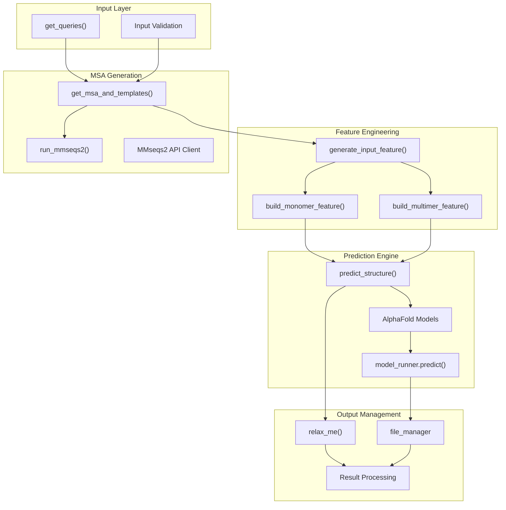
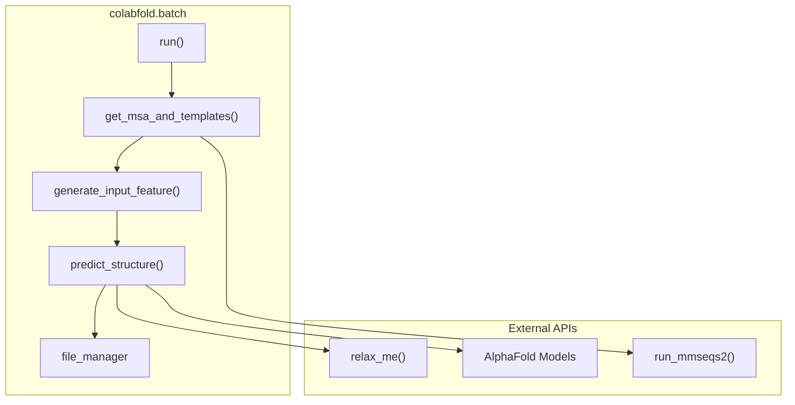
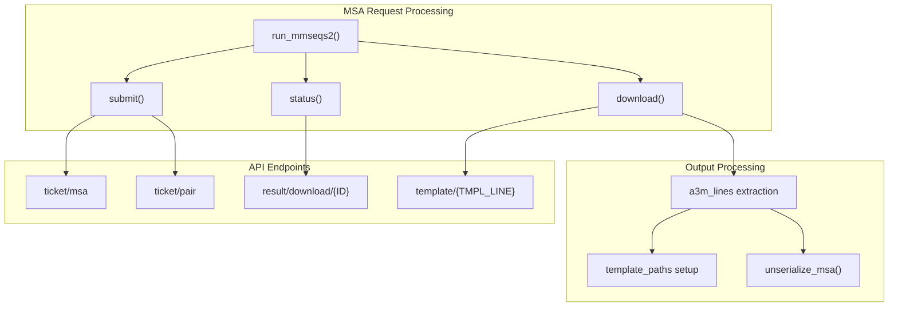
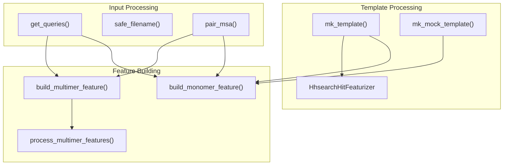
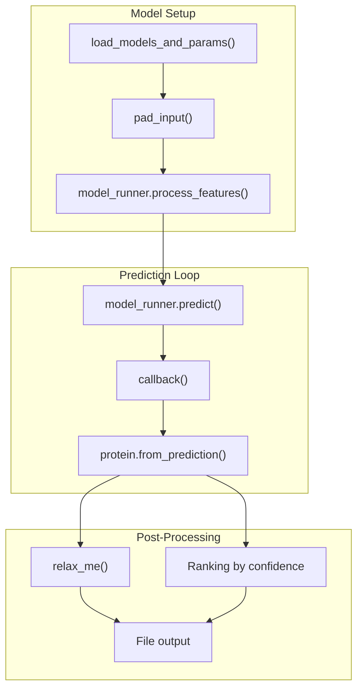
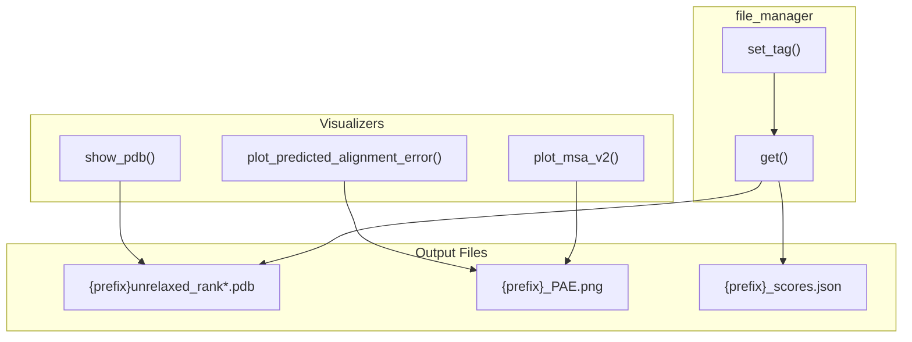

# Core Components

> **Relevant source files**
> * [colabfold/alphafold/extra_ptm.py](https://github.com/sokrypton/ColabFold/blob/0c788a0e/colabfold/alphafold/extra_ptm.py)
> * [colabfold/batch.py](https://github.com/sokrypton/ColabFold/blob/0c788a0e/colabfold/batch.py)
> * [colabfold/colabfold.py](https://github.com/sokrypton/ColabFold/blob/0c788a0e/colabfold/colabfold.py)
> * [colabfold/pdb.py](https://github.com/sokrypton/ColabFold/blob/0c788a0e/colabfold/pdb.py)
> * [colabfold/plot.py](https://github.com/sokrypton/ColabFold/blob/0c788a0e/colabfold/plot.py)

This document covers the fundamental architectural components that form the backbone of the ColabFold system. These components handle the complete workflow from input sequence processing through MSA generation, model prediction, and result output.

For information about user interfaces and notebooks, see [Notebook Interfaces](/sokrypton/ColabFold/3.2-notebook-interfaces). For command-line tools, see [Command Line Interface](/sokrypton/ColabFold/4-command-line-interface). For advanced configuration and local execution, see [Advanced Usage](/sokrypton/ColabFold/5-advanced-usage).

## System Architecture Overview

The ColabFold core components form a modular pipeline architecture where each component has distinct responsibilities but works together to orchestrate protein structure prediction workflows.

### Core Component Relationships

Sources: [colabfold/batch.py L700-L848](https://github.com/sokrypton/ColabFold/blob/0c788a0e/colabfold/batch.py#L700-L848)

 [colabfold/batch.py L440-L698](https://github.com/sokrypton/ColabFold/blob/0c788a0e/colabfold/batch.py#L440-L698)

 [colabfold/batch.py L942-L1044](https://github.com/sokrypton/ColabFold/blob/0c788a0e/colabfold/batch.py#L942-L1044)

## Central Pipeline Controller

The `colabfold.batch` module serves as the central orchestrator for all protein structure prediction workflows. The main entry point coordinates the entire pipeline from input processing to final output.

### Batch Processing Pipeline

The batch processing system implements several key functions:

| Function | Purpose | Key Parameters |
| --- | --- | --- |
| `get_msa_and_templates()` | MSA generation and template search | `msa_mode`, `use_templates`, `pair_mode` |
| `generate_input_feature()` | Feature tensor preparation | `is_complex`, `model_type`, `max_seq` |
| `predict_structure()` | Model inference and ranking | `model_runner_and_params`, `num_relax` |
| `file_manager` | Result file organization | `prefix`, `result_dir` |

For details, see [Batch Processing System](/sokrypton/ColabFold/3.1-batch-processing-system).

Sources: [colabfold/batch.py L700-L848](https://github.com/sokrypton/ColabFold/blob/0c788a0e/colabfold/batch.py#L700-L848)

 [colabfold/batch.py L942-L1044](https://github.com/sokrypton/ColabFold/blob/0c788a0e/colabfold/batch.py#L942-L1044)

 [colabfold/batch.py L440-L698](https://github.com/sokrypton/ColabFold/blob/0c788a0e/colabfold/batch.py#L440-L698)

 [colabfold/batch.py L423-L438](https://github.com/sokrypton/ColabFold/blob/0c788a0e/colabfold/batch.py#L423-L438)

## MSA Generation and Search System

The MSA (Multiple Sequence Alignment) generation system is built around the `run_mmseqs2()` function, which interfaces with both remote API services and local MMseqs2 installations.

### MSA Generation Workflow

The system supports multiple MSA modes:

* **Standard MSA**: `mmseqs2_uniref_env` - searches UniRef and environmental databases.
* **Pairing Mode**: For complex prediction with sequence pairing strategies like `greedy` or `complete`.
* **Template Search**: Retrieves structural templates when `use_templates` is enabled.

For details, see [MSA Generation and Search](/sokrypton/ColabFold/3.3-msa-generation-and-search).

Sources: [colabfold/colabfold.py L68-L331](https://github.com/sokrypton/ColabFold/blob/0c788a0e/colabfold/colabfold.py#L68-L331)

 [colabfold/batch.py L700-L848](https://github.com/sokrypton/ColabFold/blob/0c788a0e/colabfold/batch.py#L700-L848)

## Input Processing and Feature Engineering

The input processing system transforms raw sequences and MSAs into feature tensors compatible with AlphaFold models. This involves specialized functions depending on the prediction type (monomer vs multimer).

### Feature Generation Pipeline

Key feature engineering functions:

* `build_monomer_feature()`: Processes single chain features [colabfold/batch.py L850-L861](https://github.com/sokrypton/ColabFold/blob/0c788a0e/colabfold/batch.py#L850-L861)
* `build_multimer_feature()`: Handles paired MSA and complex assembly [colabfold/batch.py L863-L868](https://github.com/sokrypton/ColabFold/blob/0c788a0e/colabfold/batch.py#L863-L868)
* `mk_template()`: Featurizes HHsearch results for structural templates [colabfold/batch.py L145-L171](https://github.com/sokrypton/ColabFold/blob/0c788a0e/colabfold/batch.py#L145-L171)

For details, see [Input Processing and Utilities](/sokrypton/ColabFold/3.4-input-processing-and-utilities).

Sources: [colabfold/batch.py L850-L861](https://github.com/sokrypton/ColabFold/blob/0c788a0e/colabfold/batch.py#L850-L861)

 [colabfold/batch.py L863-L868](https://github.com/sokrypton/ColabFold/blob/0c788a0e/colabfold/batch.py#L863-L868)

 [colabfold/batch.py L870-L931](https://github.com/sokrypton/ColabFold/blob/0c788a0e/colabfold/batch.py#L870-L931)

 [colabfold/batch.py L109-L143](https://github.com/sokrypton/ColabFold/blob/0c788a0e/colabfold/batch.py#L109-L143)

## Model Management and Prediction Engine

The prediction engine orchestrates AlphaFold model loading, inference, and result processing. It supports multiple model types and implements sophisticated ranking and relaxation workflows.

### Prediction Workflow

The prediction system handles multiple seeds, model ensembles (model_1 through model_5), and iterative recycling. It also integrates confidence scoring using pLDDT, pTM, and ipTM metrics [colabfold/alphafold/extra_ptm.py L42-L104](https://github.com/sokrypton/ColabFold/blob/0c788a0e/colabfold/alphafold/extra_ptm.py#L42-L104)

For details, see [Model Management](/sokrypton/ColabFold/3.5-model-management).

Sources: [colabfold/batch.py L440-L698](https://github.com/sokrypton/ColabFold/blob/0c788a0e/colabfold/batch.py#L440-L698)

 [colabfold/batch.py L389-L421](https://github.com/sokrypton/ColabFold/blob/0c788a0e/colabfold/batch.py#L389-L421)

 [colabfold/alphafold/extra_ptm.py L42-L104](https://github.com/sokrypton/ColabFold/blob/0c788a0e/colabfold/alphafold/extra_ptm.py#L42-L104)

## Visualization and Output System

The visualization system provides comprehensive analysis tools for structure prediction results, while the `file_manager` handles structured data serialization.

### Visualization and Output Schema

Key capabilities:

* **3D Structure Display**: Interactive `py3Dmol` viewers with confidence coloring [colabfold/pdb.py L1-L69](https://github.com/sokrypton/ColabFold/blob/0c788a0e/colabfold/pdb.py#L1-L69)
* **Confidence Plots**: PAE (Predicted Aligned Error) heatmaps and pLDDT plots [colabfold/plot.py L4-L18](https://github.com/sokrypton/ColabFold/blob/0c788a0e/colabfold/plot.py#L4-L18)
* **MSA Analysis**: Sequence coverage and identity visualization [colabfold/plot.py L20-L78](https://github.com/sokrypton/ColabFold/blob/0c788a0e/colabfold/plot.py#L20-L78)

For details, see [Visualization and Output](/sokrypton/ColabFold/3.6-visualization-and-output).

Sources: [colabfold/batch.py L423-L438](https://github.com/sokrypton/ColabFold/blob/0c788a0e/colabfold/batch.py#L423-L438)

 [colabfold/plot.py L20-L78](https://github.com/sokrypton/ColabFold/blob/0c788a0e/colabfold/plot.py#L20-L78)

 [colabfold/pdb.py L1-L69](https://github.com/sokrypton/ColabFold/blob/0c788a0e/colabfold/pdb.py#L1-L69)

 [colabfold/plot.py L4-L18](https://github.com/sokrypton/ColabFold/blob/0c788a0e/colabfold/plot.py#L4-L18)