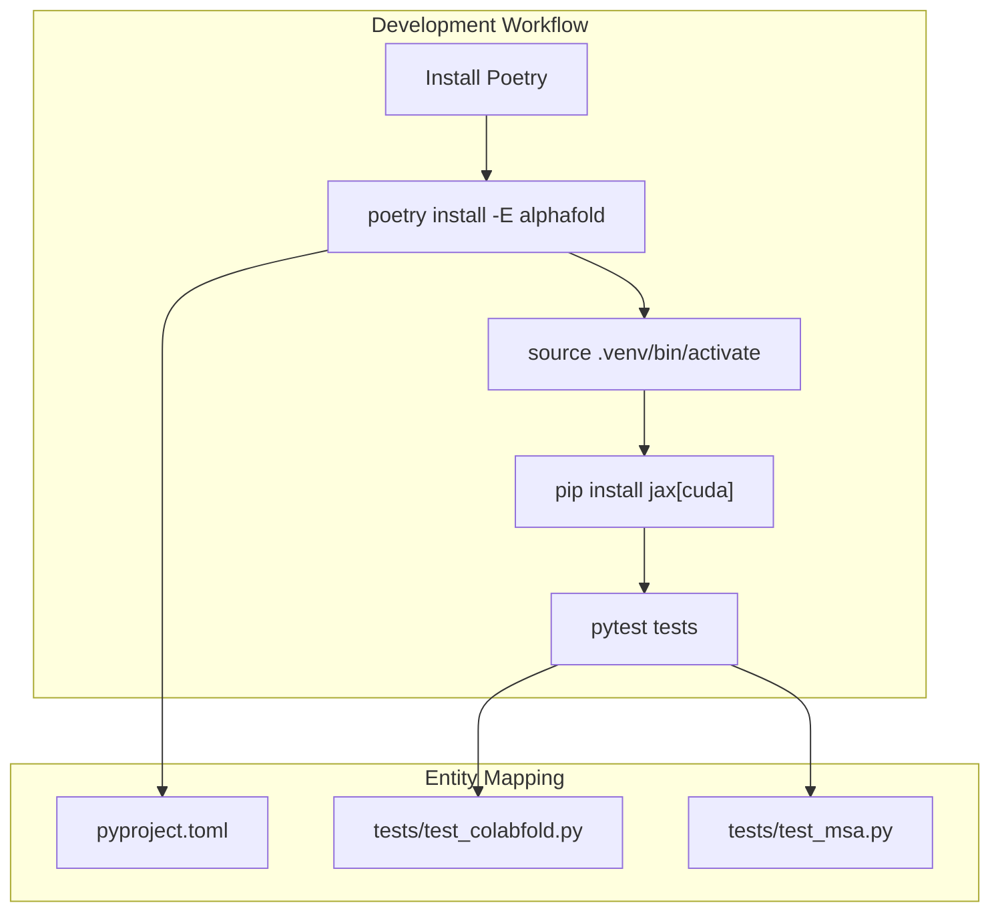

# Development and Testing

> **Relevant source files**
> * [.gitattributes](https://github.com/sokrypton/ColabFold/blob/0c788a0e/.gitattributes)
> * [.github/workflows/publish.yml](https://github.com/sokrypton/ColabFold/blob/0c788a0e/.github/workflows/publish.yml)
> * [.github/workflows/test.yml](https://github.com/sokrypton/ColabFold/blob/0c788a0e/.github/workflows/test.yml)
> * [Contributing.md](https://github.com/sokrypton/ColabFold/blob/0c788a0e/Contributing.md?plain=1)
> * [tests/reindent_ipynb.py](https://github.com/sokrypton/ColabFold/blob/0c788a0e/tests/reindent_ipynb.py)

This page provides information for developers contributing to or extending ColabFold. It covers the development environment setup, the testing framework, continuous integration workflows, and legacy components.

For a detailed breakdown of the package organization and configuration files, see [Project Structure](/sokrypton/ColabFold/6.1-project-structure). For information on automated testing and release processes, see [Continuous Integration](/sokrypton/ColabFold/6.3-continuous-integration).

## Development Environment Setup

ColabFold uses [Poetry](https://python-poetry.org/) for dependency management and packaging. The project is structured as a Python package with multiple entry points for command-line tools like `colabfold_batch` and `colabfold_search` [pyproject.toml L54-L58](https://github.com/sokrypton/ColabFold/blob/0c788a0e/pyproject.toml#L54-L58)

### Local Development Workflow

Contributors typically follow a workflow involving Poetry for environment isolation and JAX for hardware acceleration.

**Sources:** [Contributing.md L3-L28](https://github.com/sokrypton/ColabFold/blob/0c788a0e/Contributing.md?plain=1#L3-L28)

 [pyproject.toml L1-L58](https://github.com/sokrypton/ColabFold/blob/0c788a0e/pyproject.toml#L1-L58)

### Colab Development "Unholy Hack"

For testing changes directly in a Google Colab environment, developers use a specific symlink strategy to bypass standard installation paths and use a local git clone [Contributing.md L67-L76](https://github.com/sokrypton/ColabFold/blob/0c788a0e/Contributing.md?plain=1#L67-L76)

**Sources:** [Contributing.md L60-L98](https://github.com/sokrypton/ColabFold/blob/0c788a0e/Contributing.md?plain=1#L60-L98)

## Testing Framework

ColabFold utilizes `pytest` for its testing suite [pyproject.toml L51-L52](https://github.com/sokrypton/ColabFold/blob/0c788a0e/pyproject.toml#L51-L52)

 The framework includes unit tests for core utilities and integration tests that mock external dependencies like the MMseqs2 API.

### Mocking and Utilities

The testing environment relies on several key abstractions:

* **MMseqs2 Mocking:** Uses pre-recorded JSON responses stored in `test-data/mmseqs-api-reponses/` to simulate API calls [.gitattributes L1](https://github.com/sokrypton/ColabFold/blob/0c788a0e/.gitattributes#L1-L1)
* **Notebook Formatting:** The `tests/reindent_ipynb.py` script ensures consistent indentation (2 spaces) across all project notebooks [tests/reindent_ipynb.py L4-L8](https://github.com/sokrypton/ColabFold/blob/0c788a0e/tests/reindent_ipynb.py#L4-L8)

For details on mocking systems and specific test cases, see [Testing Framework](/sokrypton/ColabFold/6.2-testing-framework).

**Sources:** [pyproject.toml L45](https://github.com/sokrypton/ColabFold/blob/0c788a0e/pyproject.toml#L45-L45)

 [tests/reindent_ipynb.py L1-L8](https://github.com/sokrypton/ColabFold/blob/0c788a0e/tests/reindent_ipynb.py#L1-L8)

 [.gitattributes L1](https://github.com/sokrypton/ColabFold/blob/0c788a0e/.gitattributes#L1-L1)

## Continuous Integration (CI/CD)

Automated workflows are managed via GitHub Actions to ensure code quality and facilitate releases.

| Workflow | Trigger | Primary Actions |
| --- | --- | --- |
| **Test** | Push/PR to `main` | Runs `pytest` across Python 3.10, 3.11, and 3.12 [.github/workflows/test.yml L13-L16](https://github.com/sokrypton/ColabFold/blob/0c788a0e/.github/workflows/test.yml#L13-L16) |
| **Publish** | Version Tags (`v*.*.*`) | Builds source/wheel distributions and publishes to PyPI [.github/workflows/publish.yml L3-L25](https://github.com/sokrypton/ColabFold/blob/0c788a0e/.github/workflows/publish.yml#L3-L25) |
| **Docker** | Push to `main` | Builds and pushes official Docker images. |

For details on the CI configurations, see [Continuous Integration](/sokrypton/ColabFold/6.3-continuous-integration).

**Sources:** [.github/workflows/test.yml L1-L40](https://github.com/sokrypton/ColabFold/blob/0c788a0e/.github/workflows/test.yml#L1-L40)

 [.github/workflows/publish.yml L1-L25](https://github.com/sokrypton/ColabFold/blob/0c788a0e/.github/workflows/publish.yml#L1-L25)

## Legacy and Compatibility

ColabFold maintains several legacy components for backward compatibility and experimental research. These include:

* **Beta Patches:** A collection of `.patch` files used to modify standard AlphaFold behavior (e.g., `model.patch`, `protein.patch`).
* **Legacy API Client:** The `beta/colabfold.py` client.
* **Version 1.5.x Artifacts:** The current stable build is defined as version `1.5.5` [pyproject.toml L3](https://github.com/sokrypton/ColabFold/blob/0c788a0e/pyproject.toml#L3-L3)

For details on these components, see [Legacy Components](/sokrypton/ColabFold/6.4-legacy-components).

**Sources:** [pyproject.toml L3](https://github.com/sokrypton/ColabFold/blob/0c788a0e/pyproject.toml#L3-L3)

 [pyproject.toml L69](https://github.com/sokrypton/ColabFold/blob/0c788a0e/pyproject.toml#L69-L69)

## Project Navigation

* [Project Structure](/sokrypton/ColabFold/6.1-project-structure) — Detailed package layout and Poetry configuration.
* [Testing Framework](/sokrypton/ColabFold/6.2-testing-framework) — Mocking abstractions and test-data fixtures.
* [Continuous Integration](/sokrypton/ColabFold/6.3-continuous-integration) — GitHub Actions workflows and PyPI release process.
* [Legacy Components](/sokrypton/ColabFold/6.4-legacy-components) — Deprecated notebooks and patch files.