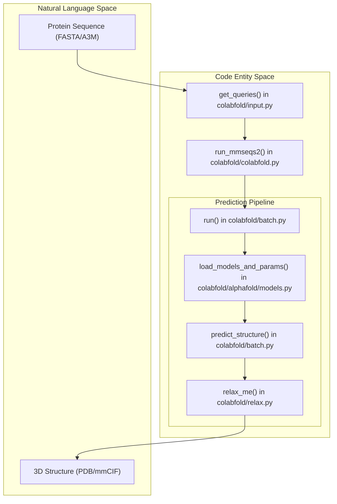
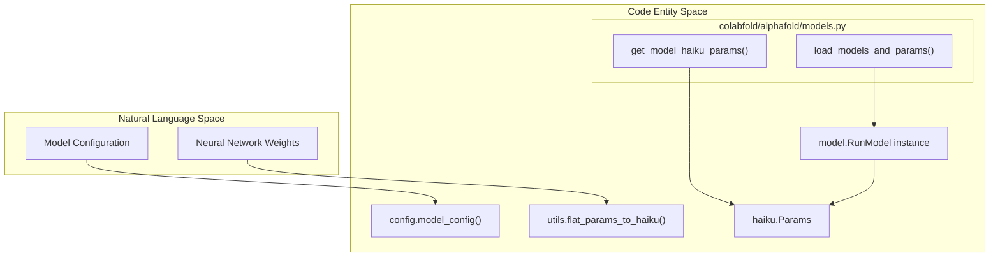

# Glossary

> **Relevant source files**
> * [README.md](https://github.com/sokrypton/ColabFold/blob/0c788a0e/README.md?plain=1)
> * [colabfold/alphafold/extra_ptm.py](https://github.com/sokrypton/ColabFold/blob/0c788a0e/colabfold/alphafold/extra_ptm.py)
> * [colabfold/alphafold/ipsae.py](https://github.com/sokrypton/ColabFold/blob/0c788a0e/colabfold/alphafold/ipsae.py)
> * [colabfold/alphafold/models.py](https://github.com/sokrypton/ColabFold/blob/0c788a0e/colabfold/alphafold/models.py)
> * [colabfold/alphafold/msa.py](https://github.com/sokrypton/ColabFold/blob/0c788a0e/colabfold/alphafold/msa.py)
> * [colabfold/batch.py](https://github.com/sokrypton/ColabFold/blob/0c788a0e/colabfold/batch.py)
> * [colabfold/colabfold.py](https://github.com/sokrypton/ColabFold/blob/0c788a0e/colabfold/colabfold.py)
> * [colabfold/mmseqs/search.py](https://github.com/sokrypton/ColabFold/blob/0c788a0e/colabfold/mmseqs/search.py)
> * [colabfold/mmseqs/split_msas.py](https://github.com/sokrypton/ColabFold/blob/0c788a0e/colabfold/mmseqs/split_msas.py)
> * [colabfold/pdb.py](https://github.com/sokrypton/ColabFold/blob/0c788a0e/colabfold/pdb.py)
> * [colabfold/plot.py](https://github.com/sokrypton/ColabFold/blob/0c788a0e/colabfold/plot.py)
> * [tests/test_colabfold.py](https://github.com/sokrypton/ColabFold/blob/0c788a0e/tests/test_colabfold.py)

This page provides definitions and technical context for codebase-specific terms, abbreviations, and concepts used within ColabFold. It serves as a reference for engineers onboarding to the project.

## Core Concepts

### Multiple Sequence Alignment (MSA)

In the context of ColabFold, an MSA is a collection of evolutionarily related protein sequences aligned to a query sequence. MSAs provide the co-evolutionary signals necessary for AlphaFold2 to predict spatial contacts.

* **A3M Format**: The primary file format used for MSAs in ColabFold. It is a condensed version of the FASTA format where insertions relative to the query are represented by lowercase letters and deletions by dashes.
* **MMseqs2**: The high-speed sequence search tool used to generate MSAs. ColabFold uses a custom API to query MMseqs2 servers [colabfold/colabfold.py L68-L71](https://github.com/sokrypton/ColabFold/blob/0c788a0e/colabfold/colabfold.py#L68-L71)  or runs it locally via `colabfold_search` [colabfold/mmseqs/search.py L50-L56](https://github.com/sokrypton/ColabFold/blob/0c788a0e/colabfold/mmseqs/search.py#L50-L56)

### Confidence Metrics

ColabFold outputs several metrics to evaluate the reliability of predicted structures:

* **pLDDT (predicted Local Distance Difference Test)**: A per-residue confidence score (0-100). Values > 90 indicate high confidence in local structure and side-chain orientation [colabfold/pdb.py L21-L33](https://github.com/sokrypton/ColabFold/blob/0c788a0e/colabfold/pdb.py#L21-L33)
* **pTM (predicted TM-score)**: A global confidence score (0-1) representing the topological similarity between the prediction and the true structure.
* **ipTM (interface pTM)**: A variant of pTM specifically for protein complexes, measuring the confidence of the predicted interface [colabfold/alphafold/extra_ptm.py L42-L58](https://github.com/sokrypton/ColabFold/blob/0c788a0e/colabfold/alphafold/extra_ptm.py#L42-L58)
* **PAE (Predicted Aligned Error)**: A matrix representing the expected distance error (in Angstroms) between every pair of residues. Low PAE indicates high confidence in the relative orientation of domains [colabfold/plot.py L4-L17](https://github.com/sokrypton/ColabFold/blob/0c788a0e/colabfold/plot.py#L4-L17)
* **ipSAE / pDockQ**: Advanced interface confidence scores implemented to evaluate protein-protein interactions [colabfold/alphafold/ipsae.py L26-L28](https://github.com/sokrypton/ColabFold/blob/0c788a0e/colabfold/alphafold/ipsae.py#L26-L28)

## System Architecture: Data Flow

The following diagram illustrates the flow of data from a sequence query through MSA generation to the final structural prediction.

### Data Flow: Query to Structure

**Sources:** [colabfold/batch.py L57-L83](https://github.com/sokrypton/ColabFold/blob/0c788a0e/colabfold/batch.py#L57-L83)

 [colabfold/colabfold.py L68-L71](https://github.com/sokrypton/ColabFold/blob/0c788a0e/colabfold/colabfold.py#L68-L71)

 [colabfold/alphafold/models.py L78-L100](https://github.com/sokrypton/ColabFold/blob/0c788a0e/colabfold/alphafold/models.py#L78-L100)

## Technical Terminology

| Term | Definition | Code Pointer |
| --- | --- | --- |
| **Recycles** | The number of times the model output is fed back into the Evoformer to refine the structure. | [colabfold/batch.py L611-L615](https://github.com/sokrypton/ColabFold/blob/0c788a0e/colabfold/batch.py#L611-L615) |
| **JAX Compilation** | The process of compiling the model for a specific GPU/CPU. ColabFold optimizes this by reusing compiled models for different sequences. | [colabfold/alphafold/models.py L9-L23](https://github.com/sokrypton/ColabFold/blob/0c788a0e/colabfold/alphafold/models.py#L9-L23) |
| **Template** | An existing experimental structure used as a spatial hint for the model. | [colabfold/batch.py L145-L151](https://github.com/sokrypton/ColabFold/blob/0c788a0e/colabfold/batch.py#L145-L151) |
| **Multimer** | A protein complex consisting of multiple polypeptide chains. | [colabfold/batch.py L57-L58](https://github.com/sokrypton/ColabFold/blob/0c788a0e/colabfold/batch.py#L57-L58) |
| **Amber Relax** | A post-prediction refinement step using the AMBER force field to resolve steric clashes. | [colabfold/relax.py L81](https://github.com/sokrypton/ColabFold/blob/0c788a0e/colabfold/relax.py#L81-L81) |
| **Pallas / Triton** | Custom GPU kernels used to accelerate specific AlphaFold operations (e.g., Triangle Multiplication). | [colabfold/alphafold/models.py L138-L140](https://github.com/sokrypton/ColabFold/blob/0c788a0e/colabfold/alphafold/models.py#L138-L140) |

## Model Management Logic

ColabFold employs a strategy to minimize JAX compilation time by reusing "RunModel" instances and swapping Haiku parameters.

### Model Loading and Parameter Swapping

**Sources:** [colabfold/alphafold/models.py L26-L32](https://github.com/sokrypton/ColabFold/blob/0c788a0e/colabfold/alphafold/models.py#L26-L32)

 [colabfold/alphafold/models.py L78-L108](https://github.com/sokrypton/ColabFold/blob/0c788a0e/colabfold/alphafold/models.py#L78-L108)

 [colabfold/alphafold/models.py L127-L128](https://github.com/sokrypton/ColabFold/blob/0c788a0e/colabfold/alphafold/models.py#L127-L128)

## File Formats and Outputs

* **`_unrelaxed_rank_XXX.pdb`**: The raw structural output from the AlphaFold model [colabfold/batch.py L87-L92](https://github.com/sokrypton/ColabFold/blob/0c788a0e/colabfold/batch.py#L87-L92)
* **`_relaxed_rank_XXX.pdb`**: The structure after Amber relaxation [colabfold/relax.py L81](https://github.com/sokrypton/ColabFold/blob/0c788a0e/colabfold/relax.py#L81-L81)
* **`_scores_rank_XXX.json`**: Contains per-residue pLDDT and global confidence scores [colabfold/batch.py L128-L132](https://github.com/sokrypton/ColabFold/blob/0c788a0e/colabfold/batch.py#L128-L132)
* **`_pae.png`**: Heatmap visualization of the Predicted Aligned Error [colabfold/plot.py L4-L14](https://github.com/sokrypton/ColabFold/blob/0c788a0e/colabfold/plot.py#L4-L14)
* **`_coverage.png`**: Visualization of the MSA depth and sequence identity across the query [colabfold/plot.py L20-L62](https://github.com/sokrypton/ColabFold/blob/0c788a0e/colabfold/plot.py#L20-L62)

**Sources:** [colabfold/batch.py L127-L142](https://github.com/sokrypton/ColabFold/blob/0c788a0e/colabfold/batch.py#L127-L142)

 [colabfold/plot.py L4-L78](https://github.com/sokrypton/ColabFold/blob/0c788a0e/colabfold/plot.py#L4-L78)

 [colabfold/pdb.py L1-L9](https://github.com/sokrypton/ColabFold/blob/0c788a0e/colabfold/pdb.py#L1-L9)