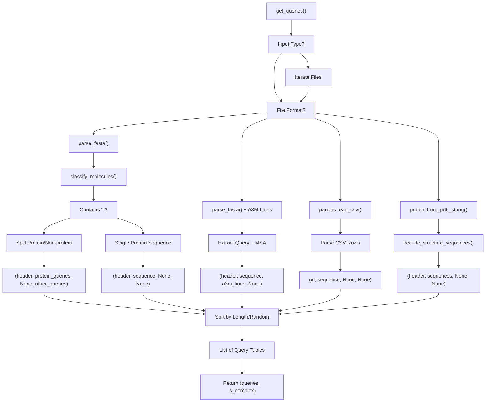
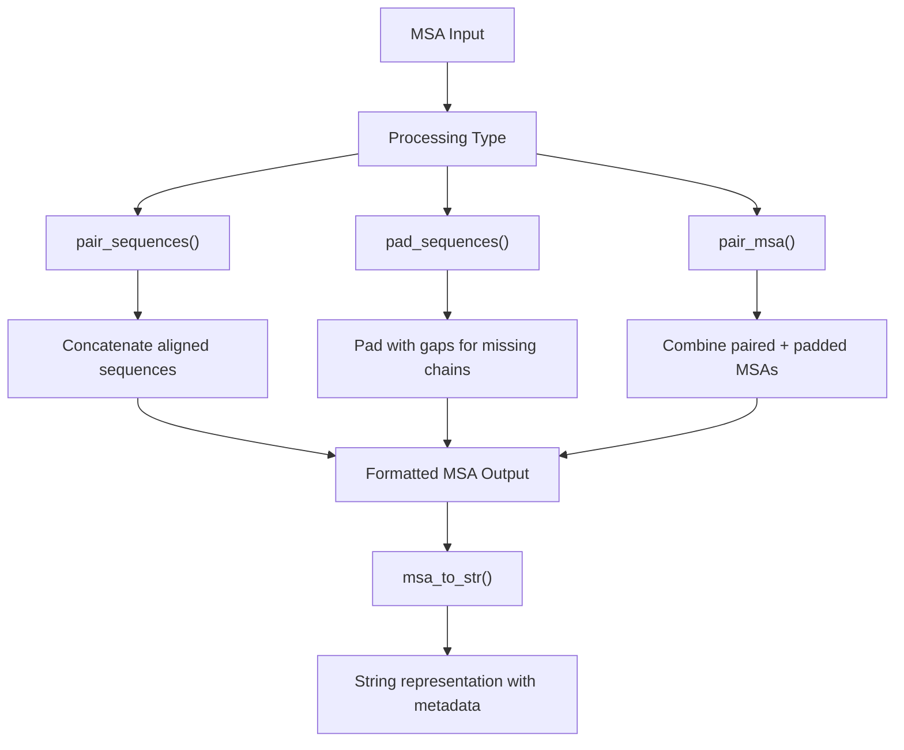
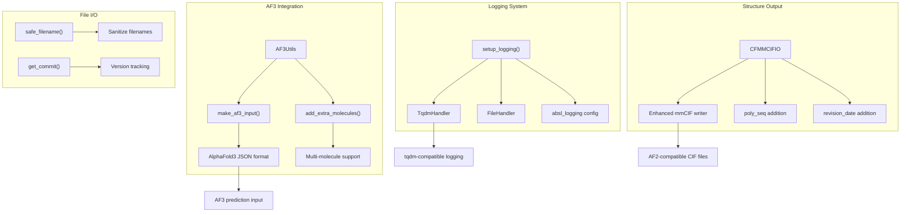
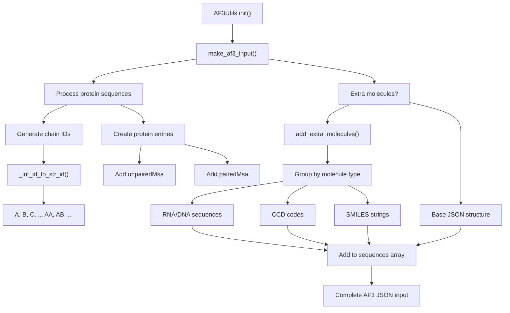
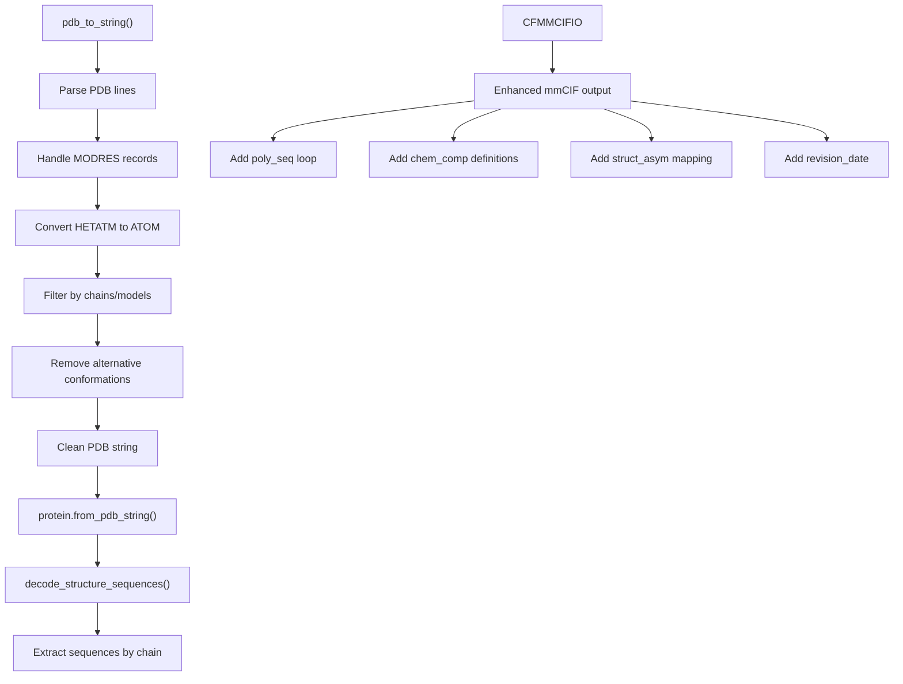

# Input Processing and Utilities

> **Relevant source files**
> * [colabfold/citations.py](https://github.com/sokrypton/ColabFold/blob/0c788a0e/colabfold/citations.py)
> * [colabfold/download.py](https://github.com/sokrypton/ColabFold/blob/0c788a0e/colabfold/download.py)
> * [colabfold/input.py](https://github.com/sokrypton/ColabFold/blob/0c788a0e/colabfold/input.py)
> * [colabfold/utils.py](https://github.com/sokrypton/ColabFold/blob/0c788a0e/colabfold/utils.py)
> * [utils/convert_deepfold_weights.py](https://github.com/sokrypton/ColabFold/blob/0c788a0e/utils/convert_deepfold_weights.py)

This document covers the input processing pipeline and utility functions that handle data ingestion, format conversion, and support services for ColabFold's protein structure prediction workflows. These components process various input formats (FASTA, A3M, PDB, CSV) and convert them into standardized internal representations for the prediction pipeline.

For information about the main prediction orchestration that uses these processed inputs, see [Batch Processing System](/sokrypton/ColabFold/3.1-batch-processing-system). For details about MSA generation that operates on the processed sequences, see [MSA Generation and Search](/sokrypton/ColabFold/3.3-msa-generation-and-search).

## Input Processing Pipeline

The input processing system centers around the `get_queries()` function, which serves as the primary entry point for reading and parsing various input file formats. This function handles single files, directories of files, and multiple file formats to produce standardized query representations.

### Input Processing Flow

Sources: [colabfold/input.py L267-L401](https://github.com/sokrypton/ColabFold/blob/0c788a0e/colabfold/input.py#L267-L401)

### File Format Support

The system supports multiple input formats with specific parsing logic for each:

| Format | Extension | Parser Function | Output Type |
| --- | --- | --- | --- |
| FASTA | `.fasta`, `.fa`, `.faa` | `parse_fasta()` | Sequence strings |
| A3M | `.a3m` | `parse_fasta()` + MSA preservation | Sequence + MSA lines |
| CSV/TSV | `.csv`, `.tsv` | `pandas.read_csv()` | Tabular sequence data |
| PDB | `.pdb` | `protein.from_pdb_string()` | Structure-derived sequences |
| mmCIF | `.cif` | `protein.from_mmcif_string()` | Structure-derived sequences |

Sources: [colabfold/input.py L277-L326](https://github.com/sokrypton/ColabFold/blob/0c788a0e/colabfold/input.py#L277-L326)

 [colabfold/input.py L330-L371](https://github.com/sokrypton/ColabFold/blob/0c788a0e/colabfold/input.py#L330-L371)

## Sequence Classification and Processing

The input system distinguishes between protein sequences and non-protein molecules (DNA, RNA, ligands) through the `classify_molecules()` function.

### Molecule Classification Logic

Sources: [colabfold/input.py L118-L143](https://github.com/sokrypton/ColabFold/blob/0c788a0e/colabfold/input.py#L118-L143)

 [colabfold/utils.py L281-L302](https://github.com/sokrypton/ColabFold/blob/0c788a0e/colabfold/utils.py#L281-L302)

## MSA Processing Utilities

The system provides functions for manipulating Multiple Sequence Alignments (MSAs) to handle complex prediction scenarios with multiple protein chains.

### MSA Manipulation Functions

Sources: [colabfold/input.py L11-L86](https://github.com/sokrypton/ColabFold/blob/0c788a0e/colabfold/input.py#L11-L86)

## Utility Classes and Functions

The utilities module provides essential support functions for logging, file I/O, and format conversion.

### Core Utility Components

Sources: [colabfold/utils.py L32-L62](https://github.com/sokrypton/ColabFold/blob/0c788a0e/colabfold/utils.py#L32-L62)

 [colabfold/utils.py L121-L280](https://github.com/sokrypton/ColabFold/blob/0c788a0e/colabfold/utils.py#L121-L280)

 [colabfold/utils.py L304-L401](https://github.com/sokrypton/ColabFold/blob/0c788a0e/colabfold/utils.py#L304-L401)

## AlphaFold3 Input Generation

The `AF3Utils` class handles the conversion of ColabFold's internal representations to AlphaFold3's JSON input format, supporting complex multi-molecule predictions.

### AF3 Input Structure Generation

Sources: [colabfold/utils.py L304-L401](https://github.com/sokrypton/ColabFold/blob/0c788a0e/colabfold/utils.py#L304-L401)

## PDB Structure Processing

The system includes comprehensive PDB file processing capabilities for structure-based input and enhanced output formatting.

### Structure File Processing Pipeline

Sources: [colabfold/input.py L186-L237](https://github.com/sokrypton/ColabFold/blob/0c788a0e/colabfold/input.py#L186-L237)

 [colabfold/input.py L246-L265](https://github.com/sokrypton/ColabFold/blob/0c788a0e/colabfold/input.py#L246-L265)

 [colabfold/utils.py L121-L280](https://github.com/sokrypton/ColabFold/blob/0c788a0e/colabfold/utils.py#L121-L280)

## Citations and Versioning

ColabFold provides automated citation generation and version tracking to ensure reproducibility and proper credit for underlying tools.

### Citation Management

The `write_bibtex` function generates a `.bibtex` file based on the specific models and features used in a run.

| Feature/Model | Citation Key | Reference |
| --- | --- | --- |
| ColabFold | `Mirdita2021` | Mirdita et al., Nature Methods 2022 |
| AlphaFold2 | `Jumper2021` | Jumper et al., Nature 2021 |
| AlphaFold-Multimer | `Evans2021` | Evans et al., bioRxiv 2021 |
| MMseqs2 | `Mirdita2019` | Mirdita et al., Bioinformatics 2019 |
| UniRef30 | `Mirdita2017` | Mirdita et al., NAR 2017 |
| OpenMM | `Eastman2017` | Eastman et al., PLOS Comput. Biol. 2017 |
| DeepFold | `Lee2023` | Lee et al., Bioinformatics 2023 |

Sources: [colabfold/citations.py L6-L119](https://github.com/sokrypton/ColabFold/blob/0c788a0e/colabfold/citations.py#L6-L119)

 [colabfold/citations.py L122-L160](https://github.com/sokrypton/ColabFold/blob/0c788a0e/colabfold/citations.py#L122-L160)

### Version Tracking

The `get_commit()` function retrieves the specific Git commit ID from the installed package metadata, allowing for exact version identification of the code used for a prediction.

Sources: [colabfold/utils.py L68-L77](https://github.com/sokrypton/ColabFold/blob/0c788a0e/colabfold/utils.py#L68-L77)